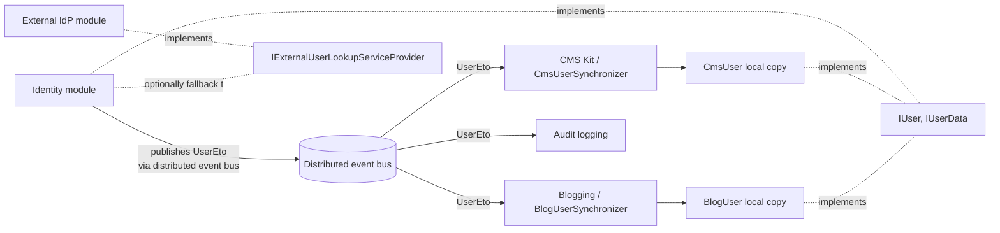
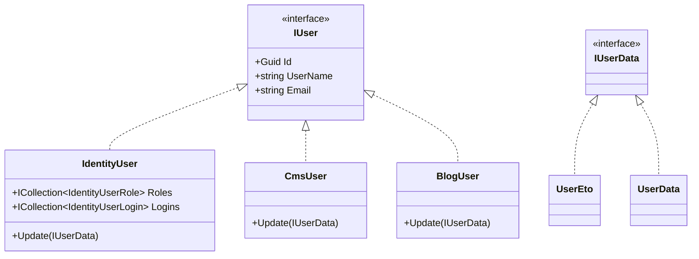

`modules/users/` is the **glue layer** between modules that own user data (Identity, Identity Pro, your own auth) and modules that consume user data (CMS Kit, Blogging, Audit Logging, Tenant Management, your own application). Unlike every other module in this catalog, **it doesn't ship aggregates or app services of its own**. It is a set of contracts — `IUser`, `IUserData`, `IUserRepository<TUser>`, `IUserLookupService<TUser>`, `IExternalUserLookupServiceProvider`, plus a handful of distributed event ETOs — paired with EF Core / MongoDB base classes that the persistence-owning modules inherit from.

This page documents the contracts in source order, shows how the inheritance hierarchy connects to `IdentityUser` (the most common implementation) and to read-models like CMS Kit's `CmsUser`, and walks the event flows the ETOs power.

## Why a shared module?

ABP solutions often span multiple modules that each need to:

- Look up "who's the user with this id" without round-tripping to Identity HTTP.
- Persist a **local read-model** of users (their `UserName`, `Email`, `Name`, `Surname`, `IsActive`) so foreign-key joins work inside their own schema.
- React when a user is created/updated/deleted somewhere else (Identity Pro, an external IdP) by updating their own copy.

Each of those concerns is solved by a contract in this module:



The contracts are deliberately tiny so they can be safely depended upon by **any** module in the dependency graph without coupling consumers to a concrete identity implementation.

## Projects

`modules/users/src/` ships six small projects:

| Project | What's in it |
| --- | --- |
| `Volo.Abp.Users.Abstractions` | `IUserData`, `UserData`, `IRoleData`, `RoleData`, `IExternalUserLookupServiceProvider`, ETOs (`UserEto`, `InviteUserToTenantRequestedEto`, `UserPasswordChangeRequestedEto`) |
| `Volo.Abp.Users.Domain.Shared` | `AbpUserConsts` (`MaxUserNameLength`, `MaxEmailLength`, …) and localization resource |
| `Volo.Abp.Users.Domain` | `IUser` aggregate-root marker, `IUpdateUserData`, `IUserLookupService<TUser>`, `UserLookupService<TUser, TRepository>`, `IUserRepository<TUser>`, `AbpUserExtensions` |
| `Volo.Abp.Users.EntityFrameworkCore` | `EfCoreUserRepositoryBase<TDbContext, TUser>`, `ConfigureAbpUser<TUser>` model extension |
| `Volo.Abp.Users.MongoDB` | `MongoUserRepositoryBase<TMongoDbContext, TUser>` |
| `Volo.Abp.Users.Installer` | NuGet metadata for `abp install-module` |

There is no Application, HttpApi, or Web project. This module is purely **library code consumed by other modules**.

<Info>
  `Volo.Abp.Users.Abstractions` is the project to add to the deepest possible layer — usually `Application.Contracts` or even `Domain.Shared` — because it has *no* domain dependencies; it pulls in only `Volo.Abp.EventBus.Abstractions` and `Volo.Abp.Data`.
</Info>

## The `IUserData` contract

`IUserData` is the **DTO-shaped** representation of a user. Anything that needs to pass user data across a wire — an event, an integration service call, an external lookup — uses this interface.

```csharp
public interface IUserData : IHasExtraProperties
{
    Guid Id { get; }
    Guid? TenantId { get; }
    string UserName { get; }
    string Name { get; }
    string Surname { get; }
    bool IsActive { get; }
    [CanBeNull] string Email { get; }
    bool EmailConfirmed { get; }
    [CanBeNull] string PhoneNumber { get; }
    bool PhoneNumberConfirmed { get; }
}
```

`UserData` is the concrete class — a serialization-friendly POCO with a copy constructor:

```csharp
public class UserData : IUserData
{
    public UserData(IUserData userData)
    {
        Id = userData.Id;
        UserName = userData.UserName;
        Email = userData.Email;
        // … all fields
        ExtraProperties = userData.ExtraProperties;
    }

    public UserData(Guid id, string userName, string email = null, string name = null,
                    string surname = null, bool emailConfirmed = false,
                    string phoneNumber = null, bool phoneNumberConfirmed = false,
                    Guid? tenantId = null, bool isActive = true,
                    ExtraPropertyDictionary extraProperties = null) { ... }
}
```

`IHasExtraProperties` brings the [object extensions](/ddd/object-extending) bag along for the ride — any custom field added to `IdentityUser` via `ObjectExtensionManager` flows through `UserData` automatically.

## The `IUser` aggregate marker

`IUser` is what a **persisted user aggregate** implements. Every module that defines a user aggregate (Identity's `IdentityUser`, CMS Kit's `CmsUser`, Blogging's `BlogUser`) implements this interface so it can plug into the shared repository base classes.

```csharp
public interface IUser : IAggregateRoot<Guid>, IMultiTenant, IHasExtraProperties
{
    string UserName { get; }
    [CanBeNull] string Email { get; }
    [CanBeNull] string Name { get; }
    [CanBeNull] string Surname { get; }
    bool IsActive { get; }
    bool EmailConfirmed { get; }
    [CanBeNull] string PhoneNumber { get; }
    bool PhoneNumberConfirmed { get; }
}
```

`IUser` is intentionally a subset of `IUserData`: it omits the `Id` setter (covered by `IAggregateRoot<Guid>`) and adds `IAggregateRoot`/`IMultiTenant`. Any `IUser` can be converted to an `IUserData` via the extension:

```csharp
public static class AbpUserExtensions
{
    public static IUserData ToAbpUserData(this IUser user) => new UserData(
        id: user.Id, userName: user.UserName, email: user.Email,
        name: user.Name, surname: user.Surname, isActive: user.IsActive,
        emailConfirmed: user.EmailConfirmed, phoneNumber: user.PhoneNumber,
        phoneNumberConfirmed: user.PhoneNumberConfirmed, tenantId: user.TenantId,
        extraProperties: user.ExtraProperties);
}
```

### `IUpdateUserData` — the read-model write contract

Local user read-models (`CmsUser`, `BlogUser`) implement `IUpdateUserData` so synchronizers can re-apply incoming `IUserData` payloads:

```csharp
public interface IUpdateUserData
{
    bool Update([NotNull] IUserData user);
}
```

The convention is: return `true` if any field actually changed (so the synchronizer can persist), `false` if the payload was a no-op.

## Repository and lookup contracts

### `IUserRepository<TUser>`

The shared repository contract that every user-owning module exposes a typed alias for (e.g. `IIdentityUserRepository : IUserRepository<IdentityUser>`):

```csharp
public interface IUserRepository<TUser> : IBasicRepository<TUser, Guid>
    where TUser : class, IUser, IAggregateRoot<Guid>
{
    Task<TUser> FindByUserNameAsync(string userName, CancellationToken cancellationToken = default);
    Task<List<TUser>> GetListAsync(IEnumerable<Guid> ids, CancellationToken cancellationToken = default);
    Task<List<TUser>> SearchAsync(string sorting = null, int maxResultCount = int.MaxValue,
                                  int skipCount = 0, string filter = null,
                                  CancellationToken cancellationToken = default);
    Task<long> GetCountAsync(string filter = null, CancellationToken cancellationToken = default);
}
```

### `IUserLookupService<TUser>`

A higher-level service used by *consumer* modules. It first checks the local repository, then falls back to `IExternalUserLookupServiceProvider` if configured.

```csharp
public interface IUserLookupService<TUser> where TUser : class, IUser
{
    Task<TUser> FindByIdAsync(Guid id, CancellationToken cancellationToken = default);
    Task<TUser> FindByUserNameAsync(string userName, CancellationToken cancellationToken = default);
    Task<List<IUserData>> SearchAsync(string sorting = null, string filter = null,
                                       int maxResultCount = int.MaxValue, int skipCount = 0,
                                       CancellationToken cancellationToken = default);
    Task<long> GetCountAsync(string filter = null, CancellationToken cancellationToken = default);
}
```

The provided `UserLookupService<TUser, TRepository>` base class implements the fallback algorithm:

```csharp
public abstract class UserLookupService<TUser, TUserRepository> : IUserLookupService<TUser>, ITransientDependency
    where TUser : class, IUser
    where TUserRepository : IUserRepository<TUser>
{
    protected bool SkipExternalLookupIfLocalUserExists { get; set; } = true;

    public IExternalUserLookupServiceProvider ExternalUserLookupServiceProvider { get; set; }
    // ↑ property-injected so the dependency is optional
}
```

The flag `SkipExternalLookupIfLocalUserExists` means the external provider is only consulted when the local repository misses — perfect for "sync on first access" semantics in microservice setups.

### `IExternalUserLookupServiceProvider`

The escape hatch for federated identity scenarios. When the local module's user table is empty (e.g. brand-new user authenticated through an external IdP), the consumer calls into this provider to materialize the user record on demand.

```csharp
public interface IExternalUserLookupServiceProvider
{
    Task<IUserData> FindByIdAsync(Guid id, CancellationToken cancellationToken = default);
    Task<IUserData> FindByUserNameAsync(string userName, CancellationToken cancellationToken = default);
    Task<List<IUserData>> SearchAsync(string sorting = null, string filter = null,
                                       int maxResultCount = int.MaxValue, int skipCount = 0,
                                       CancellationToken cancellationToken = default);
    Task<long> GetCountAsync(string filter = null, CancellationToken cancellationToken = default);
}
```

In a microservice deployment, the Identity service publishes a `Volo.Abp.Identity.HttpApi.Client`-style typed `HttpClient` that implements this provider. The consuming service then injects `IExternalUserLookupServiceProvider` and never calls Identity directly.

## Event types (ETOs)

Three pre-defined event payloads live in `Volo.Abp.Users.Abstractions`:

### `UserEto` — user changed notification

```csharp
[EventName("Volo.Abp.Users.User")]
public class UserEto : IUserData, IMultiTenant
{
    public Guid Id { get; set; }
    public Guid? TenantId { get; set; }
    public string UserName { get; set; }
    public string Name { get; set; }
    public string Surname { get; set; }
    public bool IsActive { get; set; }
    public string Email { get; set; }
    public bool EmailConfirmed { get; set; }
    public string PhoneNumber { get; set; }
    public bool PhoneNumberConfirmed { get; set; }
    public ExtraPropertyDictionary ExtraProperties { get; set; }
}
```

Published by Identity through the [auto event-publishing](/eventbus/distributed-event-bus) machinery whenever an `IdentityUser` is created or updated. Subscribers (`CmsUserSynchronizer`, `BlogUserSynchronizer`, audit log enrichers) use it to keep their local copy fresh.

### `InviteUserToTenantRequestedEto`

```csharp
[EventName("Volo.Abp.Users.InviteUserToTenantRequested")]
public class InviteUserToTenantRequestedEto : IMultiTenant
{
    public Guid? TenantId { get; set; }
    public string Email { get; set; }
    public bool DirectlyAddToTenant { get; set; }
}
```

Drives the cross-tenant invite flow in Identity Pro: a tenant requests an invitation; a subscriber sends an email or assigns the user to the tenant directly.

### `UserPasswordChangeRequestedEto`

```csharp
[EventName("Volo.Abp.Users.UserPasswordChangeRequested")]
public class UserPasswordChangeRequestedEto : IMultiTenant
{
    public Guid? TenantId { get; set; }
    public string UserName { get; set; }
    public string Password { get; set; }
}
```

Used by the [account](/modules/account) module's "force password change" flow when administrators reset a tenant's password.

## EF Core base class

`EfCoreUserRepositoryBase<TDbContext, TUser>` is what concrete user repositories inherit from:

```csharp
public abstract class EfCoreUserRepositoryBase<TDbContext, TUser>
    : EfCoreRepository<TDbContext, TUser, Guid>, IUserRepository<TUser>
    where TDbContext : IEfCoreDbContext
    where TUser : class, IUser
{
    public async Task<TUser> FindByUserNameAsync(string userName, CancellationToken ct = default)
        => await (await GetDbSetAsync())
            .OrderBy(x => x.Id)
            .FirstOrDefaultAsync(u => u.UserName == userName, GetCancellationToken(ct));

    public async Task<List<TUser>> SearchAsync(string sorting = null, int maxResultCount = int.MaxValue,
                                                int skipCount = 0, string filter = null,
                                                CancellationToken ct = default)
        => await (await GetDbSetAsync())
            .WhereIf(!filter.IsNullOrWhiteSpace(), u =>
                u.UserName.Contains(filter) ||
                (u.Email != null && u.Email.Contains(filter)) ||
                (u.Name != null && u.Name.Contains(filter)) ||
                (u.Surname != null && u.Surname.Contains(filter)))
            .OrderBy(sorting.IsNullOrEmpty() ? nameof(IUser.UserName) : sorting)
            .PageBy(skipCount, maxResultCount)
            .ToListAsync(GetCancellationToken(ct));
}
```

The `ConfigureAbpUser<TUser>` extension is called from the consumer module's `OnModelCreating`:

```csharp
public static class AbpUsersDbContextModelCreatingExtensions
{
    public static void ConfigureAbpUser<TUser>(this EntityTypeBuilder<TUser> b) where TUser : class, IUser
    {
        b.Property(u => u.TenantId).HasColumnName(nameof(IUser.TenantId));
        b.Property(u => u.UserName).IsRequired().HasMaxLength(AbpUserConsts.MaxUserNameLength)
            .HasColumnName(nameof(IUser.UserName));
        b.Property(u => u.Email).IsRequired().HasMaxLength(AbpUserConsts.MaxEmailLength)
            .HasColumnName(nameof(IUser.Email));
        // … the rest of the IUser surface
    }
}
```

The result: any module that defines its own `TUser : IUser` gets consistent column names and lengths "for free", and `Identity`, `CMS Kit`'s `CmsUser`, `Blogging`'s `BlogUser` all map their `IUser` fields to the same physical column names.

## MongoDB base class

`MongoUserRepositoryBase<TMongoDbContext, TUser>` mirrors the EF Core base — the same four query methods (`FindByUserNameAsync`, `GetListAsync`, `SearchAsync`, `GetCountAsync`) over `IMongoQueryable<TUser>`.

## Concrete implementations in the ecosystem



| Module | Aggregate | Role |
| --- | --- | --- |
| [Identity](/modules/identity) | `IdentityUser` | The authoritative user — Microsoft ASP.NET Core Identity behind the scenes. |
| [CMS Kit](/modules/cms-kit) | `CmsUser` | Local read-model, synced via events; references `AuthorId` on blog posts. |
| [Blogging](/modules/blogging) | `BlogUser` | Local read-model for the legacy blog module. |

## Using the contracts in your own module

```csharp
public class OrderingDomainModule : AbpModule
{
    public override void ConfigureServices(ServiceConfigurationContext context)
    {
        // Property-inject the abstraction; works whether Identity is in-process
        // or running as a separate microservice.
    }
}

public class OrderService : IDomainService
{
    private readonly IUserLookupService<CmsUser> _lookup;
    public OrderService(IUserLookupService<CmsUser> lookup) => _lookup = lookup;

    public async Task<string> GetBuyerDisplayName(Guid buyerId)
    {
        var user = await _lookup.GetByIdAsync(buyerId);   // extension method, throws if missing
        return $"{user.Name} {user.Surname}".Trim();
    }
}
```

`GetByIdAsync` is the `UserLookupServiceExtensions` helper that wraps `FindByIdAsync` and throws `EntityNotFoundException`:

```csharp
public static async Task<TUser> GetByIdAsync<TUser>(this IUserLookupService<TUser> userLookupService,
                                                     Guid id, CancellationToken cancellationToken = default)
    where TUser : class, IUser
{
    var user = await userLookupService.FindByIdAsync(id, cancellationToken);
    if (user == null) throw new EntityNotFoundException(typeof(TUser), id);
    return user;
}
```

## Extension points

<CardGroup cols={2}>
  <Card title="Custom external provider" icon="cloud">
    Implement `IExternalUserLookupServiceProvider` to source users from an HR system, LDAP, an external `HttpClient`, or another microservice. Register with `[Dependency(ReplaceServices = true)]`.
  </Card>
  <Card title="Local read-model" icon="database">
    Implement `IUser` + `IUpdateUserData`, subscribe to `UserEto` via a `IDistributedEventHandler<UserEto>`, and call `Update(eto)` then save. Mirror the `CmsUserSynchronizer` pattern.
  </Card>
  <Card title="Custom IUser properties" icon="puzzle-piece">
    Use [object extensions](/ddd/object-extending) — `ObjectExtensionManager.Instance.AddOrUpdate<IdentityUser>(...)` — and the new fields flow through `IUserData.ExtraProperties` to every consumer.
  </Card>
  <Card title="Selective sync" icon="filter">
    In a high-throughput service, override `IDistributedEventHandler<UserEto>.HandleEventAsync` to discard events for users that haven't yet been referenced locally — keeps the read-model table small.
  </Card>
</CardGroup>

## Cross-references

- [Identity module](/modules/identity) — the canonical implementation of `IUser` (`IdentityUser`) and the publisher of `UserEto`.
- [Account module](/modules/account) — uses `UserPasswordChangeRequestedEto` for force-reset flows.
- [CMS Kit module](/modules/cms-kit) — the canonical consumer pattern (`CmsUser` + `CmsUserSynchronizer`).
- [Blogging module](/modules/blogging) — the second consumer (`BlogUser` + `BlogUserSynchronizer`).
- [Tenant management](/modules/tenant-management) — consumes `InviteUserToTenantRequestedEto`.
- [Security and claims](/auth/security-and-claims) — the runtime `ICurrentUser` view of authenticated users.
- [Distributed event bus](/eventbus/distributed-event-bus) — the channel that ETOs travel through.
- [Object extensions](/ddd/object-extending) — the system that lets `IUserData.ExtraProperties` carry custom fields.
- [Modules overview](/modules/overview) — module catalog index.
