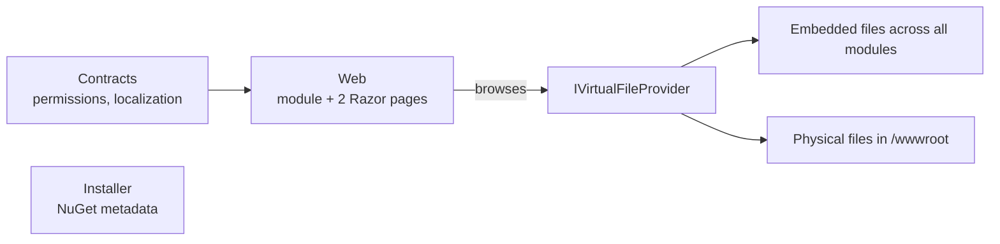
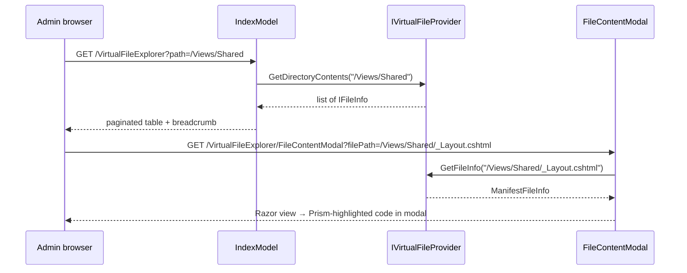

`modules/virtual-file-explorer/` is a small but invaluable **developer tool**. ABP applications gather their assets — Razor views, CSS, JavaScript, static images, localization JSON — from many `[DependsOn]`-linked modules and overlay them into a single [virtual file system](/core/virtual-file-system). At runtime an `IVirtualFileProvider` returns whichever copy "wins" the override priority. That makes "which assembly is actually serving this `_Layout.cshtml`?" a non-trivial question. The Virtual File Explorer module answers it visually: log in, open the menu item, browse the virtual `/`, click any file, and see the rendered content — without redeploying, without attaching a debugger, and without needing access to the source tree.

This page covers the entire module: the permission, the options switch that turns it on or off, the menu contributor, the two Razor pages, the bundle extensions, and a screenshot-shaped explanation of what you see when you use it.

## When to use it

<CardGroup cols={2}>
  <Card title="Theme override troubleshooting" icon="layer-group">
    "I dropped `MyTheme/Views/Shared/Components/Menu/Default.cshtml` into my host project but the old layout still renders." → open the explorer, navigate to `/Views/Shared/Components/Menu/Default.cshtml`, click it — the panel shows which assembly actually wins.
  </Card>
  <Card title="Localization debugging" icon="language">
    "Is my Turkish JSON being picked up?" → open `/Localization/MyResource/tr.json` in the explorer; if it isn't there, the embedded resource path is wrong.
  </Card>
  <Card title="Static asset audit" icon="image">
    "Where did this 4 MB sprite get bundled?" → enumerate `/wwwroot/assets/` to see contributors per file.
  </Card>
  <Card title="Module-author smoke test" icon="check">
    When publishing your own module, verify all `*.cshtml` and CSS files are properly embedded by browsing the deployed virtual tree.
  </Card>
</CardGroup>

<Warning>
  This is a **development / on-prem operator tool**, not a public-facing feature. The Razor pages render embedded source code on the screen; never expose it on a public host without a strong permission policy. See [security and claims](/auth/security-and-claims).
</Warning>

## Projects

`modules/virtual-file-explorer/src/` has three projects — there is no Domain, Application, or persistence layer because the module reads from the in-memory virtual file system.

| Project | Purpose |
| --- | --- |
| `Volo.Abp.VirtualFileExplorer.Contracts` | `VirtualFileExplorerPermissions`, `AbpVirtualFileExplorerPermissionDefinitionProvider`, `VirtualFileExplorerResource` (localization) |
| `Volo.Abp.VirtualFileExplorer.Web` | `AbpVirtualFileExplorerWebModule`, `AbpVirtualFileExplorerOptions`, `VirtualFileExplorerMenuContributor`, two Razor pages, two Prism.js bundle extensions, `FileInfoViewModel` |
| `Volo.Abp.VirtualFileExplorer.Installer` | NuGet metadata for `abp install-module` |



## The permission

A single permission gates the entire UI:

```csharp
public static class VirtualFileExplorerPermissions
{
    public const string GroupName = "AbpVirtualFileExplorer";
    public const string View      = GroupName + ".View";

    public static string[] GetAll() => ReflectionHelper.GetPublicConstantsRecursively(typeof(VirtualFileExplorerPermissions));
}
```

Registered by `AbpVirtualFileExplorerPermissionDefinitionProvider`:

```csharp
public override void Define(IPermissionDefinitionContext context)
{
    var group = context.AddGroup(VirtualFileExplorerPermissions.GroupName, L("Permission:AbpVirtualFileExplorer"));
    group.AddPermission(VirtualFileExplorerPermissions.View, L("Permission:AbpVirtualFileExplorer:View"));
}
```

By default only admins have it — grant it manually via [permission management](/modules/permission-management) (Admin → Permissions → "Abp Virtual File Explorer") or seed it in your data seeder. Don't grant it to anonymous users.

## The options object

```csharp
public class AbpVirtualFileExplorerOptions
{
    /// <summary>Default: true.</summary>
    public bool IsEnabled { get; set; } = true;
}
```

`AbpVirtualFileExplorerWebModule.ConfigureServices` executes pre-configured actions on this options object, then only adds the navigation contributor, registers the embedded file set, and extends Prism.js bundles **if** `IsEnabled == true`.

That gives you a clean kill-switch for production builds:

```csharp
public override void PreConfigureServices(ServiceConfigurationContext context)
{
    PreConfigure<AbpVirtualFileExplorerOptions>(options =>
    {
        // In Production, hide the explorer entirely.
        options.IsEnabled = !Environment.IsProduction();
    });
}
```

When `IsEnabled == false`:

- No menu item appears.
- The embedded file set is not added to the VFS (Razor cannot find the views, so the routes 404).
- Prism.js bundles are not extended.

## Wire-up

`AbpVirtualFileExplorerWebModule` is the single module to depend on:

```csharp
[DependsOn(typeof(AbpAspNetCoreMvcUiBootstrapModule))]
[DependsOn(typeof(AbpAspNetCoreMvcUiThemeSharedModule))]
[DependsOn(typeof(AbpVirtualFileExplorerContractsModule))]
public class AbpVirtualFileExplorerWebModule : AbpModule
{
    public override void PreConfigureServices(ServiceConfigurationContext context)
    {
        PreConfigure<IMvcBuilder>(mvcBuilder =>
        {
            mvcBuilder.AddApplicationPartIfNotExists(typeof(AbpVirtualFileExplorerWebModule).Assembly);
        });
    }

    public override void ConfigureServices(ServiceConfigurationContext context)
    {
        var options = context.Services.ExecutePreConfiguredActions<AbpVirtualFileExplorerOptions>();
        if (!options.IsEnabled) return;

        Configure<AbpNavigationOptions>(o => o.MenuContributors.Add(new VirtualFileExplorerMenuContributor()));

        Configure<AbpVirtualFileSystemOptions>(o =>
        {
            o.FileSets.AddEmbedded<AbpVirtualFileExplorerWebModule>("Volo.Abp.VirtualFileExplorer.Web");
        });

        Configure<AbpBundleContributorOptions>(o =>
        {
            o.Extensions<PrismjsStyleBundleContributor>().Add<PrismjsStyleBundleContributorDocsExtension>();
            o.Extensions<PrismjsScriptBundleContributor>().Add<PrismjsScriptBundleContributorDocsExtension>();
        });
    }
}
```

Three things happen at startup:

<Steps>
  <Step title="Application part is registered">
    `AddApplicationPartIfNotExists` makes the explorer's Razor pages discoverable by MVC routing.
  </Step>
  <Step title="Menu contributor is added">
    `VirtualFileExplorerMenuContributor` injects a "Virtual File Explorer" item under the standard `Main` menu, gated by `VirtualFileExplorerPermissions.View`.
  </Step>
  <Step title="Prism.js bundle is extended">
    `PrismjsStyleBundleContributorDocsExtension` + `PrismjsScriptBundleContributorDocsExtension` add Prism's `toolbar` and `copy-to-clipboard` plugins so the file content modal has a "copy" button.
  </Step>
</Steps>

## The menu contributor

```csharp
public class VirtualFileExplorerMenuContributor : IMenuContributor
{
    public virtual Task ConfigureMenuAsync(MenuConfigurationContext context)
    {
        if (context.Menu.Name != StandardMenus.Main) return Task.CompletedTask;

        var l = context.GetLocalizer<VirtualFileExplorerResource>();

        context.Menu.Items.Add(new ApplicationMenuItem(
                VirtualFileExplorerMenuNames.Index,
                l["Menu:VirtualFileExplorer"],
                icon: "fa fa-file",
                url: "~/VirtualFileExplorer")
            .RequirePermissions(VirtualFileExplorerPermissions.View));

        return Task.CompletedTask;
    }
}
```

The menu item is a top-level entry — usually deployed under an "Administration" → "Tools" group by adjusting the contributor or replacing it. The `.RequirePermissions(...)` call hides the item from the rendered menu when the user lacks the permission, as well as enforcing it server-side.

## The Razor pages

### `/VirtualFileExplorer` (Index)

The list view. Walks `IVirtualFileProvider.GetDirectoryContents(Path)`, filters by allowed file-info types, and paginates.

```csharp
[Authorize(VirtualFileExplorerPermissions.View)]
public class IndexModel : VirtualFileExplorerPageModel
{
    [BindProperty(SupportsGet = true)] public string Path { get; set; } = "/";
    [BindProperty(SupportsGet = true)] public int CurrentPage { get; set; } = 1;
    [BindProperty(SupportsGet = true)] public int PageSize { get; set; } = 10;

    public List<FileInfoViewModel> FileInfoList { get; set; }
    public PagerModel PagerModel { get; set; }
    public string PathNavigation { get; set; }

    protected IVirtualFileProvider VirtualFileProvider { get; }

    public virtual IActionResult OnGet()
    {
        var query = VirtualFileProvider.GetDirectoryContents(Path)
            .Where(d => VirtualFileExplorerConsts.AllowFileInfoTypes.Contains(d.GetType().Name))
            .OrderByDescending(f => f.IsDirectory)
            .ToList();

        PagerModel = new PagerModel(query.Count, PageSize, CurrentPage, PageSize, /* baseUrl */ ...);
        SetViewModel(query.Skip((CurrentPage - 1) * PageSize).Take(PageSize));
        SetPathNavigation();
        return Page();
    }
}
```

The allow-list `VirtualFileExplorerConsts.AllowFileInfoTypes` is small and deliberate:

```csharp
public static class VirtualFileExplorerConsts
{
    public static readonly string[] AllowFileInfoTypes =
    {
        "VirtualDirectoryFileInfo",
        "EmbeddedResourceFileInfo",
        "ManifestDirectoryInfo",
        "ManifestFileInfo"
    };
}
```

| File info type | Where it comes from |
| --- | --- |
| `VirtualDirectoryFileInfo` | Synthetic directories created by ABP's virtual file system |
| `EmbeddedResourceFileInfo` | Files embedded into module assemblies via `[assembly: VirtualFileSystem]` |
| `ManifestDirectoryInfo`, `ManifestFileInfo` | Files inside an embedded manifest (the standard `Microsoft.Extensions.FileProviders.Embedded` shape) |

Physical disk files (e.g. `wwwroot/css/site.css`) are **deliberately filtered out** — the explorer focuses on the parts of the VFS that aren't already visible on disk.

### `FileInfoViewModel`

Each row in the table:

```csharp
public class FileInfoViewModel
{
    public string FilePath { get; set; }
    public string Icon { get; set; }              // "fas fa-folder" or "fas fa-file"
    public string FileType { get; set; }          // "folder" or "file"
    public string Length { get; set; }            // formatted size or "/"
    public string FileName { get; set; }          // raw name (folder rows wrap in <a href=...>)
    public DateTime LastUpdateTime { get; set; }
    public bool IsDirectory { get; set; }
}
```

`IndexModel.SetViewModel` populates one of these per `IFileInfo`. Directories link straight back into `/VirtualFileExplorer?path=...`; files render with the size + last-modified time and open the modal.

### `/VirtualFileExplorer/FileContentModal`

Opens the file content in a modal with Prism.js syntax highlighting and a copy-to-clipboard button.

```csharp
[Authorize(VirtualFileExplorerPermissions.View)]
public class FileContentModal : PageModel
{
    [Required, BindProperty(SupportsGet = true)] public string FilePath { get; set; }
    public string Content { get; set; }

    protected IVirtualFileProvider VirtualFileProvider { get; }

    public virtual async Task<IActionResult> OnGetAsync()
    {
        var fileInfo = VirtualFileProvider.GetFileInfo(FilePath);
        if (fileInfo == null || fileInfo.IsDirectory) return NotFound();

        Content = await fileInfo.ReadAsStringAsync();
        return Page();
    }
}
```

Read-only by design — there's no PUT endpoint that would let an admin overwrite an embedded resource.

## Request flow



## Bundle extensions

The two extension contributors plug into the [shared theme's](/aspnetcore/mvc-ui-themes) Prism.js bundle:

```csharp
public class PrismjsScriptBundleContributorDocsExtension : BundleContributor
{
    public override void ConfigureBundle(BundleConfigurationContext context)
    {
        context.Files.AddIfNotContains("/libs/prismjs/plugins/toolbar/prism-toolbar.js");
        context.Files.AddIfNotContains("/libs/prismjs/plugins/copy-to-clipboard/prism-copy-to-clipboard.js");
    }
}
```

The style extension equivalents add the corresponding CSS. They make the modal's "copy" button render across **all** themes (Basic, LeptonX, …) by hooking the global Prism bundle definition. See [MVC UI bundling](/aspnetcore/mvc-ui-bundling) for how extensions are merged.

## What it doesn't do

| Not supported | Why |
| --- | --- |
| Edit files | Embedded resources are bytes in an assembly — there is no in-process way to change them. |
| Reveal physical disk files | Use a regular file manager. The explorer's allow-list excludes `PhysicalFileInfo`. |
| Stream binary files | `OnGetAsync` calls `ReadAsStringAsync()`. Binary files render as garbage and waste memory. The modal is intended for text/code. |
| Search content | Browse-only. For finding a specific file, navigate the tree by name. |

## Cross-references

- [Virtual file system](/core/virtual-file-system) — the abstraction this module surfaces.
- [Permission management](/modules/permission-management) — how to grant `AbpVirtualFileExplorer.View`.
- [Security and claims](/auth/security-and-claims) — gate the menu correctly in production.
- [MVC UI themes](/aspnetcore/mvc-ui-themes) — explains why the Prism toolbar extension is theme-agnostic.
- [MVC UI bundling](/aspnetcore/mvc-ui-bundling) — how `Extensions<PrismjsScriptBundleContributor>()` works.
- [Modules overview](/modules/overview) — module catalog index.
