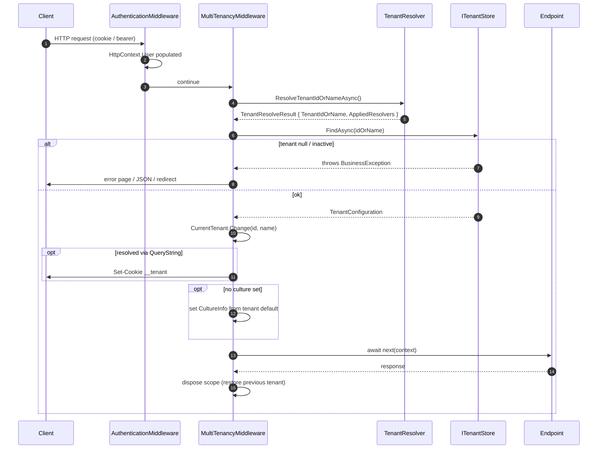

`Volo.Abp.AspNetCore.MultiTenancy` is the bridge between the abstract resolution pipeline and an HTTP request. It contributes the four HTTP-aware resolvers (`QueryString`, `Route`, `Header`, `Cookie`), a middleware that activates the resolved tenant scope, an error page for invalid resolutions, and an `HttpContext`-backed `ITenantResolveResultAccessor`.

`framework/src/Volo.Abp.AspNetCore.MultiTenancy/`

## Module wiring

```csharp
// .../AbpAspNetCoreMultiTenancyModule.cs
[DependsOn(
    typeof(AbpMultiTenancyModule),
    typeof(AbpAspNetCoreModule)
)]
public class AbpAspNetCoreMultiTenancyModule : AbpModule
{
    public override void ConfigureServices(ServiceConfigurationContext context)
    {
        Configure<AbpTenantResolveOptions>(options =>
        {
            options.TenantResolvers.Add(new QueryStringTenantResolveContributor());
            options.TenantResolvers.Add(new RouteTenantResolveContributor());
            options.TenantResolvers.Add(new HeaderTenantResolveContributor());
            options.TenantResolvers.Add(new CookieTenantResolveContributor());
        });
    }
}
```

The module also replaces `NullTenantResolveResultAccessor` with `HttpContextTenantResolveResultAccessor`:

```csharp
// .../HttpContextTenantResolveResultAccessor.cs
[Dependency(ReplaceServices = true)]
public class HttpContextTenantResolveResultAccessor : ITenantResolveResultAccessor, ITransientDependency
{
    public const string HttpContextItemName = "__AbpTenantResolveResult";

    public TenantResolveResult? Result
    {
        get => _httpContextAccessor.HttpContext?.Items[HttpContextItemName] as TenantResolveResult;
        set
        {
            if (_httpContextAccessor.HttpContext == null) return;
            _httpContextAccessor.HttpContext.Items[HttpContextItemName] = value;
        }
    }
}
```

This is what `TenantConfigurationProvider.GetAsync(saveResolveResult: true)` writes into, and what downstream code (theme layouts, the multi-tenancy error page) reads to know *which* resolver actually fired.

## Pipeline placement — `app.UseMultiTenancy()`

```csharp
// .../Microsoft/AspNetCore/Builder/
//   AbpAspNetCoreMultiTenancyApplicationBuilderExtensions.cs
public static IApplicationBuilder UseMultiTenancy(this IApplicationBuilder app)
{
    var multiTenancyOptions = app.ApplicationServices
        .GetRequiredService<IOptions<AbpTenantResolveOptions>>();
    var hasCurrentUser = multiTenancyOptions.Value.TenantResolvers
        .Any(r => r is CurrentUserTenantResolveContributor);
    if (hasCurrentUser)
    {
        var authSet = app.Properties.TryGetValue("__AuthenticationMiddlewareSet", out var v) && v is true;
        if (!authSet)
        {
            var logger = app.ApplicationServices.GetService<ILogger<MultiTenancyMiddleware>>();
            logger?.LogWarning(
                "MultiTenancyMiddleware is being registered before the authentication middleware. " +
                "This may lead to incorrect tenant resolution if the resolution depends on the " +
                "authenticated user. Ensure app.UseAuthentication() is called before app.UseMultiTenancy().");
        }
    }
    return app.UseMiddleware<MultiTenancyMiddleware>();
}
```

The order matters because `CurrentUserTenantResolveContributor` (position 0 in the resolver list) needs `ICurrentUser` to report `IsAuthenticated`, which depends on `UseAuthentication` having populated `HttpContext.User`. The extension method does not fix the order for you — it just warns. The canonical wiring in templates is:

```csharp
app.UseAbpRequestLocalization();
app.UseStaticFiles();
app.UseRouting();
app.UseAuthentication();      // → ICurrentUser becomes accurate
app.UseAbpOpenIddictValidation(); // if used
app.UseMultiTenancy();        // → ICurrentTenant gets set here
app.UseAuthorization();
app.UseConfiguredEndpoints();
```

The `__AuthenticationMiddlewareSet` flag is set by ASP.NET Core's own `app.UseAuthentication()` extension. `UseMultiTenancy` only reads it to decide whether to emit the warning — it does not enforce or reorder anything.

## The middleware

```csharp
// .../MultiTenancyMiddleware.cs
public class MultiTenancyMiddleware : AbpMiddlewareBase, ITransientDependency
{
    public async override Task InvokeAsync(HttpContext context, RequestDelegate next)
    {
        TenantConfiguration? tenant = null;
        try
        {
            tenant = await _tenantConfigurationProvider.GetAsync(saveResolveResult: true);
        }
        catch (Exception e)
        {
            Logger.LogException(e);
            if (await _options.MultiTenancyMiddlewareErrorPageBuilder(context, e)) return;
        }

        if (tenant?.Id != _currentTenant.Id)
        {
            using (_currentTenant.Change(tenant?.Id, tenant?.Name))
            {
                if (_tenantResolveResultAccessor.Result != null &&
                    _tenantResolveResultAccessor.Result.AppliedResolvers
                        .Contains(QueryStringTenantResolveContributor.ContributorName))
                {
                    AbpMultiTenancyCookieHelper.SetTenantCookie(context, _currentTenant.Id, _options.TenantKey);
                }

                var requestCulture = await TryGetRequestCultureAsync(context);
                if (requestCulture != null)
                {
                    CultureInfo.CurrentCulture = requestCulture.Culture;
                    CultureInfo.CurrentUICulture = requestCulture.UICulture;
                    AbpRequestCultureCookieHelper.SetCultureCookie(context, requestCulture);
                    context.Items[AbpRequestLocalizationMiddleware.HttpContextItemName] = true;
                }

                await next(context);
            }
        }
        else
        {
            await next(context);
        }
    }
}
```

Five things this middleware does, in order:

1. **Resolve** via `ITenantConfigurationProvider.GetAsync(saveResolveResult: true)` — populates `ITenantResolveResultAccessor.Result` for downstream code.
2. **Catch and divert** `BusinessException`s thrown by `TenantConfigurationProvider` (not found, not active). Hands the exception to `MultiTenancyMiddlewareErrorPageBuilder`; if that returns `true`, the request is short-circuited.
3. **Open the tenant scope** with `ICurrentTenant.Change(tenant?.Id, tenant?.Name)` — but only if it differs from the current value. (Skipping the change is a perf optimization; it also avoids one wasted `AsyncLocal` write per request when an upstream piece already activated the tenant.)
4. **Promote query-string resolution to a cookie** so the `?__tenant=acme` URL becomes sticky without explicit code.
5. **Apply the tenant's default language** — only when `RequestLocalizationMiddleware` did not pick a language itself. This is what makes a tenant's `Abp.Localization.DefaultLanguage` setting take effect for anonymous requests on the login page.

The downstream `await next(context)` runs *inside* the `using`, so the entire MVC / Razor Pages / Blazor render pipeline sees the right `ICurrentTenant`.

## `AbpAspNetCoreMultiTenancyOptions`

```csharp
// .../AbpAspNetCoreMultiTenancyOptions.cs
public class AbpAspNetCoreMultiTenancyOptions
{
    public string TenantKey { get; set; } = TenantResolverConsts.DefaultTenantKey;   // "__tenant"
    public Func<HttpContext, Exception, Task<bool>> MultiTenancyMiddlewareErrorPageBuilder { get; set; }
}
```

| Option | Purpose |
| --- | --- |
| `TenantKey` | Key used by `QueryStringTenantResolveContributor`, `RouteTenantResolveContributor`, `HeaderTenantResolveContributor`, `CookieTenantResolveContributor` and `AbpMultiTenancyCookieHelper.SetTenantCookie`. Default `"__tenant"`. |
| `MultiTenancyMiddlewareErrorPageBuilder` | `(HttpContext, Exception) → Task<bool>`. Return `true` to short-circuit the pipeline (the framework already wrote the response). Return `false` to fall through to whatever comes next — usually you want `true`. |

Override the key at startup:

```csharp
Configure<AbpAspNetCoreMultiTenancyOptions>(options =>
{
    options.TenantKey = "X-Tenant-Id";
});
```

## The default error page builder

When `TenantConfigurationProvider.GetAsync` throws (`TenantNotFoundMessage` or `TenantNotActiveMessage`), the default `MultiTenancyMiddlewareErrorPageBuilder` does five things, in this order:

1. **Sign the user out of cookie authentication** if the only resolver that fired was `CurrentUser` — that means the auth cookie carries a stale tenant id; killing the cookie forces re-login.
2. **Delete the `__tenant` cookie** if `Cookie` was applied or the cookie just exists — same reason.
3. **Append the `Abp-Tenant-Resolve-Error` response header** with the exception message (HTML-encoded). API clients use this to detect the condition without parsing the body.
4. **For AJAX requests** (`X-Requested-With: XMLHttpRequest`) write a `RemoteServiceErrorResponse` JSON body with status `404 Not Found`.
5. **For non-AJAX GETs after a cookie sign-out**, redirect to the same URL (now without the cookies). For everything else, render `MultiTenancyMiddlewareErrorPage` (a precompiled Razor view that takes a `MultiTenancyMiddlewareErrorPageModel`).

Customize by replacing the delegate:

```csharp
Configure<AbpAspNetCoreMultiTenancyOptions>(options =>
{
    var previous = options.MultiTenancyMiddlewareErrorPageBuilder;
    options.MultiTenancyMiddlewareErrorPageBuilder = async (ctx, ex) =>
    {
        // Custom telemetry
        ctx.RequestServices.GetRequiredService<ITelemetry>().TrackBadTenant(ex);
        return await previous(ctx, ex); // delegate to the framework default
    };
});
```

## Cookie write-back helper

```csharp
// .../AbpMultiTenancyCookieHelper.cs
public static class AbpMultiTenancyCookieHelper
{
    public static void SetTenantCookie(HttpContext context, Guid? tenantId, string tenantKey)
    {
        if (tenantId != null)
        {
            context.Response.Cookies.Append(tenantKey, tenantId.ToString()!,
                new CookieOptions
                {
                    Path = "/",
                    HttpOnly = false,            // readable by JS (the UI uses it)
                    IsEssential = true,          // not blocked by consent
                    Expires = DateTimeOffset.Now.AddYears(10)
                });
        }
        else
        {
            context.Response.Cookies.Delete(tenantKey);
        }
    }
}
```

`HttpOnly = false` is intentional: the MVC UI reads the cookie from JavaScript to render the tenant switch box. `IsEssential = true` keeps it out of GDPR consent gating.

The helper is called from three places:

| Caller | When |
| --- | --- |
| `MultiTenancyMiddleware` | After a `QueryString` resolution, to make the tenant sticky. |
| Default error page builder | To delete the cookie on a failed resolution. |
| `TenantSwitchModalModel.OnPostAsync` | After a user submits the switch modal. See [MVC UI](/multitenancy/mvc-ui). |

## Pipeline picture



## Adding the domain resolver

Not added by the module by default. Opt in via the extension:

```csharp
// .../Volo/Abp/MultiTenancy/AbpMultiTenancyOptionsExtensions.cs
Configure<AbpTenantResolveOptions>(options =>
{
    options.AddDomainTenantResolver("{0}.mycompany.com");
});
```

`AddDomainTenantResolver` inserts the resolver *after* `CurrentUserTenantResolveContributor`. See [Tenant resolution](/multitenancy/tenant-resolution#domain-resolver--opt-in) for the matching rules.

## Notes for hosts that are not ASP.NET Core

Background services, console hosts, MAUI apps and gRPC-only servers don't load `Volo.Abp.AspNetCore.MultiTenancy` — they only get the framework's `CurrentUser` contributor. For those hosts you:

- Either call `ICurrentTenant.Change(tenantId)` explicitly at the job entry point.
- Or register a custom `ITenantResolveContributor` that reads from your transport (e.g. a gRPC metadata entry, a Service Bus message property).

`HttpContextTenantResolveResultAccessor` is `[Dependency(ReplaceServices = true)]` *only* in the AspNetCore.MultiTenancy assembly, so non-HTTP hosts keep `NullTenantResolveResultAccessor` — that's harmless, the rest of the framework only ever *writes* to the accessor and tolerates a null read.
