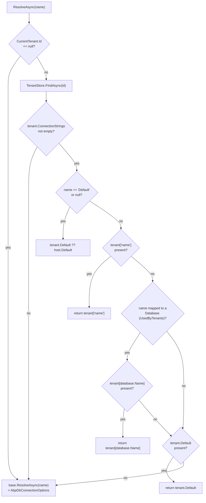

ABP supports three database styles per `AbpMultiTenancyOptions.DatabaseStyle`: `Shared` (one database, `TenantId` filter), `PerTenant` (every tenant on its own database), and `Hybrid` (mix and match — some tenants share the host database, others have their own; even named connection strings like `Saas` or `AuditLogging` can route per-tenant). The component that turns "current tenant + connection string name" into a real connection string is `MultiTenantConnectionStringResolver`.

It registers as a `[Dependency(ReplaceServices = true)]` override of `DefaultConnectionStringResolver` whenever `Volo.Abp.MultiTenancy` is loaded, so any data provider (EF Core, MongoDB, Dapper) that resolves through `IConnectionStringResolver` becomes tenant-aware for free.

`framework/src/Volo.Abp.MultiTenancy/Volo/Abp/MultiTenancy/MultiTenantConnectionStringResolver.cs`

## The resolution chain

```csharp
[Dependency(ReplaceServices = true)]
public class MultiTenantConnectionStringResolver : DefaultConnectionStringResolver
{
    public override async Task<string> ResolveAsync(string? connectionStringName = null)
    {
        if (_currentTenant.Id == null)
        {
            // No current tenant — host. Use AbpDbConnectionOptions.
            return await base.ResolveAsync(connectionStringName);
        }

        var tenant = await FindTenantConfigurationAsync(_currentTenant.Id.Value);
        if (tenant == null || tenant.ConnectionStrings.IsNullOrEmpty())
        {
            // Tenant defined no overrides — fall back to host config.
            return await base.ResolveAsync(connectionStringName);
        }

        var tenantDefault = tenant.ConnectionStrings?.Default;

        // (1) "Default" was asked for.
        if (connectionStringName == null ||
            connectionStringName == ConnectionStrings.DefaultConnectionStringName)
        {
            return !tenantDefault.IsNullOrWhiteSpace()
                ? tenantDefault!
                : Options.ConnectionStrings.Default!;
        }

        // (2) A specific name was asked for — does the tenant override it?
        var connString = tenant.ConnectionStrings?.GetOrDefault(connectionStringName);
        if (!connString.IsNullOrWhiteSpace()) return connString!;

        // (3) Is this name mapped to a Database used by tenants? If yes,
        // try the tenant's override under the *database* name.
        var database = Options.Databases.GetMappedDatabaseOrNull(connectionStringName);
        if (database != null && database.IsUsedByTenants)
        {
            connString = tenant.ConnectionStrings?.GetOrDefault(database.DatabaseName);
            if (!connString.IsNullOrWhiteSpace()) return connString!;
        }

        // (4) Tenant has a default → use it for the unknown name.
        if (!tenantDefault.IsNullOrWhiteSpace()) return tenantDefault!;

        // (5) Give up and use the host's value for that name (or null).
        return await base.ResolveAsync(connectionStringName);
    }
}
```

The same logic ships in a synchronous `Resolve(...)` (marked `[Obsolete]`) for legacy code paths.



## What the resolver depends on

- `ICurrentTenant` — gates the entire branch. `Id == null` is treated as host, and the host's `AbpDbConnectionOptions` answer directly.
- `ITenantStore` — looked up through a *fresh DI scope* (`_serviceProvider.CreateScope()`) so its UoW interception, caching and own data filter behavior are not entangled with the request's UoW that triggered the resolution.
- `IOptionsMonitor<AbpDbConnectionOptions>` — the host's view: `ConnectionStrings`, `Databases`. See [Connection strings](/data/connection-strings).

```csharp
protected virtual async Task<TenantConfiguration?> FindTenantConfigurationAsync(Guid tenantId)
{
    using (var serviceScope = _serviceProvider.CreateScope())
    {
        var tenantStore = serviceScope.ServiceProvider.GetRequiredService<ITenantStore>();
        return await tenantStore.FindAsync(tenantId);
    }
}
```

This is also why `TenantStore` in the Tenant Management module uses a distributed cache — every connection string lookup hits this method, which is called once per `DbContext` open per UoW.

## Mapped databases — the `(3)` step

`AbpDbConnectionOptions.Databases` lets a host map "logical" connection-string names to "physical" database names that should also pick up per-tenant overrides:

```csharp
Configure<AbpDbConnectionOptions>(options =>
{
    options.Databases.Configure("SaasService", db =>
    {
        db.MappedConnections.Add("AbpSaas");
        db.IsUsedByTenants = true;
    });
});
```

With `IsUsedByTenants = true`, when a caller asks for `"AbpSaas"`:

1. The resolver looks for `tenant.ConnectionStrings["AbpSaas"]`. If present, that wins.
2. Otherwise it checks `Options.Databases.GetMappedDatabaseOrNull("AbpSaas")` and tries `tenant.ConnectionStrings["SaasService"]` (the *database* name).
3. Otherwise it falls back to the tenant's `Default`.
4. Otherwise it falls back to the host's `AbpDbConnectionOptions` lookup for `"AbpSaas"`.

This is what makes `Hybrid` style ergonomic: a tenant can put one connection string under the database name and have *all* modules backed by that database (`AbpSaas`, `AbpAuditLogging`, `AbpFeatureManagement` if they map to the same DB) route to it.

## `TenantConfiguration.ConnectionStrings`

The DTO that `ITenantStore` returns:

```csharp
// framework/src/Volo.Abp.MultiTenancy.Abstractions/Volo/Abp/MultiTenancy/TenantConfiguration.cs
public class TenantConfiguration
{
    public Guid Id { get; set; }
    public string Name { get; set; } = default!;
    public string NormalizedName { get; set; } = default!;
    public ConnectionStrings? ConnectionStrings { get; set; }   // dictionary-like, has Default
    public bool IsActive { get; set; }
    public Guid? EditionId { get; set; }
}
```

`ConnectionStrings` is the shared `Volo.Abp.Data.ConnectionStrings` dictionary — the same type that backs `AbpDbConnectionOptions.ConnectionStrings`. `Default` is `this["Default"]`. Names are case-insensitive lookups.

## The `Tenant` aggregate behind it

In production the `ITenantStore` is backed by the Tenant Management module's `Tenant` aggregate. Per-tenant connection strings are an owned collection on the aggregate, not a property bag:

```csharp
// modules/tenant-management/src/Volo.Abp.TenantManagement.Domain/Volo/Abp/TenantManagement/Tenant.cs
public class Tenant : FullAuditedAggregateRoot<Guid>, IHasEntityVersion
{
    public virtual string Name { get; protected set; }
    public virtual string NormalizedName { get; protected set; }
    public virtual List<TenantConnectionString> ConnectionStrings { get; protected set; }

    public virtual string FindDefaultConnectionString() =>
        FindConnectionString(Data.ConnectionStrings.DefaultConnectionStringName);

    public virtual string FindConnectionString(string name) =>
        ConnectionStrings.FirstOrDefault(c => c.Name == name)?.Value;

    public virtual void SetDefaultConnectionString(string connectionString) =>
        SetConnectionString(Data.ConnectionStrings.DefaultConnectionStringName, connectionString);

    public virtual void SetConnectionString(string name, string connectionString)
    {
        var existing = ConnectionStrings.FirstOrDefault(x => x.Name == name);
        if (existing != null) existing.SetValue(connectionString);
        else ConnectionStrings.Add(new TenantConnectionString(Id, name, connectionString));
    }

    public virtual void RemoveConnectionString(string name) { /* ... */ }
}
```

And the child entity:

```csharp
// modules/tenant-management/src/Volo.Abp.TenantManagement.Domain/Volo/Abp/TenantManagement/
//   TenantConnectionString.cs
public class TenantConnectionString : Entity
{
    public virtual Guid TenantId { get; protected set; }
    public virtual string Name { get; protected set; }   // composite key with TenantId
    public virtual string Value { get; protected set; }

    public override object[] GetKeys() => new object[] { TenantId, Name };
}
```

The `TenantStore` implementation in the Tenant Management module maps `Tenant` → `TenantConfiguration` via the AutoMapper / Mapperly profile registered in `AbpTenantManagementDomainModule`, then caches the result through `IDistributedCache<TenantConfigurationCacheItem>` with UoW awareness:

```csharp
// modules/tenant-management/src/Volo.Abp.TenantManagement.Domain/.../TenantStore.cs
public virtual async Task<TenantConfiguration> FindAsync(Guid id) =>
    (await GetCacheItemAsync(id, null)).Value;

protected virtual async Task<TenantConfigurationCacheItem> GetCacheItemAsync(Guid? id, string normalizedName)
{
    var cacheKey = CalculateCacheKey(id, normalizedName);
    var cacheItem = await Cache.GetAsync(cacheKey, considerUow: true);
    if (cacheItem?.Value != null) return cacheItem;

    using (CurrentTenant.Change(null))   // read host-side Tenant rows even from tenant scope
    {
        var tenant = await TenantRepository.FindAsync(id!.Value);
        return await SetCacheAsync(cacheKey, tenant);
    }
}
```

`TenantConfigurationCacheItem` is marked `[IgnoreMultiTenancy]` so the cache itself does not get tenant-namespaced — the lookup table is the same regardless of which tenant is current.

## Persistent invalidation across nodes

When the Tenant Management module changes a connection string it publishes:

```csharp
// framework/src/Volo.Abp.MultiTenancy.Abstractions/Volo/Abp/MultiTenancy/
//   TenantConnectionStringUpdatedEto.cs
[EventName("abp.multi_tenancy.tenant.connection_string.updated")]
public class TenantConnectionStringUpdatedEto : EtoBase
{
    public Guid Id { get; set; }
    public string Name { get; set; }
    public string ConnectionStringName { get; set; }
    public string? OldValue { get; set; }
    public string? NewValue { get; set; }
}
```

Subscribers (typically other API hosts and worker processes that hold their own `TenantStore` cache) listen for this event and evict the affected cache entry. If you build a custom `ITenantStore`, mirror this behavior or your nodes will serve stale connection strings until the cache TTL expires.

## Default `ITenantStore` — for tests and tiny setups

When the Tenant Management module is not loaded, `Volo.Abp.MultiTenancy` provides `DefaultTenantStore` backed by `appsettings.json`:

```csharp
// framework/src/Volo.Abp.MultiTenancy/Volo/Abp/MultiTenancy/ConfigurationStore/DefaultTenantStore.cs
[Dependency(TryRegister = true)]
public class DefaultTenantStore : ITenantStore, ITransientDependency { /* in-memory lookup */ }
```

Bound from configuration in `AbpMultiTenancyModule.ConfigureServices`:

```csharp
Configure<AbpDefaultTenantStoreOptions>(configuration);
```

So you can declare tenants in `appsettings.json`:

```json
"Tenants": [
  {
    "Id": "5f3e7e7a-1a3a-4b9e-9c1e-1b2c3d4e5f6a",
    "Name": "acme",
    "NormalizedName": "ACME",
    "IsActive": true,
    "ConnectionStrings": { "Default": "Server=...;Database=Acme_App" }
  }
]
```

This is the path used by most integration tests and any host that does not want to host the full Tenant Management module.

## Interplay with `IConnectionStringResolver` consumers

| Caller | When it asks |
| --- | --- |
| `AbpDbContextOptions` (EF Core) | Each `DbContext` open within a UoW. |
| `MongoDbContext.CreateAsync` | Each MongoDB context open within a UoW. |
| `IDbConnectionCreator` (Dapper) | Each Dapper connection within a UoW. |
| Module data seed contributors | Once per tenant they iterate over (`using (CurrentTenant.Change(tenantId)) await seeder.SeedAsync()`). |

All of them call `IConnectionStringResolver.ResolveAsync(name)`. None of them know about `MultiTenantConnectionStringResolver` specifically — they just receive a tenant-correct string because DI swapped the implementation.

## Cross-references

- Host-side configuration shape: [Connection strings](/data/connection-strings).
- How the `TenantId` filter complements per-tenant connection strings in `Shared` and `Hybrid` modes: [Data filtering](/data/data-filtering).
- The Tenant aggregate, its repositories and UI: [Tenant Management module](/modules/tenant-management).
- The exact request lifecycle around the resolver: [Multi-tenant request flow](/flows/multi-tenant-request).
