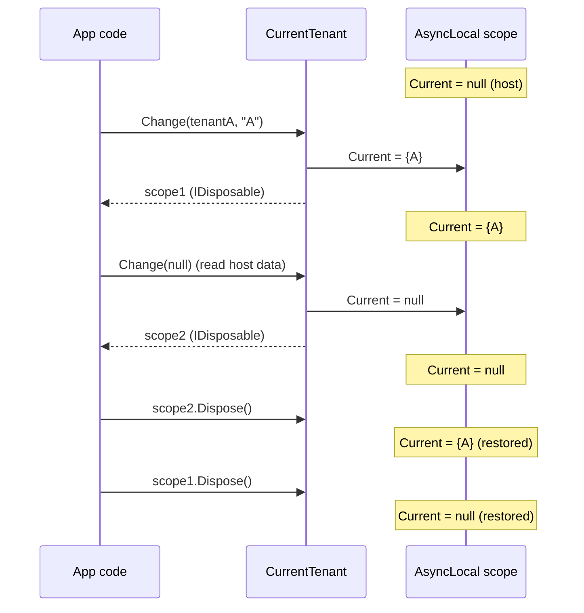

`ICurrentTenant` is the single point of truth for "which tenant is this code running for?" Every multi-tenant-aware subsystem — the EF Core / MongoDB filter, the connection string resolver, auditing, settings, distributed cache key generation — reads it instead of accepting a tenant id as a parameter. Understanding its scope semantics is the difference between code that works the first time and code that leaks tenant data across a single await.

## The contract

`framework/src/Volo.Abp.MultiTenancy.Abstractions/Volo/Abp/MultiTenancy/ICurrentTenant.cs`

```csharp
public interface ICurrentTenant
{
    bool IsAvailable { get; }                          // shorthand for Id.HasValue
    Guid? Id { get; }                                  // null = host
    string? Name { get; }                              // may be null even when Id is set
    IDisposable Change(Guid? id, string? name = null); // open a new tenant scope
}
```

Three facts:

- `Id == null` *means host*. It is not "unknown"; it is a real tenancy side.
- `Change` returns `IDisposable`. Restoring the previous value on `Dispose` is mandatory — that is how nested scopes work.
- `Name` is informational. The data filter, the connection string resolver and auditing only consume `Id`.

Two helpers are worth knowing:

```csharp
// framework/src/Volo.Abp.MultiTenancy.Abstractions/Volo/Abp/MultiTenancy/
//   CurrentTenantExtensions.cs
public static Guid GetId(this ICurrentTenant currentTenant)
{
    if (currentTenant.Id == null)
        throw new AbpException("Current Tenant Id is not available!");
    return currentTenant.Id.Value;
}

public static MultiTenancySides GetMultiTenancySide(this ICurrentTenant currentTenant) =>
    currentTenant.Id.HasValue ? MultiTenancySides.Tenant : MultiTenancySides.Host;
```

`GetId()` is the right call when a feature requires a tenant and falling back to host would be a bug — it throws a clear exception instead of silently reading host data.

## Implementation

`CurrentTenant` is a transient pass-through over `ICurrentTenantAccessor`:

```csharp
// framework/src/Volo.Abp.MultiTenancy/Volo/Abp/MultiTenancy/CurrentTenant.cs
public class CurrentTenant : ICurrentTenant, ITransientDependency
{
    public virtual bool IsAvailable => Id.HasValue;
    public virtual Guid? Id => _currentTenantAccessor.Current?.TenantId;
    public string? Name => _currentTenantAccessor.Current?.Name;

    public IDisposable Change(Guid? id, string? name = null)
    {
        var parentScope = _currentTenantAccessor.Current;
        _currentTenantAccessor.Current = new BasicTenantInfo(id, name);

        return new DisposeAction<ValueTuple<ICurrentTenantAccessor, BasicTenantInfo?>>(
            static (state) => state.Item1.Current = state.Item2,
            (_currentTenantAccessor, parentScope));
    }
}
```

The state-restoring `DisposeAction` uses a static lambda + tuple so no closure is allocated per scope — `Change` is on the hot path of multi-tenant requests.

## The accessor — async-local state

`framework/src/Volo.Abp.MultiTenancy/Volo/Abp/MultiTenancy/AsyncLocalCurrentTenantAccessor.cs`

```csharp
public class AsyncLocalCurrentTenantAccessor : ICurrentTenantAccessor
{
    public static AsyncLocalCurrentTenantAccessor Instance { get; } = new();

    public BasicTenantInfo? Current
    {
        get => _currentScope.Value;
        set => _currentScope.Value = value;
    }

    private readonly AsyncLocal<BasicTenantInfo?> _currentScope;
    private AsyncLocalCurrentTenantAccessor() { _currentScope = new AsyncLocal<BasicTenantInfo?>(); }
}
```

Registration in `AbpMultiTenancyModule`:

```csharp
context.Services.AddSingleton<ICurrentTenantAccessor>(AsyncLocalCurrentTenantAccessor.Instance);
```

Three consequences of the `AsyncLocal<T>` choice:

1. **Awaits flow through.** `await SomeIO()` inside a `using (CurrentTenant.Change(id))` block keeps the tenant set after the await resumes, possibly on a different thread.
2. **`Task.Run` keeps the value, `new Thread` keeps the value, `BackgroundService.ExecuteAsync` keeps the value of the *call site*.** A `BackgroundJob` execution does **not** inherit the publisher's `ICurrentTenant`; it gets the tenant id from the job arguments and you must `Change` to it.
3. **Fire-and-forget mutates the caller.** Writing `_ = DoAsync();` without `await` inside a `using (Change(id))` block is dangerous: the `Dispose` runs before `DoAsync` finishes, restoring the parent scope under the still-running task. Always await inside the using block, or open a new scope inside `DoAsync`.

`BasicTenantInfo` is a simple container, not a stack — the "stack" is recreated by `DisposeAction` writing back the previous value when each `using` exits.

```csharp
// framework/src/Volo.Abp.MultiTenancy.Abstractions/Volo/Abp/MultiTenancy/BasicTenantInfo.cs
public class BasicTenantInfo
{
    public Guid? TenantId { get; }   // null = host
    public string? Name { get; }
    public BasicTenantInfo(Guid? tenantId, string? name = null) { TenantId = tenantId; Name = name; }
}
```

## Scope semantics — nesting



Inner scope can change to any value, including `null`, without losing the outer. This is exactly how `TenantStore` reads tenant rows that physically live on host-side tables while serving a tenant request:

```csharp
// modules/tenant-management/src/Volo.Abp.TenantManagement.Domain/.../TenantStore.cs
using (CurrentTenant.Change(null))      // host scope just for this query
{
    var tenant = await TenantRepository.FindAsync(id.Value);
    return await SetCacheAsync(cacheKey, tenant);
}
```

## What reads `ICurrentTenant`

| Subsystem | Where | What it does with `Id` |
| --- | --- | --- |
| EF Core / MongoDB `IMultiTenant` filter | `framework/src/Volo.Abp.EntityFrameworkCore`, `Volo.Abp.MongoDB` | Query filter `e.TenantId == CurrentTenant.Id`. See [Data filtering](/data/data-filtering). |
| Connection string resolver | `framework/src/Volo.Abp.MultiTenancy/.../MultiTenantConnectionStringResolver.cs` | Picks the tenant's `ConnectionStrings.Default` (and named overrides) when `Id != null`. See [Connection string resolver](/multitenancy/connection-string-resolver). |
| Auditing | `framework/src/Volo.Abp.Auditing` | `AuditLogInfo.TenantId = CurrentTenant.Id` on every write. |
| `TenantSettingValueProvider` | `framework/src/Volo.Abp.MultiTenancy/Volo/Abp/MultiTenancy/TenantSettingValueProvider.cs` | Stores/reads settings under provider key `"T"` with `CurrentTenant.Id?.ToString()` as scope. Registered *after* `GlobalSettingValueProvider` in the chain. |
| Distributed cache | `framework/src/Volo.Abp.Caching` | `AbpDistributedCacheOptions.KeyPrefix` plus `CurrentTenant.Id` form the namespace, so a tenant-A read can never hit a tenant-B entry. |
| Permission / feature stores | `modules/permission-management`, `modules/feature-management` | Permissions and feature values are keyed by `(name, providerName, providerKey=CurrentTenant.Id)`. |
| `MultiTenantUrlProvider` | `framework/src/Volo.Abp.MultiTenancy/.../MultiTenantUrlProvider.cs` | Substitutes `{0}`, `{{tenantId}}`, `{{tenantName}}` placeholders in URLs using the current tenant. |

`TenantSettingValueProvider` is a useful concrete example:

```csharp
// framework/src/Volo.Abp.MultiTenancy/Volo/Abp/MultiTenancy/TenantSettingValueProvider.cs
public class TenantSettingValueProvider : SettingValueProvider
{
    public const string ProviderName = "T";
    public override string Name => ProviderName;

    public async override Task<string?> GetOrNullAsync(SettingDefinition setting) =>
        await SettingStore.GetOrNullAsync(setting.Name, Name, CurrentTenant.Id?.ToString());
}
```

The setting subsystem stores `(name, providerName="T", providerKey="<guid>")` rows and looks them up by the *current* tenant id at read time. Change `ICurrentTenant`, read settings again, get the other tenant's values — no API change in `ISettingProvider`.

## When to call `Change` yourself

The middleware sets `ICurrentTenant` once per request. You only call `Change` when:

| Situation | Pattern |
| --- | --- |
| Background job runs work for a specific tenant id read from the job args | `using (CurrentTenant.Change(args.TenantId)) await DoWork();` |
| A `BackgroundWorker` iterates over all tenants | `foreach (var t in tenants) using (CurrentTenant.Change(t.Id)) await DoTenantWork();` |
| Host-side code must read tenant data (cross-tenant reports) | `using (CurrentTenant.Change(reportedTenantId)) ...` |
| Tenant-side code must read host-only data | `using (CurrentTenant.Change(null)) ...` (data filter widens) |
| A handler in the host context must impersonate a tenant for a deferred operation | Same — `Change(tenantId)` around the inner block |

A nested `using (CurrentTenant.Change(null))` inside a tenant scope is the canonical way to suspend the tenant filter on a single query without disabling `IDataFilter<IMultiTenant>` globally.

## How the middleware sets it

`MultiTenancyMiddleware` activates the scope once per HTTP request and lets the rest of the pipeline run inside it:

```csharp
// framework/src/Volo.Abp.AspNetCore.MultiTenancy/Volo/Abp/AspNetCore/MultiTenancy/
//   MultiTenancyMiddleware.cs (excerpt)
if (tenant?.Id != _currentTenant.Id)
{
    using (_currentTenant.Change(tenant?.Id, tenant?.Name))
    {
        // optional cookie write-back, culture, then:
        await next(context);
    }
}
else
{
    await next(context); // already in the right scope (or no change needed)
}
```

The `tenant?.Id != _currentTenant.Id` guard avoids opening a redundant scope when an earlier piece of infrastructure (e.g. an authentication handler that already triggered `CurrentUserTenantResolveContributor` via a child request) has already activated the same tenant.

## Testing tip

In a unit test, you can either:

- Inject `CurrentTenant` from the test fixture container and wrap calls in `using (CurrentTenant.Change(tenantId)) { ... }`.
- Or replace `ICurrentTenantAccessor` with a stub that returns a fixed `BasicTenantInfo`. Because the accessor is registered as a singleton, this also works at the integration test level — just register the stub before the host is built.

Avoid setting `AsyncLocalCurrentTenantAccessor.Instance.Current` directly from a test — you will leak state between tests that share the same async context.
