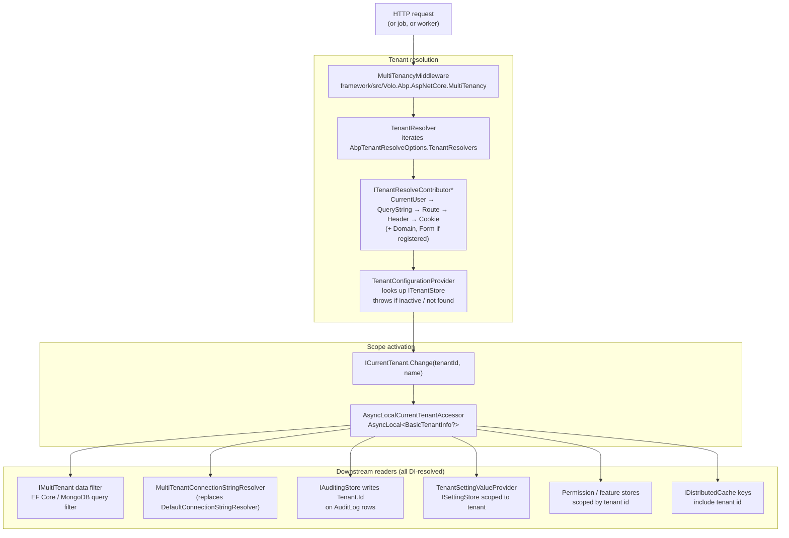

ABP's multi-tenancy stack is built around one small abstraction — `ICurrentTenant` — and a pipeline that sets it for the duration of a request, a job or any user-controlled scope. Once `ICurrentTenant.Id` is set, every other subsystem (data filters, connection string resolver, audit logs, settings, feature/permission stores, cache keys) reads it implicitly through DI. No code path needs to receive a tenant id as a parameter.

This page maps the packages, the request-time data flow, and where to dive next.

## Package map

| Package | Path | Role |
| --- | --- | --- |
| `Volo.Abp.MultiTenancy.Abstractions` | `framework/src/Volo.Abp.MultiTenancy.Abstractions/` | Contracts: `ICurrentTenant`, `IMultiTenant`, `ITenantStore`, `ITenantResolveContributor`, `TenantConfiguration`, options. No behavior. |
| `Volo.Abp.MultiTenancy` | `framework/src/Volo.Abp.MultiTenancy/` | Default implementations: `CurrentTenant`, `AsyncLocalCurrentTenantAccessor`, `TenantResolver`, `TenantConfigurationProvider`, `MultiTenantConnectionStringResolver`, `CurrentUserTenantResolveContributor`. |
| `Volo.Abp.AspNetCore.MultiTenancy` | `framework/src/Volo.Abp.AspNetCore.MultiTenancy/` | `MultiTenancyMiddleware`, HTTP-aware contributors (Domain, Header, QueryString, Route, Cookie, Form), error page, cookie helper. |
| `Volo.Abp.AspNetCore.Mvc.UI.MultiTenancy` | `framework/src/Volo.Abp.AspNetCore.Mvc.UI.MultiTenancy/` | Razor Page modal `TenantSwitchModal`, `AbpTenantController`/`AbpTenantAppService`, the `tenant-switch.js` bundle, the `AbpUiMultiTenancyResource` localization. |
| `Volo.Abp.TenantManagement.*` | `modules/tenant-management/src/` | Application module: `Tenant` aggregate, `TenantConnectionString`, repositories, `TenantStore` (cached, EF Core or MongoDB backed), management UI. See [Tenant Management module](/modules/tenant-management). |

## End-to-end data flow



Three things to internalize:

1. **`AsyncLocalCurrentTenantAccessor` is a process-wide singleton** (`AsyncLocalCurrentTenantAccessor.Instance`, registered in `AbpMultiTenancyModule.ConfigureServices`). The "scope" is `AsyncLocal<T>`, so a background job that spins off a new logical flow gets a fresh, empty tenant slot and must call `ICurrentTenant.Change(...)` explicitly.
2. **Resolution and activation are split.** `ITenantResolver` returns a `TenantResolveResult` (just a string and a trail of contributor names). `ITenantConfigurationProvider` then validates that string against `ITenantStore` and yields a `TenantConfiguration`. Only after that does `MultiTenancyMiddleware` open the scope via `_currentTenant.Change(tenant?.Id, tenant?.Name)`.
3. **All downstream subsystems are passive.** They never call the resolver; they inject `ICurrentTenant` and read `Id` synchronously. That's why turning multi-tenancy on/off is a single flag (`AbpMultiTenancyOptions.IsEnabled`) and why the same code base runs single- and multi-tenant.

## The `AbpMultiTenancyOptions` switch

```csharp
// framework/src/Volo.Abp.MultiTenancy.Abstractions/Volo/Abp/MultiTenancy/AbpMultiTenancyOptions.cs
public class AbpMultiTenancyOptions
{
    public bool IsEnabled { get; set; }                                        // master switch
    public MultiTenancyDatabaseStyle DatabaseStyle { get; set; }
        = MultiTenancyDatabaseStyle.Hybrid;                                    // Shared | PerTenant | Hybrid
    public TenantUserSharingStrategy UserSharingStrategy { get; set; }
        = TenantUserSharingStrategy.Isolated;                                  // or Shared
}
```

Modules — for example Identity, Tenant Management, Audit Logging — gate their tenant-aware behavior on `IsEnabled`. `MultiTenancySides` (`Tenant`, `Host`, `Both`) is the flag enum used by `[MultiTenancySide]`-style attributes and menu contributors.

| Type | Path | Notes |
| --- | --- | --- |
| `MultiTenancySides` | `.../AbpMultiTenancyOptions/MultiTenancySides.cs` | `Tenant=1`, `Host=2`, `Both=3`. `ICurrentTenant.GetMultiTenancySide()` returns `Tenant` when `Id != null`, otherwise `Host`. |
| `MultiTenancyDatabaseStyle` | `.../MultiTenancyDatabaseStyle.cs` | `Shared`, `PerTenant`, `Hybrid` — the model behind `MultiTenantConnectionStringResolver`'s fallbacks. |
| `TenantUserSharingStrategy` | `.../TenantUserSharingStrategy.cs` | `Isolated` (default) vs `Shared` — drives Identity module's user uniqueness rules. |
| `IgnoreMultiTenancyAttribute` | `.../IgnoreMultiTenancyAttribute.cs` | Marker. Repositories check it on entities/DTOs to skip the `TenantId` query filter (e.g. `TenantConfigurationCacheItem`). |

## `IMultiTenant` and the data filter

Entities implement `IMultiTenant` to opt in to the EF Core / MongoDB `TenantId` query filter:

```csharp
// framework/src/Volo.Abp.MultiTenancy.Abstractions/Volo/Abp/MultiTenancy/IMultiTenant.cs
public interface IMultiTenant
{
    Guid? TenantId { get; }   // null = host-side row
}
```

The filter logic lives with the persistence providers, not with multi-tenancy itself — see [Data filtering](/data/data-filtering) for the `IDataFilter<IMultiTenant>` pipeline and how `using (CurrentTenant.Change(null))` temporarily widens reads to the host.

## Claims and the request user

The auth layer carries the tenant id on the principal:

```csharp
// framework/src/Volo.Abp.MultiTenancy.Abstractions/System/Security/Principal/
//   AbpMultiTenancyClaimsIdentityExtensions.cs
public static MultiTenancySides GetMultiTenancySide(this ClaimsPrincipal principal)
{
    var tenantId = principal.FindTenantId();
    return tenantId.HasValue ? MultiTenancySides.Tenant : MultiTenancySides.Host;
}
```

`FindTenantId()` reads `AbpClaimTypes.TenantId` (see [Security and claims](/auth/security-and-claims)). That claim is what `CurrentUserTenantResolveContributor` — registered at position 0 — promotes into the resolve context whenever the request is authenticated. The header/query/cookie contributors are anonymous-friendly fallbacks for login pages.

## Events emitted on the tenant lifecycle

| Event | Path | Trigger |
| --- | --- | --- |
| `TenantChangedEvent` | `Abstractions/.../TenantChangedEvent.cs` | Published by local handlers (not by `CurrentTenant.Change` itself — by tenant *configuration* changes in the Tenant Management module's domain). |
| `CreateTenantEto` | `Abstractions/.../CreateTenantEto.cs` | Distributed (`abp.multi_tenancy.create.tenant`). Tenant Management raises it after a successful `CreateAsync`. |
| `TenantConnectionStringUpdatedEto` | `Abstractions/.../TenantConnectionStringUpdatedEto.cs` | Distributed (`abp.multi_tenancy.tenant.connection_string.updated`). Lets subscribers (e.g. background workers, schedulers) flush per-tenant caches when a connection string moves. |

## Where to go next

<CardGroup cols={2}>
  <Card title="Tenant resolution pipeline" icon="route" href="/multitenancy/tenant-resolution">
    The full list of `ITenantResolveContributor` implementations and how `TenantResolver` orders them.
  </Card>
  <Card title="ICurrentTenant scope semantics" icon="layer-group" href="/multitenancy/current-tenant">
    Why `Change()` returns `IDisposable`, how the `AsyncLocal` stack works across awaits and threads.
  </Card>
  <Card title="Per-tenant connection strings" icon="database" href="/multitenancy/connection-string-resolver">
    `MultiTenantConnectionStringResolver`, the `Hybrid` fallback chain, mapped databases.
  </Card>
  <Card title="ASP.NET Core wiring" icon="globe" href="/multitenancy/aspnetcore-integration">
    `MultiTenancyMiddleware`, `AbpAspNetCoreMultiTenancyOptions`, the error page and cookie write-back.
  </Card>
  <Card title="MVC UI" icon="display" href="/multitenancy/mvc-ui">
    The Switch Tenant modal, the layout hook in `Account.cshtml`, the `AbpTenantController` lookup endpoint.
  </Card>
  <Card title="Tenant Management module" icon="building" href="/modules/tenant-management">
    The `Tenant` aggregate, `TenantConnectionString`, cached `TenantStore`, management pages.
  </Card>
</CardGroup>

<Tip>
  For a request-level trace that touches authentication, tenant resolution, UoW and EF Core in one diagram, see [Multi-tenant request flow](/flows/multi-tenant-request).
</Tip>
