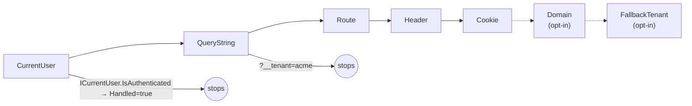

The tenant resolution pipeline answers one question: *given the inbound context, what tenant should the rest of this request run under?* It is a list of `ITenantResolveContributor` objects iterated by `TenantResolver` in declaration order. The first contributor that produces a `TenantIdOrName` (or sets `context.Handled = true` to mean "host on purpose") wins.

`framework/src/Volo.Abp.MultiTenancy/Volo/Abp/MultiTenancy/TenantResolver.cs`

```csharp
public virtual async Task<TenantResolveResult> ResolveTenantIdOrNameAsync()
{
    var result = new TenantResolveResult();
    using (var serviceScope = ServiceProvider.CreateScope())
    {
        var context = new TenantResolveContext(serviceScope.ServiceProvider);

        foreach (var tenantResolver in Options.TenantResolvers)
        {
            await tenantResolver.ResolveAsync(context);
            result.AppliedResolvers.Add(tenantResolver.Name);

            if (context.HasResolvedTenantOrHost())     // Handled || TenantIdOrName != null
            {
                result.TenantIdOrName = context.TenantIdOrName;
                break;
            }
        }
    }

    if (result.TenantIdOrName.IsNullOrEmpty() && !string.IsNullOrWhiteSpace(Options.FallbackTenant))
    {
        result.TenantIdOrName = Options.FallbackTenant;
        result.AppliedResolvers.Add(TenantResolverNames.FallbackTenant);
    }

    return result;
}
```

A new DI scope is created per resolution so contributors can resolve scoped services (notably `ICurrentUser`) without leaking the lifetime into the outer scope.

## The contract

`framework/src/Volo.Abp.MultiTenancy.Abstractions/Volo/Abp/MultiTenancy/ITenantResolveContext.cs`

```csharp
public interface ITenantResolveContext : IServiceProviderAccessor
{
    string? TenantIdOrName { get; set; }   // string id (GUID) or normalized name
    bool Handled { get; set; }             // "I authoritatively chose host, stop iterating"
}

public interface ITenantResolveContributor
{
    string Name { get; }
    Task ResolveAsync(ITenantResolveContext context);
}
```

`HasResolvedTenantOrHost()` returns `Handled || TenantIdOrName != null`. That means there are two ways to short-circuit the chain:

- Set `TenantIdOrName` to a real value (string GUID or tenant name) → that tenant wins.
- Set `Handled = true` and leave `TenantIdOrName = null` → host wins, and lower-priority contributors do **not** run.

The second is how `CurrentUserTenantResolveContributor` pins a host-side user to the host even if the request has a `__tenant` cookie.

## The default order

`AbpMultiTenancyModule.ConfigureServices` seeds the resolver list with `CurrentUserTenantResolveContributor` at index 0:

```csharp
// framework/src/Volo.Abp.MultiTenancy/Volo/Abp/MultiTenancy/AbpMultiTenancyModule.cs
Configure<AbpTenantResolveOptions>(options =>
{
    options.TenantResolvers.Insert(0, new CurrentUserTenantResolveContributor());
});
```

`AbpAspNetCoreMultiTenancyModule.ConfigureServices` appends the HTTP-aware contributors:

```csharp
// framework/src/Volo.Abp.AspNetCore.MultiTenancy/Volo/Abp/AspNetCore/MultiTenancy/
//   AbpAspNetCoreMultiTenancyModule.cs
Configure<AbpTenantResolveOptions>(options =>
{
    options.TenantResolvers.Add(new QueryStringTenantResolveContributor());
    options.TenantResolvers.Add(new RouteTenantResolveContributor());
    options.TenantResolvers.Add(new HeaderTenantResolveContributor());
    options.TenantResolvers.Add(new CookieTenantResolveContributor());
});
```

So a typical ASP.NET Core host runs this order:



## Built-in contributors

### Framework contributors (always loaded with `Volo.Abp.MultiTenancy`)

| Contributor | `Name` | File | Behavior |
| --- | --- | --- | --- |
| `CurrentUserTenantResolveContributor` | `"CurrentUser"` | `Volo.Abp.MultiTenancy/.../CurrentUserTenantResolveContributor.cs` | If `ICurrentUser.IsAuthenticated`, sets `Handled = true` and `TenantIdOrName = currentUser.TenantId?.ToString()`. Authoritative — bypasses query/cookie spoofing. |
| `ActionTenantResolveContributor` | `"Action"` | `Volo.Abp.MultiTenancy/.../ActionTenantResolveContributor.cs` | Wraps an `Action<ITenantResolveContext>`. Use for custom inline logic without a new class. |

### ASP.NET Core contributors (added by `Volo.Abp.AspNetCore.MultiTenancy`)

All inherit from `HttpTenantResolveContributorBase`, which short-circuits when there is no `HttpContext` and wraps the lookup in a try/catch that logs warnings:

```csharp
// framework/src/Volo.Abp.AspNetCore.MultiTenancy/Volo/Abp/AspNetCore/MultiTenancy/
//   HttpTenantResolveContributorBase.cs
public override async Task ResolveAsync(ITenantResolveContext context)
{
    var httpContext = context.GetHttpContext();
    if (httpContext == null) return;

    try { await ResolveFromHttpContextAsync(context, httpContext); }
    catch (Exception e)
    {
        context.ServiceProvider.GetRequiredService<ILogger<HttpTenantResolveContributorBase>>()
            .LogWarning(e.ToString());
    }
}

protected abstract Task<string?> GetTenantIdOrNameFromHttpContextOrNullAsync(
    ITenantResolveContext context, HttpContext httpContext);
```

| Contributor | `Name` | Reads | Notes |
| --- | --- | --- | --- |
| `QueryStringTenantResolveContributor` | `"QueryString"` | `?__tenant=...` | If key present with empty value → `Handled = true`, host. The middleware writes a cookie *after* resolution when this contributor was the one that fired, so `?__tenant=acme` once → sticky for the session. |
| `RouteTenantResolveContributor` | `"Route"` | `httpContext.GetRouteValue("__tenant")` | Use with route templates like `{__tenant}/products`. |
| `HeaderTenantResolveContributor` | `"Header"` | Request header `__tenant` | If multiple header values are present, first wins and a warning is logged. Common for API clients. |
| `CookieTenantResolveContributor` | `"Cookie"` | `Request.Cookies["__tenant"]` | Written by `MultiTenancyMiddleware` (after a successful QueryString resolution) and by the `TenantSwitchModal` post handler. Cleared by `AbpMultiTenancyCookieHelper.SetTenantCookie(ctx, null, key)` on resolution errors. |
| `DomainTenantResolveContributor` | `"Domain"` | `Request.Host` matched against `{0}.mydomain.com` | Constructor takes a `domainFormat` string. Always sets `Handled = true` after attempting a match (an unknown subdomain on a wildcard domain explicitly means host). Not registered by default — opt in. |
| `FormTenantResolveContributor` | `"Form"` | `await Request.ReadFormAsync()` | **Obsolete.** Reading the form early disables features like model binding for some content types — kept only for compatibility. |

### Cookie write-back

`MultiTenancyMiddleware` writes the `__tenant` cookie back only when the *winning* contributor was `QueryString`:

```csharp
// framework/src/Volo.Abp.AspNetCore.MultiTenancy/Volo/Abp/AspNetCore/MultiTenancy/
//   MultiTenancyMiddleware.cs
if (_tenantResolveResultAccessor.Result?.AppliedResolvers
        .Contains(QueryStringTenantResolveContributor.ContributorName) == true)
{
    AbpMultiTenancyCookieHelper.SetTenantCookie(context, _currentTenant.Id, _options.TenantKey);
}
```

That makes `?__tenant=...` a one-shot URL that becomes persistent without an explicit handoff.

### The `__tenant` key

All HTTP contributors read `context.GetAbpAspNetCoreMultiTenancyOptions().TenantKey`, which defaults to `TenantResolverConsts.DefaultTenantKey = "__tenant"` and can be changed once at startup:

```csharp
Configure<AbpAspNetCoreMultiTenancyOptions>(o => o.TenantKey = "x-tenant");
```

## Domain resolver — opt in

The domain resolver is in the package but **not registered** by `AbpAspNetCoreMultiTenancyModule`. Use the extension:

```csharp
// framework/src/Volo.Abp.AspNetCore.MultiTenancy/Volo/Abp/MultiTenancy/
//   AbpMultiTenancyOptionsExtensions.cs
Configure<AbpTenantResolveOptions>(options =>
{
    options.AddDomainTenantResolver("{0}.mycompany.com");
});
```

`AddDomainTenantResolver` inserts the resolver immediately after `CurrentUserTenantResolveContributor` so an authenticated user still wins. The format string is parsed with `FormattedStringValueExtracter`, so any single `{0}` placeholder works (`{0}.mycompany.com`, `api.{0}.io`). The contributor strips `http://` / `https://` from both the host and the format.

`DomainTenantResolveContributor` always sets `context.Handled = true` after attempting a match. That means a request to `mycompany.com` (no subdomain) on an `{0}.mycompany.com` resolver chain produces *host*, not "keep looking in the cookie".

## The fallback tenant

`AbpTenantResolveOptions.FallbackTenant` is a last-chance value:

```csharp
// framework/src/Volo.Abp.MultiTenancy.Abstractions/Volo/Abp/MultiTenancy/
//   AbpTenantResolveOptions.cs
public class AbpTenantResolveOptions
{
    public List<ITenantResolveContributor> TenantResolvers { get; }
    public string? FallbackTenant { get; set; }
}
```

If every contributor returns null and `Handled` stays false, `TenantResolver` substitutes `FallbackTenant` and stamps `TenantResolverNames.FallbackTenant` ("`FallbackTenant`") into `AppliedResolvers`. Useful for environments where "unresolved" should still mean a known demo tenant rather than host.

## Custom contributors

Subclass `TenantResolveContributorBase`:

```csharp
public class SubscriptionKeyTenantResolveContributor : TenantResolveContributorBase
{
    public const string ContributorName = "SubscriptionKey";
    public override string Name => ContributorName;

    public override async Task ResolveAsync(ITenantResolveContext context)
    {
        var http = context.ServiceProvider.GetService<IHttpContextAccessor>()?.HttpContext;
        var key = http?.Request.Headers["X-Subscription-Key"].FirstOrDefault();
        if (key.IsNullOrEmpty()) return;

        var lookup = context.ServiceProvider.GetRequiredService<ISubscriptionLookup>();
        var tenantId = await lookup.GetTenantIdAsync(key);
        if (tenantId.HasValue) context.TenantIdOrName = tenantId.Value.ToString();
    }
}

Configure<AbpTenantResolveOptions>(options =>
{
    // Run after CurrentUser, before QueryString
    options.TenantResolvers.Insert(1, new SubscriptionKeyTenantResolveContributor());
});
```

Inline variant with `ActionTenantResolveContributor`:

```csharp
options.TenantResolvers.Insert(1, new ActionTenantResolveContributor(ctx =>
{
    var http = ctx.ServiceProvider.GetService<IHttpContextAccessor>()?.HttpContext;
    if (http?.Request.Headers.TryGetValue("X-Tenant", out var v) == true)
        ctx.TenantIdOrName = v.ToString();
}));
```

## From resolve result to tenant configuration

`ITenantResolver` only produces strings. `TenantConfigurationProvider` then converts the result into a validated `TenantConfiguration` by hitting `ITenantStore`:

`framework/src/Volo.Abp.MultiTenancy/Volo/Abp/MultiTenancy/TenantConfigurationProvider.cs`

```csharp
public virtual async Task<TenantConfiguration?> GetAsync(bool saveResolveResult = false)
{
    var resolveResult = await TenantResolver.ResolveTenantIdOrNameAsync();
    if (saveResolveResult) TenantResolveResultAccessor.Result = resolveResult;

    TenantConfiguration? tenant = null;
    if (resolveResult.TenantIdOrName != null)
    {
        tenant = await FindTenantAsync(resolveResult.TenantIdOrName);

        if (tenant == null)
            throw new BusinessException("Volo.AbpIo.MultiTenancy:010001", ...); // "TenantNotFoundMessage"

        if (!tenant.IsActive)
            throw new BusinessException("Volo.AbpIo.MultiTenancy:010002", ...); // "TenantNotActiveMessage"
    }
    return tenant;
}

protected virtual async Task<TenantConfiguration?> FindTenantAsync(string tenantIdOrName)
{
    if (Guid.TryParse(tenantIdOrName, out var parsedTenantId))
        return await TenantStore.FindAsync(parsedTenantId);
    return await TenantStore.FindAsync(TenantNormalizer.NormalizeName(tenantIdOrName)!);
}
```

`MultiTenancyMiddleware` calls `GetAsync(saveResolveResult: true)` and catches the `BusinessException` — that's what shows the multi-tenancy error page (see [ASP.NET Core integration](/multitenancy/aspnetcore-integration)).

## Accessing the resolve trail

`ITenantResolveResultAccessor.Result` exposes the trail (`TenantIdOrName`, `AppliedResolvers`) for the rest of the request:

| Implementation | Path | Where it lives |
| --- | --- | --- |
| `NullTenantResolveResultAccessor` | `framework/src/Volo.Abp.MultiTenancy/.../NullTenantResolveResultAccessor.cs` | Default in non-HTTP hosts. Always returns null; setter is a no-op. |
| `HttpContextTenantResolveResultAccessor` | `framework/src/Volo.Abp.AspNetCore.MultiTenancy/.../HttpContextTenantResolveResultAccessor.cs` | Replaces the null one in ASP.NET Core. Stores the result in `HttpContext.Items["__AbpTenantResolveResult"]`. |

The accessor is what lets the MVC theme decide whether to show the tenant box (only when `Cookie` or `QueryString` actually resolved the current tenant — see [MVC UI](/multitenancy/mvc-ui)).

## Normalization

`ITenantNormalizer` controls the form that lookups by name use. `UpperInvariantTenantNormalizer` is the default:

```csharp
// framework/src/Volo.Abp.MultiTenancy.Abstractions/Volo/Abp/MultiTenancy/
//   UpperInvariantTenantNormalizer.cs
public virtual string? NormalizeName(string? name) =>
    name?.Normalize().ToUpperInvariant();
```

Both `TenantConfigurationProvider.FindTenantAsync` (for resolver inputs) and `AbpTenantAppService.FindTenantByNameAsync` (for the switch UI) call this before hitting the store.
