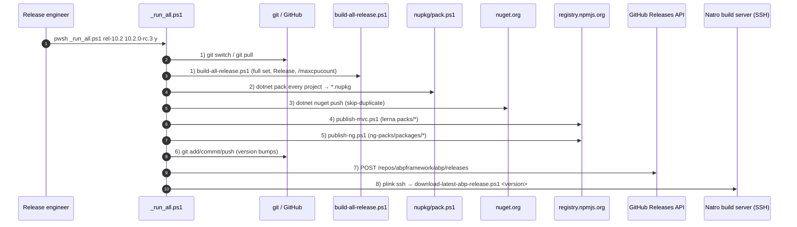

`deploy/` holds the release engineering scripts that turn a freshly-merged release branch into published NuGet + npm packages, a tagged GitHub release and an archived zip downloaded to a build server. They are numbered 1–8 and orchestrated by `_run_all.ps1`. This page walks every script in order, the side effects it has on the working tree, the secrets it reads from disk (`*.txt` files in `deploy/`) and the recovery story when one step fails.

<Info>
For the layered overview (where deploy/ fits next to build/ and nupkg/), see [/overview/build-and-tooling](/overview/build-and-tooling). For the NuGet specifics see [/ops/nuget-and-packaging](/ops/nuget-and-packaging); for npm specifics see [/ops/npm-publish-pipeline](/ops/npm-publish-pipeline).
</Info>

## Files in `deploy/`

| File | Type | Purpose |
| --- | --- | --- |
| `_run_all.ps1` | orchestrator | Prompts for inputs once, then chains 1 → 8 with a `Start-Transcript` log |
| `1-fetch-and-build.ps1` | step | `git switch` / `git pull` on the release branch, bump `<Version>` in `common.props`, run `build/build-all-release.ps1` |
| `2-nuget-pack.ps1` | step | `cd ..\nupkg` and run `pack.ps1` — `dotnet pack` every project listed in `nupkg/common.ps1` |
| `3-nuget-push.ps1` | step | Push every `*.nupkg` to nuget.org with `dotnet nuget push --skip-duplicate` |
| `4-npm-publish-mvc.ps1` | step | `cd ..\npm` and run `publish-mvc.ps1` — Lerna-versioned MVC packs under `npm/packs/*` |
| `5-npm-publish-angular.ps1` | step | `cd ..\npm` and run `publish-ng.ps1` — Nx/Lerna `ng-packs/packages/*` |
| `6-git-commit.ps1` | step | `git add . && git commit -m Update_NPM_Package_Versions && git push` |
| `7-publish-github-release.ps1` | step | Direct POST to `api.github.com/repos/abpframework/abp/releases` |
| `8-download-release-zip.ps1` | step | SSH (via `plink.exe`) to the Natro build server (`jenkins@94.73.164.234`) to mirror the release zip |
| `new-github-release-function.psm1` | module | Re-usable `New-GitHubRelease` cmdlet (Daniel Schroeder's module) for the GitHub Releases API |
| `plink.exe` | tool | PuTTY's CLI SSH client — used by step 8 |
| `readme.md` | doc | "Set your secret keys" cheat sheet (npm-auth-token.txt, nuget-api-key.txt, ssh-password.txt) |

The `*.txt` secret files (`npm-auth-token.txt`, `nuget-api-key.txt`, `ssh-password.txt`, `github-api-key.txt`) live in `deploy/` and are git-ignored. Each step has a fallback prompt if the file isn't present.

## High-level pipeline



## `_run_all.ps1` — the orchestrator

```powershell
param([string]$branch, [string]$newVersion, [string]$isRcVersion)

. ..\nupkg\common.ps1

Start-Transcript -Append _run_all_log.txt

if (!$branch)     { $branch     = Read-Host "Enter the branch name" }
if (!$newVersion) {
    $currentVersion = Get-Current-Version
    $newVersion = Read-Host "Current version is '$currentVersion'. Enter the new version (empty for no change) "
    if ($newVersion -eq "") { $newVersion = $currentVersion }
}
if ($isRcVersion -eq "") { $isRcVersion = Read-Host "Is this a RC/Preview version? (y/n)" }

$publishGithubReleaseParams = @{ branchName=$branch; isRcVersion=$isRcVersion }

./1-fetch-and-build.ps1 $branch $newVersion
./2-nuget-pack.ps1
./3-nuget-push.ps1
./4-npm-publish-mvc.ps1
./5-npm-publish-angular.ps1
./6-git-commit.ps1
./7-publish-github-release.ps1 @publishGithubReleaseParams
./8-download-release-zip.ps1

Stop-Transcript
```

Key behaviour:

- Dot-sources `..\nupkg\common.ps1` so `Write-Info`, `Get-Current-Version`, `Get-Current-Branch`, `Read-File` are available.
- `Start-Transcript -Append _run_all_log.txt` captures stdout/stderr to `deploy/_run_all_log.txt` — the post-mortem artifact.
- Prompts for any missing argument once at the top, then passes them down. **There is no `try/catch`** — a non-zero exit from any step bubbles out of PowerShell and aborts the remaining steps.

| Param | What | Where used |
| --- | --- | --- |
| `$branch` | Release branch name (e.g. `rel-10.2`) | step 1 (git checkout), step 7 (tag target) |
| `$newVersion` | New SemVer to write into `common.props` `<Version>` | step 1 (in-place edit), step 7 (tag/release name) |
| `$isRcVersion` | `y` / `n` / `rc` / `true` | step 7 (`prerelease` flag on the GitHub release) |

## Step 1 — `1-fetch-and-build.ps1`

Behaviour:

1. Read `<Version>` from `..\common.props` via `[xml]`.
2. If `$newVersion` differs, write it back to `common.props` and re-read to confirm.
3. `cd ..` → `git switch $branch` → `git pull origin`.
4. `cd build` → `.\build-all-release.ps1` (Release, full set, `/maxcpucount`).
5. `cd ..\deploy` (defensive — every step returns to `deploy/`).

```powershell
$commonPropsFilePath = resolve-path "../common.props"
$commonPropsXmlCurrent = [xml](Get-Content $commonPropsFilePath)
$currentVersion = $commonPropsXmlCurrent.Project.PropertyGroup.Version.Trim()
if ($newVersion -ne $currentVersion) {
    $commonPropsXmlCurrent.Project.PropertyGroup.Version = $newVersion
    $commonPropsXmlCurrent.Save($commonPropsFilePath)
}
```

The bump is the only side effect on the working tree at this point — step 6 will commit it. See [/ops/build-scripts](/ops/build-scripts) for what `build-all-release.ps1` actually does.

## Step 2 — `2-nuget-pack.ps1`

```powershell
. ..\nupkg\common.ps1
Write-Info "Creating NuGet packages"
cd ..\nupkg
powershell -File pack.ps1
cd ..\deploy
```

Hands off to `nupkg/pack.ps1`, which deletes existing `*.nupkg`, runs `dotnet restore` per solution, then `dotnet pack -c Release --no-build -- /maxcpucount` per project from the long `$projects` list in `nupkg/common.ps1`, moving each output into `nupkg/`. See [/ops/nuget-and-packaging](/ops/nuget-and-packaging) for the full project list and per-package convention.

## Step 3 — `3-nuget-push.ps1`

```powershell
param([string]$nugetApiKey)
. ..\nupkg\common.ps1
# fall back to nuget-api-key.txt → prompt
cd ..\nupkg
powershell -File push_packages.ps1 $nugetApiKey
cd ..\deploy
```

`push_packages.ps1`:

- Reads `<Version>` from `common.props`.
- For each `$project` in `nupkg/common.ps1`, computes `"<projectName>.<version>.nupkg"`, checks `Test-Path` and runs `dotnet nuget push <pkg> --skip-duplicate -s https://api.nuget.org/v3/index.json --api-key $apiKey`.
- Tallies missing packages into `$errorCount` and prints a red `******* $errorCount error(s) occured *******` line at the end.

The `--skip-duplicate` flag makes the step re-runnable: if `nuget push` succeeded for some packages but a transient network blip killed the rest, re-running the step is safe.

## Step 4 — `4-npm-publish-mvc.ps1`

```powershell
param([string]$npmAuthToken)
. ..\nupkg\common.ps1
# fall back to npm-auth-token.txt → prompt
cd ..\npm

npm set //registry.npmjs.org/:_authToken $npmAuthToken

Write-Info "Pushing MVC packages to NPM"
powershell -File publish-mvc.ps1
cd ..\deploy
```

Globally sets the `_authToken` for `registry.npmjs.org` then delegates to `npm/publish-mvc.ps1`, which Lerna-bumps `packs/*` to the current version, runs `replace-with-tilde` (caret → tilde for ABP-internal `@abp/*` deps), validates versions and `lerna exec` `npm publish` per pack. See [/ops/npm-publish-pipeline](/ops/npm-publish-pipeline) for the inner mechanics.

## Step 5 — `5-npm-publish-angular.ps1`

Structurally identical to step 4 but delegates to `npm/publish-ng.ps1`, which:

- Bumps `ng-packs/lerna.version.json` to the new version.
- Runs `nx run-many --target=build --all --prod` over `ng-packs/packages/*`.
- Publishes the built `dist/packages/*` from `lerna.publish.json`.
- Calls `update-gulp` to refresh `wwwroot/libs` in MVC templates and `update-lepton-x-versions` for the satellite theme.

Note: the on-screen text says `"Pushing MVC packages to NPM"` because the file was forked from the MVC variant — the actual work is Angular publishing.

## Step 6 — `6-git-commit.ps1`

```powershell
. ..\nupkg\common.ps1
cd ..
git add .
git commit -m Update_NPM_Package_Versions
git push
cd deploy
```

Commits every file the previous steps mutated:

- `common.props` (version bump from step 1)
- `npm/lerna.json` (Lerna writes the new version on `lerna version`)
- `npm/packs/**/package.json` (Lerna-bumped per-pack versions)
- `npm/ng-packs/lerna.version.json` and every `npm/ng-packs/packages/*/package.json`
- Anything the template-update side effects of step 5 touched

The commit message is hard-coded `Update_NPM_Package_Versions` (no spaces — underscore-joined).

## Step 7 — `7-publish-github-release.ps1`

Creates a tag + release on `abpframework/abp` via the GitHub REST API. The script doesn't use `new-github-release-function.psm1` directly (the module is shipped alongside as a reference / alternative); instead it inlines the POST:

```powershell
$releaseData = @{
    tag_name = $version;
    target_commitish = $branchName;
    name = $version;
    body = $releaseNotes;
    draft = $draft;
    prerelease = $preRelease;
}

$releaseParams = @{
    Uri = "https://api.github.com/repos/$gitHubUsername/$gitHubRepository/releases";
    Method = 'POST';
    Headers = @{
        Authorization = 'Basic ' + [Convert]::ToBase64String(
            [Text.Encoding]::ASCII.GetBytes($gitHubApiKey + ":x-oauth-basic"));
    }
    ContentType = 'application/json';
    Body = (ConvertTo-Json $releaseData -Compress)
}

$response = Invoke-RestMethod @releaseParams
```

| Field | Source |
| --- | --- |
| `tag_name` | `$version` (from `Get-Current-Version`) |
| `target_commitish` | `$branchName` (defaults to `git branch --show-current`) |
| `name` | Same as tag |
| `body` | Hard-coded empty string; release notes are auto-generated through the GitHub UI afterwards |
| `draft` | `$isDraft` → `false` by default; `$true` while testing |
| `prerelease` | `true` if `$isRcVersion` matches `true`, `y`, or `rc` |

The `readme.md` comment block warns that **step 6 (GitHub release) in their numbered list is "not active"** for some maintainers' workflows — they prefer to publish the release manually from the GitHub UI with auto-generated notes. Either path is supported.

### `new-github-release-function.psm1`

A standalone PowerShell module (adapted from `deadlydog/New-GitHubRelease`) that exposes `New-GitHubRelease`:

```powershell
New-GitHubRelease `
    -GitHubUsername abpframework `
    -GitHubRepositoryName abp `
    -GitHubAccessToken (Get-Content github-api-key.txt) `
    -TagName 10.2.0-rc.3 `
    -ReleaseName "10.2.0-rc.3" `
    -Commitish rel-10.2 `
    -IsPreRelease $true `
    -IsDraft $false `
    -AssetFilePaths @('C:\…\release.zip')
```

Differences from the inline `7-publish-github-release.ps1`:

| Capability | Inline script | `New-GitHubRelease` |
| --- | --- | --- |
| Create the release | ✅ | ✅ |
| Upload assets to `upload_url` | ❌ | ✅ (handles `assets{?name,label}` template substitution) |
| Strict-mode error formatting | basic | rich (`Convert-HashTableToNicelyFormattedString`) |
| TLS protocol pinning | ❌ | ✅ (`Set-SecurityProtocolForThread` forces TLS 1.0/1.1/1.2) |
| Output shape | `Invoke-RestMethod` raw | hashtable `{ Succeeded, ReleaseCreationSucceeded, AllAssetUploadsSucceeded, ReleaseUrl, ErrorMessage }` |

Import it for asset uploads (zips, binaries) — the inline script intentionally creates a notes-only release.

## Step 8 — `8-download-release-zip.ps1`

```powershell
param([string]$password)
. ..\nupkg\common.ps1

# Reads ssh-password.txt or prompts
[xml]$commonPropsXml = Get-Content "../common.props"
$version = $commonPropsXml.Project.PropertyGroup.Version

plink.exe -ssh jenkins@94.73.164.234 -pw $password -P 22 -batch `
    "powershell -File c:\ci\scripts\download-latest-abp-release.ps1 ${version}"
```

`plink.exe` (PuTTY's headless SSH client, vendored next to the script) connects to the **Natro build server** as `jenkins@94.73.164.234` and remotely invokes a downloader script that pulls the just-published `*.zip` to `c:\ci\` on that box. The remote script is **not in this repo** — it lives on the Natro server and is maintained by Volosoft Ops.

If you fork the pipeline, replace this step with whatever your own archive sink is (or stub it out).

## Per-step recovery cheat sheet

| Step | What was already published when it failed | Safe to re-run? |
| --- | --- | --- |
| 1 | Local working tree mutated (`common.props`) | Yes — bump idempotent |
| 2 | `*.nupkg` files in `nupkg/` | Yes — `del *.nupkg` runs at the start of `pack.ps1` |
| 3 | Subset of packages on nuget.org | Yes — `--skip-duplicate` |
| 4 | Subset of MVC `@abp/*` on npm | Partially — npm rejects re-publishing the same version. Bump pre-release tag and re-run |
| 5 | Subset of Angular `@abp/ng.*` on npm | Same caveat |
| 6 | A commit pushed | Yes — second run usually has nothing to commit |
| 7 | Release created on GitHub | Idempotent failure: API returns 422 if the tag exists; delete the release manually and re-run |
| 8 | Zip downloaded to Natro | Yes — script overwrites |

## Secrets the pipeline reads

Per `deploy/readme.md`, create these files in `deploy/` before running:

| File | Used by | Notes |
| --- | --- | --- |
| `npm-auth-token.txt` | steps 4, 5 | npmjs.org auth token (GUID) — `npm set //registry.npmjs.org/:_authToken` |
| `nuget-api-key.txt` | step 3 | nuget.org API key |
| `ssh-password.txt` | step 8 | Jenkins user SSH password on Natro |
| `github-api-key.txt` | step 7 | Personal Access Token with `repo` / `public_repo` scope |

All four are git-ignored. If any file is missing, the corresponding step falls back to `Read-Host` (interactive prompt).

## Cross-links

<CardGroup cols={2}>
  <Card title="Build & Tooling overview" href="/overview/build-and-tooling" />
  <Card title="Build scripts" href="/ops/build-scripts" />
  <Card title="NuGet & packaging" href="/ops/nuget-and-packaging" />
  <Card title="NPM publish pipeline" href="/ops/npm-publish-pipeline" />
  <Card title="Templates (what gets refreshed by step 5)" href="/templates/overview" />
  <Card title="CLI (consumes published packages)" href="/cli/overview" />
</CardGroup>
