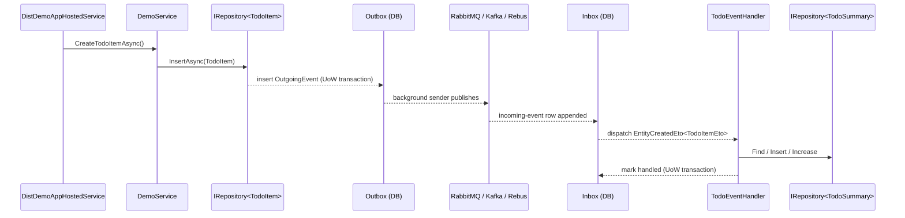

`test/AbpPerfTest/` and `test/DistEvents/` are not unit-test projects — they are **runnable applications** that the framework team uses to measure regression and to validate the distributed-event bus + outbox/inbox stack end-to-end. They are excluded from `build/test-all.ps1` (their solutions aren't in `$solutionPaths`) and must be launched manually. This page enumerates every sub-project, the wire-level dependencies (SQL Server, MongoDB, RabbitMQ, Kafka, Redis), and how to reproduce the JMeter measurements.

<Info>
For the runtime story behind `IDistributedEventBus`, outbox/inbox and EToMappings, see [/eventbus/distributed-event-bus](/eventbus/distributed-event-bus) and [/flows/distributed-event-publish](/flows/distributed-event-publish).
</Info>

## `test/AbpPerfTest/` — head-to-head perf harness

Layout:

```
test/AbpPerfTest/
├── AbpPerfTest.slnx                ← combined solution
├── AbpPerfTest.WithAbp/            ← full ABP stack
├── AbpPerfTest.WithoutAbp/         ← plain ASP.NET Core MVC + EF Core
├── _jmeter/
│   ├── SimpleTestPlan.jmx
│   └── SimpleTestPlanWithoutAbp.jmx
└── _results/
    ├── WithAbp/
    ├── WithoutAbp/
    └── with-without-abp-comparison.png
```

Two web apps that expose the **same** `Book` REST surface — `GET /api/books`, `GET /api/books/{id}`, `POST`, `PUT`, `DELETE` — backed by SQL Server (the same `BookDbContext` schema). The point is to subtract everything ABP layers on top so the cost of ABP-specific features is measurable.

### `AbpPerfTest.WithAbp`

```csharp
// Program.cs
var builder = WebApplication.CreateBuilder(args);
builder.Host.UseAutofac();
await builder.AddApplicationAsync<AppModule>();
var app = builder.Build();
await app.InitializeApplicationAsync();
await app.RunAsync();
```

```csharp
[DependsOn(
    typeof(AbpAspNetCoreMvcModule),
    typeof(AbpAutofacModule),
    typeof(AbpEntityFrameworkCoreSqlServerModule)
)]
public class AppModule : AbpModule
{
    public override void ConfigureServices(ServiceConfigurationContext context)
    {
        context.Services.AddAbpDbContext<BookDbContext>(opts => opts.AddDefaultRepositories());
        Configure<AbpDbContextOptions>(opts => opts.UseSqlServer());
        Configure<AbpUnitOfWorkDefaultOptions>(opts =>
            opts.TransactionBehavior = UnitOfWorkTransactionBehavior.Auto);
    }
    // OnApplicationInitialization: UseRouting + UseConfiguredEndpoints
}
```

The controller uses `IRepository<Book, Guid>`:

```csharp
[Route("api/books")]
public class BookController : Controller
{
    private readonly IRepository<Book, Guid> _bookRepository;
    public BookController(IRepository<Book, Guid> r) => _bookRepository = r;

    [HttpGet]
    public async Task<List<BookDto>> GetListAsync()
    {
        var books = await _bookRepository.GetPagedListAsync(0, 10, "Id");
        return books.Select(b => new BookDto { /*…*/ }).ToList();
    }
    // GetAsync, CreateAsync, UpdateAsync, DeleteAsync …
}
```

Every call goes through Autofac DI, an ABP unit-of-work transaction (`UnitOfWorkTransactionBehavior.Auto`), audit-property filling, automatic concurrency checks and the `IRepository` LINQ provider.

### `AbpPerfTest.WithoutAbp`

```csharp
// Program.cs — plain ASP.NET Core
var builder = WebApplication.CreateBuilder(args);
builder.Services.AddMvc();
builder.Services.AddDbContext<BookDbContext>(opts =>
    opts.UseSqlServer(builder.Configuration.GetConnectionString("Default")));
var app = builder.Build();
if (builder.Environment.IsDevelopment()) app.UseDeveloperExceptionPage();
app.UseRouting();
app.UseEndpoints(e => e.MapControllers());
app.Run();
```

Same `BookController` shape but talking to `DbContext` directly through `DbSet<Book>` — no `IRepository`, no UoW interceptor, no audit, no DI container swap. EF Core migrations are identical, so the table schema matches one-for-one.

### Project comparison

| Aspect | `AbpPerfTest.WithAbp` | `AbpPerfTest.WithoutAbp` |
| --- | --- | --- |
| Host | `WebApplication.CreateBuilder` + `UseAutofac` + `AddApplicationAsync<AppModule>` | `WebApplication.CreateBuilder` (plain MEDI) |
| Module system | `AbpAspNetCoreMvcModule`, `AbpAutofacModule`, `AbpEntityFrameworkCoreSqlServerModule` | none |
| Data access | `IRepository<Book, Guid>` via `AddAbpDbContext` + `AddDefaultRepositories` | `DbSet<Book>` directly |
| Transactions | `UnitOfWorkTransactionBehavior.Auto` (UoW interceptor wraps every action) | None (manual `SaveChangesAsync`) |
| Audit / multi-tenancy | Wired automatically | Not present |
| Endpoint mapping | `app.UseConfiguredEndpoints()` (ABP's auto-route convention) | `endpoints.MapControllers()` |

### JMeter test plans

`_jmeter/SimpleTestPlan.jmx` runs a 40-loop thread group against `WithAbp`; `SimpleTestPlanWithoutAbp.jmx` runs the equivalent against `WithoutAbp`. Run with `jmeter -n -t SimpleTestPlan.jmx -l results.jtl` and import the JTL into the JMeter report generator.

The pre-recorded `_results/WithAbp/` and `_results/WithoutAbp/` folders capture the most recent reference run; `with-without-abp-comparison.png` is the side-by-side chart published in the ABP perf write-ups.

### Recipe: reproduce locally

```bash
# 1. Start SQL Server (any local instance) and edit appsettings.Development.json
#    in both projects to point at it.

# 2. Apply migrations (each project ships its own Migrations folder)
cd test/AbpPerfTest/AbpPerfTest.WithAbp
dotnet ef database update
cd ../AbpPerfTest.WithoutAbp
dotnet ef database update

# 3. Launch both apps on distinct ports
dotnet run --project ../AbpPerfTest.WithAbp     # https://localhost:7001
dotnet run --project ../AbpPerfTest.WithoutAbp  # https://localhost:7002

# 4. Run JMeter
cd ../_jmeter
jmeter -n -t SimpleTestPlan.jmx           -l ../_results/WithAbp/run.jtl
jmeter -n -t SimpleTestPlanWithoutAbp.jmx -l ../_results/WithoutAbp/run.jtl
```

The harness is not part of CI — perf numbers fluctuate too much per machine — but every framework PR that touches the UoW interceptor, repository, dynamic-proxy chain or DI wiring should be re-measured here.

## `test/DistEvents/` — distributed event bus end-to-end app

Layout:

```
test/DistEvents/
├── DistEventsDemo.slnx
├── DistDemoApp.Shared/             ← entities, ETO mappings, hosted service
├── DistDemoApp.EfCoreRabbitMq/     ← SQL Server + EF Core + RabbitMQ
├── DistDemoApp.MongoDbKafka/       ← MongoDB + Kafka
└── DistDemoApp.MongoDbRebus/       ← MongoDB + Rebus (in-memory)
```

Three independently runnable console apps that share the same domain (`TodoItem` entity, `TodoSummary` aggregate, `TodoItemEto` event) so a release engineer can validate the outbox/inbox stack on every supported (database, broker) combination.

### `DistDemoApp.Shared` — the domain

| File | What it defines |
| --- | --- |
| `TodoItem.cs` | The aggregate root with `Text` property |
| `TodoSummary.cs` | A per-day rollup with `Year/Month/Day/Count`, `Increase()` / `Decrease()` |
| `TodoItemEto.cs` | The event-transfer object; tagged `[EventName("todo-item")]` |
| `TodoItemObjectMapper.cs` | Manual `IObjectMapper<TodoItem, TodoItemEto>` |
| `TodoEventHandler.cs` | Handles `EntityCreatedEto<TodoItemEto>` and `EntityDeletedEto<TodoItemEto>` and mutates `TodoSummary` |
| `DemoService.cs` | Calls `_todoItemRepository.InsertAsync(...)` once on start-up |
| `DistDemoAppHostedService.cs` | `IHostedService` that bootstraps the ABP container and invokes `DemoService.CreateTodoItemAsync()` |
| `DistDemoAppSharedModule.cs` | Registers the hosted service, configures `AbpDistributedEntityEventOptions` |

The module wires the auto-event selector and ETO mapping:

```csharp
[DependsOn(
    typeof(AbpAutofacModule),
    typeof(AbpDddDomainModule),
    typeof(AbpEventBusModule)
)]
public class DistDemoAppSharedModule : AbpModule
{
    public override void ConfigureServices(ServiceConfigurationContext context)
    {
        context.Services.AddHostedService<DistDemoAppHostedService>();

        Configure<AbpDistributedEntityEventOptions>(options =>
        {
            options.EtoMappings.Add<TodoItem, TodoItemEto>();
            options.AutoEventSelectors.Add<TodoItem>();   // auto-publish on create/update/delete
        });

        context.Services.AddSingleton<IDistributedLockProvider>(sp =>
        {
            var connection = ConnectionMultiplexer.Connect(
                configuration["Redis:Configuration"]);
            return new RedisDistributedSynchronizationProvider(connection.GetDatabase());
        });
    }
}
```

Key behaviour: when `DemoService.CreateTodoItemAsync()` inserts a `TodoItem`, ABP fires `EntityCreatedEto<TodoItemEto>` because the entity is in `AutoEventSelectors`. The shared `TodoEventHandler` then updates `TodoSummary` — this is the unit of work whose outbox/inbox transactional guarantees the apps are testing.

### `TodoEventHandler` — the cross-DB invariant

```csharp
public class TodoEventHandler :
    IDistributedEventHandler<EntityCreatedEto<TodoItemEto>>,
    IDistributedEventHandler<EntityDeletedEto<TodoItemEto>>,
    ITransientDependency
{
    private readonly IRepository<TodoSummary, int> _todoSummaryRepository;

    [UnitOfWork]
    public virtual async Task HandleEventAsync(EntityCreatedEto<TodoItemEto> eventData)
    {
        var dt = eventData.Entity.CreationTime;
        var summary = await _todoSummaryRepository.FindAsync(
            x => x.Year == dt.Year && x.Month == dt.Month && x.Day == dt.Day);
        if (summary == null)
            summary = await _todoSummaryRepository.InsertAsync(new TodoSummary(dt));
        else
        {
            summary.Increase();
            await _todoSummaryRepository.UpdateAsync(summary);
        }
        Console.WriteLine("Increased total count: " + summary);
    }
    // HandleEventAsync(EntityDeletedEto<TodoItemEto>) similar, Decrease()
}
```

Distributed `Redis` lock guards concurrent handler instances (when you scale out beyond one process). The handler is `[UnitOfWork]` so changes commit atomically with the inbox state row.

### Variant 1 — `DistDemoApp.EfCoreRabbitMq`

```csharp
[DependsOn(
    typeof(AbpEntityFrameworkCoreSqlServerModule),
    typeof(AbpEventBusRabbitMqModule),
    typeof(DistDemoAppSharedModule)
)]
public class DistDemoAppEfCoreRabbitMqModule : AbpModule
{
    public override void ConfigureServices(ServiceConfigurationContext context)
    {
        context.Services.AddAbpDbContext<TodoDbContext>(o => o.AddDefaultRepositories());
        Configure<AbpDbContextOptions>(o => o.UseSqlServer());

        Configure<AbpDistributedEventBusOptions>(options =>
        {
            options.Outboxes.Configure(c => c.UseDbContext<TodoDbContext>());
            options.Inboxes.Configure(c => c.UseDbContext<TodoDbContext>());
        });
    }
}
```

`Program.cs` uses Serilog and `Host.CreateDefaultBuilder().UseAutofac().UseSerilog().RunConsoleAsync()`. Migrations live in `Migrations/20210910152547_Added_Boxes_Initial.cs` and include `AbpEventOutbox` / `AbpEventInbox` tables (added by `AbpEntityFrameworkCoreDistributedEvents`).

| Component | Implementation |
| --- | --- |
| Database | SQL Server, EF Core `TodoDbContext` |
| Outbox | `AbpEventOutbox` table (`config.UseDbContext<TodoDbContext>()`) |
| Inbox | `AbpEventInbox` table |
| Transport | RabbitMQ via `AbpEventBusRabbitMqModule` |

### Variant 2 — `DistDemoApp.MongoDbKafka`

```csharp
[DependsOn(
    typeof(AbpMongoDbModule),
    typeof(AbpEventBusKafkaModule),
    typeof(DistDemoAppSharedModule)
)]
public class DistDemoAppMongoDbKafkaModule : AbpModule
{
    public override void ConfigureServices(ServiceConfigurationContext context)
    {
        context.Services.AddMongoDbContext<TodoMongoDbContext>(o => o.AddDefaultRepositories());
        Configure<AbpDistributedEventBusOptions>(options =>
        {
            options.Outboxes.Configure(c => c.UseMongoDbContext<TodoMongoDbContext>());
            options.Inboxes.Configure(c => c.UseMongoDbContext<TodoMongoDbContext>());
        });
    }
}
```

| Component | Implementation |
| --- | --- |
| Database | MongoDB via `AbpMongoDbModule` |
| Outbox / Inbox | MongoDB collections (`UseMongoDbContext<TodoMongoDbContext>()`) |
| Transport | Kafka via `AbpEventBusKafkaModule` |

### Variant 3 — `DistDemoApp.MongoDbRebus`

```csharp
[DependsOn(
    typeof(AbpMongoDbModule),
    typeof(AbpEventBusRebusModule),
    typeof(DistDemoAppSharedModule)
)]
public class DistDemoAppMongoDbRebusModule : AbpModule
{
    public override void PreConfigureServices(ServiceConfigurationContext context)
    {
        PreConfigure<AbpRebusEventBusOptions>(options =>
        {
            options.InputQueueName = "eventbus";
            options.Configurer = rebus =>
            {
                rebus.Transport(t => t.UseInMemoryTransport(new InMemNetwork(), "eventbus"));
                rebus.Subscriptions(s => s.StoreInMemory());
            };
        });
    }
    // ConfigureServices identical to Kafka variant
}
```

Uses Rebus's in-memory transport + subscription store, so the variant runs without any external broker — useful as the smallest possible repro of the outbox/inbox flow.

### Variants matrix

| Project | Database | Broker | Outbox/Inbox storage | External services needed |
| --- | --- | --- | --- | --- |
| `DistDemoApp.EfCoreRabbitMq` | SQL Server (EF Core) | RabbitMQ | EF Core tables in `TodoDbContext` | SQL Server, RabbitMQ, Redis |
| `DistDemoApp.MongoDbKafka` | MongoDB | Kafka | MongoDB collections in `TodoMongoDbContext` | MongoDB, Kafka, Redis |
| `DistDemoApp.MongoDbRebus` | MongoDB | Rebus (in-memory) | MongoDB collections | MongoDB, Redis |

All three share `DistDemoApp.Shared` and depend on Redis for `IDistributedLockProvider` (configured via `Redis:Configuration` in `appsettings.json`).

### End-to-end flow



The transactional outbox stores the event in the same DB transaction as the entity insert; a background worker reads from the outbox and publishes to the broker. On the receiving side, the inbox row is written transactionally with the handler's side effects (`TodoSummary` mutation), giving exactly-once semantics at the handler boundary.

### Recipe: run the EF Core + RabbitMQ variant

```bash
# 1. docker-compose with SQL Server, RabbitMQ and Redis
docker run -d -p 1433:1433 -e ACCEPT_EULA=Y -e SA_PASSWORD=… mcr.microsoft.com/mssql/server
docker run -d -p 5672:5672 -p 15672:15672 rabbitmq:3-management
docker run -d -p 6379:6379 redis

# 2. Edit DistDemoApp.EfCoreRabbitMq/appsettings.json for the connection strings.

# 3. Apply EF migrations (creates Todos, AbpEventOutbox, AbpEventInbox)
dotnet ef database update --project DistDemoApp.EfCoreRabbitMq

# 4. Run multiple instances to exercise the distributed lock
dotnet run --project DistDemoApp.EfCoreRabbitMq
dotnet run --project DistDemoApp.EfCoreRabbitMq
```

Each instance prints `Created a new todo item: ...` once, then both observe `Increased total count: ...` lines from `TodoEventHandler` — proving the broker round-trip and the Redis-locked handler succeeded.

## What these harnesses are *not*

- Not part of `build/test-all.ps1` — their solution files aren't in `$solutionPaths`.
- Not built or packed by `nupkg/pack.ps1` — they have no NuGet manifest.
- Not consumed by the CLI / templates — they're maintainer-facing diagnostics.

## Cross-links

<CardGroup cols={2}>
  <Card title="Distributed event bus" href="/eventbus/distributed-event-bus" />
  <Card title="RabbitMQ event bus" href="/eventbus/rabbitmq" />
  <Card title="Kafka event bus" href="/eventbus/kafka" />
  <Card title="Rebus integration" href="/eventbus/rebus-integration" />
  <Card title="Distributed event publish flow" href="/flows/distributed-event-publish" />
  <Card title="Distributed locking" href="/background/distributed-locking" />
  <Card title="Test base classes" href="/ops/test-base" />
  <Card title="Build scripts" href="/ops/build-scripts" />
</CardGroup>
