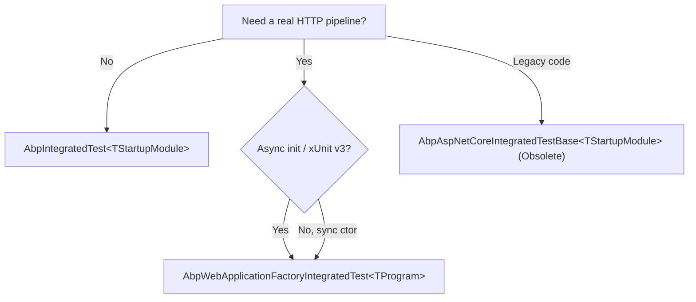

Every `*.Tests` project in the framework, modules and templates inherits — directly or transitively — from one of four classes shipped by `framework/src/Volo.Abp.TestBase/` and `framework/src/Volo.Abp.AspNetCore.TestBase/`. They handle ABP container bootstrap, `IServiceCollection` overrides for the in-memory event bus / SQLite providers, and (for the ASP.NET Core variants) wiring `TestServer` into the dynamic client-proxy `HttpClientFactory`. This page documents each base class and shows the override hooks `test-all.ps1` ultimately exercises.

<Info>
This page focuses on what release engineers and coding agents need to write or fix a test class. For the runtime story of `AbpWebApplicationFactoryIntegratedTest` (proxy client routing, `ITestServerAccessor`), see [/aspnetcore/test-base](/aspnetcore/test-base).
</Info>

## Package map

| Package | Source folder | Module | Depends on |
| --- | --- | --- | --- |
| `Volo.Abp.TestBase` | `framework/src/Volo.Abp.TestBase/` | `AbpTestBaseModule` (empty) | `Microsoft.Extensions.DependencyInjection` |
| `Volo.Abp.AspNetCore.TestBase` | `framework/src/Volo.Abp.AspNetCore.TestBase/` | `AbpAspNetCoreTestBaseModule` | `AbpHttpClientModule`, `AbpAspNetCoreModule`, `AbpTestBaseModule`, `AbpAutofacModule` |

```csharp
// framework/src/Volo.Abp.AspNetCore.TestBase/Volo/Abp/AspNetCore/TestBase/AbpAspNetCoreTestBaseModule.cs
[DependsOn(typeof(AbpHttpClientModule))]
[DependsOn(typeof(AbpAspNetCoreModule))]
[DependsOn(typeof(AbpTestBaseModule))]
[DependsOn(typeof(AbpAutofacModule))]
public class AbpAspNetCoreTestBaseModule : AbpModule { }
```

The `AbpAutofacModule` dependency means **every integration test runs on Autofac**, matching how solution templates ship. There is no `Microsoft.Extensions.DependencyInjection`-only test path.

## `AbpTestBaseWithServiceProvider` — common DI surface

The minimal abstract base, used by both framework-agnostic and ASP.NET Core flavors:

```csharp
// framework/src/Volo.Abp.TestBase/Volo/Abp/AbpTestBaseWithServiceProvider.cs
public abstract class AbpTestBaseWithServiceProvider
{
    protected IServiceProvider ServiceProvider { get; set; } = default!;

    protected virtual T? GetService<T>()
        => ServiceProvider.GetService<T>();

    protected virtual T GetRequiredService<T>() where T : notnull
        => ServiceProvider.GetRequiredService<T>();

    protected virtual T? GetKeyedServices<T>(object? serviceKey)
        => ServiceProvider.GetKeyedService<T>(serviceKey);

    protected virtual T GetRequiredKeyedService<T>(object? serviceKey) where T : notnull
        => ServiceProvider.GetRequiredKeyedService<T>(serviceKey);
}
```

Inheriting types only need to set `ServiceProvider` once during their ctor. `Get…Service` calls are virtuals, so a test fixture can short-circuit a lookup if needed.

## `AbpIntegratedTest<TStartupModule>` — framework-agnostic

`Volo/Abp/Testing/AbpIntegratedTest.cs` is the base **non-ASP.NET-Core** integration-test class. It spins up the ABP container with no HTTP server.

```csharp
public abstract class AbpIntegratedTest<TStartupModule> : AbpTestBaseWithServiceProvider, IDisposable
    where TStartupModule : IAbpModule
{
    protected IAbpApplication Application { get; }
    protected IServiceProvider RootServiceProvider { get; }
    protected IServiceScope TestServiceScope { get; }

    protected AbpIntegratedTest()
    {
        var services = CreateServiceCollection();          // 1
        BeforeAddApplication(services);                    // 2
        var application = services.AddApplication<TStartupModule>(
            SetAbpApplicationCreationOptions);             // 3
        Application = application;
        AfterAddApplication(services);                     // 4

        RootServiceProvider = CreateServiceProvider(services);   // 5
        TestServiceScope = RootServiceProvider.CreateScope();    // 6
        application.Initialize(TestServiceScope.ServiceProvider); // 7
        ServiceProvider = Application.ServiceProvider;

        AfterInitialize();                                 // 8
    }
    // …
}
```

| Step | Hook | Override to… |
| --- | --- | --- |
| 1 | `CreateServiceCollection()` | Replace `new ServiceCollection()` (rarely needed) |
| 2 | `BeforeAddApplication(IServiceCollection)` | Register services that must exist **before** `IAbpModule` discovery (e.g. a stubbed `IConfiguration`) |
| 3 | `SetAbpApplicationCreationOptions(AbpApplicationCreationOptions)` | Add plug-in module assemblies, override `Services.PluginSources` |
| 4 | `AfterAddApplication(IServiceCollection)` | Inject mocks or replace previously-registered services (most common hook) |
| 5 | `CreateServiceProvider(IServiceCollection)` | Default calls `services.BuildServiceProviderFromFactory()` (chooses Autofac if available). Override to force MEDI |
| 6 | — | A scope is opened; tests interact with scoped services through `ServiceProvider` |
| 7 | — | `application.Initialize(scope)` triggers every `OnApplicationInitialization` |
| 8 | `AfterInitialize()` | Seed test data once the container is up |

### Disposal

```csharp
public virtual void Dispose()
{
    Application.Shutdown();
    TestServiceScope.Dispose();
    if (RootServiceProvider is IDisposable disposable)
        disposable.Dispose();
    Application.Dispose();
}
```

Each xUnit test fact instantiates a fresh `AbpIntegratedTest` (xUnit creates a new instance per test), so SQLite-in-memory or `IDistributedEventBus` mocks rebuild every test.

### Typical `AfterAddApplication` overrides

The patterns below appear hundreds of times across `framework/test/`, `modules/*/test/`:

```csharp
protected override void AfterAddApplication(IServiceCollection services)
{
    // 1) In-memory distributed event bus (instead of RabbitMQ/Kafka)
    services.AddSingleton<IDistributedEventBus, LocalDistributedEventBus>();

    // 2) SQLite in-memory EF Core provider
    var connection = new SqliteConnection("DataSource=:memory:");
    connection.Open();
    services.Configure<AbpDbContextOptions>(options =>
    {
        options.Configure(ctx =>
            ctx.DbContextOptions.UseSqlite(connection));
    });

    // 3) Replace a clock so deterministic tests
    services.AddSingleton<IClock, FakeClock>();
}
```

`LocalDistributedEventBus` is the in-process implementation shipped in `Volo.Abp.EventBus` — it satisfies the `IDistributedEventBus` contract without a broker. EF Core SQLite is a `Microsoft.EntityFrameworkCore.Sqlite` reference brought in by the test project itself.

## `AbpAsyncIntegratedTest<TStartupModule>` — async-init flavour

`Volo/Abp/Testing/AbpAsyncIntegratedTest.cs` mirrors the sync version but uses xUnit v3's `IAsyncLifetime` pattern. The constructor is empty; `InitializeAsync` does the work and can await module bootstrap:

```csharp
public virtual async Task InitializeAsync()
{
    var services = await CreateServiceCollectionAsync();
    await BeforeAddApplicationAsync(services);
    var application = await services.AddApplicationAsync<TStartupModule>(
        await SetAbpApplicationCreationOptionsAsync());
    await AfterAddApplicationAsync(services);

    RootServiceProvider = await CreateServiceProviderAsync(services);
    TestServiceScope = RootServiceProvider.CreateScope();
    await application.InitializeAsync(TestServiceScope.ServiceProvider);
    ServiceProvider = application.ServiceProvider;
    Application = application;

    await InitializeServicesAsync();
}
```

Override the `Async` variants for any seed work that needs `await`. `DisposeAsync` mirrors `Dispose` above.

## `AbpAspNetCoreIntegratedTestBase<TStartupModule>` (legacy `[Obsolete]`)

`Volo/Abp/AspNetCore/TestBase/AbpAspNetCoreIntegratedTestBase.cs` directly hosts an ASP.NET Core `Microsoft.AspNetCore.TestHost.TestServer`:

```csharp
[Obsolete("Use AbpWebApplicationFactoryIntegratedTest instead.")]
public abstract class AbpAspNetCoreIntegratedTestBase<TStartupModule>
    : AbpTestBaseWithServiceProvider, IDisposable
    where TStartupModule : class
{
    protected TestServer Server { get; }
    protected HttpClient Client { get; }
    private readonly IHost _host;

    protected AbpAspNetCoreIntegratedTestBase()
    {
        var builder = CreateHostBuilder();
        _host = builder.Build();
        _host.Start();
        Server = _host.GetTestServer();
        Client = _host.GetTestClient();
        ServiceProvider = Server.Services;
        ServiceProvider.GetRequiredService<ITestServerAccessor>().Server = Server;
    }

    protected virtual IHostBuilder CreateHostBuilder()
    {
        return Host.CreateDefaultBuilder()
            .AddAppSettingsSecretsJson()
            .ConfigureWebHostDefaults(webBuilder =>
            {
                if (typeof(TStartupModule).IsAssignableTo<IAbpModule>())
                    webBuilder.UseStartup<TestStartup<TStartupModule>>();
                else
                    webBuilder.UseStartup<TStartupModule>();
                webBuilder.UseAbpTestServer();
            })
            .UseAutofac()
            .ConfigureServices(ConfigureServices);
    }
    // GetUrl<TController>(…) helpers, Dispose…
}
```

`TestStartup<TStartupModule>` is internal and exists because pre-`WebApplicationFactory` tests needed a `Startup`-shaped class even for `IAbpModule` test modules:

```csharp
internal class TestStartup<TStartupModule>
{
    public void ConfigureServices(IServiceCollection services)
        => AsyncHelper.RunSync(() => services.AddApplicationAsync(typeof(TStartupModule)));

    public void Configure(IApplicationBuilder app)
        => AsyncHelper.RunSync(app.InitializeApplicationAsync);
}
```

`ITestServerAccessor` lets `AspNetCoreTestProxyHttpClientFactory` (in the same folder) replace `IProxyHttpClientFactory` so dynamic C# client proxies route through `TestServer` instead of the network — see [/aspnetcore/test-base](/aspnetcore/test-base) for that wiring.

### `GetUrl<TController>()` helpers

Both ASP.NET Core base classes ship URL helpers that mirror ABP's controller-naming convention:

```csharp
protected virtual string GetUrl<TController>()
    => "/" + typeof(TController).Name.RemovePostFix(
        "Controller", "AppService", "ApplicationService",
        "IntService", "IntegrationService", "Service");

protected virtual string GetUrl<TController>(string actionName)
    => GetUrl<TController>() + "/" + actionName;

protected virtual string GetUrl<TController>(string actionName, object queryStringParamsAsAnonymousObject);
```

Because ABP auto-routes application services as REST endpoints (see [/aspnetcore/mvc-integration](/aspnetcore/mvc-integration)), these helpers cover both `Controller` classes and `AppService` classes uniformly.

## `AbpWebApplicationFactoryIntegratedTest<TProgram>` — modern path

`Volo/Abp/AspNetCore/TestBase/AbpWebApplicationFactoryIntegratedTest.cs` derives from `Microsoft.AspNetCore.Mvc.Testing.WebApplicationFactory<TProgram>` and is the **non-obsolete** way to write ASP.NET Core integration tests:

```csharp
public abstract class AbpWebApplicationFactoryIntegratedTest<TProgram>
    : WebApplicationFactory<TProgram>
    where TProgram : class
{
    protected HttpClient Client { get; set; }
    protected IServiceProvider ServiceProvider => Services;

    protected AbpWebApplicationFactoryIntegratedTest()
    {
        Client = CreateClient(new WebApplicationFactoryClientOptions
        {
            AllowAutoRedirect = false
        });
        ServiceProvider.GetRequiredService<ITestServerAccessor>().Server = Server;
    }

    protected override IHost CreateHost(IHostBuilder builder)
    {
        builder
            .AddAppSettingsSecretsJson()
            .ConfigureServices(ConfigureServices);
        return base.CreateHost(builder);
    }

    protected override void ConfigureWebHost(IWebHostBuilder builder)
    {
        builder.ConfigureAppConfiguration((hostingContext, config) =>
        {
            hostingContext.HostingEnvironment.EnvironmentName = "Production";
        });
        base.ConfigureWebHost(builder);
    }

    protected virtual void ConfigureServices(IServiceCollection services) { }
    // GetService<T>, GetUrl<TController>… mirror the AbpTestBaseWithServiceProvider helpers
}
```

Notable choices:

- `AllowAutoRedirect = false` — tests can assert on `302` responses instead of following redirects (essential for OpenIddict / login flows).
- `EnvironmentName = "Production"` — forces the test app onto the same code paths a deployed instance hits (no dev-only `UseDeveloperExceptionPage`).
- `AddAppSettingsSecretsJson()` — looks for `appsettings.secrets.json` next to the host binary (User Secrets in CI).
- `ITestServerAccessor` wiring is identical to the legacy path: dynamic C# client proxies use the in-memory `TestServer`.

### Choosing a base class



`AbpAsyncIntegratedTest` slots into the `No` branch when you need `InitializeAsync` for seed work.

## `TestCounter` — assertion-friendly counters

`Volo/Abp/Testing/Utils/TestCounter.cs` (and the `ITestCounter` interface) is a thread-safe `int` counter consumed by event-handler tests:

```csharp
public interface ITestCounter
{
    void Increment(string key);
    int Get(string key);
}
```

Register it as a singleton in your test module to count how many times a `LocalEventHandler` or `DistributedEventHandler` fired during a scenario.

## Worked example — `IServiceCollection` overrides

```csharp
public class BookAppService_Tests : AbpIntegratedTest<BookTestModule>
{
    protected override void AfterAddApplication(IServiceCollection services)
    {
        // 1) Swap a domain service for a deterministic stub
        services.AddTransient<IIsbnGenerator, FixedIsbnGenerator>();

        // 2) In-memory distributed event bus
        services.AddSingleton<IDistributedEventBus, LocalDistributedEventBus>();

        // 3) SQLite EF Core provider
        var connection = new SqliteConnection("DataSource=:memory:");
        connection.Open();
        services.Configure<AbpDbContextOptions>(options =>
            options.Configure(ctx => ctx.DbContextOptions.UseSqlite(connection)));

        // 4) Pin the clock so audit fields are reproducible
        services.AddSingleton<IClock>(_ => new FakeClock(new DateTime(2025, 01, 01)));
    }

    [Fact]
    public async Task Should_Create_Book()
    {
        var service = GetRequiredService<IBookAppService>();
        var dto = await service.CreateAsync(new CreateBookDto { Name = "Test" });
        dto.Name.ShouldBe("Test");
    }
}
```

## How the build harness runs these

`build/test-all.ps1` walks `$solutionPaths` and calls:

```bash
dotnet test --no-build --no-restore --collect:"XPlat Code Coverage"
```

Every `*.Tests.csproj` under those solutions transitively references `Volo.Abp.TestBase` (and, when MVC is involved, `Volo.Abp.AspNetCore.TestBase`). Coverage XML lands at `**/TestResults/<guid>/coverage.cobertura.xml`; `codecov.yml` at the repo root configures the upload threshold. See [/ops/build-scripts](/ops/build-scripts) for the loop body.

## Cross-links

<CardGroup cols={2}>
  <Card title="Build scripts" href="/ops/build-scripts" />
  <Card title="ASP.NET Core test base runtime" href="/aspnetcore/test-base" />
  <Card title="Perf & DistEvents harnesses" href="/ops/perf-and-distevents" />
  <Card title="Distributed event bus" href="/eventbus/distributed-event-bus" />
  <Card title="Unit of Work flow" href="/flows/unit-of-work-flow" />
  <Card title="Module loading lifecycle" href="/flows/module-loading-lifecycle" />
</CardGroup>
