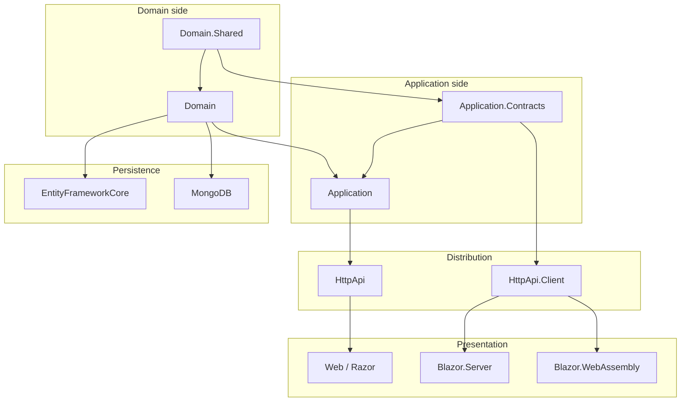

The **ABP Framework** (`abpframework/abp`) is a modular, opinionated stack on top of ASP.NET Core that imposes a uniform layered architecture across every NuGet package it ships. Every product in the repo — the core `framework/`, the application `modules/`, the solution `templates/` and the npm `packs/` — is composed of the same five-or-seven layer split (`Domain.Shared`, `Domain`, `Application.Contracts`, `Application`, `HttpApi`, `HttpApi.Client`, `Web/Blazor`) and the same module system rooted in `Volo.Abp.Core`. This page maps that architecture from the `AbpApplicationBase` entry point down to subsystem packages and shows the boot-order rules an agent must respect when adding code.

## The big picture

```mermaid
flowchart LR
  Host["WebApplication / generic Host<br/>(Program.cs)"] --> Factory["AbpApplicationFactory<br/>framework/src/Volo.Abp.Core/Volo/Abp/AbpApplicationFactory.cs"]
  Factory --> Base["AbpApplicationBase<br/>framework/src/Volo.Abp.Core/Volo/Abp/AbpApplicationBase.cs"]
  Base --> Loader["IModuleLoader<br/>Volo.Abp.Modularity.ModuleLoader"]
  Loader --> Graph["Module dependency graph<br/>[DependsOn] attributes"]
  Graph --> Lifecycle["IModuleManager<br/>IModuleLifecycleContributor"]
  Lifecycle --> Pre["PreConfigureServices"]
  Pre --> Cfg["ConfigureServices"]
  Cfg --> Post["PostConfigureServices"]
  Post --> Init["OnApplicationInitialization"]
  Init --> Shut["OnApplicationShutdown"]
```

<Info>
At runtime an ABP app is a graph of `IAbpModule` instances rooted at a single **startup module**. The startup module is passed to `AbpApplicationFactory.CreateAsync<TStartupModule>` (Autofac) or `WebApplicationBuilderExtensions.AddApplicationAsync<TStartupModule>` (see `templates/app/aspnet-core/src/MyCompanyName.MyProjectName.AuthServer/Program.cs`). All other modules are pulled in transitively via `[DependsOn]` attributes.
</Info>



## Layered package split (DDD)

Every ABP module — including the framework's own infrastructure modules and every business module under `modules/<name>/src/` — is laid out as a fan of small NuGet packages, one per layer. The canonical example is `modules/identity/src/`:

| Layer package suffix | Role | Example (`modules/identity/`) | Depends on |
| --- | --- | --- | --- |
| `.Domain.Shared` | Constants, enums, error codes, localization resources usable by every layer | `Volo.Abp.Identity.Domain.Shared` | `Volo.Abp.Ddd.Domain.Shared` |
| `.Domain` | Aggregates, value objects, domain services, repositories interfaces | `Volo.Abp.Identity.Domain` | `Volo.Abp.Ddd.Domain` |
| `.Application.Contracts` | DTOs, application service **interfaces**, permission/feature/setting definitions | `Volo.Abp.Identity.Application.Contracts` | `Volo.Abp.Ddd.Application.Contracts` |
| `.Application` | Application service **implementations**, AutoMapper/Mapperly profiles | `Volo.Abp.Identity.Application` | `Volo.Abp.Ddd.Application` |
| `.HttpApi` | ASP.NET Core controllers that expose the application services as REST | `Volo.Abp.Identity.HttpApi` | `Volo.Abp.AspNetCore.Mvc` |
| `.HttpApi.Client` | Auto-generated dynamic C# proxies for remote consumption | `Volo.Abp.Identity.HttpApi.Client` | `Volo.Abp.Http.Client` |
| `.EntityFrameworkCore` | EF Core `DbContext` + repository implementations | `Volo.Abp.Identity.EntityFrameworkCore` | `Volo.Abp.EntityFrameworkCore` |
| `.MongoDB` | MongoDB repository implementations (parallel persistence) | `Volo.Abp.Identity.MongoDB` | `Volo.Abp.MongoDB` |
| `.Web` / `.Blazor` / `.Blazor.Server` / `.Blazor.WebAssembly` | UI pages, view components, menu contributors | `Volo.Abp.Identity.Web` | `Volo.Abp.AspNetCore.Mvc.UI.Theme.Shared` |
| `.AspNetCore` | Cross-cutting AspNetCore integration (cookie auth events, etc.) | `Volo.Abp.Identity.AspNetCore` | `Volo.Abp.AspNetCore` |
| `.Installer` | NuGet metapackage used by ABP Studio to add the module to a solution | `Volo.Abp.Identity.Installer` | – |

<Tip>
The split is enforced by **project references in csproj files** — there is no runtime check. An agent adding code must match the layer: domain logic into `*.Domain`, DTOs into `*.Application.Contracts`, etc. See `/ddd/overview` for the rules each layer must obey.
</Tip>

The same split is followed by every solution template. The MVC/Tiered app template at `templates/app/aspnet-core/src/` ships, for one host, the projects `MyCompanyName.MyProjectName.Domain.Shared`, `…Domain`, `…Application.Contracts`, `…Application`, `…EntityFrameworkCore`, `…MongoDB`, `…HttpApi`, `…HttpApi.Client`, `…HttpApi.Host`, `…HttpApi.HostWithIds`, `…AuthServer`, `…Web`, `…Web.Host`, `…Blazor`, `…Blazor.Server`, `…Blazor.Client`, `…Blazor.WebApp`, `…DbMigrator`. Each project owns exactly one layer.



## The entry point: `AbpApplicationBase`

`framework/src/Volo.Abp.Core/Volo/Abp/AbpApplicationBase.cs` is the abstract class every `IAbpApplication` derives from. It owns:

| Member | Type | Source |
| --- | --- | --- |
| `StartupModuleType` | `Type` | `AbpApplicationBase.cs` line 25 |
| `ServiceProvider` | `IServiceProvider` | line 27 |
| `Services` | `IServiceCollection` | line 29 |
| `Modules` | `IReadOnlyList<IAbpModuleDescriptor>` | line 31 |
| `ApplicationName` | `string?` | line 33 |
| `InstanceId` | `string` (GUID per process) | line 35 |

The constructor (lines 38–73) runs `services.AddCoreServices()` (line 65) and `services.AddCoreAbpServices(this, options)` (line 66), then assigns `Modules = LoadModules(services, options)` (line 68). `LoadModules` (lines 147–156) delegates to `IModuleLoader.LoadModules(services, StartupModuleType, options.PlugInSources)`. If `options.SkipConfigureServices` is false the constructor finishes by calling `ConfigureServices()` (line 72), the sync wrapper around `ConfigureServicesAsync()` defined further down the same file.

`ConfigureServicesAsync()` (line 214) iterates every loaded module four times in declared order:

<Steps>
  <Step title="PreConfigureServices">
    Calls `IPreConfigureServices.PreConfigureServicesAsync(context)` on modules that implement it. Used to register cross-module options before normal registration.
  </Step>
  <Step title="ConfigureServices">
    Calls `AbpModule.ConfigureServicesAsync(context)` (sync wrapper `ConfigureServices(context)` in `AbpModule.cs`). Modules with `SkipAutoServiceRegistration == false` first get their assembly scanned for conventional registrations.
  </Step>
  <Step title="PostConfigureServices">
    Calls `IPostConfigureServices.PostConfigureServicesAsync(context)`. Last chance to mutate `IServiceCollection`.
  </Step>
  <Step title="Initialize (after BuildServiceProvider)">
    Once the host builds `ServiceProvider`, `InitializeModulesAsync()` (line 107) resolves `IModuleManager` and runs three more passes: `OnPreApplicationInitialization` → `OnApplicationInitialization` → `OnPostApplicationInitialization`. All three exist as overrideable virtuals on `AbpModule.cs` (sync + async pairs, lines 65–95).
  </Step>
</Steps>

Graceful shutdown is handled by `ShutdownAsync()` (line 76) which calls `IModuleManager.ShutdownModulesAsync(new ApplicationShutdownContext(scope.ServiceProvider))` running every module's `OnApplicationShutdownAsync` (defined on `AbpModule.cs` around line 95).

<Note>
The deeper boot sequence — host → factory → loader → lifecycle contributors → DI build — is documented in `/flows/application-startup`. This page covers only the architectural shape.
</Note>

## `IAbpModule`, `AbpModule` and `[DependsOn]`

`framework/src/Volo.Abp.Core/Volo/Abp/Modularity/IAbpModule.cs` defines the bare contract — two methods, sync and async:

```csharp
public interface IAbpModule
{
    Task ConfigureServicesAsync(ServiceConfigurationContext context);
    void ConfigureServices(ServiceConfigurationContext context);
}
```

`AbpModule.cs` provides the abstract base that implements `IAbpModule` *and* `IOnPreApplicationInitialization`, `IOnApplicationInitialization`, `IOnPostApplicationInitialization`, `IOnApplicationShutdown`, `IPreConfigureServices`, `IPostConfigureServices` (the union — every lifecycle hook a module can plug into). Each interface comes as a sync + async pair, and `AbpModule` ships virtual no-op implementations of both so concrete modules can override either.

Module dependencies are declared by **attribute, not by DI**:

```csharp
// templates/app/aspnet-core/src/MyCompanyName.MyProjectName.Domain/MyProjectNameDomainModule.cs
[DependsOn(
    typeof(MyProjectNameDomainSharedModule),
    typeof(AbpAuditLoggingDomainModule),
    typeof(AbpBackgroundJobsDomainModule),
    typeof(AbpFeatureManagementDomainModule),
    typeof(AbpIdentityDomainModule),
    typeof(AbpOpenIddictDomainModule),
    typeof(AbpPermissionManagementDomainOpenIddictModule),
    typeof(AbpPermissionManagementDomainIdentityModule),
    typeof(AbpSettingManagementDomainModule),
    typeof(AbpTenantManagementDomainModule),
    typeof(AbpEmailingModule)
)]
public class MyProjectNameDomainModule : AbpModule { /* ... */ }
```

`DependsOnAttribute` (`framework/src/Volo.Abp.Core/Volo/Abp/Modularity/DependsOnAttribute.cs`) implements `IDependedTypesProvider.GetDependedTypes()`. `ModuleLoader.LoadModules` walks this graph, topologically orders it, and emits the `IReadOnlyList<IAbpModuleDescriptor> Modules` that `AbpApplicationBase` exposes. Therefore **boot order = topological order of the `[DependsOn]` DAG**. A module is guaranteed that all of its dependencies have already had `ConfigureServices` invoked before its own `ConfigureServices` runs.

<Warning>
Forgetting `[DependsOn]` will not produce a compile error; it will silently skip dependency registration and surface as a missing-service exception during `OnApplicationInitialization`. Adding a transient using to another module's type does **not** import the module — only `[DependsOn(typeof(OtherModule))]` does.
</Warning>

## Subsystem map: what lives in `framework/src/`

The framework ships 169 packages under `framework/src/` (count from `ls framework/src | wc -l`). They cluster into a stable set of subsystems:

```mermaid
graph TB
  Core["Core<br/>Volo.Abp / Volo.Abp.Core / Volo.Abp.Castle.Core / Volo.Abp.Autofac"]
  DDD["DDD<br/>Volo.Abp.Ddd.Domain.Shared / .Domain / .Application.Contracts / .Application / Volo.Abp.Specifications / Volo.Abp.ObjectExtending"]
  Data["Data<br/>Volo.Abp.Data / Volo.Abp.Uow / Volo.Abp.EntityFrameworkCore.* / Volo.Abp.MongoDB / Volo.Abp.MemoryDb / Volo.Abp.Dapper"]
  AspN["ASP.NET Core<br/>Volo.Abp.AspNetCore / .Mvc / .Mvc.UI.* / .Components.* / .SignalR / .Serilog"]
  Auth["Authorization & Security<br/>Volo.Abp.Authorization / .Authorization.Abstractions / Volo.Abp.Security"]
  MT["Multi-Tenancy<br/>Volo.Abp.MultiTenancy / .MultiTenancy.Abstractions / .AspNetCore.MultiTenancy"]
  EB["Event Bus<br/>Volo.Abp.EventBus / .Abstractions / .RabbitMQ / .Kafka / .Azure / .Dapr / .Rebus"]
  BJ["Background<br/>Volo.Abp.BackgroundJobs.* / Volo.Abp.BackgroundWorkers.* / Volo.Abp.Quartz / Volo.Abp.HangFire / Volo.Abp.TickerQ"]
  Blob["BLOB Storing<br/>Volo.Abp.BlobStoring / .Azure / .Aws / .Google / .Minio / .FileSystem / .Memory / .Aliyun / .Bunny"]
  Cache["Caching<br/>Volo.Abp.Caching / Volo.Abp.Caching.StackExchangeRedis"]
  Loc["Localization<br/>Volo.Abp.Localization / .Abstractions / Volo.Abp.MultiLingualObjects"]
  Audit["Auditing & Exception<br/>Volo.Abp.Auditing / .Contracts / Volo.Abp.ExceptionHandling"]
  Feat["Features / Permissions / Settings<br/>Volo.Abp.Features / Volo.Abp.Authorization / Volo.Abp.Settings"]
  VFS["Virtual File System<br/>Volo.Abp.VirtualFileSystem"]
  Map["Object Mapping<br/>Volo.Abp.ObjectMapping / Volo.Abp.AutoMapper / Volo.Abp.Mapperly"]
  Tools["CLI<br/>Volo.Abp.Cli / Volo.Abp.Cli.Core"]

  Core --> DDD
  Core --> Data
  Core --> AspN
  Core --> Auth
  Core --> MT
  Core --> EB
  Core --> BJ
  Core --> Blob
  Core --> Cache
  Core --> Loc
  Core --> Audit
  Core --> Feat
  Core --> VFS
  Core --> Map
  DDD --> Data
  Auth --> AspN
  MT --> AspN
  EB --> BJ
```



For an exhaustive per-package table see `/overview/repository-layout`. Deep dives per subsystem live under `/core/overview`, `/ddd/overview`, `/data/overview`.

## How a real app composes

`templates/app/aspnet-core/src/MyCompanyName.MyProjectName.AuthServer/Program.cs` is the canonical host entry. Three lines wire ABP to ASP.NET Core's `WebApplicationBuilder`:

```csharp
var builder = WebApplication.CreateBuilder(args);
builder.Host.AddAppSettingsSecretsJson()
    .UseAutofac()
    .UseSerilog();
await builder.AddApplicationAsync<MyProjectNameAuthServerModule>();
var app = builder.Build();
await app.InitializeApplicationAsync();
await app.RunAsync();
```

- `UseAutofac()` on the `IHostBuilder` is defined in `framework/src/Volo.Abp.Autofac/Microsoft/Extensions/Hosting/AbpAutofacHostBuilderExtensions.cs` and registers `AbpAutofacServiceProviderFactory` (`framework/src/Volo.Abp.Autofac/Volo/Abp/Autofac/AbpAutofacServiceProviderFactory.cs`). ABP requires Autofac to honour open-generic registrations, property injection and interception.
- `builder.AddApplicationAsync<TStartupModule>()` lives in `framework/src/Volo.Abp.AspNetCore/Microsoft/Extensions/DependencyInjection/WebApplicationBuilderExtensions.cs` and ultimately calls `AbpApplicationFactory.CreateAsync(...)` (in `framework/src/Volo.Abp.Core/Volo/Abp/AbpApplicationFactory.cs`) → constructs `AbpApplicationWithExternalServiceProvider`, runs `ConfigureServicesAsync` on every module.
- `app.InitializeApplicationAsync()` resolves the built `IAbpApplicationWithExternalServiceProvider`, sets the root service provider, and runs `InitializeModulesAsync()` on `AbpApplicationBase`.

The startup module `MyProjectNameAuthServerModule` typically `[DependsOn]`s `MyProjectNameApplicationModule`, `MyProjectNameEntityFrameworkCoreModule`, the OpenIddict module, an IdentityServer/OpenIddict UI module, and theme modules — pulling in ~50–100 transitive ABP modules. The full transitive list is what makes the loader's topological sort the single source of truth for boot order.

## Cross-cutting subsystem contracts an agent must know

| Concern | Key abstraction | Defined in |
| --- | --- | --- |
| DI registration conventions | `IDependencyRegistrar`, `[Dependency]`, `ITransientDependency` / `IScopedDependency` / `ISingletonDependency` | `framework/src/Volo.Abp.Core/Volo/Abp/DependencyInjection/` |
| Unit of work | `IUnitOfWork`, `IUnitOfWorkManager`, `[UnitOfWork]` | `framework/src/Volo.Abp.Uow/Volo/Abp/Uow/` |
| Repositories | `IRepository<TEntity, TKey>`, `IBasicRepository<>`, `IReadOnlyRepository<>` | `framework/src/Volo.Abp.Ddd.Domain/Volo/Abp/Domain/Repositories/` |
| Application services | `ApplicationService`, `CrudAppService<,,,,>` | `framework/src/Volo.Abp.Ddd.Application/Volo/Abp/Application/Services/` |
| Object mapping | `IObjectMapper` + AutoMapper or Mapperly profile | `framework/src/Volo.Abp.ObjectMapping/` |
| Localization | `IStringLocalizer`, `LocalizationResource`, virtual JSON files | `framework/src/Volo.Abp.Localization/` |
| Settings | `ISettingProvider`, `SettingDefinition` | `framework/src/Volo.Abp.Settings/` |
| Permissions | `PermissionDefinitionProvider`, `IPermissionChecker`, `[Authorize]` | `framework/src/Volo.Abp.Authorization/` |
| Features | `FeatureDefinitionProvider`, `IFeatureChecker` | `framework/src/Volo.Abp.Features/` |
| Multi-tenancy | `ICurrentTenant`, `ITenantResolver`, `ITenantResolveContributor` | `framework/src/Volo.Abp.MultiTenancy/` |
| Event bus | `ILocalEventBus`, `IDistributedEventBus`, `IEventHandler<TEvent>` | `framework/src/Volo.Abp.EventBus/` |
| Background jobs | `IBackgroundJobManager`, `IBackgroundJob<TArgs>` | `framework/src/Volo.Abp.BackgroundJobs/` |
| BLOB storing | `IBlobContainer`, `BlobContainerConfiguration` | `framework/src/Volo.Abp.BlobStoring/` |
| Caching | `IDistributedCache<TCacheItem>` (ABP wrapper around MS) | `framework/src/Volo.Abp.Caching/` |
| Virtual files | `IVirtualFileProvider`, `VirtualFileSetList` | `framework/src/Volo.Abp.VirtualFileSystem/` |
| Auditing | `IAuditingManager`, `AuditedAttribute`, `IAuditedObject` | `framework/src/Volo.Abp.Auditing/` |
| Exception handling | `IExceptionToErrorInfoConverter`, `BusinessException` | `framework/src/Volo.Abp.ExceptionHandling/` |

Each row has a corresponding deep-dive page; see `/core/overview` for DI, `/data/overview` for repositories/UoW, `/modules/overview` for the module map.

## Module categories you will encounter

<CardGroup cols={2}>
  <Card title="Framework modules" href="/core/overview">
    Live in `framework/src/`. Provide infrastructure: DI, modularity, DDD, data, MVC, multitenancy, eventing. Always referenced by every app.
  </Card>
  <Card title="Application modules" href="/modules/overview">
    Live in `modules/<name>/`. Ship full business features (Identity, OpenIddict, TenantManagement, BlobStoringDatabase, CmsKit). Composed via `[DependsOn]`.
  </Card>
  <Card title="Solution templates" href="/templates/overview">
    Live in `templates/`. Produce a ready-to-run multi-project solution with predefined module set (`app`, `app-nolayers`, `module`, `console`, `maui`, `wpf`).
  </Card>
  <Card title="UI packs" href="/templates/overview">
    Live in `npm/packs/` (MVC) and `npm/ng-packs/` (Angular). Bundle JS/CSS resources consumed by `Volo.Abp.AspNetCore.Mvc.UI.*` modules.
  </Card>
</CardGroup>

## Reading order for an agent

<Steps>
  <Step title="Read this page">
    Architecture, layer split, boot order.
  </Step>
  <Step title="Skim `/overview/repository-layout`">
    Get the file-system map of every package.
  </Step>
  <Step title="Read `/overview/solution-structure`">
    Understand `.slnx`, `.abpmdl`, `.abppkg` and MSBuild propagation.
  </Step>
  <Step title="Read `/flows/application-startup`">
    Concrete walk-through of `AbpApplicationFactory.CreateAsync` and `IModuleLoader.LoadModules`.
  </Step>
  <Step title="Drill into the subsystem you are editing">
    Use `/core/overview`, `/ddd/overview`, `/data/overview`, `/modules/overview`.
  </Step>
</Steps>

<Note>
The layered split is invariant. When asked to add a new feature an agent should first pick the layer (Domain / Application / HttpApi / Web), then locate the matching `*.<Layer>` project under the appropriate `framework/src` or `modules/<name>/src` directory, and only then edit. Adding code in the wrong layer breaks the module DAG and the source-code redistribution under `source-code/` simultaneously.
</Note>
