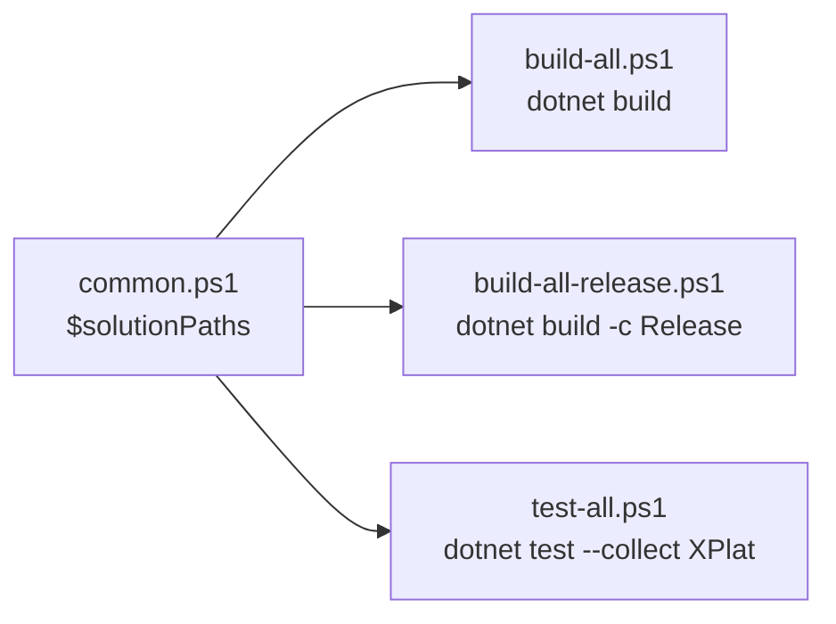
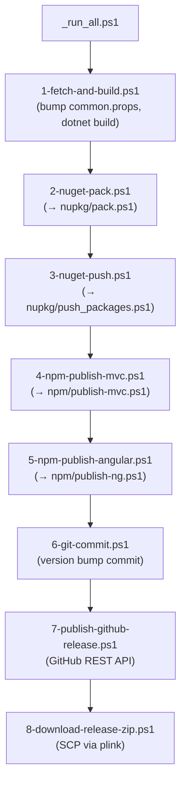

The `abpframework/abp` repository ships its own release engineering. There is no monolithic CI script; instead small numbered PowerShell scripts under `build/`, `deploy/`, `nupkg/` and `npm/` chain together to produce the public NuGet and npm packages. This page enumerates **every script and tool**, what it executes, and where its inputs live (`common.props` version, `global.json` SDK, `latest-versions.json`). An agent automating a release, fixing CI or reproducing a customer issue against a specific build needs all of this on one page.

## Inputs the whole pipeline depends on

| File | Role | Notes |
| --- | --- | --- |
| `global.json` | Pins .NET SDK to **`10.0.100`** with `rollForward: latestFeature` | Every `dotnet build` / `pack` resolves to this SDK |
| `common.props` | Owns `<Version>` (`10.2.0-rc.3` at time of writing) and `<LeptonXVersion>` (`5.2.0-rc.3`) | `nupkg/push_packages.ps1` and `deploy/1-fetch-and-build.ps1` read these via `[xml](Get-Content common.props)` |
| `Directory.Packages.props` | Central NuGet version pinning (`ManagePackageVersionsCentrally`) | Edit here, never per-csproj |
| `latest-versions.json` | Sequence of `{version, releaseDate, type, message, leptonx:{version}}` entries | Consumed by templates & CLI to suggest the latest stable / RC |
| `delete-bin-obj.ps1` | Root-level hygiene script: recursive `bin`/`obj` delete (skips `node_modules`) | Run before clean rebuilds |
| `nupkg/` | Working directory where packed `.nupkg` files collect | Also where `pack.ps1` and `common.ps1` (the project list) live |

<Info>
The release version is **single-sourced from `common.props`**. Bump it there and every csproj that imports `common.props` picks the new value, every published .nupkg gets that version, and `nupkg/push_packages.ps1` looks for files named `<project>.<version>.nupkg`.
</Info>

## `build/` — developer-time builds



| Script | What it does | Key line |
| --- | --- | --- |
| `build/common.ps1` | Sets `$rootFolder = $PWD`, defines `$solutionPaths` array. Default list: `../framework`, `../modules/basic-theme`, `../modules/users`, `../modules/permission-management`, `../modules/setting-management`, `../modules/feature-management`, `../modules/identity`, `../modules/identityserver`, `../modules/openiddict`, `../modules/tenant-management`, `../modules/audit-logging`, `../modules/background-jobs`, `../modules/account`, `../modules/cms-kit`, `../modules/blob-storing-database`. With `-f` it also appends `client-simulation`, `virtual-file-explorer`, `docs`, `blogging`, `templates/module/aspnet-core`, `templates/app/aspnet-core`, `templates/console`, `templates/app-nolayers/aspnet-core`, `abp_io/AbpIoLocalization`, `source-code` | `$solutionPaths = @( ... )` |
| `build/build-all.ps1` | `foreach ($solutionPath in $solutionPaths) { Set-Location $solutionPath; dotnet build }` and exits on first failure | `dotnet build` |
| `build/build-all-release.ps1` | Sources `common.ps1 -f`, runs `dotnet build --configuration Release -- /maxcpucount` per solution | `dotnet build --configuration Release` |
| `build/test-all.ps1` | `dotnet test --no-build --no-restore --collect:"XPlat Code Coverage"` per solution | `--collect "XPlat Code Coverage"` (feeds `codecov.yml`) |

<Tip>
Run `pwsh -File build/build-all.ps1` from the repo root to compile every dev-time solution; add `-f` for the full set. Use `delete-bin-obj.ps1` first if dependencies changed between branches.
</Tip>

## `nupkg/` — packing pipeline

`nupkg/` is both **build output directory** and **scripts directory**.

| File | Role |
| --- | --- |
| `nupkg/common.ps1` | Defines `$packFolder = $PWD`, `$rootFolder = ../`, and helper functions `Write-Info`/`Write-Error`/`Seperator`. Also holds the canonical `$projects` array (~290 entries) and `$solutions` list driving `pack.ps1` and `push_packages.ps1` |
| `nupkg/pack.ps1` | Deletes existing `*.nupkg`, restores each solution in `$solutions`, then iterates `$projects` running `dotnet pack -c Release --no-build -- /maxcpucount` per project and moves the produced `.nupkg` into `nupkg/` |
| `nupkg/push_packages.ps1` | Reads `<Version>` from `common.props`, then for each `$project` runs `dotnet nuget push <project>.<version>.nupkg --skip-duplicate -s https://api.nuget.org/v3/index.json --api-key $apiKey` |
| `nupkg/push-nightly-packages-myget.ps1` | Same pattern but pointed at MyGet's `abp-nightly` feed |
| `nupkg/unit_test.ps1` | Runs unit tests as a release gate |
| `nupkg/common.ps1.bak` | Backup of a previous version of the project list |
| `nupkg/0/` | Scratch sub-folder used to stage builds |

The fact that `$projects` is hand-maintained inside `nupkg/common.ps1` is why **adding a new framework/module project requires editing this list** in addition to the `.slnx` and `.abpmdl` (see `/overview/solution-structure`).

## `deploy/` — orchestrated release pipeline

The release is a sequence of **numbered scripts** in `deploy/` run in order by `_run_all.ps1`. Each script imports `..\nupkg\common.ps1` for shared helpers.

| Script | Purpose | Notable behaviour |
| --- | --- | --- |
| `1-fetch-and-build.ps1` | Switches to branch, bumps version in `common.props`, restores + builds everything | Reads `$commonPropsFilePath = resolve-path "../common.props"`; takes `-branch` and `-newVersion` params |
| `2-nuget-pack.ps1` | `cd ..\nupkg; powershell -File pack.ps1` | Returns to `deploy/` after |
| `3-nuget-push.ps1` | Calls `nupkg\push_packages.ps1` with the API key | Reads `nuget-api-key.txt` if `-nugetApiKey` not supplied |
| `4-npm-publish-mvc.ps1` | Runs `npm/publish-mvc.ps1` (publishes `npm/packs/*` MVC bundles) | Reads `npm-auth-token.txt` if `-npmAuthToken` not supplied |
| `5-npm-publish-angular.ps1` | Runs `npm/publish-ng.ps1` (publishes `npm/ng-packs/packages/*` Angular libs) | Same auth token file |
| `6-git-commit.ps1` | `git add .; git commit -m Update_NPM_Package_Versions; git push` | Captures version-bump diffs |
| `7-publish-github-release.ps1` | Uses GitHub REST API (via `new-github-release-function.psm1`) to create a release + tag | Params `-branchName`, `-version`, `-isRcVersion`, `-isDraft`, `-gitHubApiKey` |
| `8-download-release-zip.ps1` | Uses bundled `plink.exe` (PuTTY) to SCP-download release zip from build server | Reads `ssh-password.txt` if `-password` not supplied |
| `_run_all.ps1` | Wraps 1–7 (and 8) under `Start-Transcript -Append _run_all_log.txt` | Prompts for branch / version / RC flag if not given |
| `new-github-release-function.psm1` | PowerShell module exporting `New-GitHubRelease`/related helpers used by step 7 | Imported by `7-publish-github-release.ps1` |
| `plink.exe` | PuTTY plink binary — required by step 8 SSH transfer | Bundled into the repo |
| `readme.md` | Human notes about the pipeline | Skim first if running by hand |



<Warning>
The numbered scripts must run from `deploy/` (each does `cd ..\nupkg` or `cd ..` and returns). Running step N standalone after step N-1 failed leaves the repo with a half-bumped `common.props`. Use `_run_all.ps1` or fully complete one step before retrying the next.
</Warning>

## `npm/` — JavaScript build & publish

`npm/lerna.json` glues `npm/packs/*` (MVC packs only) into a Lerna 3 monorepo at version `10.2.0-rc.3`, `npmClient: yarn`. Angular `npm/ng-packs/` is a self-managed Nx/Angular workspace published separately.

| Script | Purpose |
| --- | --- |
| `npm/preview-publish.ps1` | Dry-run publish for verifying tarballs locally |
| `npm/publish-mvc.ps1` | Iterates `npm/packs/*` and `npm publish` each |
| `npm/publish-ng.ps1` | Builds and publishes the Angular libs in `npm/ng-packs/packages/*` |
| `npm/update-gulp.js` | Updates gulp toolchain across packs |
| `npm/package-update-script.js` | Bulk updates `package.json` dependencies |
| `npm/replace-with-tilde.js` | Rewrites `^X.Y.Z` ranges to `~X.Y.Z` before publish |
| `npm/publish-utils.js` | Shared helpers (read version, run command) |
| `npm/scripts/` | A TypeScript workspace (`scripts/package.json`) with: `remove-lock-files.ts`, `validate-versions.ts`, `change-package-version.ts`, `update-lepton-x-versions.ts` — invoked via `yarn` + `ts-node` |
| `npm/verdaccio-containers/` | Docker-based local npm registry used to validate publishes before hitting npmjs |

### Lerna config (`npm/lerna.json`)

```json
{
  "version": "10.2.0-rc.3",
  "packages": ["packs/*"],
  "npmClient": "yarn",
  "lerna": "3.18.4"
}
```

The same `10.2.0-rc.3` matches `common.props` `<Version>` — npm and NuGet release in lock-step.

### `npm/scripts/package.json` automations

```json
{
  "scripts": {
    "remove-lock-files":     "yarn && ts-node -r tsconfig-paths/register remove-lock-files.ts",
    "validate-versions":     "yarn && ts-node -r tsconfig-paths/register validate-versions.ts",
    "change-package-version": "ts-node -r tsconfig-paths/register change-package-version.ts",
    "update-lepton-x-versions": "ts-node -r tsconfig-paths/register update-lepton-x-versions.ts"
  }
}
```

- `validate-versions` ensures every package.json in the workspace matches `lerna.json`.
- `update-lepton-x-versions` syncs LeptonX theme version across npm packages.

## `tools/` — bundled binaries and helpers

| Path | Purpose |
| --- | --- |
| `tools/github-changelog-generator/` | C# console app — pulls PRs from GitHub and emits a Markdown changelog |
| `tools/localization-key-synchronizer/` | C# console app — walks every `*.json` localization file under `framework/`, `modules/`, `templates/` and reports keys missing per language vs. English source-of-truth |
| `tools/nuget/nuget.exe` | Pinned Windows NuGet client, used by the deploy scripts to authenticate against private feeds |
| `tools/smtp-prober-email-sender.exe` | Standalone Windows binary used to diagnose SMTP delivery from a release environment |

## Root-level helpers

| Path | Purpose |
| --- | --- |
| `delete-bin-obj.ps1` | Recursively deletes `bin/` and `obj/` under `./`, skipping any path under `node_modules`. Source: top of file: `Get-ChildItem -Path . -Include bin,obj -Recurse -Directory \| ForEach-Object { … }` |
| `templates/zip-templates.ps1` | Zips each template (`templates/app/`, `templates/app-nolayers/`, `templates/module/`, `templates/console/`, `templates/maui/`, `templates/wpf/`) for distribution by the ABP CLI |

## Reproducing a local build (recipe)

<Steps>
  <Step title="Install the SDK pinned in global.json">
    `dotnet --version` must print `10.0.100`. If not, install .NET SDK 10.0.100 (or a later feature-band that satisfies `rollForward: latestFeature`).
  </Step>
  <Step title="Clean previous output">
    ```powershell
    pwsh ./delete-bin-obj.ps1
    ```
  </Step>
  <Step title="Build everything (dev mode)">
    ```powershell
    cd build
    pwsh ./build-all.ps1
    ```
    Or `pwsh ./build-all.ps1 -f` for the **full** set (also `client-simulation`, `virtual-file-explorer`, `docs`, `blogging`, templates, `abp_io/AbpIoLocalization`, `source-code`).
  </Step>
  <Step title="Run tests with coverage">
    ```powershell
    cd build
    pwsh ./test-all.ps1
    ```
    Results feed Codecov per `codecov.yml`.
  </Step>
  <Step title="Pack NuGet locally">
    ```powershell
    cd nupkg
    pwsh ./pack.ps1
    ```
    Resulting `*.nupkg` files land in `nupkg/` named `<project>.<version>.nupkg`.
  </Step>
</Steps>

## Releasing (recipe)

<Steps>
  <Step title="Edit the version">
    Update `<Version>` in `common.props` (and `<LeptonXVersion>` if needed). Update `latest-versions.json` to include the new entry.
  </Step>
  <Step title="Run the orchestrator from deploy/">
    ```powershell
    cd deploy
    pwsh ./_run_all.ps1 -branch dev -newVersion 10.2.0-rc.4 -isRcVersion y
    ```
    Steps 1–8 run in order under `Start-Transcript -Append _run_all_log.txt`.
  </Step>
  <Step title="Verify on nuget.org and npmjs.com">
    Confirm `Volo.Abp.Core` has the new version, plus a sample npm pack like `@abp/core`.
  </Step>
  <Step title="Publish GitHub release notes">
    Step 7 has created a draft if `isDraft=y`. Edit on GitHub and publish.
  </Step>
</Steps>

## Working with the CLI and Studio

The release pipeline produces NuGets that the **ABP CLI** (`Volo.Abp.Cli` + `Volo.Abp.Cli.Core` in `framework/src/`) and **ABP Studio** consume. Common commands an agent will run:

| Command | What it does |
| --- | --- |
| `abp new MyApp -t app` | Materialises `templates/app/aspnet-core/` for the customer |
| `abp new MyApp -t app-nolayers` | Materialises `templates/app-nolayers/` |
| `abp new MyModule -t module` | Materialises `templates/module/aspnet-core/` |
| `abp install-libs` | Triggers `Volo.Abp.Cli` to download MVC pack contents into `wwwroot/libs` |
| `abp generate-proxy -t csharp \| ng` | Reads `**\*generate-proxy.json` (embedded by `common.props` into `HttpApi.Client`) and generates C#/Angular clients |
| `abp suite` | Launches ABP Suite (separate UI generator) |
| `abp update` | Bumps every `Volo.*` package in the customer solution |

For full command surface see `/cli/overview`.

## CI signal

| File | Purpose |
| --- | --- |
| `codecov.yml` | Codecov upload/threshold config (used by `test-all.ps1` coverage output) |
| `common.DotSettings` | ReSharper code-style enforcement read by the CI lint stage |
| `.github/workflows/` (in the repo root) | GitHub Actions workflows including `build-and-test.yml` referenced from the README badge |

## Cross-links

<CardGroup cols={2}>
  <Card title="Detailed build-script reference" href="/ops/build-scripts" />
  <Card title="CLI commands" href="/cli/overview" />
  <Card title="Solution structure (.slnx, .abpmdl)" href="/overview/solution-structure" />
  <Card title="Repository layout" href="/overview/repository-layout" />
  <Card title="Module deep dives" href="/modules/overview" />
  <Card title="Template catalogue" href="/templates/overview" />
</CardGroup>

<Note>
When debugging a CI failure, start from the script that surfaced the error (e.g. `build-all.ps1` exits with `$LASTEXITCODE` on the first `dotnet build` failure). Walk upward only if the script itself is broken — most failures are inside one csproj and the script faithfully forwards the exit code.
</Note>
