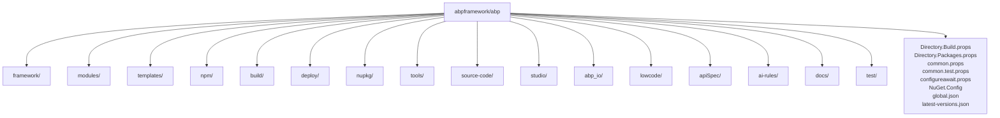
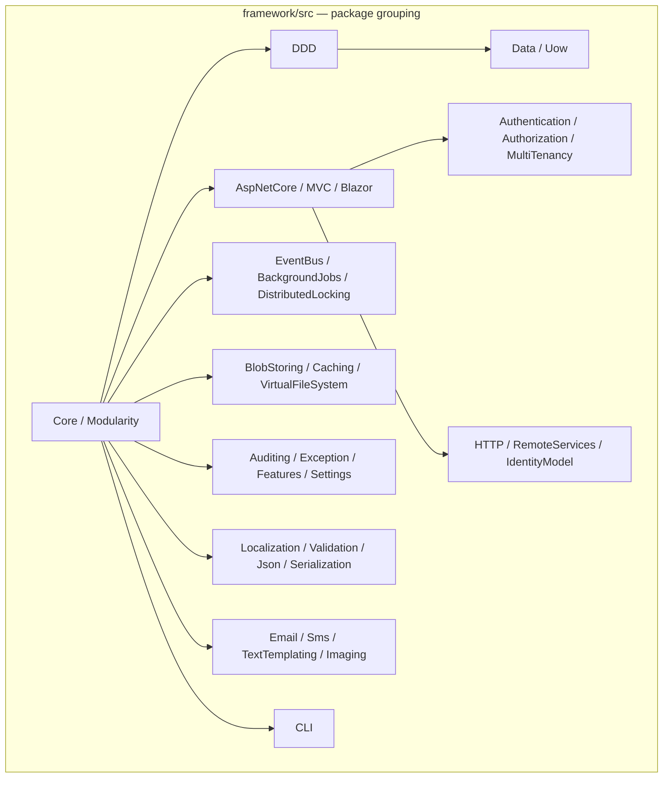

The `abpframework/abp` repository is a single monorepo that ships the framework, the official application modules, the solution templates, the NPM bundles and every release-engineering script in one tree. This page is an **exhaustive file-system map** for agents that need to know exactly which folder contains a given concern before opening files. Counts and file names come from `ls` at the repo root and inside `framework/src/`, `modules/`, `templates/`, `npm/packs/`, `npm/ng-packs/packages/`, `build/` and `deploy/`.

## Repository root



Every entry from `ls -1` at the repo root, annotated:

| Path | Type | Role |
| --- | --- | --- |
| `CODE_OF_CONDUCT.md` | file | Contributor Covenant v2.0 |
| `CONTRIBUTING.md` | file | PR / issue process |
| `Directory.Build.props` | file | Test-project detection + `coverlet.collector` autoref. Applies to every csproj |
| `Directory.Packages.props` | file | Central NuGet **package version pinning** (`ManagePackageVersionsCentrally=true`) — single source of truth for ~200 transitive package versions |
| `LICENSE.md` | file | LGPL-3.0-only |
| `NuGet.Config` | file | Restricts feeds to `nuget.org` only |
| `NuGet.md` | file | Per-package README embedded into every published .nupkg via `<PackageReadmeFile>` |
| `README.md` | file | Marketing readme, links to docs/tutorials |
| `SECURITY.md` | file | Vulnerability reporting policy |
| `abp_io/` | dir | The `AbpIoLocalization` solution used by abp.io website builds |
| `ai-rules/` | dir | Markdown rule packs consumed by ABP Studio's AI features (`common`, `data`, `template-specific`, `testing`, `ui`) |
| `apiSpec/` | dir | Generated public API surface markdown (e.g. `Microsoft_AspNetCore_Routing_AbpEndpointRouterOptions.md`) |
| `build/` | dir | Top-level dev-time build PowerShell |
| `codecov.yml` | file | Codecov config |
| `common.DotSettings` | file | ReSharper team-shared settings |
| `common.props` | file | Shared MSBuild props for every csproj: `Version=10.2.0-rc.3`, `LeptonXVersion`, `PackageLicenseExpression`, SourceLink, `.abppkg` Content packing |
| `common.test.props` | file | Shared MSBuild for test projects: disables `GenerateAssembly*Attribute` |
| `configureawait.props` | file | Conditionally references `ConfigureAwait.Fody` in Release builds |
| `delete-bin-obj.ps1` | file | Recursive `bin`/`obj` wiper, skips `node_modules` |
| `deploy/` | dir | Numbered release pipeline scripts (see `/overview/build-and-tooling`) |
| `docs/` | dir | Documentation site sources (live at abp.io/docs) |
| `framework/` | dir | The framework itself: `src/` packages + `test/` + `Volo.Abp.slnx` |
| `global.json` | file | Pins .NET SDK to **`10.0.100`** with `rollForward=latestFeature` |
| `latest-versions.json` | file | Sequence of `{version, leptonx, type}` entries consumed by templates & CLI |
| `lowcode/` | dir | `schema/` JSON Schemas used by ABP Studio low-code module designer |
| `modules/` | dir | 18 application modules (Identity, OpenIddict, CmsKit, …) plus a `README.md` |
| `npm/` | dir | All JavaScript: Angular `ng-packs`, MVC `packs`, lerna config, publish scripts |
| `nupkg/` | dir | Release-time .nupkg producer (`pack.ps1`, `push_packages.ps1`, `common.ps1`) |
| `source-code/` | dir | Modules redistributed as **source** (zipped by ABP Studio for "source-code" purchases): `SourceCodes.slnx` + per-module `Volo.Abp.<X>.SourceCode/` |
| `studio/` | dir | `source-codes/` mirror used by ABP Studio's package replacement workflow |
| `templates/` | dir | 6 solution templates: `app`, `app-nolayers`, `module`, `console`, `maui`, `wpf` |
| `test/` | dir | Standalone test/benchmark solutions: `AbpPerfTest/` (with/without ABP perf harness — `AbpPerfTest.WithAbp`, `AbpPerfTest.WithoutAbp`, JMeter scripts under `_jmeter/`) and `DistEvents/` (distributed event-bus demo apps: `DistDemoApp.EfCoreRabbitMq`, `DistDemoApp.MongoDbKafka`, `DistDemoApp.MongoDbRebus`, `DistDemoApp.Shared`) |
| `tools/` | dir | `github-changelog-generator`, `localization-key-synchronizer`, `nuget/nuget.exe`, `smtp-prober-email-sender.exe` |

## `framework/`

```text
framework/
├── NuGet.md
├── Volo.Abp.abpmdl     # ABP Studio module metadata (folders + packages map)
├── Volo.Abp.abpsln     # ABP Studio solution that embeds the above .abpmdl
├── Volo.Abp.sln.DotSettings
├── Volo.Abp.slnx       # XML-based .NET solution (.slnx) — 169 projects under src/, plus test/
├── src/                # 169 csproj packages
└── test/               # mirror of src/ with .Tests projects
```

### Packages inside `framework/src/`

169 directories from `ls framework/src`. Grouped by subsystem (every directory listed):

| Subsystem | Packages |
| --- | --- |
| **Core / DI / modularity** | `Volo.Abp`, `Volo.Abp.Core`, `Volo.Abp.Autofac`, `Volo.Abp.Autofac.WebAssembly`, `Volo.Abp.Castle.Core` |
| **DDD** | `Volo.Abp.Ddd.Domain.Shared`, `Volo.Abp.Ddd.Domain`, `Volo.Abp.Ddd.Application.Contracts`, `Volo.Abp.Ddd.Application`, `Volo.Abp.Specifications`, `Volo.Abp.ObjectExtending`, `Volo.Abp.ObjectMapping`, `Volo.Abp.AutoMapper`, `Volo.Abp.Mapperly` |
| **Data / UoW** | `Volo.Abp.Data`, `Volo.Abp.Uow`, `Volo.Abp.MemoryDb`, `Volo.Abp.Dapper`, `Volo.Abp.MongoDB`, `Volo.Abp.EntityFrameworkCore`, `Volo.Abp.EntityFrameworkCore.MySQL`, `Volo.Abp.EntityFrameworkCore.MySQL.Pomelo`, `Volo.Abp.EntityFrameworkCore.Oracle`, `Volo.Abp.EntityFrameworkCore.Oracle.Devart`, `Volo.Abp.EntityFrameworkCore.PostgreSql`, `Volo.Abp.EntityFrameworkCore.SqlServer`, `Volo.Abp.EntityFrameworkCore.Sqlite` |
| **ASP.NET Core** | `Volo.Abp.AspNetCore.Abstractions`, `Volo.Abp.AspNetCore`, `Volo.Abp.AspNetCore.MultiTenancy`, `Volo.Abp.AspNetCore.Serilog`, `Volo.Abp.AspNetCore.SignalR`, `Volo.Abp.AspNetCore.TestBase`, `Volo.Abp.AspNetCore.Bundling` |
| **MVC** | `Volo.Abp.AspNetCore.Mvc`, `Volo.Abp.AspNetCore.Mvc.Contracts`, `Volo.Abp.AspNetCore.Mvc.Client`, `Volo.Abp.AspNetCore.Mvc.Client.Common`, `Volo.Abp.AspNetCore.Mvc.Dapr`, `Volo.Abp.AspNetCore.Mvc.Dapr.EventBus`, `Volo.Abp.AspNetCore.Mvc.NewtonsoftJson`, `Volo.Abp.AspNetCore.Mvc.UI`, `Volo.Abp.AspNetCore.Mvc.UI.Bootstrap`, `Volo.Abp.AspNetCore.Mvc.UI.Bundling`, `Volo.Abp.AspNetCore.Mvc.UI.Bundling.Abstractions`, `Volo.Abp.AspNetCore.Mvc.UI.MultiTenancy`, `Volo.Abp.AspNetCore.Mvc.UI.Packages`, `Volo.Abp.AspNetCore.Mvc.UI.Theme.Shared`, `Volo.Abp.AspNetCore.Mvc.UI.Theme.Shared.Demo`, `Volo.Abp.AspNetCore.Mvc.UI.Widgets` |
| **Blazor / Components** | `Volo.Abp.AspNetCore.Components`, `Volo.Abp.AspNetCore.Components.Server`, `Volo.Abp.AspNetCore.Components.Server.Theming`, `Volo.Abp.AspNetCore.Components.Web`, `Volo.Abp.AspNetCore.Components.Web.Theming`, `Volo.Abp.AspNetCore.Components.WebAssembly`, `Volo.Abp.AspNetCore.Components.WebAssembly.Theming`, `Volo.Abp.AspNetCore.Components.WebAssembly.Theming.Bundling`, `Volo.Abp.AspNetCore.Components.MauiBlazor`, `Volo.Abp.AspNetCore.Components.MauiBlazor.Bundling`, `Volo.Abp.AspNetCore.Components.MauiBlazor.Theming`, `Volo.Abp.AspNetCore.Components.MauiBlazor.Theming.Bundling`, `Volo.Abp.BlazoriseUI`, `Volo.Abp.Maui.Client` |
| **Authentication** | `Volo.Abp.AspNetCore.Authentication.JwtBearer`, `Volo.Abp.AspNetCore.Authentication.OAuth`, `Volo.Abp.AspNetCore.Authentication.OpenIdConnect` |
| **Authorization / Security** | `Volo.Abp.Authorization.Abstractions`, `Volo.Abp.Authorization`, `Volo.Abp.Security` |
| **Multi-Tenancy** | `Volo.Abp.MultiTenancy.Abstractions`, `Volo.Abp.MultiTenancy` |
| **Auditing / Exception** | `Volo.Abp.Auditing.Contracts`, `Volo.Abp.Auditing`, `Volo.Abp.ExceptionHandling` |
| **Features / Settings / Permissions** | `Volo.Abp.Features`, `Volo.Abp.Settings`, `Volo.Abp.GlobalFeatures` |
| **Event Bus** | `Volo.Abp.EventBus.Abstractions`, `Volo.Abp.EventBus`, `Volo.Abp.EventBus.Azure`, `Volo.Abp.EventBus.Dapr`, `Volo.Abp.EventBus.Kafka`, `Volo.Abp.EventBus.RabbitMQ`, `Volo.Abp.EventBus.Rebus`, `Volo.Abp.RabbitMQ`, `Volo.Abp.Kafka`, `Volo.Abp.AzureServiceBus`, `Volo.Abp.Dapr` |
| **Background Jobs / Workers** | `Volo.Abp.BackgroundJobs.Abstractions`, `Volo.Abp.BackgroundJobs`, `Volo.Abp.BackgroundJobs.HangFire`, `Volo.Abp.BackgroundJobs.Quartz`, `Volo.Abp.BackgroundJobs.RabbitMQ`, `Volo.Abp.BackgroundJobs.TickerQ`, `Volo.Abp.BackgroundWorkers`, `Volo.Abp.BackgroundWorkers.Hangfire`, `Volo.Abp.BackgroundWorkers.Quartz`, `Volo.Abp.BackgroundWorkers.TickerQ`, `Volo.Abp.HangFire`, `Volo.Abp.Quartz`, `Volo.Abp.TickerQ` |
| **BLOB Storing** | `Volo.Abp.BlobStoring`, `Volo.Abp.BlobStoring.Aliyun`, `Volo.Abp.BlobStoring.Aws`, `Volo.Abp.BlobStoring.Azure`, `Volo.Abp.BlobStoring.Bunny`, `Volo.Abp.BlobStoring.FileSystem`, `Volo.Abp.BlobStoring.Google`, `Volo.Abp.BlobStoring.Memory`, `Volo.Abp.BlobStoring.Minio` |
| **Caching** | `Volo.Abp.Caching`, `Volo.Abp.Caching.StackExchangeRedis` |
| **Distributed Locking** | `Volo.Abp.DistributedLocking.Abstractions`, `Volo.Abp.DistributedLocking`, `Volo.Abp.DistributedLocking.Dapr` |
| **HTTP** | `Volo.Abp.Http.Abstractions`, `Volo.Abp.Http`, `Volo.Abp.Http.Client`, `Volo.Abp.Http.Client.Dapr`, `Volo.Abp.Http.Client.IdentityModel`, `Volo.Abp.Http.Client.IdentityModel.MauiBlazor`, `Volo.Abp.Http.Client.IdentityModel.Web`, `Volo.Abp.Http.Client.IdentityModel.WebAssembly`, `Volo.Abp.Http.Client.Web`, `Volo.Abp.IdentityModel`, `Volo.Abp.RemoteServices` |
| **Localization / MultiLingual** | `Volo.Abp.Localization.Abstractions`, `Volo.Abp.Localization`, `Volo.Abp.MultiLingualObjects` |
| **Virtual files / Bundling / Minify** | `Volo.Abp.VirtualFileSystem`, `Volo.Abp.Minify` |
| **Validation** | `Volo.Abp.Validation.Abstractions`, `Volo.Abp.Validation`, `Volo.Abp.FluentValidation` |
| **JSON / Serialization** | `Volo.Abp.Json.Abstractions`, `Volo.Abp.Json`, `Volo.Abp.Json.Newtonsoft`, `Volo.Abp.Json.SystemTextJson`, `Volo.Abp.Serialization` |
| **AI** | `Volo.Abp.AI.Abstractions`, `Volo.Abp.AI` |
| **Imaging** | `Volo.Abp.Imaging.Abstractions`, `Volo.Abp.Imaging.AspNetCore`, `Volo.Abp.Imaging.ImageSharp`, `Volo.Abp.Imaging.MagickNet`, `Volo.Abp.Imaging.SkiaSharp` |
| **Email / SMS** | `Volo.Abp.Emailing`, `Volo.Abp.MailKit`, `Volo.Abp.Sms`, `Volo.Abp.Sms.Aliyun`, `Volo.Abp.Sms.TencentCloud` |
| **Text templating** | `Volo.Abp.TextTemplating.Core`, `Volo.Abp.TextTemplating`, `Volo.Abp.TextTemplating.Razor`, `Volo.Abp.TextTemplating.Scriban` |
| **LDAP / GDPR** | `Volo.Abp.Ldap.Abstractions`, `Volo.Abp.Ldap`, `Volo.Abp.Gdpr.Abstractions` |
| **Swagger / API Versioning** | `Volo.Abp.Swashbuckle`, `Volo.Abp.ApiVersioning.Abstractions` |
| **CLI** | `Volo.Abp.Cli.Core`, `Volo.Abp.Cli` |
| **Misc / Util** | `Volo.Abp.Guids`, `Volo.Abp.Threading`, `Volo.Abp.Timing`, `Volo.Abp.UI`, `Volo.Abp.UI.Navigation`, `Volo.Abp.TestBase` |



## `modules/`

18 official application modules (`ls modules` — plus a top-level `README.md`):

| Directory | Module purpose | Notable startup module class |
| --- | --- | --- |
| `account/` | Login / register / 2FA UI on top of Identity | `AbpAccountWebModule`, `AbpAccountApplicationModule` |
| `audit-logging/` | Persistence of audit logs (EF/Mongo) | `AbpAuditLoggingDomainModule` |
| `background-jobs/` | DB-backed background job store | `AbpBackgroundJobsDomainModule` |
| `basic-theme/` | Free Basic theme — Bootstrap-based MVC layout | `AbpAspNetCoreMvcUiBasicThemeModule` |
| `blob-storing-database/` | EF/Mongo `IBlobProvider` implementation | `BlobStoringDatabaseDomainModule` |
| `blogging/` | Sample blogging module (used by abp.io) | `BloggingDomainModule` |
| `client-simulation/` | Load-testing simulation tool | `ClientSimulationDomainModule` |
| `cms-kit/` | Blogs, pages, comments, tags, polls — split between public (`Volo.CmsKit.*`) and admin (`Volo.CmsKit.Admin.*`) layer fans | `CmsKitDomainModule`, `CmsKitAdminApplicationModule` |
| `docs/` | Multi-source documentation viewer | `DocsDomainModule` |
| `feature-management/` | Persisted feature flags | `FeatureManagementDomainModule` |
| `identity/` | User/role/claim management on top of ASP.NET Identity | `AbpIdentityDomainModule` |
| `identityserver/` | IdentityServer4 integration (legacy) | `AbpIdentityServerDomainModule` |
| `openiddict/` | OpenIddict 7.x integration (preferred) | `AbpOpenIddictDomainModule` |
| `permission-management/` | Permission grants persistence | `PermissionManagementDomainModule` |
| `setting-management/` | Setting persistence | `SettingManagementDomainModule` |
| `tenant-management/` | Tenant CRUD UI/API | `AbpTenantManagementDomainModule` |
| `users/` | `IUser` abstraction shared by Identity & domain | `AbpUsersDomainModule` |
| `virtual-file-explorer/` | Browse the VFS at runtime | `VirtualFileExplorerWebModule` |
| `README.md` | – | – |

Each module follows the seven-layer split documented in `/overview/architecture`. See `/modules/overview` for per-module deep dives.

## `templates/`

6 solution starters that the ABP CLI / Studio materialize into customer projects:

| Path | Output type | Notable feature |
| --- | --- | --- |
| `templates/app/aspnet-core/` | Full layered ASP.NET solution: MVC, Blazor Server, Blazor WebApp, Blazor.WASM, Tiered split, AuthServer, HttpApi.Host, DbMigrator | EF + Mongo variants per project |
| `templates/app-nolayers/aspnet-core/` | Single-project per host: `Host`, `Mvc`, `Blazor.Server`, `Blazor.WebAssembly` (+ `.Mongo` variants) | "Single project" / no DDD layering |
| `templates/module/aspnet-core/` | Reusable application module template (full layer fan) | Used to scaffold new modules like `Volo.Abp.X` |
| `templates/module/angular/` | Angular library module | Companion to the above |
| `templates/console/` | `Microsoft.Extensions.Hosting` console worker with ABP | `MyCompanyName.MyProjectName.slnx` + `common.props` |
| `templates/maui/` | .NET MAUI app | `MyCompanyName.MyProjectName.slnx` |
| `templates/wpf/` | WPF desktop app | `MyCompanyName.MyProjectName.slnx` |
| `templates/zip-templates.ps1` | helper script | Zips templates for CLI distribution |
| `templates/Directory.Packages.props` | central versions for template projects | mirrors root |
| `templates/NuGet.Config` | sources for template restore | – |

## `npm/`

Two parallel package trees.

### `npm/ng-packs/packages/` — Angular libraries

15 packages (`ls npm/ng-packs/packages`):

| Package | Purpose |
| --- | --- |
| `core` | `@abp/ng.core` — ABP Angular runtime: HTTP, config, auth |
| `account` | `@abp/ng.account` UI |
| `account-core` | `@abp/ng.account.core` headless services |
| `oauth` | `@abp/ng.oauth` IdentityModel/oidc client |
| `identity` | `@abp/ng.identity` |
| `permission-management` | `@abp/ng.permission-management` |
| `feature-management` | `@abp/ng.feature-management` |
| `setting-management` | `@abp/ng.setting-management` |
| `tenant-management` | `@abp/ng.tenant-management` |
| `cms-kit` | `@abp/ng.cms-kit` |
| `theme-shared` | Shared Angular theme primitives |
| `theme-basic` | Bootstrap-based default theme |
| `components` | `@abp/ng.components` reusable UI |
| `generators` | Yeoman / scaffolding generators |
| `schematics` | Angular CLI schematics |

### `npm/packs/` — MVC client-side bundles

55 directories (`ls npm/packs | wc -l`). They are republished onto NuGet by ABP via `Volo.Abp.AspNetCore.Mvc.UI.Packages`. Selection:

| Pack | Description |
| --- | --- |
| `core`, `aspnetcore.mvc.ui`, `aspnetcore.mvc.ui.theme.shared`, `aspnetcore.mvc.ui.theme.basic`, `aspnetcore.components.server.basictheme`, `aspnetcore.components.server.theming` | First-party ABP MVC / Blazor packs |
| `bootstrap`, `bootstrap-datepicker`, `bootstrap-daterangepicker`, `popper.js`, `jquery`, `jquery-form`, `jquery-validation`, `jquery-validation-unobtrusive` | Bootstrap stack |
| `font-awesome`, `flag-icon-css`, `flag-icons` | Icons |
| `chart.js`, `signalr`, `datatables.net`, `datatables.net-bs4`, `datatables.net-bs5`, `select2`, `jstree`, `cropperjs`, `tui-editor`, `uppy`, `markdown-it`, `prismjs`, `highlight.js`, `codemirror`, `clipboard`, `lodash`, `luxon`, `moment`, `slugify`, `qrcode`, `malihu-custom-scrollbar-plugin`, `owl.carousel`, `star-rating-svg`, `sweetalert2`, `timeago`, `toastr`, `vee-validate`, `vue`, `zxcvbn`, `anchor-js`, `virtual-file-explorer`, `blogging`, `cms-kit`, `cms-kit.admin`, `cms-kit.public`, `docs` | Third-party JS / first-party UI packs |
| `npm-check-updates.ps1`, `utils` | helper scripts |

### `npm/` top-level files

| Path | Purpose |
| --- | --- |
| `lerna.json` | Lerna 7 monorepo config (used to coordinate ng-packs publish) |
| `package.json`, `package-lock.json`, `yarn.lock` | Root workspace + lockfiles |
| `package-update-script.js`, `update-gulp.js`, `replace-with-tilde.js`, `publish-utils.js` | Custom Node helpers |
| `preview-publish.ps1`, `publish-mvc.ps1`, `publish-ng.ps1` | Manual publish scripts (CI invokes them) |
| `scripts/` | TypeScript automations: `change-package-version.ts`, `remove-lock-files.ts`, `update-lepton-x-versions.ts`, `validate-versions.ts`, `utils/`, `package.json`, `tsconfig.json`, `yarn.lock` |
| `verdaccio-containers/` | Local Docker-based npm registry for testing publishes |

## `build/`

Dev-time aggregate build/test runners. See `/overview/build-and-tooling` for line-by-line.

| File | Purpose |
| --- | --- |
| `common.ps1` | Defines `$rootFolder` and `$solutionPaths` array (`../framework`, all 14 core `../modules/*`). With `-f` flag also adds `client-simulation`, `virtual-file-explorer`, `docs`, `blogging`, all `templates/*`, `abp_io/AbpIoLocalization`, `source-code` |
| `build-all.ps1` | Runs `dotnet build` over `$solutionPaths` |
| `build-all-release.ps1` | Same with `-c Release` |
| `test-all.ps1` | `dotnet test --no-build --no-restore --collect:"XPlat Code Coverage"` per solution |

## `deploy/`

Release pipeline — numbered for human ordering, orchestrated by `_run_all.ps1`.

| Script | Purpose |
| --- | --- |
| `1-fetch-and-build.ps1` | Switches branch, bumps `common.props` version, restores+builds everything |
| `2-nuget-pack.ps1` | Invokes `nupkg/pack.ps1` |
| `3-nuget-push.ps1` | `dotnet nuget push` for every `*.nupkg` |
| `4-npm-publish-mvc.ps1` | Publish `npm/packs/*` to npmjs |
| `5-npm-publish-angular.ps1` | Publish `npm/ng-packs/packages/*` |
| `6-git-commit.ps1` | `git add .`, `git commit -m Update_NPM_Package_Versions`, `git push` |
| `7-publish-github-release.ps1` | Calls GitHub REST API to create release + tag |
| `8-download-release-zip.ps1` | SCP-downloads release artifact zip from build server |
| `_run_all.ps1` | Runs 1–7 sequentially under a `Start-Transcript` log |
| `new-github-release-function.psm1` | PowerShell module exporting GitHub release helpers used by step 7 |
| `plink.exe`, `readme.md` | PuTTY plink (used by step 8 over SSH); readme |

## `nupkg/`

Distinct from `deploy/` — this is where `dotnet pack` outputs collect.

| File | Purpose |
| --- | --- |
| `common.ps1` | Defines `$projects` (~290 entries), `$solutions`, plus `Write-Info`/`Write-Error`/`Seperator` PowerShell helpers |
| `pack.ps1` | Per-project `dotnet pack -c Release --no-build`, moves `.nupkg` to `nupkg/` |
| `push_packages.ps1` | Loops over `*.nupkg` and `dotnet nuget push` |
| `push-nightly-packages-myget.ps1` | Variant targeting MyGet nightly feed |
| `unit_test.ps1` | Runs unit tests as a release gate |
| `0/` | Workspace folder used to stage individual project packs |
| `common.ps1.bak` | Backup of previous pack list |

## `source-code/`

Contains every business module re-exposed as **source** in a top-level `SourceCodes.slnx`. Per-module folder name is `Volo.Abp.<X>.SourceCode/`:

```
source-code/
├── SourceCodes.slnx
├── Volo.Abp.Account.SourceCode/
├── Volo.Abp.AuditLogging.SourceCode/
├── Volo.Abp.BackgroundJobs.SourceCode/
├── Volo.Abp.BasicTheme.SourceCode/
├── Volo.Abp.BlobStoring.Database.SourceCode/
├── Volo.Abp.FeatureManagement.SourceCode/
├── Volo.Abp.Identity.SourceCode/
├── Volo.Abp.IdentityServer.SourceCode/
├── Volo.Abp.OpenIddict.SourceCode/
├── Volo.Abp.PermissionManagement.SourceCode/
├── Volo.Abp.SettingManagement.SourceCode/
├── Volo.Abp.TenantManagement.SourceCode/
├── Volo.Abp.Users.SourceCode/
├── Volo.Abp.VirtualFileExplorer.SourceCode/
├── Volo.Blogging.SourceCode/
├── Volo.ClientSimulation.SourceCode/
├── Volo.CmsKit.SourceCode/
└── Volo.Docs.SourceCode/
```

`studio/source-codes/` mirrors the same tree; it is the artifact ABP Studio's "replace package with source code" command pulls from.

## `tools/`

| Item | Purpose |
| --- | --- |
| `github-changelog-generator/` | C# console app that builds release notes from GitHub PRs |
| `localization-key-synchronizer/` | C# console app that diffs English JSON localization vs. other languages |
| `nuget/nuget.exe` | Pinned Windows NuGet executable, used by deploy scripts |
| `smtp-prober-email-sender.exe` | Standalone Windows binary used by email diagnostics |

## `test/`, `docs/`, `apiSpec/`, `ai-rules/`, `lowcode/`, `abp_io/`

| Path | Purpose |
| --- | --- |
| `test/` | Two standalone solutions: `AbpPerfTest/AbpPerfTest.slnx` (perf benchmarks) and `DistEvents/DistEventsDemo.slnx` (distributed-event-bus demo) — not invoked by `build/build-all.ps1` |
| `docs/` | Source of the documentation site at abp.io/docs |
| `apiSpec/` | Auto-generated public-API markdown surface (1 file currently visible) |
| `ai-rules/` | Markdown rule packs that ABP Studio AI features inject into prompts: `common/`, `data/`, `template-specific/`, `testing/`, `ui/` |
| `lowcode/schema/` | JSON Schemas (`model.schema.json` + `definitions/`) used by the ABP Studio low-code designer |
| `abp_io/` | The localization solution that powers the abp.io website (`AbpIoLocalization/`) |

<Tip>
When asked "where does X live?", first check this page's top-level table, then drill into the matching subsystem table inside `framework/src` or the matching module under `modules/`. Almost every concern in ABP has exactly one home directory.
</Tip>

## Cross-links

<CardGroup cols={2}>
  <Card title="Solution structure (.slnx, .abpmdl, .abppkg)" href="/overview/solution-structure" />
  <Card title="Build & tooling (build/, deploy/, nupkg/)" href="/overview/build-and-tooling" />
  <Card title="Module deep dives" href="/modules/overview" />
  <Card title="Template catalogue" href="/templates/overview" />
  <Card title="CLI commands" href="/cli/overview" />
  <Card title="Architecture overview" href="/overview/architecture" />
</CardGroup>
