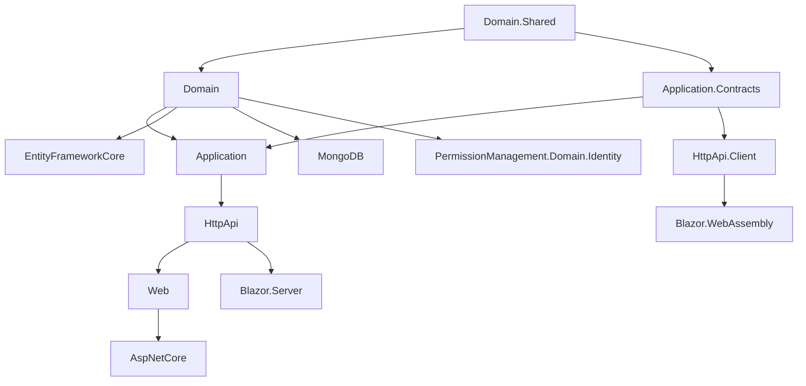
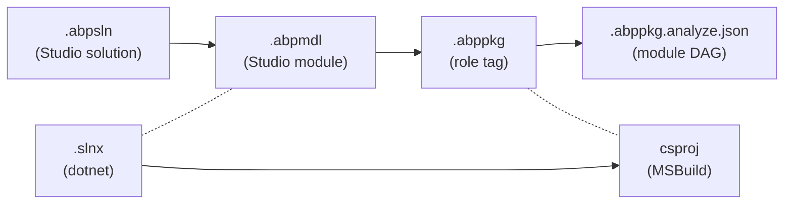
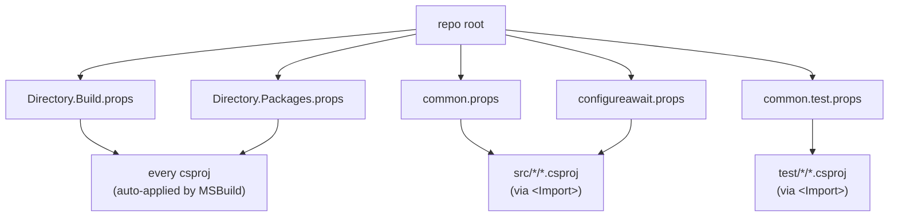

The `abpframework/abp` repository is not a single .NET solution. It is a constellation of `.slnx` solutions — one per logical product — bound together by shared MSBuild props at the repository root and by ABP Studio metadata (`.abpmdl`, `.abppkg`, `.abpsln`). This page maps every solution file, explains each metadata file format, and shows how `Directory.Build.props`, `Directory.Packages.props`, `common.props`, `common.test.props` and `configureawait.props` propagate cross-project settings to ~290 csprojs.

## Why many `.slnx` solutions?

A single `Volo.Abp.sln` containing every csproj would be unloadable in Visual Studio. Instead each module owns its own solution so contributors can open only what they touch.

| Solution | Path | Project count (approx.) | Purpose |
| --- | --- | --- | --- |
| Framework | `framework/Volo.Abp.slnx` | 169 src + matching test | Core framework packages |
| Each official module | `modules/<name>/Volo.Abp.<Name>.slnx` (e.g. `modules/identity/Volo.Abp.Identity.slnx`) | 10–20 | One application module (7-layer fan + tests) |
| Source-code SLN | `source-code/SourceCodes.slnx` | All modules as source | Used by ABP Studio "replace with source" |
| Each template | `templates/app/aspnet-core/MyCompanyName.MyProjectName.slnx`, `templates/app-nolayers/aspnet-core/MyCompanyName.MyProjectName.slnx`, `templates/console/MyCompanyName.MyProjectName.slnx`, `templates/maui/MyCompanyName.MyProjectName.slnx`, `templates/wpf/MyCompanyName.MyProjectName.slnx`, `templates/module/aspnet-core/<…>.slnx`, `templates/module/angular/...` | varies | Solution the CLI/Studio materialises for end-users |
| Localization | `abp_io/AbpIoLocalization/` | small | Localization tooling solution for abp.io site |

<Info>
`.slnx` is the **XML-based replacement** for the legacy `.sln` text format. Microsoft's .NET 10 SDK (`global.json` pins SDK `10.0.100`) supports it natively via `dotnet build path/to/X.slnx`. ABP has migrated every solution to `.slnx`.
</Info>

### Anatomy of a `.slnx`

`framework/Volo.Abp.slnx` (extract):

```xml
<Solution>
  <Folder Name="/src/">
    <Project Path="src/Volo.Abp.AI.Abstractions/Volo.Abp.AI.Abstractions.csproj" />
    <Project Path="src/Volo.Abp.AI/Volo.Abp.AI.csproj" />
    <Project Path="src/Volo.Abp.ApiVersioning.Abstractions/Volo.Abp.ApiVersioning.Abstractions.csproj" />
    <!-- 169 entries under /src/ … -->
  </Folder>
  <Folder Name="/test/">
    <!-- mirror under test/ -->
  </Folder>
</Solution>
```

Two solution folders (`/src/`, `/test/`) and a flat `<Project Path>` list. Nothing else — no GUIDs, no per-project configurations.

The `modules/identity/Volo.Abp.Identity.slnx` shows the canonical 15-project layered split:

```xml
<Solution>
  <Folder Name="/src/">
    <Project Path="src/Volo.Abp.Identity.Application.Contracts/Volo.Abp.Identity.Application.Contracts.csproj" />
    <Project Path="src/Volo.Abp.Identity.Application/Volo.Abp.Identity.Application.csproj" />
    <Project Path="src/Volo.Abp.Identity.AspNetCore/Volo.Abp.Identity.AspNetCore.csproj" />
    <Project Path="src/Volo.Abp.Identity.Blazor.Server/Volo.Abp.Identity.Blazor.Server.csproj" />
    <Project Path="src/Volo.Abp.Identity.Blazor.WebAssembly/Volo.Abp.Identity.Blazor.WebAssembly.csproj" />
    <Project Path="src/Volo.Abp.Identity.Blazor/Volo.Abp.Identity.Blazor.csproj" />
    <Project Path="src/Volo.Abp.Identity.Domain.Shared/Volo.Abp.Identity.Domain.Shared.csproj" />
    <Project Path="src/Volo.Abp.Identity.Domain/Volo.Abp.Identity.Domain.csproj" />
    <Project Path="src/Volo.Abp.Identity.EntityFrameworkCore/Volo.Abp.Identity.EntityFrameworkCore.csproj" />
    <Project Path="src/Volo.Abp.Identity.HttpApi.Client/Volo.Abp.Identity.HttpApi.Client.csproj" />
    <Project Path="src/Volo.Abp.Identity.HttpApi/Volo.Abp.Identity.HttpApi.csproj" />
    <Project Path="src/Volo.Abp.Identity.Installer/Volo.Abp.Identity.Installer.csproj" />
    <Project Path="src/Volo.Abp.Identity.MongoDB/Volo.Abp.Identity.MongoDB.csproj" />
    <Project Path="src/Volo.Abp.Identity.Web/Volo.Abp.Identity.Web.csproj" />
    <Project Path="src/Volo.Abp.PermissionManagement.Domain.Identity/Volo.Abp.PermissionManagement.Domain.Identity.csproj" />
  </Folder>
  <Folder Name="/test/">
    <Project Path="test/Volo.Abp.Identity.Application.Tests/Volo.Abp.Identity.Application.Tests.csproj" />
    <Project Path="test/Volo.Abp.Identity.AspNetCore.Tests/Volo.Abp.Identity.AspNetCore.Tests.csproj" />
    <Project Path="test/Volo.Abp.Identity.Domain.Tests/Volo.Abp.Identity.Domain.Tests.csproj" />
    <Project Path="test/Volo.Abp.Identity.EntityFrameworkCore.Tests/Volo.Abp.Identity.EntityFrameworkCore.Tests.csproj" />
    <Project Path="test/Volo.Abp.Identity.MongoDB.Tests/Volo.Abp.Identity.MongoDB.Tests.csproj" />
    <Project Path="test/Volo.Abp.Identity.TestBase/Volo.Abp.Identity.TestBase.csproj" />
  </Folder>
</Solution>
```

This is the **canonical per-module layered split** every business module under `modules/` reproduces, and the same shape that the templates under `templates/` produce for end-user solutions.

## The layered split applied to one module

Inside any `modules/<name>/src/` the seven-layer fan is recursively present. For `modules/identity/src/`:

| Project | Layer | abppkg `role` |
| --- | --- | --- |
| `Volo.Abp.Identity.Domain.Shared/` | Domain.Shared | `lib.domain.shared` (typical) |
| `Volo.Abp.Identity.Domain/` | Domain | `lib.domain` (verified — `cat Volo.Abp.Identity.Domain.abppkg` → `{ "role": "lib.domain" }`) |
| `Volo.Abp.Identity.Application.Contracts/` | Application.Contracts | `lib.application.contracts` |
| `Volo.Abp.Identity.Application/` | Application | `lib.application` |
| `Volo.Abp.Identity.HttpApi/` | HttpApi | `lib.httpapi` |
| `Volo.Abp.Identity.HttpApi.Client/` | HttpApi.Client | `lib.httpapi.client` |
| `Volo.Abp.Identity.EntityFrameworkCore/` | EF Core persistence | `lib.entityframeworkcore` |
| `Volo.Abp.Identity.MongoDB/` | Mongo persistence | `lib.mongodb` |
| `Volo.Abp.Identity.Web/` | Razor pages + view components | `lib.web` |
| `Volo.Abp.Identity.Blazor/` | Blazor common | `lib.blazor` |
| `Volo.Abp.Identity.Blazor.Server/` | Blazor Server | `lib.blazor.server` |
| `Volo.Abp.Identity.Blazor.WebAssembly/` | Blazor WASM | `lib.blazor.webassembly` |
| `Volo.Abp.Identity.AspNetCore/` | AspNetCore cross-cutting glue | `lib.aspnetcore` |
| `Volo.Abp.Identity.Installer/` | Metapackage for Studio | `lib.installer` |
| `Volo.Abp.PermissionManagement.Domain.Identity/` | Cross-module bridge: lets PermissionManagement see Identity users | `lib.domain` |



## ABP Studio metadata: `.abpmdl`, `.abppkg`, `.abpsln`

ABP Studio (the desktop IDE built on top of `dotnet`) layers a **module-and-package abstraction** over csproj/slnx. Three JSON files capture it.

### `.abpmdl` — module manifest

`framework/Volo.Abp.abpmdl` (extract):

```json
{
  "folders": {
    "items": {
      "test": {},
      "src": {}
    }
  },
  "packages": {
    "AbpTestBase":            { "path": "test/AbpTestBase/AbpTestBase.abppkg", "folder": "test" },
    "Volo.Abp.AspNetCore":    { "path": "src/Volo.Abp.AspNetCore/Volo.Abp.AspNetCore.abppkg",       "folder": "src" },
    "Volo.Abp.AspNetCore.Tests": { "path": "test/Volo.Abp.AspNetCore.Tests/Volo.Abp.AspNetCore.Tests.abppkg", "folder": "test" },
    "Volo.Abp.MultiTenancy.Tests": { /* ... */ }
    /* one entry per csproj */
  }
}
```

- `folders.items` — virtual folders Studio renders in its tree (mirror of `<Folder Name>` in `.slnx`).
- `packages` — dictionary keyed by **package name** (the csproj's assembly name), each carrying the relative path to that project's `.abppkg` descriptor and the parent folder.

`modules/identity/Volo.Abp.Identity.abpmdl` follows exactly the same schema, scoping it to the 15 identity projects + their tests.

### `.abppkg` — per-project descriptor

`framework/src/Volo.Abp.Core/Volo.Abp.Core.abppkg`:

```json
{ "role": "lib.framework" }
```

`modules/identity/src/Volo.Abp.Identity.Domain/Volo.Abp.Identity.Domain.abppkg`:

```json
{ "role": "lib.domain" }
```

The single `role` string tags the layer/kind of the package. Possible values used in the repo include `lib.framework`, `lib.domain`, `lib.domain.shared`, `lib.application`, `lib.application.contracts`, `lib.httpapi`, `lib.httpapi.client`, `lib.entityframeworkcore`, `lib.mongodb`, `lib.web`, `lib.blazor`, `lib.blazor.server`, `lib.blazor.webassembly`, `lib.aspnetcore`, `lib.installer`, `test.unit`, etc. Studio uses this role to pick correct add-package prompts, scaffold the right `[DependsOn]` chains, and decide which solution folder to drop the project into.

### `.abppkg.analyze.json` — frozen dependency snapshot

Beside each `.abppkg` there is a `.abppkg.analyze.json` file like `modules/identity/src/Volo.Abp.Identity.Domain/Volo.Abp.Identity.Domain.abppkg.analyze.json`:

```json
{
  "name": "Volo.Abp.Identity.Domain",
  "hash": "",
  "contents": [
    {
      "namespace": "Volo.Abp.Identity",
      "dependsOnModules": [
        { "declaringAssemblyName": "Volo.Abp.Ddd.Domain",          "namespace": "Volo.Abp.Domain",    "name": "AbpDddDomainModule" },
        { "declaringAssemblyName": "Volo.Abp.Identity.Domain.Shared", "namespace": "Volo.Abp.Identity", "name": "AbpIdentityDomainSharedModule" },
        { "declaringAssemblyName": "Volo.Abp.Users.Domain",        "namespace": "Volo.Abp.Users",     "name": "AbpUsersDomainModule" },
        { "declaringAssemblyName": "Volo.Abp.Mapperly",            "namespace": "Volo.Abp.Mapperly",  "name": "AbpMapperlyModule" }
      ],
      "implementingInterfaces": [
        { "name": "IAbpModule", "fullName": "Volo.Abp.Modularity.IAbpModule" },
        { "name": "IOnPreApplicationInitialization", "fullName": "Volo.Abp.Modularity.IOnPreApplicationInitialization" },
        /* etc. */
      ]
    }
  ]
}
```

This file is the **analyzed module DAG** that ABP Studio uses without having to compile the project. Note that the file is checked into the repo and packed into the published NuGet as `content/*.abppkg.analyze.json` via `common.props`:

```xml
<ItemGroup Condition="'$(UsingMicrosoftNETSdkWeb)' != 'true' AND '$(UsingMicrosoftNETSdkRazor)' != 'true'">
  <None Remove="*.abppkg.analyze.json" />
  <Content Include="*.abppkg.analyze.json">
    <Pack>true</Pack>
    <PackagePath>content\</PackagePath>
  </Content>
</ItemGroup>
```

That means downstream consumers get the precomputed dependency graph inside the .nupkg and Studio can navigate it without re-analysing IL.

The same `common.props` block packs `*.abppkg` itself into `content\`.

### `.abpsln` — Studio solution

`framework/Volo.Abp.abpsln`:

```json
{
  "template": "empty",
  "modules": {
    "Volo.Abp": { "path": "Volo.Abp.abpmdl" }
  }
}
```

An ABP Studio solution is a top-level shell that references one or more `.abpmdl` modules. A multi-module customer solution typically lists several:

```json
{
  "template": "app",
  "modules": {
    "MyCompany.MyProject":     { "path": "src/MyCompany.MyProject/MyCompany.MyProject.abpmdl" },
    "MyCompany.MyProject.Auth": { "path": "src/MyCompany.MyProject.Auth/MyCompany.MyProject.Auth.abpmdl" }
  }
}
```

Studio uses this file as its entry point.

### Summary of the metadata stack



## Shared MSBuild props

Five repo-root prop files are auto-applied to every csproj by MSBuild's directory-walking rules.

### `Directory.Build.props` (root)

Detects test projects by path/name and forces `coverlet.collector` onto them:

```xml
<Project>
  <PropertyGroup>
    <IsTestProject Condition="$(MSBuildProjectFullPath.Contains('test')) and ($(MSBuildProjectName.EndsWith('.Tests')) or $(MSBuildProjectName.EndsWith('.TestBase')))">true</IsTestProject>
  </PropertyGroup>
  <ItemGroup>
    <PackageReference Condition="'$(IsTestProject)' == 'true'" Include="coverlet.collector">
      <Version Condition="$(MSBuildProjectFullPath.Contains('templates'))">6.0.4</Version>
      <PrivateAssets>all</PrivateAssets>
      <IncludeAssets>runtime; build; native; contentfiles; analyzers</IncludeAssets>
    </PackageReference>
  </ItemGroup>
</Project>
```

### `Directory.Packages.props` (root)

Central package version pinning:

```xml
<Project>
  <PropertyGroup>
    <ManagePackageVersionsCentrally>true</ManagePackageVersionsCentrally>
    <CentralPackageFloatingVersionsEnabled>true</CentralPackageFloatingVersionsEnabled>
  </PropertyGroup>
  <ItemGroup>
    <PackageVersion Include="Autofac"             Version="8.4.0" />
    <PackageVersion Include="AutoMapper"          Version="14.0.0" />
    <PackageVersion Include="Microsoft.AspNetCore.Authentication.JwtBearer" Version="10.0.2" />
    <PackageVersion Include="Microsoft.EntityFrameworkCore" Version="10.0.2" />
    <PackageVersion Include="MongoDB.Driver"      Version="3.7.0" />
    <PackageVersion Include="Npgsql.EntityFrameworkCore.PostgreSQL" Version="10.0.0" />
    <PackageVersion Include="OpenIddict.Core"     Version="7.2.0" />
    <PackageVersion Include="Serilog.AspNetCore"  Version="9.0.0" />
    <PackageVersion Include="xunit"               Version="2.9.3" />
    <PackageVersion Include="ConfigureAwait.Fody" Version="3.3.2" />
    <!-- ~200 entries -->
  </ItemGroup>
</Project>
```

Every csproj writes `<PackageReference Include="Autofac" />` without `Version=` — the version is supplied centrally. A second `templates/Directory.Packages.props` mirrors this for template projects.

### `common.props`

Imported explicitly by csproj (`<Import Project="..\..\common.props" />`):

```xml
<Project>
  <PropertyGroup>
    <LangVersion>latest</LangVersion>
    <Version>10.2.0-rc.3</Version>
    <LeptonXVersion>5.2.0-rc.3</LeptonXVersion>
    <NoWarn>$(NoWarn);CS1591;CS0436</NoWarn>
    <PackageIconUrl>https://abp.io/assets/abp_nupkg.png</PackageIconUrl>
    <PackageProjectUrl>https://abp.io/</PackageProjectUrl>
    <PackageLicenseExpression>LGPL-3.0-only</PackageLicenseExpression>
    <RepositoryType>git</RepositoryType>
    <RepositoryUrl>https://github.com/abpframework/abp/</RepositoryUrl>
    <PackageReadmeFile>NuGet.md</PackageReadmeFile>
    <PackageTags>aspnetcore boilerplate framework web best-practices angular maui blazor mvc csharp webapp</PackageTags>
    <GenerateDocumentationFile>true</GenerateDocumentationFile>
    <AllowedOutputExtensionsInPackageBuildOutputFolder>$(AllowedOutputExtensionsInPackageBuildOutputFolder);.pdb</AllowedOutputExtensionsInPackageBuildOutputFolder>
  </PropertyGroup>
  <ItemGroup>
    <None Include="..\..\NuGet.md" Pack="true" PackagePath="\" />
  </ItemGroup>
  <ItemGroup>
    <PackageReference Include="Microsoft.SourceLink.GitHub">
      <PrivateAssets>all</PrivateAssets>
      <IncludeAssets>runtime; build; native; contentfiles; analyzers</IncludeAssets>
    </PackageReference>
  </ItemGroup>
  <!-- Pack .abppkg + .abppkg.analyze.json into content/ -->
  <ItemGroup Condition="$(AssemblyName.EndsWith('HttpApi.Client'))">
    <EmbeddedResource Include="**\*generate-proxy.json" />
    <Content Remove="**\*generate-proxy.json" />
  </ItemGroup>
</Project>
```

Key effects: every package ships with SourceLink, `LeptonXVersion` (for theme NuGet references), `NuGet.md` as `<PackageReadmeFile>`, and `HttpApi.Client` projects embed `*generate-proxy.json` so `abp generate-proxy` finds the swagger spec.

### `common.test.props`

```xml
<Project>
  <PropertyGroup>
    <LangVersion>latest</LangVersion>
    <NoWarn>$(NoWarn);CS1591;CS0436</NoWarn>
    <GenerateRuntimeConfigurationFiles>true</GenerateRuntimeConfigurationFiles>
    <GenerateAssemblyConfigurationAttribute>false</GenerateAssemblyConfigurationAttribute>
    <GenerateAssemblyCompanyAttribute>false</GenerateAssemblyCompanyAttribute>
    <GenerateAssemblyProductAttribute>false</GenerateAssemblyProductAttribute>
  </PropertyGroup>
</Project>
```

Test projects import this instead of `common.props`: no package metadata, but `GenerateRuntimeConfigurationFiles` for xUnit isolation.

### `configureawait.props`

```xml
<Project>
  <ItemGroup Condition="'$(Configuration)' == 'Release'">
    <PackageReference Include="ConfigureAwait.Fody" PrivateAssets="All" />
    <PackageReference Include="Fody">
      <PrivateAssets>All</PrivateAssets>
      <IncludeAssets>runtime; build; native; contentfiles; analyzers</IncludeAssets>
    </PackageReference>
  </ItemGroup>
</Project>
```

Released assemblies are post-processed by Fody to inject `.ConfigureAwait(false)` on every awaitable — only in Release builds — to avoid deadlocks for callers without a sync-context-free wrapper.

### Propagation diagram



## Reading `NuGet.Config`

`NuGet.Config` at the root only ever points to nuget.org:

```xml
<configuration>
  <packageSources>
    <add key="nuget.org" value="https://api.nuget.org/v3/index.json" />
  </packageSources>
</configuration>
```

A second `NuGet.Config` lives under `templates/` for template-generated solutions.

<Warning>
Do not add private feeds here. Internal preview packages are pushed to MyGet via `nupkg/push-nightly-packages-myget.ps1` and consumed by adding the feed inside the customer's solution, not into this repo.
</Warning>

## `global.json`

```json
{
  "sdk": {
    "version": "10.0.100",
    "rollForward": "latestFeature"
  }
}
```

- **SDK pinned to 10.0.100** — every csproj is built with .NET 10 SDK.
- `rollForward: latestFeature` allows newer 10.x feature bands but not 11.x.

## How a customer solution differs

The `templates/app/aspnet-core/MyCompanyName.MyProjectName.slnx` is the **same shape** but instantiated for application code:

```text
templates/app/aspnet-core/src/
├── MyCompanyName.MyProjectName.Domain.Shared
├── MyCompanyName.MyProjectName.Domain
├── MyCompanyName.MyProjectName.Application.Contracts
├── MyCompanyName.MyProjectName.Application
├── MyCompanyName.MyProjectName.EntityFrameworkCore
├── MyCompanyName.MyProjectName.MongoDB
├── MyCompanyName.MyProjectName.HttpApi
├── MyCompanyName.MyProjectName.HttpApi.Client
├── MyCompanyName.MyProjectName.HttpApi.Host
├── MyCompanyName.MyProjectName.HttpApi.HostWithIds
├── MyCompanyName.MyProjectName.AuthServer
├── MyCompanyName.MyProjectName.Web
├── MyCompanyName.MyProjectName.Web.Host
├── MyCompanyName.MyProjectName.Blazor / .Server / .Server.Tiered / .Client
├── MyCompanyName.MyProjectName.Blazor.WebApp / .WebApp.Tiered (+ .Client variants)
├── MyCompanyName.MyProjectName.DbMigrator
```

The CLI/Studio replaces `MyCompanyName.MyProjectName` with the customer's name, drops unused hosts (e.g. Mongo variants), and writes back the `.slnx`, `.abpmdl`, and per-project `.abppkg` files.

## Source-code redistribution

The official "Get source code" feature swaps a customer's NuGet reference to a project reference into `source-code/Volo.Abp.<X>.SourceCode/`:

| Path | Contents |
| --- | --- |
| `source-code/SourceCodes.slnx` | Top-level solution including every `Volo.Abp.<X>.SourceCode/` |
| `source-code/Volo.Abp.Identity.SourceCode/` | Mirror of `modules/identity/src/` adapted for direct inclusion |
| `studio/source-codes/...` | Same tree, version managed by ABP Studio |

Combined with the per-package `.abppkg`/`.abppkg.analyze.json` files this lets Studio do "Replace `Volo.Abp.Identity.Domain` package with source code" by simply switching a NuGet reference to a project reference into the parallel tree.

## When you must touch solution metadata

<Steps>
  <Step title="Adding a new project to framework or a module">
    1. Create `src/<NewProject>/<NewProject>.csproj` (import `common.props`).
    2. Add `<Project Path="src/<NewProject>/<NewProject>.csproj" />` to the relevant `.slnx`.
    3. Add a `<NewProject>.abppkg` with the correct `role`.
    4. Add an entry to the module's `.abpmdl` `packages` dict.
    5. If under `framework/src/`, also add a reference to it from `nupkg/common.ps1`'s `$projects` array so `pack.ps1` packs it.
  </Step>
  <Step title="Adding a new module solution under modules/">
    1. Create `modules/<name>/Volo.Abp.<Name>.slnx`, `.abpmdl`, `.abpsln`.
    2. Register the relative path inside `build/common.ps1` `$solutionPaths` so `build-all.ps1` / `test-all.ps1` pick it up.
    3. Add the matching `Volo.Abp.<Name>.SourceCode/` under `source-code/` if it should be redistributable.
  </Step>
  <Step title="Bumping a NuGet dependency">
    Edit only `Directory.Packages.props` — never set `Version=` inside the csproj.
  </Step>
  <Step title="Bumping the framework version">
    Edit `common.props` `<Version>` and `<LeptonXVersion>`. The `deploy/1-fetch-and-build.ps1` script automates this for releases.
  </Step>
</Steps>

## Cross-links

<CardGroup cols={2}>
  <Card title="Architecture (layers & modules)" href="/overview/architecture" />
  <Card title="Repository layout" href="/overview/repository-layout" />
  <Card title="Build & release pipeline" href="/overview/build-and-tooling" />
  <Card title="Module deep dives" href="/modules/overview" />
  <Card title="CLI commands (project scaffolding)" href="/cli/overview" />
  <Card title="Glossary (.abpmdl/.abppkg/role)" href="/overview/glossary" />
</CardGroup>
