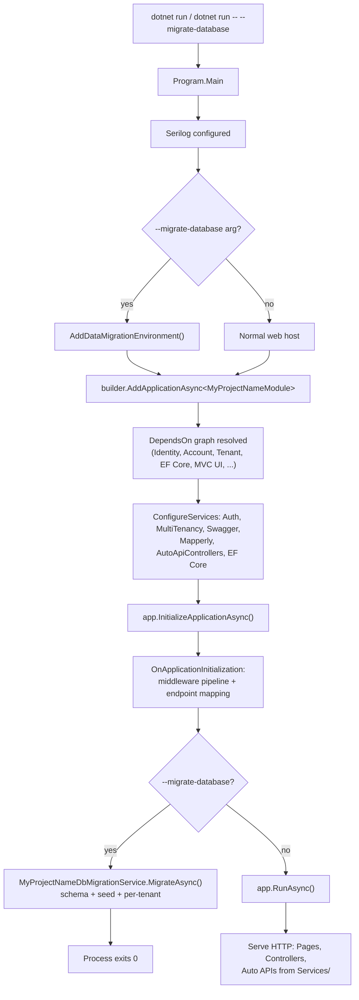

The `app-nolayers` template is ABP's *minimalist startup solution*. Instead of carving the application into Domain, Application, EntityFrameworkCore, HttpApi, and Web class libraries, it puts every concern — Razor Pages, controllers, application services, entities, the `DbContext`, EF Core migrations, localization, and menus — into a **single ASP.NET Core web project**. The `slnx` still contains multiple projects, but each one is a *complete*, *self-contained* host for a particular UI/data combination (MVC + EF Core, MVC + Mongo, Blazor Server, Blazor WASM client/server, Host API). You pick one, delete the rest, and you ship.

This page is the reference for coding agents that need to navigate, extend, or scaffold against the single-layer layout. It is grounded in the source under `templates/app-nolayers/` in the `abpframework/abp` repository and contrasts the layout with the layered `app` template wherever relevant.

<Info>
The single-layer template still depends on ABP's *framework* modules (Identity, Account, Tenant Management, Permission Management, Feature Management, Setting Management, OpenIddict, Audit Logging) as NuGet packages. "No layers" refers to **your** code, not ABP's. The modules themselves remain layered internally.
</Info>

## When to choose it

<CardGroup cols={2}>
  <Card title="Pick app-nolayers when" icon="check">
    You are building a small app, a prototype, an internal tool, a microservice, or a demo. You want the shortest path between "new project" and "first endpoint" and you are comfortable enforcing your own boundaries.
  </Card>
  <Card title="Pick app instead when" icon="layer-group">
    You expect to scale the team, share a Domain across multiple hosts (MVC + Blazor + mobile), publish a reusable application contract package, or split the API host from the UI host on different boxes.
  </Card>
</CardGroup>

See [`/templates/overview`](/templates/overview) for the full template matrix and [`/templates/app`](/templates/app) for the layered counterpart.

## Solution layout

The `.slnx` at `templates/app-nolayers/aspnet-core/MyCompanyName.MyProjectName.slnx` enumerates every host variant the template can emit:

```xml MyCompanyName.MyProjectName.slnx
<Solution>
  <Project Path="MyCompanyName.MyProjectName.Blazor.Server.Mongo/MyCompanyName.MyProjectName.Blazor.Server.Mongo.csproj" />
  <Project Path="MyCompanyName.MyProjectName.Blazor.Server/MyCompanyName.MyProjectName.Blazor.Server.csproj" />
  <Project Path="MyCompanyName.MyProjectName.Blazor.WebAssembly/Client/MyCompanyName.MyProjectName.Blazor.WebAssembly.Client.csproj" />
  <Project Path="MyCompanyName.MyProjectName.Blazor.WebAssembly/Server.Mongo/MyCompanyName.MyProjectName.Blazor.WebAssembly.Server.Mongo.csproj" />
  <Project Path="MyCompanyName.MyProjectName.Blazor.WebAssembly/Server/MyCompanyName.MyProjectName.Blazor.WebAssembly.Server.csproj" />
  <Project Path="MyCompanyName.MyProjectName.Blazor.WebAssembly/Shared/MyCompanyName.MyProjectName.Blazor.WebAssembly.Shared.csproj" />
  <Project Path="MyCompanyName.MyProjectName.Host.Mongo/MyCompanyName.MyProjectName.Host.Mongo.csproj" />
  <Project Path="MyCompanyName.MyProjectName.Host/MyCompanyName.MyProjectName.Host.csproj" />
  <Project Path="MyCompanyName.MyProjectName.Mvc.Mongo/MyCompanyName.MyProjectName.Mvc.Mongo.csproj" />
  <Project Path="MyCompanyName.MyProjectName.Mvc/MyCompanyName.MyProjectName.Mvc.csproj" />
</Solution>
```

The ABP CLI emits exactly one of these (with the matching Mongo or EF Core variant) when you run `abp new`. The rest are siblings in the template's source tree so the CLI can pick the correct skeleton — see [`/cli/project-creation`](/cli/project-creation) for the resolution rules. The Blazor WebAssembly variant is the only one that ships with an explicit `Client` / `Server` / `Shared` split, because Blazor WASM requires a separate client assembly.

<Tip>
Agent rule of thumb: when generating code for a single-layer solution, treat the *one* generated csproj as both the "domain" and the "presentation" layer. There is nowhere else to put files.
</Tip>

## The folders inside one project

Every host variant has the same shape. The MVC + EF Core flavour at `templates/app-nolayers/aspnet-core/MyCompanyName.MyProjectName.Mvc/` is canonical:

<CodeGroup>
```text MVC + EF Core (canonical)
MyCompanyName.MyProjectName.Mvc/
├── Data/
│   ├── MyProjectNameDbContext.cs
│   ├── MyProjectNameDbContextFactory.cs
│   ├── MyProjectNameDbMigrationService.cs
│   ├── MyProjectNameEFCoreDbSchemaMigrator.cs
│   └── MyProjectNameEfCoreEntityExtensionMappings.cs
├── Entities/                       # empty placeholder for your aggregates
├── Localization/
│   ├── MyProjectName/              # *.json language files
│   └── MyProjectNameResource.cs
├── Menus/
│   ├── MyProjectNameMenuContributor.cs
│   └── MyProjectNameMenus.cs
├── Migrations/                     # EF Core migrations
├── ObjectMapping/
│   └── MyProjectNameMappers.cs     # Mapperly placeholders
├── Pages/                          # Razor Pages UI
│   ├── Index.cshtml
│   ├── Index.cshtml.cs
│   └── _ViewImports.cshtml
├── Properties/launchSettings.json
├── Services/                       # AppServices (auto-exposed as APIs)
│   ├── Dtos/
│   └── MyProjectNameAppService.cs
├── wwwroot/                        # static assets, global-styles.css
├── MyProjectNameBrandingProvider.cs
├── MyProjectNameGlobalFeatureConfigurator.cs
├── MyProjectNameModule.cs          # single AbpModule for the whole app
├── MyProjectNameModuleExtensionConfigurator.cs
├── Program.cs
├── abp.resourcemapping.js
├── appsettings.json
└── package.json
```

```text Host (API only, EF Core)
MyCompanyName.MyProjectName.Host/
├── Controllers/
│   └── HomeController.cs           # redirects "/" -> "/swagger"
├── Data/                           # same as MVC variant
├── Entities/
├── Localization/
├── Migrations/
├── ObjectMapping/
├── Services/                       # AppServices auto-exposed as REST
├── Properties/
├── wwwroot/
├── MyProjectNameModule.cs
├── Program.cs
└── appsettings.json
```

```text Blazor Server (EF Core)
MyCompanyName.MyProjectName.Blazor.Server/
├── Components/
│   ├── App.razor
│   ├── Pages/Index.razor(.cs|.css)
│   └── Routes.razor
├── Data/                           # same EF Core stack
├── Entities/
├── Localization/
├── Menus/
├── Migrations/
├── ObjectMapping/
├── Services/                       # AppServices
├── _Imports.razor
├── MyProjectNameComponentBase.cs
├── MyProjectNameModule.cs
└── Program.cs
```
</CodeGroup>

The Mongo variants (`*.Mongo` suffix) swap `Data/*EFCore*` for a single `MyProjectNameDbContext : AbpMongoDbContext` and drop the `Migrations/` folder — the rest of the folder structure is identical.

### What each folder is for

| Folder | Role | Layered template equivalent |
| --- | --- | --- |
| `Pages/` or `Components/` | Razor Pages / Blazor components, the *presentation* surface | `*.Web` |
| `Controllers/` | Plain MVC controllers (the Host variant only ships `HomeController` that redirects to Swagger) | `*.HttpApi` or `*.HttpApi.Host` |
| `Services/` | Application services (`ApplicationService` subclasses) auto-exposed as REST endpoints | `*.Application` + `*.Application.Contracts` |
| `Services/Dtos/` | DTOs that flow over the wire and through Mapperly | `*.Application.Contracts/Dtos` |
| `Entities/` | Aggregate roots, value objects, domain services | `*.Domain` |
| `Data/` | `DbContext`, design-time factory, migration runner, schema migrator | `*.EntityFrameworkCore` + `*.DbMigrator` |
| `Migrations/` | EF Core migration snapshots | `*.EntityFrameworkCore` (or a dedicated migrations project) |
| `Localization/` | Localization resource class and per-culture JSON | `*.Domain.Shared` |
| `Menus/` | Menu contributor and menu name constants | `*.Web` |
| `ObjectMapping/` | Mapperly mappers (`MyProjectNameMappers.cs`) | `*.Application` |
| `wwwroot/` | Static assets and bundles | `*.Web/wwwroot` |

The empty `Entities/.gitkeep` and `Services/Dtos/.gitkeep` files in the source are intentional — they exist so the CLI emits the folders even before you add code.

## How the single module wires everything

In the layered template each csproj has its own `AbpModule` (e.g. `MyProjectNameDomainModule`, `MyProjectNameApplicationModule`, `MyProjectNameEntityFrameworkCoreModule`, `MyProjectNameWebModule`). The single-layer template collapses them all into **one** module class. For the MVC variant it lives at `MyProjectNameModule.cs`:

```csharp MyProjectNameModule.cs (excerpt)
[DependsOn(
    // ABP Framework packages
    typeof(AbpAspNetCoreMvcModule),
    typeof(AbpAutofacModule),
    typeof(AbpMapperlyModule),
    typeof(AbpEntityFrameworkCoreSqlServerModule),
    typeof(AbpSwashbuckleModule),
    typeof(AbpAspNetCoreSerilogModule),
    typeof(AbpAspNetCoreMvcUiLeptonXLiteThemeModule),

    // Account module packages
    typeof(AbpAccountApplicationModule),
    typeof(AbpAccountHttpApiModule),
    typeof(AbpAccountWebOpenIddictModule),

    // Identity module packages
    typeof(AbpPermissionManagementDomainIdentityModule),
    typeof(AbpPermissionManagementDomainOpenIddictModule),
    typeof(AbpIdentityApplicationModule),
    typeof(AbpIdentityHttpApiModule),
    typeof(AbpIdentityEntityFrameworkCoreModule),
    typeof(AbpOpenIddictEntityFrameworkCoreModule),
    typeof(AbpIdentityWebModule),

    // Audit logging, Permission, Tenant, Feature, Setting Management ...
)]
public class MyProjectNameModule : AbpModule
{
    /* Single point to enable/disable multi-tenancy */
    public const bool IsMultiTenant = true;

    public override void PreConfigureServices(ServiceConfigurationContext context) { /* ... */ }

    public override void ConfigureServices(ServiceConfigurationContext context)
    {
        ConfigureAuthentication(context);
        ConfigureMultiTenancy();
        ConfigureUrls(configuration);
        ConfigureBundles();
        ConfigureMapperly(context);
        ConfigureSwagger(context.Services);
        ConfigureNavigationServices();
        ConfigureAutoApiControllers();
        ConfigureVirtualFiles(hostingEnvironment);
        ConfigureLocalization();
        ConfigureEfCore(context);
    }

    public override void OnApplicationInitialization(ApplicationInitializationContext context) { /* ... */ }
}
```

Two things to notice:

1. **`[DependsOn(...)]` is *flat*.** It lists every framework module (`Domain`, `Application`, `HttpApi`, `EntityFrameworkCore`, `Web`) of every ABP module the app uses. In the layered template these dependencies are spread across five class libraries; here they live on one type.
2. **`IsMultiTenant` is a single `const bool`.** Flipping it disables both `AbpMultiTenancyOptions` and the `app.UseMultiTenancy()` call in the same file. There is no second class library to keep in sync.

The `ConfigureAutoApiControllers` step is what makes `Services/` work without controllers:

```csharp ConfigureAutoApiControllers
private void ConfigureAutoApiControllers()
{
    Configure<AbpAspNetCoreMvcOptions>(options =>
    {
        options.ConventionalControllers.Create(typeof(MyProjectNameModule).Assembly);
    });
}
```

It scans the *single* assembly for `ApplicationService` subclasses and exposes them as REST endpoints. In the layered template you would point this at `*.Application.csproj`'s assembly; here, the module's own assembly contains everything.

### The base AppService

`Services/MyProjectNameAppService.cs` is the project-wide base class your application services should inherit from:

```csharp Services/MyProjectNameAppService.cs
using MyCompanyName.MyProjectName.Localization;
using Volo.Abp.Application.Services;

namespace MyCompanyName.MyProjectName.Services;

/* Inherit your application services from this class. */
public abstract class MyProjectNameAppService : ApplicationService
{
    protected MyProjectNameAppService()
    {
        LocalizationResource = typeof(MyProjectNameResource);
    }
}
```

The single `MyProjectNameResource` (an empty marker class with `[LocalizationResourceName("MyProjectName")]`) is the localization root for the whole app — UI, services, exceptions, and validators share it.

## `Program.cs` walkthrough

`Program.cs` is identical across the MVC, Host, and Blazor.Server variants — only the bootstrap module type differs. Here is the MVC version verbatim:

```csharp Program.cs
using MyCompanyName.MyProjectName.Data;
using Serilog;
using Serilog.Events;
using Volo.Abp.Data;

namespace MyCompanyName.MyProjectName;

public class Program
{
    public async static Task<int> Main(string[] args)
    {
        var loggerConfiguration = new LoggerConfiguration()
#if DEBUG
            .MinimumLevel.Debug()
#else
            .MinimumLevel.Information()
#endif
            .MinimumLevel.Override("Microsoft", LogEventLevel.Information)
            .MinimumLevel.Override("Microsoft.EntityFrameworkCore", LogEventLevel.Warning)
            .Enrich.FromLogContext()
            .WriteTo.Async(c => c.File("Logs/logs.txt"))
            .WriteTo.Async(c => c.Console());

        if (IsMigrateDatabase(args))
        {
            loggerConfiguration.MinimumLevel.Override("Volo.Abp", LogEventLevel.Warning);
            loggerConfiguration.MinimumLevel.Override("Microsoft", LogEventLevel.Warning);
        }

        Log.Logger = loggerConfiguration.CreateLogger();

        try
        {
            var builder = WebApplication.CreateBuilder(args);
            builder.Host.AddAppSettingsSecretsJson()
                .UseAutofac()
                .UseSerilog();
            if (IsMigrateDatabase(args))
            {
                builder.Services.AddDataMigrationEnvironment();
            }
            await builder.AddApplicationAsync<MyProjectNameModule>();
            var app = builder.Build();
            await app.InitializeApplicationAsync();

            if (IsMigrateDatabase(args))
            {
                await app.Services
                    .GetRequiredService<MyProjectNameDbMigrationService>()
                    .MigrateAsync();
                return 0;
            }

            Log.Information("Starting MyCompanyName.MyProjectName.");
            await app.RunAsync();
            return 0;
        }
        catch (Exception ex)
        {
            if (ex is HostAbortedException) { throw; }
            Log.Fatal(ex, "MyCompanyName.MyProjectName terminated unexpectedly!");
            return 1;
        }
        finally
        {
            Log.CloseAndFlush();
        }
    }

    private static bool IsMigrateDatabase(string[] args)
        => args.Any(x => x.Contains("--migrate-database", StringComparison.OrdinalIgnoreCase));
}
```

What it does, in order:

1. Configures Serilog (file + console, async sinks).
2. Detects the `--migrate-database` switch; if present, registers `AddDataMigrationEnvironment()` so the bootstrap runs as a one-shot migration job instead of a long-running web server.
3. Calls `builder.AddApplicationAsync<MyProjectNameModule>()` — this is the single entry point that walks the `[DependsOn]` graph, registers every service, and prepares the ABP application.
4. `app.InitializeApplicationAsync()` runs all `OnApplicationInitialization` hooks (including the one in `MyProjectNameModule`, which wires the middleware pipeline).
5. If `--migrate-database` was passed, resolves `MyProjectNameDbMigrationService` from DI and exits after running schema + seed; otherwise calls `app.RunAsync()`.

The Blazor WebAssembly *Client* variant is the only one that diverges — it boots via `WebAssemblyHostBuilder` rather than `WebApplication.CreateBuilder`:

```csharp Blazor.WebAssembly/Client/Program.cs
using Microsoft.AspNetCore.Components.WebAssembly.Hosting;

namespace MyCompanyName.MyProjectName;

public class Program
{
    public async static Task Main(string[] args)
    {
        var builder = WebAssemblyHostBuilder.CreateDefault(args);

        var application = await builder.AddApplicationAsync<MyProjectNameBlazorModule>(options =>
        {
            options.UseAutofac();
        });

        var host = builder.Build();
        await application.InitializeApplicationAsync(host.Services);
        await host.RunAsync();
    }
}
```

## Bootstrap and runtime flow



The diagram is the *whole* lifecycle. There is no separate `DbMigrator` console app in this template — `Program.cs` doubles as the migrator when invoked with `--migrate-database`, and `MyProjectNameDbMigrationService` (a `ITransientDependency` defined in `Data/`) does the work:

```csharp Data/MyProjectNameDbMigrationService.cs (excerpt)
public class MyProjectNameDbMigrationService : ITransientDependency
{
    public async Task MigrateAsync()
    {
        var initialMigrationAdded = AddInitialMigrationIfNotExist();
        if (initialMigrationAdded) { return; }

        Logger.LogInformation("Started database migrations...");
        await MigrateDatabaseSchemaAsync();
        await SeedDataAsync();
        Logger.LogInformation("Successfully completed host database migrations.");

        var tenants = await _tenantRepository.GetListAsync(includeDetails: true);
        foreach (var tenant in tenants)
        {
            using (_currentTenant.Change(tenant.Id))
            {
                // migrate per-tenant connection strings
            }
        }
    }
}
```

## Data access

### EF Core variants

`Data/MyProjectNameDbContext.cs` extends `AbpDbContext<T>` and *composes* every module schema into one `DbContext`:

```csharp Data/MyProjectNameDbContext.cs
public class MyProjectNameDbContext : AbpDbContext<MyProjectNameDbContext>
{
    public MyProjectNameDbContext(DbContextOptions<MyProjectNameDbContext> options)
        : base(options) { }

    protected override void OnModelCreating(ModelBuilder builder)
    {
        base.OnModelCreating(builder);

        /* Include modules to your migration db context */
        builder.ConfigurePermissionManagement();
        builder.ConfigureSettingManagement();
        builder.ConfigureAuditLogging();
        builder.ConfigureIdentity();
        builder.ConfigureOpenIddict();
        builder.ConfigureFeatureManagement();
        builder.ConfigureTenantManagement();

        /* Configure your own entities here */
    }
}
```

In the layered template the equivalent file lives in `*.EntityFrameworkCore.csproj` and is referenced by a separate `*.DbMigrator` console. Here it lives next to `Program.cs` and is registered by `ConfigureEfCore` inside the same module:

```csharp MyProjectNameModule.ConfigureEfCore
private void ConfigureEfCore(ServiceConfigurationContext context)
{
    context.Services.AddAbpDbContext<MyProjectNameDbContext>(options =>
    {
        /* You can remove "includeAllEntities: true" to create
         * default repositories only for aggregate roots */
        options.AddDefaultRepositories(includeAllEntities: true);
    });

    Configure<AbpDbContextOptions>(options =>
    {
        options.Configure(configurationContext =>
        {
            configurationContext.UseSqlServer();
        });
    });
}
```

`AddDefaultRepositories(includeAllEntities: true)` means **every** entity you drop into `Entities/` gets a generic `IRepository<TEntity, TKey>` for free, without you needing to author a Domain layer interface or an EF Core implementation. This is the single biggest ergonomic gain of the no-layers template.

The design-time `MyProjectNameDbContextFactory` lives in the same `Data/` folder so the `dotnet ef migrations add ...` tooling works out of the box from the project root.

### Mongo variants

The `.Mongo` flavour replaces the EF Core stack with a single MongoDB context:

```csharp Blazor.Server.Mongo/Data/MyProjectNameDbContext.cs
[ConnectionStringName("Default")]
public class MyProjectNameDbContext : AbpMongoDbContext
{
    /* Add mongo collections here. Example:
     * public IMongoCollection<Question> Questions => Collection<Question>();
     */
    protected override void CreateModel(IMongoModelBuilder modelBuilder)
    {
        base.CreateModel(modelBuilder);
    }
}
```

No `Migrations/` folder, no `DbContextFactory`, no `EFCoreDbSchemaMigrator` — the rest of the project (Pages, Services, Entities, Localization, Menus, `Program.cs`, `MyProjectNameModule`) is byte-for-byte the same shape as the EF Core variant.

## Razor Pages, Controllers, and auto APIs

There are three ways to serve HTTP in a single-layer app:

<Steps>
  <Step title="Razor Pages under Pages/">
    `Pages/Index.cshtml` + `Pages/Index.cshtml.cs` (a `IndexModel : AbpPageModel`) is the default home page in the MVC variant. Add new `.cshtml` / `.cshtml.cs` pairs here, no registration required.
  </Step>
  <Step title="MVC controllers under Controllers/">
    The Host variant uses `Controllers/HomeController.cs` to redirect "/" to Swagger:
    
    ```csharp Controllers/HomeController.cs
    public class HomeController : AbpController
    {
        public ActionResult Index() => Redirect("~/swagger");
    }
    ```
    
    Inherit from `AbpController` and ABP handles localization, current user, current tenant, and unit-of-work for you.
  </Step>
  <Step title="Application services under Services/">
    Any class that inherits `MyProjectNameAppService` (and therefore `ApplicationService`) is auto-exposed as a REST endpoint thanks to `options.ConventionalControllers.Create(typeof(MyProjectNameModule).Assembly)`. Put the DTOs in `Services/Dtos/` and wire mappings in `ObjectMapping/MyProjectNameMappers.cs`:
    
    ```csharp ObjectMapping/MyProjectNameMappers.cs
    // [Mapper]
    // public partial class SourceToDestinationMapper : MapperBase<Source, Destination>
    // {
    //     public override partial Destination Map(Source source);
    //     public override partial void Map(Source source, Destination destination);
    // }
    ```
  </Step>
</Steps>

Menus are contributed via `Menus/MyProjectNameMenuContributor.cs`, which builds against named constants in `Menus/MyProjectNameMenus.cs`:

```csharp Menus/MyProjectNameMenus.cs
namespace MyCompanyName.MyProjectName.Menus;

public class MyProjectNameMenus
{
    private const string Prefix = "MyProjectName";
    public const string Home = Prefix + ".Home";

    //Add your menu items here...
}
```

## Configuration and extension hooks

Two empty-by-default extension classes live at the project root so you have *one* canonical place to drop framework-level configuration:

<AccordionGroup>
  <Accordion title="MyProjectNameGlobalFeatureConfigurator.cs">
    Toggle global features of the ABP modules (e.g. enable/disable optional features inside Identity, Tenant Management, etc.). Called once from `PreConfigureServices` via a `OneTimeRunner`.

    ```csharp
    public static class MyProjectNameGlobalFeatureConfigurator
    {
        private static readonly OneTimeRunner OneTimeRunner = new OneTimeRunner();
        public static void Configure()
        {
            OneTimeRunner.Run(() =>
            {
                /* Configure ABP global features here. */
            });
        }
    }
    ```
  </Accordion>
  <Accordion title="MyProjectNameModuleExtensionConfigurator.cs">
    Extend module entities (e.g. add a `SocialSecurityNumber` to `IdentityUser`) and change property lengths. The template ships the example commented out in the file.
  </Accordion>
  <Accordion title="Data/MyProjectNameEfCoreEntityExtensionMappings.cs (EF Core only)">
    Maps the extra properties declared in the configurator above to EF Core columns so `dotnet ef migrations add` picks them up. Invoked from both `PreConfigureServices` and the `DbContextFactory`.
  </Accordion>
</AccordionGroup>

`appsettings.json` is short and shared across variants:

```json appsettings.json (MVC + EF Core)
{
  "App": {
    "SelfUrl": "https://localhost:44300"
  },
  "ConnectionStrings": {
    "Default": "Server=(LocalDb)\\MSSQLLocalDB;Database=MyProjectName;Trusted_Connection=True;TrustServerCertificate=True"
  },
  "StringEncryption": {
    "DefaultPassPhrase": "gsKnGZ041HLL4IM8"
  }
}
```

## Layered vs. single-layer at a glance

| Concern | `app` (layered) | `app-nolayers` (single layer) |
| --- | --- | --- |
| Number of csproj for one host | 6–8 (Domain.Shared, Domain, Application.Contracts, Application, EntityFrameworkCore, HttpApi, HttpApi.Client, Web, DbMigrator) | 1 |
| Number of `AbpModule` classes you author | One per project (5–8) | 1 |
| `DbContext` location | `*.EntityFrameworkCore.csproj` | `Data/` inside the host project |
| Application services location | `*.Application.csproj` | `Services/` inside the host project |
| DTOs location | `*.Application.Contracts.csproj` (referenceable by clients) | `Services/Dtos/` inside the host project |
| Auto-API discovery target | `*.Application.csproj` assembly | The host's own assembly |
| Database migrator | Separate `*.DbMigrator` console exe | Same `Program.cs` with `--migrate-database` switch |
| Reusable contracts package | Yes (`*.Contracts`, `*.HttpApi.Client`) | No — DTOs are sealed inside the host |
| Enforced layering boundaries | Compiler-checked via project references | Convention only — anything can reference anything |
| Cross-host code sharing | Easy (reference Domain from any host) | Copy/paste or extract a manual library |
| Time to first endpoint | High | Low |

<Warning>
The single-layer template intentionally removes the *compiler-enforced* separation between presentation, application, and domain. Razor Pages can `new` up an entity, an entity can take an `HttpContext` dependency, a `DbContext` can be injected into a controller. If you need to keep those boundaries, you either need discipline + code review + analyzers, or you should use the layered [`/templates/app`](/templates/app) template.
</Warning>

## Tradeoffs you should weigh

<CardGroup cols={2}>
  <Card title="Wins" icon="bolt">
    - One csproj, one `dotnet build`, one publish artifact.
    - One `[DependsOn(...)]` graph — no chasing references across projects to add a module.
    - One assembly scan covers Pages, Controllers, AppServices, and entity registrations.
    - `--migrate-database` keeps DevOps simple: same image, different argument.
    - Mongo and SQL variants share folder structure, so swapping is mechanical.
  </Card>
  <Card title="Costs" icon="triangle-exclamation">
    - No `*.Contracts` package — external API clients can't share your DTOs by reference, only by OpenAPI codegen.
    - No `*.Domain.Shared` — localization, permissions, and feature constants live in the host and can't be reused by a sibling host.
    - No compiler-enforced separation; layered patterns (CQRS, DDD aggregates) work but are *cultural*, not structural.
    - Splitting later means a real refactor: moving files between projects, adjusting namespaces, re-pointing `ConventionalControllers.Create(...)`.
  </Card>
</CardGroup>

<Note>
If your app *might* grow into a layered solution, keep your folder naming aligned with the layered template's project names (`Entities/`, `Services/`, `Services/Dtos/`, `Data/`). This is what ABP's source already does, and it makes a future split a `git mv` exercise rather than a rewrite.
</Note>

## Generating a single-layer solution

The ABP CLI selects this template when you pass `-t app-nolayers`:

```bash CLI
# MVC UI + EF Core + SQL Server (defaults)
abp new Acme.BookStore -t app-nolayers

# Blazor Server UI + MongoDB
abp new Acme.BookStore -t app-nolayers -u blazor-server -d mongodb

# Web API host only (no UI), EF Core
abp new Acme.BookStore -t app-nolayers -u none

# Blazor WebAssembly (separate Client/Server/Shared)
abp new Acme.BookStore -t app-nolayers -u blazor
```

See [`/cli/project-creation`](/cli/project-creation) for the full flag matrix (UI, database, mobile, theme, sample CRUD page, public website, version pinning, output folder).

After generation, the migration step in the EF Core variants is:

```bash Bootstrap
cd aspnet-core/src/Acme.BookStore.Mvc      # or whichever single host you kept
dotnet run -- --migrate-database           # creates schema + seeds Identity/OpenIddict
dotnet run                                  # starts the app on https://localhost:44300
```

For Mongo variants the seed step still runs through `--migrate-database`; it just skips schema migrations.

## Angular companion

If you generate with `-u angular`, the CLI emits the Angular front-end from `templates/app-nolayers/angular/`. It is a stock Angular workspace (standalone components, `app.config.ts`, `app.routes.ts`, a `home` feature module, and a `route.provider.ts`) wired against `@abp/ng.*` packages. It does **not** introduce additional .NET projects — the backend is still the single-project Host variant from the `aspnet-core` folder. Key files:

```text angular/
src/
├── app/
│   ├── app.component.ts
│   ├── app.config.ts        # provideHttpClient, ABP providers, routing
│   ├── app.routes.ts        # top-level routes
│   ├── home/                # standalone "home" feature
│   ├── route.provider.ts    # contributes routes to ABP's nav system
│   └── shared/shared.module.ts
├── environments/
│   ├── environment.ts
│   └── environment.prod.ts
└── main.ts
```

The Angular side is identical to what the layered template ships — the *only* difference between `app-nolayers` and `app` for the front-end is the backend it points at.

## Migrating from no-layers to layered

If you outgrow the flat layout, the mechanical path is: scaffold an `-t app` shell with the same name; move `Entities/` and `Localization/` into `*.Domain.Shared` / `*.Domain`; move `Services/` into `*.Application` and `Services/Dtos/` into `*.Application.Contracts`; move `Data/` (including `Migrations/`) into `*.EntityFrameworkCore` and the migration runner into `*.DbMigrator`; split the single `MyProjectNameModule` into one module per project, redistributing the `[DependsOn(...)]` graph; keep `Pages/`, `Controllers/`, `Menus/`, `wwwroot/`, and `Program.cs` in the Web host. Update `ConventionalControllers.Create(...)` to point at the new `*.Application` assembly. A ~5k LOC app typically takes a half-day to split; a 50k LOC app is a multi-week refactor — pick the template that matches the destination, not just the start.

## Related

<CardGroup cols={2}>
  <Card title="Templates overview" href="/templates/overview" icon="map">
    Compare app, app-nolayers, module, and microservice templates side by side.
  </Card>
  <Card title="Layered app template" href="/templates/app" icon="layer-group">
    The DDD-style multi-project sibling. Same modules, more structure.
  </Card>
  <Card title="Module template" href="/templates/module" icon="puzzle-piece">
    Build a reusable ABP module that can be consumed by either app variant.
  </Card>
  <Card title="CLI project creation" href="/cli/project-creation" icon="terminal">
    All `abp new` flags, including `-t app-nolayers`, UI, database, and mobile options.
  </Card>
</CardGroup>
