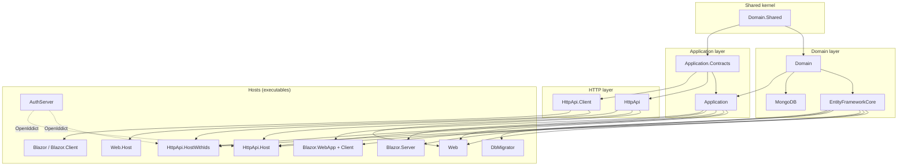
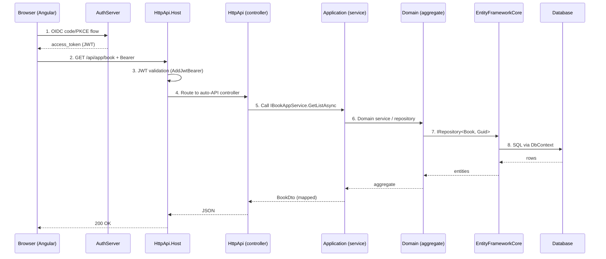

The `app` template under `templates/app/` is the canonical starting point produced
by `abp new` and the [ABP CLI project creation flow](/cli/project-creation). It is
a layered, Domain-Driven-Design solution: every project corresponds to a layer or
a deployment host, and every layer is shipped as an ABP module class
(`*Module.cs`) that declares its dependencies with `[DependsOn]`.

This page is a map. Use it when you need to know **where to put code**, **which
project a feature belongs in**, or **which host to run** for a given UI/topology
choice. For the simpler single-project alternative see
[App (No-Layers) Template](/templates/app-nolayers); for the catalog of all
templates see [Templates Overview](/templates/overview).

<Info>
The template ships under `templates/app/aspnet-core/` (backend + Razor/Blazor
UIs) and `templates/app/angular/` (Angular SPA frontend). The CLI substitutes
`MyCompanyName.MyProjectName` for your chosen company/project names.
</Info>

## Solution topology

The solution is split into three concerns:

1. **Layers** — `Domain.Shared`, `Domain`, `Application.Contracts`, `Application`,
   `EntityFrameworkCore`, `MongoDB`, `HttpApi`, `HttpApi.Client`. These are
   class libraries that compose into any host.
2. **Hosts** — `Web`, `Web.Host`, `HttpApi.Host`, `HttpApi.HostWithIds`,
   `AuthServer`, and the `Blazor.*` variants. Each is an executable `Program.cs`
   that picks a layer composition for a deployment shape.
3. **Tools** — `DbMigrator` is a console host that runs migrations and seeds.



Solid arrows are compile-time `[DependsOn]` references. Dotted arrows show
runtime trust (a host validates JWTs issued by `AuthServer`).

## Every project at a glance

The table below lists every directory under
`templates/app/aspnet-core/src/`. Paths are relative to that folder; the
`MyCompanyName.MyProjectName.` prefix is the CLI placeholder.

### Layer projects

| Project | Path | Role |
| --- | --- | --- |
| Domain.Shared | `Domain.Shared/` | Enums, constants, error codes, localization keys. Has no other project deps. |
| Domain | `Domain/` | Aggregate roots, domain services, repository interfaces, domain events. Depends on Domain.Shared. |
| Application.Contracts | `Application.Contracts/` | DTOs, application-service interfaces, permission/feature definitions. Safe for clients to reference. |
| Application | `Application/` | Application-service implementations, AutoMapper/Mapperly profiles, authorization handlers. Server-only. |
| EntityFrameworkCore | `EntityFrameworkCore/` | `DbContext`, EF entity configurations, migrations, repository implementations. |
| MongoDB | `MongoDB/` | Mongo `DbContext` and repository implementations. Alternative to EF Core; pick one at `abp new` time. |
| HttpApi | `HttpApi/` | Auto-API controllers exposing application services over REST. |
| HttpApi.Client | `HttpApi.Client/` | Dynamic C# proxies for the HTTP API (consumed by Web.Host and Blazor WASM). |

### Host projects (executables)

| Project | Path | Role |
| --- | --- | --- |
| Web | `Web/` | Single-layer monolith MVC/Razor UI. References `Application` + `EntityFrameworkCore` directly. |
| Web.Host | `Web.Host/` | Tiered MVC/Razor UI that talks to a remote API via `HttpApi.Client`. |
| HttpApi.Host | `HttpApi.Host/` | Tiered API host. Validates JWTs issued by a separate `AuthServer`. |
| HttpApi.HostWithIds | `HttpApi.HostWithIds/` | Non-tiered API host that **also hosts OpenIddict** (no separate AuthServer). |
| AuthServer | `AuthServer/` | Stand-alone OpenIddict identity provider used by the tiered topology. |
| Blazor | `Blazor/` | Blazor WebAssembly standalone host (legacy single-WASM option). |
| Blazor.Client | `Blazor.Client/` | WASM client module used by the standalone Blazor host. |
| Blazor.Server | `Blazor.Server/` | Blazor Server (interactive server rendering), non-tiered. |
| Blazor.Server.Tiered | `Blazor.Server.Tiered/` | Blazor Server pointed at a remote API + AuthServer. |
| Blazor.WebApp | `Blazor.WebApp/` | Blazor Web App (Server + WASM auto-render), non-tiered. |
| Blazor.WebApp.Client | `Blazor.WebApp.Client/` | WASM half of the Blazor Web App. |
| Blazor.WebApp.Tiered | `Blazor.WebApp.Tiered/` | Tiered Blazor Web App server half. |
| Blazor.WebApp.Tiered.Client | `Blazor.WebApp.Tiered.Client/` | WASM client for the tiered Blazor Web App. |
| DbMigrator | `DbMigrator/` | Console app that applies EF migrations and runs `IDataSeedContributor`s. |

### Test projects

Under `templates/app/aspnet-core/test/`:

| Project | Role |
| --- | --- |
| `TestBase` | Shared xUnit fixture, test-data builder, in-memory module setup. |
| `Domain.Tests` | Tests for aggregates and domain services. |
| `Application.Tests` | Tests for application services using the EF Core in-memory provider. |
| `EntityFrameworkCore.Tests` | EF Core repository tests. |
| `MongoDB.Tests` | Mongo repository tests (uses `Mongo2Go`). |
| `Web.Tests` | Razor-page integration tests. |
| `HttpApi.Client.ConsoleTestApp` | Console sample that exercises `HttpApi.Client` proxies. |

## Request flow

A request from a browser through the layered template touches the projects in
this order. The example assumes the tiered topology with `HttpApi.Host` +
`AuthServer` + Angular UI.



Step 4 — controller discovery — is automatic. `MyProjectNameHttpApiModule`
re-exports controllers from `AbpAccountHttpApiModule`,
`AbpIdentityHttpApiModule`, etc., and `HttpApi.Host` calls
`ConfigureConventionalControllers()` to expose every application-service
interface from `Application.Contracts` as a REST endpoint.

## Canonical `Program.cs`

Every ASP.NET host in the template shares the same five-step bootstrap. This is
the verbatim shape from `HttpApi.Host/Program.cs`:

```csharp templates/app/aspnet-core/src/MyCompanyName.MyProjectName.HttpApi.Host/Program.cs
public class Program
{
    public async static Task<int> Main(string[] args)
    {
        Log.Logger = new LoggerConfiguration()
#if DEBUG
            .MinimumLevel.Debug()
#else
            .MinimumLevel.Information()
#endif
            .MinimumLevel.Override("Microsoft", LogEventLevel.Information)
            .MinimumLevel.Override("Microsoft.EntityFrameworkCore", LogEventLevel.Warning)
            .Enrich.FromLogContext()
            .WriteTo.Async(c => c.File("Logs/logs.txt"))
            .WriteTo.Async(c => c.Console())
            .CreateLogger();

        try
        {
            Log.Information("Starting MyCompanyName.MyProjectName.HttpApi.Host.");
            var builder = WebApplication.CreateBuilder(args);
            builder.Host.AddAppSettingsSecretsJson()
                .UseAutofac()
                .UseSerilog();
            await builder.AddApplicationAsync<MyProjectNameHttpApiHostModule>();
            var app = builder.Build();
            await app.InitializeApplicationAsync();
            await app.RunAsync();
            return 0;
        }
        catch (Exception ex)
        {
            if (ex is HostAbortedException) { throw; }
            Log.Fatal(ex, "Host terminated unexpectedly!");
            return 1;
        }
    }
}
```

What each line does:

<Steps>
<Step title="Configure Serilog before anything else">
A two-stage logger (file + async console) is built so failures during DI
container construction still hit the log.
</Step>
<Step title="`WebApplication.CreateBuilder(args)`">
Standard .NET generic host. ABP does not replace it.
</Step>
<Step title="`AddAppSettingsSecretsJson().UseAutofac().UseSerilog()`">
- `AddAppSettingsSecretsJson` loads `appsettings.secrets.json` (gitignored).
- `UseAutofac` swaps in Autofac as the DI container so ABP property-injection,
  interceptors, and dynamic proxying work.
- `UseSerilog` plugs Serilog into `ILogger<T>`.
</Step>
<Step title="`AddApplicationAsync<TModule>()`">
Boots the ABP module system. The generic argument is the host's root module
(`MyProjectNameHttpApiHostModule` here). ABP transitively resolves every
`[DependsOn]` and runs `PreConfigureServices` → `ConfigureServices`.
</Step>
<Step title="`InitializeApplicationAsync()` then `RunAsync()`">
`InitializeApplicationAsync` wires the middleware pipeline that each module
contributed via `OnApplicationInitialization`. Only then is Kestrel started.
</Step>
</Steps>

`Web/Program.cs`, `AuthServer/Program.cs`, `Blazor.Server/Program.cs`,
`Blazor.WebApp/Program.cs` and `Web.Host/Program.cs` are **identical** except
for the root module type name and the namespace.

### WASM `Program.cs`

The WebAssembly clients (`Blazor.Client`, `Blazor.WebApp.Client`,
`Blazor.WebApp.Tiered.Client`) use a slimmer bootstrap because there is no
`WebApplication` host:

```csharp templates/app/aspnet-core/src/MyCompanyName.MyProjectName.Blazor.Client/Program.cs
public class Program
{
    public async static Task Main(string[] args)
    {
        var builder = WebAssemblyHostBuilder.CreateDefault(args);
        var application = await builder.AddApplicationAsync<MyProjectNameBlazorClientModule>(options =>
        {
            options.UseAutofac();
        });

        var host = builder.Build();
        await application.InitializeApplicationAsync(host.Services);
        await host.RunAsync();
    }
}
```

### `DbMigrator/Program.cs`

`DbMigrator` is not a web host — it is a console `IHostedService`:

```csharp templates/app/aspnet-core/src/MyCompanyName.MyProjectName.DbMigrator/Program.cs
static async Task Main(string[] args)
{
    Log.Logger = /* Serilog setup */ ;

    await CreateHostBuilder(args).RunConsoleAsync();
}

static IHostBuilder CreateHostBuilder(string[] args) =>
    Host.CreateDefaultBuilder(args)
        .AddAppSettingsSecretsJson()
        .ConfigureServices((hostContext, services) =>
        {
            services.AddHostedService<MyProjectNameDbMigratorHostedService>();
        })
        .UseAutofac()
        .UseSerilog();
```

The hosted service boots
`MyProjectNameDbMigratorModule` (which depends on
`MyProjectNameEntityFrameworkCoreModule` + `MyProjectNameApplicationContractsModule`),
runs `DbContext.Database.MigrateAsync()` via
`EntityFrameworkCoreMyProjectNameDbSchemaMigrator`, then executes every
registered `IDataSeedContributor` (Identity admin user, OpenIddict clients,
permissions, etc.).

## Module dependency snapshots

Each layer's root module is the contract: anything you add must respect (or
extend) these `[DependsOn]` graphs. Use these snippets to know what is
**already imported** before reaching for a `using`.

### `MyProjectNameDomainSharedModule`

```csharp
[DependsOn(
    typeof(AbpAuditLoggingDomainSharedModule),
    typeof(AbpBackgroundJobsDomainSharedModule),
    typeof(AbpFeatureManagementDomainSharedModule),
    typeof(AbpIdentityDomainSharedModule),
    typeof(AbpOpenIddictDomainSharedModule),
    typeof(AbpPermissionManagementDomainSharedModule),
    typeof(AbpSettingManagementDomainSharedModule),
    /* + TenantManagement, Validation, VirtualFileSystem */
)]
public class MyProjectNameDomainSharedModule : AbpModule { }
```

### `MyProjectNameDomainModule`

```csharp
[DependsOn(
    typeof(MyProjectNameDomainSharedModule),
    typeof(AbpAuditLoggingDomainModule),
    typeof(AbpBackgroundJobsDomainModule),
    typeof(AbpFeatureManagementDomainModule),
    typeof(AbpIdentityDomainModule),
    typeof(AbpOpenIddictDomainModule),
    typeof(AbpPermissionManagementDomainOpenIddictModule),
    typeof(AbpPermissionManagementDomainIdentityModule),
    typeof(AbpSettingManagementDomainModule),
    typeof(AbpTenantManagementDomainModule)
)]
public class MyProjectNameDomainModule : AbpModule { }
```

### `MyProjectNameApplicationModule`

```csharp
[DependsOn(
    typeof(MyProjectNameDomainModule),
    typeof(AbpAccountApplicationModule),
    typeof(MyProjectNameApplicationContractsModule),
    typeof(AbpIdentityApplicationModule),
    typeof(AbpPermissionManagementApplicationModule),
    typeof(AbpTenantManagementApplicationModule),
    typeof(AbpFeatureManagementApplicationModule),
    typeof(AbpSettingManagementApplicationModule)
)]
public class MyProjectNameApplicationModule : AbpModule
{
    public override void ConfigureServices(ServiceConfigurationContext context)
    {
        context.Services.AddMapperlyObjectMapper<MyProjectNameApplicationModule>();
    }
}
```

### `MyProjectNameEntityFrameworkCoreModule`

```csharp
[DependsOn(
    typeof(MyProjectNameDomainModule),
    typeof(AbpIdentityEntityFrameworkCoreModule),
    typeof(AbpOpenIddictEntityFrameworkCoreModule),
    typeof(AbpPermissionManagementEntityFrameworkCoreModule),
    typeof(AbpSettingManagementEntityFrameworkCoreModule),
    typeof(AbpEntityFrameworkCoreSqlServerModule),
    typeof(AbpBackgroundJobsEntityFrameworkCoreModule),
    typeof(AbpAuditLoggingEntityFrameworkCoreModule),
    typeof(AbpTenantManagementEntityFrameworkCoreModule),
    typeof(AbpFeatureManagementEntityFrameworkCoreModule)
)]
public class MyProjectNameEntityFrameworkCoreModule : AbpModule { }
```

The MongoDB variant (`MyProjectNameMongoDbModule`) is an exact peer — it
imports the same set of `*MongoDb*` integration modules. Pick one at template
generation; you can also reference both for hybrid scenarios but the test
projects assume a single provider.

### `MyProjectNameHttpApiModule`

```csharp
[DependsOn(
    typeof(MyProjectNameApplicationContractsModule),
    typeof(AbpAccountHttpApiModule),
    typeof(AbpIdentityHttpApiModule),
    typeof(AbpPermissionManagementHttpApiModule),
    typeof(AbpTenantManagementHttpApiModule),
    typeof(AbpFeatureManagementHttpApiModule),
    typeof(AbpSettingManagementHttpApiModule)
)]
public class MyProjectNameHttpApiModule : AbpModule { }
```

### `MyProjectNameHttpApiClientModule`

```csharp
[DependsOn(
    typeof(MyProjectNameApplicationContractsModule),
    typeof(AbpAccountHttpApiClientModule),
    typeof(AbpIdentityHttpApiClientModule),
    typeof(AbpPermissionManagementHttpApiClientModule),
    typeof(AbpTenantManagementHttpApiClientModule),
    typeof(AbpFeatureManagementHttpApiClientModule),
    typeof(AbpSettingManagementHttpApiClientModule)
)]
public class MyProjectNameHttpApiClientModule : AbpModule
{
    public const string RemoteServiceName = "Default";
}
```

## Host comparison

Picking the right host project determines your deployment shape, your auth
boundary, and which projects you ship. The rest of the document is a decision
matrix.

### Single-layer Web vs Tiered

<CardGroup cols={2}>
<Card title="Single-layer (Web)">
- One process, one DB connection.
- `Web/` references `Application` + `EntityFrameworkCore` directly.
- OpenIddict, MVC UI, and EF Core all live in the same host.
- Best for monoliths, internal apps, prototypes.
</Card>
<Card title="Tiered (Web.Host + HttpApi.Host + AuthServer)">
- Three processes: UI shell, API, identity provider.
- `Web.Host/` uses `HttpApi.Client` proxies — no direct DB access.
- `HttpApi.Host/` validates JWTs from `AuthServer/`.
- Adds Redis for distributed cache + data-protection keys.
- Best for scale-out, separate teams, or strict auth isolation.
</Card>
</CardGroup>

You select tiered at `abp new` time with `--tiered`. The CLI then keeps
`Web.Host/`, `HttpApi.Host/`, and `AuthServer/` and drops `Web/`. See
[CLI: Project Creation](/cli/project-creation) for the exact flags.

### `HttpApi.Host` vs `HttpApi.HostWithIds`

Both expose the REST API, but they differ in **who issues tokens**.

| Aspect | `HttpApi.Host` | `HttpApi.HostWithIds` |
| --- | --- | --- |
| Topology | Tiered. Pairs with `AuthServer/`. | Non-tiered. Self-contained. |
| Auth module | `AbpAspNetCoreAuthenticationJwtBearerModule` (validate only). | `AbpAccountWebOpenIddictModule` + `AbpAccountWebModule` (issue + validate). |
| Login UI | None — UI lives in `AuthServer`. | Embedded Razor login pages from `Volo.Abp.Account.Web`. |
| OpenIddict server | No. | Yes — also serves `/connect/token`, `/connect/authorize`. |
| Distributed cache | Required (Redis) for tokens, DataProtection. | Optional; usually in-memory for dev. |
| Use when | You want SSO across multiple APIs / UIs. | One API + one UI, single deployable unit. |

The `HostWithIds` host's module depends on `MyProjectNameApplicationModule` and
`MyProjectNameEntityFrameworkCoreModule` directly — it talks to the database.
`HttpApi.Host` depends on the same set **plus** `AbpDistributedLockingModule`
and the Redis cache module because it shares state with `AuthServer`.

<Tip>
If you start with `HostWithIds` and later need to scale out the identity
provider, you can copy `AuthServer/` from a fresh tiered template and swap
`HostWithIds` for `HttpApi.Host` — the application/domain/EF layers do not
change.
</Tip>

### Blazor host matrix

The template ships **six** Blazor projects so that one repo can produce any
Blazor render mode. Pick **one pair** and delete the rest at generation time.

| Render mode | Server project | WASM client | Tiered? |
| --- | --- | --- | --- |
| Blazor WebAssembly standalone | (none — WASM only) | `Blazor/` | No. WASM hosts itself, calls `HttpApi.Host`/`HostWithIds`. |
| Blazor WebAssembly (separate client csproj) | served by `HttpApi.Host` | `Blazor.Client/` | Optional. |
| Blazor Server (non-tiered) | `Blazor.Server/` | — | No. Direct EF Core. |
| Blazor Server (tiered) | `Blazor.Server.Tiered/` | — | Yes. Uses `HttpApi.Client`. |
| Blazor Web App (non-tiered) | `Blazor.WebApp/` | `Blazor.WebApp.Client/` | No. |
| Blazor Web App (tiered) | `Blazor.WebApp.Tiered/` | `Blazor.WebApp.Tiered.Client/` | Yes. |

<Note>
The non-`.Tiered` Blazor Server / WebApp projects reference
`MyProjectNameEntityFrameworkCoreModule` directly, exactly like the `Web/`
project does. The tiered variants reference `MyProjectNameHttpApiClientModule`
and authenticate via OIDC against `AuthServer/`.
</Note>

All Blazor server hosts share the standard `Program.cs` shape shown above. WASM
clients use the slim `WebAssemblyHostBuilder` form.

## Angular frontend

`templates/app/angular/` is a standard Angular CLI workspace that consumes the
same `HttpApi.Host` (or `HttpApi.HostWithIds`) backend over REST. Notable bits
from `package.json`:

- `@abp/ng.core`, `@abp/ng.oauth` — ABP runtime + OIDC integration.
- `@abp/ng.identity`, `@abp/ng.tenant-management`, `@abp/ng.setting-management`,
  `@abp/ng.account` — pre-built feature modules mirroring the backend ones.
- `@abp/ng.theme.lepton-x`, `@abp/ng.theme.shared` — LeptonX Lite theme.

The CLI generates Angular service proxies from the backend's auto-API
definitions; regenerate with `abp generate-proxy -t ng`. See
[Angular: Overview](/angular/overview) for routing, lazy-load patterns, and the
LeptonX theme configuration.

## Where to put new code

Use this table as a quick reference when adding a feature:

| Adding... | Goes in | Notes |
| --- | --- | --- |
| Enum, constant, error code, localization key | `Domain.Shared` | Safe for clients. |
| Aggregate root, entity, domain service | `Domain` | Behavior + invariants. No DTOs. |
| DTO, application service interface, permission/feature definition | `Application.Contracts` | Referenced by UI and tests. |
| Application service implementation, Mapperly profile | `Application` | Server only. |
| EF entity config, migration | `EntityFrameworkCore` | `OnModelCreating` in `MyProjectNameDbContext.cs`. |
| Mongo collection config | `MongoDB` | `MyProjectNameMongoDbContext.cs`. |
| Custom REST controller (rare; auto-API usually suffices) | `HttpApi` | Inherit `AbpController`. |
| Razor page, view component | `Web` (or `Web.Host` for tiered shell) | Theme files live in `Volo.Abp.AspNetCore.Mvc.UI.Theme.LeptonXLite`. |
| Blazor component | `Blazor.*` host of your choice | Razor components, services, routes. |
| OpenIddict client/scope seed | `DbMigrator` | Add an `IDataSeedContributor`. |

## Multi-tenancy

The template is multi-tenant out of the box: `Domain.Shared`,
`Domain`, `EntityFrameworkCore`, and every host import the
`AbpTenantManagement*` and `AbpMultiTenancy*` modules shown above. Hosts add
`AbpAspNetCoreMvcUiMultiTenancyModule` (MVC) or
`AbpAspNetCoreMultiTenancyModule` (API-only) to enable the tenant resolution
middleware. Disable by passing `--no-multi-tenancy` to `abp new`, which strips
those `[DependsOn]` entries and the tenant resolver registration.

## Modules already wired

The template depends on the ABP pro-grade modules:

- **Identity** — users, roles, claims, lockout.
- **Account** — login, register, password reset Razor UI.
- **OpenIddict** — OAuth 2.0 / OIDC server.
- **PermissionManagement** — permission definitions + grants.
- **FeatureManagement** — tenant-scoped feature flags.
- **SettingManagement** — global/tenant/user settings.
- **TenantManagement** — tenant CRUD UI.
- **AuditLogging** — request/entity-change audit trail.
- **BackgroundJobs** — durable job queue.

Each appears as a `Domain.Shared` / `Domain` / `Application.Contracts` /
`Application` / `EntityFrameworkCore` (or `MongoDB`) / `HttpApi` /
`HttpApi.Client` / UI module — exactly mirroring the host template's own layer
split. Browse them under [Modules: Overview](/modules/overview).

## CLI generation reference

```bash
# Single-layer + Angular + EF Core (default)
abp new Acme.BookStore -u angular

# Tiered + Blazor WebApp + EF Core
abp new Acme.BookStore -u blazor-webapp --tiered

# Non-tiered Blazor Server + MongoDB
abp new Acme.BookStore -u blazor-server -d mongodb

# API + identity in one host (no AuthServer)
abp new Acme.BookStore -u none --without-cms-kit
```

See [CLI: Project Creation](/cli/project-creation) for the full flag matrix
(`-u`, `-d`, `-m`, `--tiered`, `--separate-identity-server`,
`--no-multi-tenancy`, `--preview`).

## Cross-platform clients

The template only generates web clients, but the `HttpApi.Client` /
`Application.Contracts` pair is consumed verbatim by mobile/desktop hosts:

- [MAUI Client](/ui/maui-client) — .NET MAUI shell using the same
  `HttpApi.Client` proxies and OIDC config as `Blazor.Client`.

## See also

<CardGroup cols={2}>
<Card title="App (No-Layers) Template" href="/templates/app-nolayers">
Same feature set, single project — for small services and learning ABP.
</Card>
<Card title="Templates Overview" href="/templates/overview">
Catalog of every starter template the CLI can produce.
</Card>
<Card title="CLI: Project Creation" href="/cli/project-creation">
All `abp new` flags, including UI / DB / tiered / module selection.
</Card>
<Card title="Modules Overview" href="/modules/overview">
The Identity / Account / Tenant / Setting modules wired in by default.
</Card>
<Card title="Angular Overview" href="/angular/overview">
The Angular workspace that lives in `templates/app/angular/`.
</Card>
<Card title="MAUI Client" href="/ui/maui-client">
Hook a .NET MAUI shell into the same HTTP API.
</Card>
</CardGroup>
