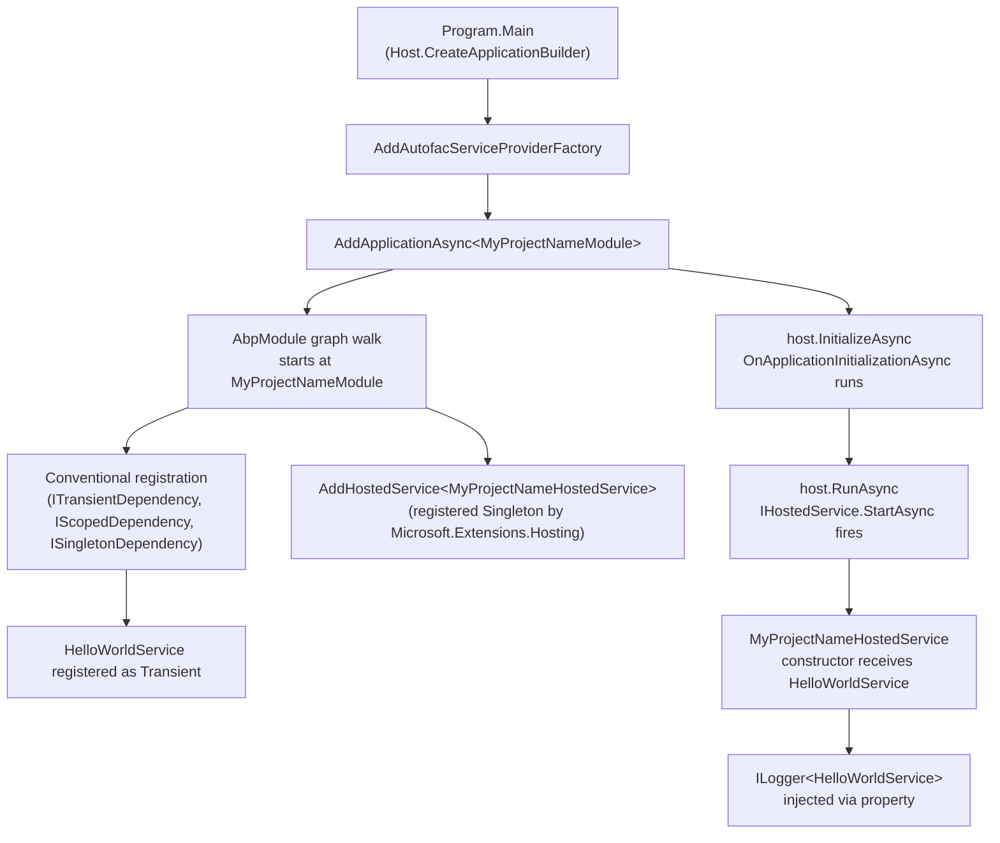

The `templates/console/` directory is the smallest end-to-end ABP solution that ships with the framework. It is a **single project** (`MyCompanyName.MyProjectName.csproj`) that wires up Serilog, the generic `IHostBuilder`, Autofac, and the ABP module system, and then runs an `IHostedService` that consumes a transient service through constructor injection. Despite being seven files, it covers every concept a coding agent needs in order to understand how ABP integrates with non-web .NET hosts — including the rarely-documented direct `AbpApplicationFactory.Create<TModule>()` path used by short-lived utilities.

This page walks the entire tree, identifies the seams that the `abp new -t console` pipeline rewrites, and contrasts the two bootstrap shapes (`IHostBuilder` vs. direct factory) that you will see across ABP samples.

<Info>
  Generated by `abp new Acme.MyTool -t console`. See [Project creation](/cli/project-creation) for how the CLI rewrites `MyCompanyName.MyProjectName` into your own namespace, and [Templates overview](/templates/overview) for how this template fits next to `app`, `maui`, and `wpf`.
</Info>

## Project layout

```
templates/console/src/MyCompanyName.MyProjectName/
├── MyCompanyName.MyProjectName.csproj
├── Program.cs                       # Serilog + Host.CreateApplicationBuilder + AddApplicationAsync
├── MyProjectNameModule.cs           # AbpModule, DependsOn AbpAutofacModule
├── MyProjectNameHostedService.cs    # IHostedService that calls HelloWorldService
├── HelloWorldService.cs             # ITransientDependency sample
├── appsettings.json                 # MySettingName demo key
└── Properties/launchSettings.json
```

There is no `src` / `test` split, no `Domain` / `Application` layering, and no `HttpApi`. The console template exists to give you an ABP **module context** (so you can `DependsOn(...)` other modules and use the framework's DI conventions) inside an otherwise vanilla `Microsoft.Extensions.Hosting` app.

## `.csproj` — what the template actually compiles

```xml MyCompanyName.MyProjectName.csproj
<Project Sdk="Microsoft.NET.Sdk">

    <Import Project="..\..\common.props" />

    <PropertyGroup>
        <OutputType>Exe</OutputType>
        <TargetFramework>net10.0</TargetFramework>
        <Nullable>enable</Nullable>
    </PropertyGroup>

    <ItemGroup>
        <ProjectReference Include="..\..\..\..\framework\src\Volo.Abp.Autofac\Volo.Abp.Autofac.csproj" />
    </ItemGroup>

    <ItemGroup>
      <PackageReference Include="Microsoft.Extensions.Hosting" Version="10.0.2" />
      <PackageReference Include="Serilog.Extensions.Hosting" Version="9.0.0" />
      <PackageReference Include="Serilog.Extensions.Logging" Version="9.0.2" />
      <PackageReference Include="Serilog.Sinks.Async" Version="2.1.0" />
      <PackageReference Include="Serilog.Sinks.Console" Version="6.0.0" />
      <PackageReference Include="Serilog.Sinks.File" Version="7.0.0" />
    </ItemGroup>

    <ItemGroup>
        <Content Include="appsettings.json">
            <CopyToPublishDirectory>PreserveNewest</CopyToPublishDirectory>
            <CopyToOutputDirectory>Always</CopyToOutputDirectory>
        </Content>
        <Content Include="appsettings.secrets.json" Condition="Exists('appsettings.secrets.json')">
            <CopyToPublishDirectory>PreserveNewest</CopyToPublishDirectory>
            <CopyToOutputDirectory>Always</CopyToOutputDirectory>
        </Content>
    </ItemGroup>

</Project>
```

Observations that matter when porting the project out of the repo:

- `..\..\common.props` is the template's shared property file (target framework, NuGet feed config). When the CLI ships the template, `common.props` is collapsed into the `.csproj` so the generated project compiles standalone. If you copy the template manually, copy `common.props` too — or inline its contents.
- The only **non-package** reference is `Volo.Abp.Autofac`. The console template does not pull `Volo.Abp.Core` directly; Autofac transitively brings it in.
- `appsettings.secrets.json` is conditional — `AddAppSettingsSecretsJson()` in `Program.cs` reads it when present, mirroring the convention used by every other ABP host.

The `OutputType=Exe` plus `TargetFramework=net10.0` makes this a portable cross-platform binary; nothing in the template is Windows-specific.

## `Program.cs` — the IHostBuilder path

`Program.cs` is the file that defines the **recommended** way to bootstrap an ABP module inside a long-running .NET host. It uses `Host.CreateApplicationBuilder(args)` (the modern generic host) and then folds ABP in via `AddApplicationAsync`.

```csharp Program.cs
using System;
using System.Threading.Tasks;
using Microsoft.Extensions.Configuration;
using Microsoft.Extensions.DependencyInjection;
using Microsoft.Extensions.Hosting;
using Microsoft.Extensions.Logging;
using Serilog;
using Serilog.Events;
using Volo.Abp;

namespace MyCompanyName.MyProjectName;

public class Program
{
    public async static Task<int> Main(string[] args)
    {
        Log.Logger = new LoggerConfiguration()
#if DEBUG
            .MinimumLevel.Debug()
#else
            .MinimumLevel.Information()
#endif
            .MinimumLevel.Override("Microsoft", LogEventLevel.Information)
            .Enrich.FromLogContext()
            .WriteTo.Async(c => c.File("Logs/logs.txt"))
            .WriteTo.Async(c => c.Console())
            .CreateLogger();

        try
        {
            Log.Information("Starting console host.");

            var builder = Host.CreateApplicationBuilder(args);

            builder.Configuration.AddAppSettingsSecretsJson();
            builder.Logging.ClearProviders().AddSerilog();

            builder.ConfigureContainer(builder.Services.AddAutofacServiceProviderFactory());

            builder.Services.AddHostedService<MyProjectNameHostedService>();

            await builder.Services.AddApplicationAsync<MyProjectNameModule>();

            var host = builder.Build();

            await host.InitializeAsync();

            await host.RunAsync();

            return 0;
        }
        catch (Exception ex)
        {
            if (ex is HostAbortedException)
            {
                throw;
            }

            Log.Fatal(ex, "Host terminated unexpectedly!");
            return 1;
        }
        finally
        {
            Log.CloseAndFlush();
        }
    }
}
```

Read the entry method top-to-bottom:

<Steps>
  <Step title="Bootstrap Serilog before the host">
    Serilog is configured **before** anything ABP runs because module initialization itself logs. The `#if DEBUG` block keeps `Debug` level locally and `Information` in Release. Async sinks are used so that file I/O does not block the foreground thread, and `Log.CloseAndFlush()` in the `finally` block guarantees pending writes are flushed even on `HostAbortedException`.
  </Step>
  <Step title="Create the application builder">
    `Host.CreateApplicationBuilder(args)` returns the .NET 8+ `HostApplicationBuilder` — the slimmer replacement for `Host.CreateDefaultBuilder().ConfigureWebHostDefaults(...)`. It already loads `appsettings.json`, environment variables, and command-line args into `builder.Configuration` and writes them into `builder.Services` as `IConfiguration`.
  </Step>
  <Step title="Layer ABP conventions on top">
    Three calls do the actual ABP wiring:
    - `builder.Configuration.AddAppSettingsSecretsJson()` is an ABP extension that pulls `appsettings.secrets.json` if it exists. Use this for secrets you do not want in source control.
    - `builder.Logging.ClearProviders().AddSerilog()` swaps the default `Microsoft.Extensions.Logging` providers for Serilog so every `ILogger<T>` flows through the Serilog pipeline you configured above.
    - `builder.ConfigureContainer(builder.Services.AddAutofacServiceProviderFactory())` swaps Microsoft's default DI for Autofac. ABP modules depend on Autofac semantics (dynamic proxies for interceptors, property injection, conventional registration) — without this line `AbpAutofacModule` will throw at startup.
  </Step>
  <Step title="Register the hosted service">
    `builder.Services.AddHostedService<MyProjectNameHostedService>()` registers the worker that actually runs your code. ABP does **not** auto-discover `IHostedService` implementations — you wire them explicitly so that you control startup order.
  </Step>
  <Step title="Add the ABP application">
    `await builder.Services.AddApplicationAsync<MyProjectNameModule>()` is the async variant of `AddApplication<TModule>`. It walks the `[DependsOn]` graph starting at `MyProjectNameModule`, calls every module's `ConfigureServicesAsync` / `ConfigureServices`, and registers the resulting service collection with the builder. Nothing has **initialized** yet — that happens after `Build()`.
  </Step>
  <Step title="Build, initialize, run">
    `var host = builder.Build()` produces the `IHost`. `await host.InitializeAsync()` is the ABP extension that walks `OnPreApplicationInitializationAsync` → `OnApplicationInitializationAsync` → `OnPostApplicationInitializationAsync` across the module graph. **Only after that** does `await host.RunAsync()` start hosted services and block until the host shuts down.
  </Step>
</Steps>

<Warning>
  The order **must** be: `AddAutofacServiceProviderFactory` → `AddApplicationAsync` → `Build` → `InitializeAsync` → `RunAsync`. Calling `RunAsync` before `InitializeAsync` will start your `IHostedService` before ABP has had a chance to initialize modules, which leads to "service not registered" errors at runtime.
</Warning>

## The module class

`MyProjectNameModule` is a thin `AbpModule` that pulls `AbpAutofacModule` (required by the bootstrap above) and uses `OnApplicationInitializationAsync` to demonstrate how to reach the service provider during initialization.

```csharp MyProjectNameModule.cs
using System.Threading.Tasks;
using Microsoft.Extensions.Configuration;
using Microsoft.Extensions.DependencyInjection;
using Microsoft.Extensions.Hosting;
using Microsoft.Extensions.Logging;
using Volo.Abp;
using Volo.Abp.Autofac;
using Volo.Abp.Modularity;

namespace MyCompanyName.MyProjectName;

[DependsOn(
    typeof(AbpAutofacModule)
)]
public class MyProjectNameModule : AbpModule
{
    public override Task OnApplicationInitializationAsync(ApplicationInitializationContext context)
    {
        var logger = context.ServiceProvider.GetRequiredService<ILogger<MyProjectNameModule>>();
        var configuration = context.ServiceProvider.GetRequiredService<IConfiguration>();
        logger.LogInformation($"MySettingName => {configuration["MySettingName"]}");

        var hostEnvironment = context.ServiceProvider.GetRequiredService<IHostEnvironment>();
        logger.LogInformation($"EnvironmentName => {hostEnvironment.EnvironmentName}");

        return Task.CompletedTask;
    }
}
```

Things worth pointing out for agents extending this module:

- **`[DependsOn]` is the only knob.** Every other ABP module you add — `AbpEventBusRabbitMqModule`, `AbpHttpClientModule`, `AbpBackgroundJobsModule` — goes inside this attribute. The module graph is walked exactly once at startup.
- **`OnApplicationInitializationAsync` runs after all services are registered**, so it is the right place to: warm caches, run a one-off seeder, log resolved configuration, or kick off background work that needs the full container.
- **`context.ServiceProvider` is the root provider.** It is fine to resolve singletons and `IConfiguration` here; if you need a scoped service, create a scope with `context.ServiceProvider.CreateScope()` first.
- The `appsettings.json` shipped with the template contains `{ "MySettingName": "MySettingValue" }` precisely so the log line above prints something interesting on first run — it's the smoke test that proves configuration binding works.

## Transient services via attribute-less registration

`HelloWorldService` shows the ABP convention for letting the framework discover and register services:

```csharp HelloWorldService.cs
using System.Threading.Tasks;
using Microsoft.Extensions.Logging;
using Microsoft.Extensions.Logging.Abstractions;
using Volo.Abp.DependencyInjection;

namespace MyCompanyName.MyProjectName;

public class HelloWorldService : ITransientDependency
{
    public ILogger<HelloWorldService> Logger { get; set; }

    public HelloWorldService()
    {
        Logger = NullLogger<HelloWorldService>.Instance;
    }

    public Task SayHelloAsync()
    {
        Logger.LogInformation("Hello World!");
        return Task.CompletedTask;
    }
}
```

Three patterns are at work simultaneously:

1. **Marker interface registration.** `ITransientDependency` (from `Volo.Abp.DependencyInjection`) tells `AbpServiceCollectionExtensions.AddType` to register this class with `ServiceLifetime.Transient` during the conventional registration pass. There is no `services.AddTransient<HelloWorldService>()` call anywhere — the module walks the assembly and registers everything that implements `ITransientDependency`, `IScopedDependency`, or `ISingletonDependency`. The other lifetime marker interfaces register their respective scopes.
2. **Property injection for the logger.** `Logger` is a `public` settable property, not a constructor parameter. ABP's Autofac integration injects properties whose type starts with `ILogger<>` after construction. The constructor seeds the property with `NullLogger<T>.Instance` so the class is testable without any container at all — the "null-object-default + property-injection" pattern that runs through the entire ABP codebase.
3. **Async-by-default API surface.** Even though this method does no I/O, it returns `Task` — the convention used everywhere in the framework so that consumers can `await` without re-platforming when the implementation grows real work.

## The hosted service: consuming the module

`MyProjectNameHostedService` is the bridge between the .NET host's `IHostedService` contract and your ABP services. Because it is registered via `AddHostedService<T>` (a `Microsoft.Extensions.DependencyInjection` call), .NET resolves it as a singleton from the **root** service provider — which is the same provider ABP just populated.

```csharp MyProjectNameHostedService.cs
using System.Threading;
using System.Threading.Tasks;
using Microsoft.Extensions.Hosting;
using Volo.Abp;

namespace MyCompanyName.MyProjectName;

public class MyProjectNameHostedService : IHostedService
{
    private readonly HelloWorldService _helloWorldService;

    public MyProjectNameHostedService(HelloWorldService helloWorldService)
    {
        _helloWorldService = helloWorldService;
    }

    public async Task StartAsync(CancellationToken cancellationToken)
    {
        await _helloWorldService.SayHelloAsync();
    }

    public Task StopAsync(CancellationToken cancellationToken)
    {
        return Task.CompletedTask;
    }
}
```

Two things to notice:

- **The hosted service depends on a transient `HelloWorldService` directly.** That works because `MyProjectNameHostedService` itself is a singleton — the captive-dependency rule (don't inject transients into singletons) applies only when the inner service needs per-request state. Here the inner service is stateless, so capturing it is fine. If `HelloWorldService` were `IScopedDependency`, you would need to inject `IServiceScopeFactory` and create a scope inside `StartAsync` instead.
- **`StartAsync` runs after `InitializeAsync`**, so by the time the body executes every ABP module's `OnApplicationInitializationAsync` has completed and `HelloWorldService` is fully registered.

## The other path — direct `AbpApplicationFactory.Create<TModule>()`

The console template uses `IHostBuilder` because it intends to be a **long-running** host that responds to lifetime signals (`SIGTERM`, Ctrl+C, `IHostApplicationLifetime`). The other ABP bootstrap shape — `AbpApplicationFactory.Create<TModule>()` — is the right choice for **short-lived utilities** that don't want the cost of a host. The [WPF template](/templates/wpf) uses this path because WPF owns the message loop and ABP only needs to live for the application's lifetime, not drive it.

The two shapes side-by-side:

| Aspect | `IHostBuilder` path (this template) | `AbpApplicationFactory.Create` path |
| --- | --- | --- |
| Entry call | `Host.CreateApplicationBuilder(args)` then `AddApplicationAsync<T>` | `AbpApplicationFactory.CreateAsync<T>(options => ...)` |
| Service provider ownership | Owned by `IHost` | Owned by `IAbpApplicationWithInternalServiceProvider` |
| Initialization | `await host.InitializeAsync()` (ABP extension) | `await application.InitializeAsync()` |
| Lifetime signals | `IHostApplicationLifetime` + `host.RunAsync()` blocks | You drive shutdown manually via `await application.ShutdownAsync()` |
| Hosted services | `AddHostedService<T>` registers and runs them | Not run — `IHostedService` instances are ignored |
| Best fit | Workers, CLIs that loop, scheduled jobs | One-shot utilities, integration with foreign main loops like WPF / MAUI |
| Autofac toggle | `builder.ConfigureContainer(builder.Services.AddAutofacServiceProviderFactory())` | `options.UseAutofac()` |

A direct-factory equivalent of the same console template would look like this — note that there is no `IHostedService` and no `RunAsync`:

```csharp Program.cs (direct factory variant)
using System;
using System.Threading.Tasks;
using Microsoft.Extensions.DependencyInjection;
using Volo.Abp;

namespace MyCompanyName.MyProjectName;

public static class Program
{
    public static async Task<int> Main(string[] args)
    {
        using var application = await AbpApplicationFactory.CreateAsync<MyProjectNameModule>(options =>
        {
            options.UseAutofac();
            options.Services.AddLogging(builder => builder.AddConsole());
        });

        await application.InitializeAsync();

        var helloWorldService = application.ServiceProvider
            .GetRequiredService<HelloWorldService>();
        await helloWorldService.SayHelloAsync();

        await application.ShutdownAsync();
        return 0;
    }
}
```

When to pick which:

<Tabs>
  <Tab title="Pick IHostBuilder when…">
    - You want `IHostedService` workers, scheduled jobs, or `BackgroundService` subclasses.
    - You want graceful shutdown wired to OS signals automatically.
    - You expect to add Kestrel, gRPC, or other web pieces later.
    - You want `dotnet user-secrets`, environment-variable configuration providers, and the conventional `appsettings.{Environment}.json` cascade for free.
  </Tab>
  <Tab title="Pick AbpApplicationFactory directly when…">
    - The program is a one-shot script that does work and exits.
    - You are embedding ABP inside a non-host framework that owns its own main loop (WPF, WinForms, MAUI, Avalonia, a Roslyn analyzer).
    - You want the smallest possible startup time and do not need the `IHost` lifecycle.
  </Tab>
</Tabs>

## The DI pattern, end-to-end

Putting all four files together produces the ABP-canonical dependency-injection picture:



Three takeaways for agents writing or extending console hosts:

1. **You never call `services.AddTransient<HelloWorldService>()`.** The marker interface plus `AddApplicationAsync` does it.
2. **You never wire `ILogger<HelloWorldService>` explicitly.** Property injection finds it because Autofac is in charge.
3. **You never need to override `ConfigureServices` in the module class for simple cases.** The conventional registration pass is enough.

If you do need to override `ConfigureServices` — say to call `Configure<TOptions>(...)`, register a typed `HttpClient`, or set up `Volo.Abp.BackgroundJobs` — the pattern mirrors what other templates do:

```csharp MyProjectNameModule.cs (overriding ConfigureServices)
public override void ConfigureServices(ServiceConfigurationContext context)
{
    Configure<AbpBackgroundJobOptions>(options =>
    {
        options.IsJobExecutionEnabled = true;
    });

    context.Services.AddHttpClient("MyApi", client =>
    {
        client.BaseAddress = new Uri(
            context.Services.GetConfiguration()["RemoteServices:MyApi:BaseUrl"]!);
    });
}
```

`context.Services.GetConfiguration()` is the ABP extension that reaches into the pre-built service collection for the `IConfiguration` instance — useful because at `ConfigureServices` time there is no service provider yet.

## Adapting the template

Common modifications and the cheapest way to make them:

| Goal | What to change |
| --- | --- |
| Read connection strings from secret store | Add `AbpAspNetCoreSerilogModule`'s pattern: drop an `appsettings.secrets.json`, the existing `AddAppSettingsSecretsJson()` call already picks it up. |
| Call a remote HTTP API | `DependsOn(typeof(AbpHttpClientModule))` and `context.Services.AddHttpClientProxies(typeof(IMyService).Assembly, "MyRemoteService")`. |
| Run a scheduled job | `DependsOn(typeof(AbpBackgroundJobsModule))` and replace `MyProjectNameHostedService` with `BackgroundJobManager.EnqueueAsync(...)` calls in `OnApplicationInitializationAsync`. |
| Convert to a short-lived utility | Replace `Program.cs` with the `AbpApplicationFactory.CreateAsync` variant shown above; drop the `IHostedService`. |
| Add a second worker | Define another `IHostedService` and `builder.Services.AddHostedService<TSecond>()` — order is registration order. |
| Read tenant-specific settings | `DependsOn(typeof(AbpSettingManagementApplicationModule))` and inject `ISettingProvider`. |

## Where this template fits

- **Templates index:** [Templates overview](/templates/overview) maps every `-t` flag to a directory; `-t console` points here.
- **CLI:** [CLI overview](/cli/overview) covers `abp new`, `abp install-libs`, and adjacent commands. [Project creation](/cli/project-creation) describes the `ProjectBuildContext` pipeline that copies `templates/console/` into your output directory and rewrites `MyCompanyName.MyProjectName` to your namespace.
- **Sibling client-app templates:** [MAUI template](/templates/maui) for cross-platform mobile / desktop UI, [WPF template](/templates/wpf) for Windows-only desktop. Both reuse the same `[DependsOn(typeof(AbpAutofacModule))]` module pattern but bootstrap ABP differently.
