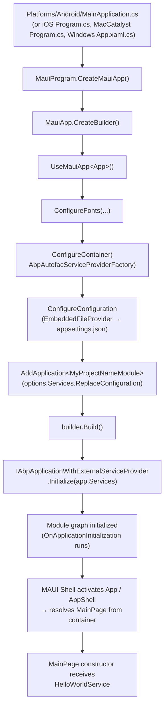

The `templates/maui/` directory is the ABP starter for **.NET MAUI** — a single project that targets Android, iOS, MacCatalyst, Windows (and optionally Tizen) and runs the ABP module system inside the MAUI host. The interesting parts are concentrated in `MauiProgram.cs`, which differs from a vanilla MAUI app in three places: it swaps Autofac in via `ConfigureContainer`, it loads `appsettings.json` from an embedded resource, and it calls `AddApplication<TModule>` followed by a manual `Initialize(...)` against the `IServiceProvider` MAUI hands back.

Every other file (`App.xaml`, `AppShell.xaml`, `MainPage.xaml(.cs)`) is intentionally plain — the template's job is to show **how ABP and MAUI cohabit**, not to ship a UI framework. This page walks the entire tree, points out the seams the `abp new -t maui` pipeline rewrites, and explains how to extend the template into something that talks to an `HttpApi.Host` backend using `AbpMauiClientModule` and HTTP client proxies.

<Info>
  Generated by `abp new Acme.Mobile -t maui`. See [Templates overview](/templates/overview) for the catalogue of `-t` values, [Project creation](/cli/project-creation) for the rename pipeline, and [MAUI client UI](/ui/maui-client) for the deeper UI-layer integration that goes on top of this template.
</Info>

## Project layout

```
templates/maui/src/MyCompanyName.MyProjectName/
├── MyCompanyName.MyProjectName.csproj   # Multi-TFM (net10.0 + android + ios + maccatalyst [+ windows])
├── MauiProgram.cs                       # MauiApp.CreateBuilder + ABP wiring
├── MyProjectNameModule.cs               # AbpModule, DependsOn AbpAutofacModule
├── App.xaml(.cs)                        # MAUI application root
├── AppShell.xaml(.cs)                   # Shell navigation host
├── MainPage.xaml(.cs)                   # ISingletonDependency page with HelloWorldService injected
├── HelloWorldService.cs                 # ITransientDependency sample
├── appsettings.json                     # Embedded resource; { "AppName": "MyProjectName" }
├── Platforms/                           # Android / iOS / MacCatalyst / Windows / Tizen heads
│   ├── Android/{AndroidManifest.xml, MainActivity.cs, MainApplication.cs, Resources/values/colors.xml}
│   ├── iOS/{AppDelegate.cs, Info.plist, Program.cs}
│   ├── MacCatalyst/{AppDelegate.cs, Info.plist, Program.cs}
│   ├── Tizen/{Main.cs, tizen-manifest.xml}
│   └── Windows/{App.xaml(.cs), Package.appxmanifest, app.manifest}
├── Properties/launchSettings.json
└── Resources/                           # Fonts, AppIcon, Splash, Images, Raw, Styles (Colors.xaml, Styles.xaml)
```

The `Platforms/` heads are pristine MAUI defaults — they call into `MauiProgram.CreateMauiApp()` and otherwise contribute nothing ABP-specific. The whole ABP integration lives in five C# files at the project root.

## `.csproj` — multi-target framework, single project

```xml MyCompanyName.MyProjectName.csproj
<Project Sdk="Microsoft.NET.Sdk">

    <Import Project="..\..\common.props" />

    <PropertyGroup>
        <TargetFrameworks>net10.0;net10.0-android;net10.0-ios;net10.0-maccatalyst</TargetFrameworks>
        <TargetFrameworks Condition="$([MSBuild]::IsOSPlatform('windows'))">$(TargetFrameworks);net10.0-windows10.0.19041.0</TargetFrameworks>
        <!-- Uncomment to also build the tizen app. -->
        <!-- <TargetFrameworks>$(TargetFrameworks);net10.0-tizen</TargetFrameworks> -->
        <Nullable>enable</Nullable>
        <OutputType>Exe</OutputType>
        <RootNamespace>MyCompanyName.MyProjectName</RootNamespace>
        <UseMaui>true</UseMaui>
        <SingleProject>true</SingleProject>
        <ImplicitUsings>enable</ImplicitUsings>

        <ApplicationTitle>MyCompanyName.MyProjectName</ApplicationTitle>
        <ApplicationId>com.mycompanyname.myprojectname</ApplicationId>
        <ApplicationIdGuid>27317750-B571-4690-B433-B358B2480E01</ApplicationIdGuid>
        <ApplicationDisplayVersion>1.0</ApplicationDisplayVersion>
        <ApplicationVersion>1</ApplicationVersion>
    </PropertyGroup>

    <ItemGroup>
        <ProjectReference Include="..\..\..\..\framework\src\Volo.Abp.Autofac\Volo.Abp.Autofac.csproj" />
        <PackageReference Include="Microsoft.Extensions.FileProviders.Embedded" Version="10.0.2" />
    </ItemGroup>

    <ItemGroup>
        <MauiIcon Include="Resources\AppIcon\appicon.svg" ForegroundFile="Resources\AppIcon\appiconfg.svg" Color="#512BD4" />
        <MauiSplashScreen Include="Resources\Splash\splash.svg" Color="#512BD4" BaseSize="128,128" />
        <MauiImage Include="Resources\Images\*" />
        <MauiImage Update="Resources\Images\dotnet_bot.svg" BaseSize="168,208" />
        <MauiFont Include="Resources\Fonts\*" />
        <MauiAsset Include="Resources\Raw\**" LogicalName="%(RecursiveDir)%(Filename)%(Extension)" />
    </ItemGroup>

    <ItemGroup>
        <None Remove="appsettings.json" />
        <EmbeddedResource Include="appsettings.json" />
    </ItemGroup>

</Project>
```

Key choices the template makes:

- **`Volo.Abp.Autofac` is the only ABP reference.** It transitively brings `Volo.Abp.Core` and the conventional-registration pipeline. Add additional ABP modules (`Volo.Abp.Http.Client`, `Volo.Abp.Maui.Client`, …) only when you actually need them — keeping startup time small on mobile matters.
- **`Microsoft.Extensions.FileProviders.Embedded`** is the package that lets `EmbeddedFileProvider` find `appsettings.json` inside the assembly. Mobile apps cannot rely on a file on disk next to the executable the way a desktop or server app can; embedding the JSON into the assembly avoids per-platform `MauiAsset` plumbing for configuration.
- **`<EmbeddedResource Include="appsettings.json" />`** combined with the matching `None Remove` line is what swaps the file from a copy-to-output `Content` item into an embedded resource. `MauiProgram.ConfigureConfiguration` (below) reads it back through `EmbeddedFileProvider`.
- **`SingleProject=true`** means the same `.csproj` produces the head for every platform — no separate Android / iOS projects. That is also why the `Platforms/` folders only contain the platform-bootstrap shims, not full application code.

## `MauiProgram.cs` — the ABP wiring

This file is the single most important one in the template. Everything that makes the MAUI app ABP-aware happens here.

```csharp MauiProgram.cs
using System.Reflection;
using Microsoft.Extensions.Configuration;
using Microsoft.Extensions.FileProviders;
using Volo.Abp;
using Volo.Abp.Autofac;

namespace MyCompanyName.MyProjectName;

public static class MauiProgram
{
    public static MauiApp CreateMauiApp()
    {
        var builder = MauiApp.CreateBuilder();
        builder
            .UseMauiApp<App>()
            .ConfigureFonts(fonts =>
            {
                fonts.AddFont("OpenSans-Regular.ttf", "OpenSansRegular");
                fonts.AddFont("OpenSans-Semibold.ttf", "OpenSansSemibold");
            })
            .ConfigureContainer(new AbpAutofacServiceProviderFactory(new Autofac.ContainerBuilder()));

        ConfigureConfiguration(builder);

        builder.Services.AddApplication<MyProjectNameModule>(options =>
        {
            options.Services.ReplaceConfiguration(builder.Configuration);
        });

        var app = builder.Build();

        app.Services.GetRequiredService<IAbpApplicationWithExternalServiceProvider>().Initialize(app.Services);

        return app;
    }

    private static void ConfigureConfiguration(MauiAppBuilder builder)
    {
        var assembly = typeof(App).GetTypeInfo().Assembly;
        builder.Configuration.AddJsonFile(new EmbeddedFileProvider(assembly), "appsettings.json", optional: false, false);
    }
}
```

There are five distinct steps. They run in this order intentionally — moving any of them will break the bootstrap.

<Steps>
  <Step title="Create the MAUI builder and pick the App root">
    `MauiApp.CreateBuilder()` is the MAUI equivalent of `Host.CreateApplicationBuilder` — it returns a `MauiAppBuilder` with `IConfigurationManager`, `IServiceCollection`, and `IMauiHandlersCollection` pre-wired. `UseMauiApp<App>()` registers `App` (the `Microsoft.Maui.Controls.Application` subclass) as the root that will be activated per-platform.
  </Step>
  <Step title="Register fonts">
    Standard MAUI — `OpenSans-Regular` / `OpenSans-Semibold` ship in `Resources/Fonts/` as `MauiFont` items and are mapped to logical names the XAML can reference.
  </Step>
  <Step title="Swap in the Autofac service provider factory">
    `ConfigureContainer(new AbpAutofacServiceProviderFactory(new Autofac.ContainerBuilder()))` is the line that makes ABP modules work. MAUI's default DI is `Microsoft.Extensions.DependencyInjection`; ABP modules require Autofac semantics (interceptors, conventional registration, property injection). The factory is built **before** `AddApplication` so that when ABP discovers services, it can register them against the right container.
  </Step>
  <Step title="Load embedded configuration">
    `ConfigureConfiguration(builder)` instantiates an `EmbeddedFileProvider` pointing at the project's assembly and registers `appsettings.json` as a non-optional source. The file appears as an embedded resource thanks to the `.csproj` settings above. Because configuration is added **before** `AddApplication`, the value of `IConfiguration` ABP sees is already populated.
  </Step>
  <Step title="Register the ABP application and connect IConfiguration">
    `builder.Services.AddApplication<MyProjectNameModule>(options =>{ options.Services.ReplaceConfiguration(builder.Configuration); })` walks the module graph, runs `ConfigureServices` on every module, and crucially **replaces** the `IConfiguration` registered in the service collection with the one MAUI's builder owns. Without `ReplaceConfiguration`, ABP modules would resolve a *different* `IConfiguration` instance than the rest of the MAUI app.
  </Step>
  <Step title="Build and initialize against the external service provider">
    `var app = builder.Build()` produces the `MauiApp`. ABP cannot call `host.InitializeAsync()` here because MAUI owns the service provider — instead the template resolves `IAbpApplicationWithExternalServiceProvider` and calls `Initialize(app.Services)`. That triggers the `OnPreApplicationInitialization` → `OnApplicationInitialization` → `OnPostApplicationInitialization` walk against the MAUI-owned container.
  </Step>
</Steps>

<Warning>
  `Initialize(...)` here is the **synchronous** overload. If you need to do async work in module initialization (for example calling `MauiCachedApplicationConfigurationClient.InitializeAsync()` from `AbpMauiClientModule`), use the async overload and await it inside a `Task.Run` from a platform startup hook, or override `OnApplicationInitializationAsync` and let MAUI's startup pipeline marshal it.
</Warning>

## The module class — minimal on purpose

```csharp MyProjectNameModule.cs
using Volo.Abp.Autofac;
using Volo.Abp.Modularity;

namespace MyCompanyName.MyProjectName;

[DependsOn(typeof(AbpAutofacModule))]
public class MyProjectNameModule : AbpModule
{
}
```

That is the entire file. It pulls `AbpAutofacModule` (required because of the `AbpAutofacServiceProviderFactory` registered above) and otherwise relies on conventional registration to discover `HelloWorldService` and `MainPage` from the assembly.

When you start adding ABP capabilities to the template, this is the class you grow. The most common additions for a MAUI client are listed below.

## XAML pieces

`App.xaml.cs` is the MAUI application root. It instantiates `AppShell` as the `MainPage`:

```csharp App.xaml.cs
namespace MyCompanyName.MyProjectName;

public partial class App : Application
{
    public App()
    {
        InitializeComponent();
        MainPage = new AppShell();
    }
}
```

`AppShell.xaml` is a single-route shell pointing at `MainPage`:

```xml AppShell.xaml
<?xml version="1.0" encoding="UTF-8" ?>
<Shell
    x:Class="MyCompanyName.MyProjectName.AppShell"
    xmlns="http://schemas.microsoft.com/dotnet/2021/maui"
    xmlns:x="http://schemas.microsoft.com/winfx/2009/xaml"
    xmlns:local="clr-namespace:MyCompanyName.MyProjectName"
    Shell.FlyoutBehavior="Disabled">

    <ShellContent
        Title="Home"
        ContentTemplate="{DataTemplate local:MainPage}"
        Route="MainPage" />

</Shell>
```

`MainPage.xaml` is the standard MAUI starter content (image, label, click counter) with one ABP twist: the `HelloLab` label is set from `HelloWorldService.SayHello()`:

```xml MainPage.xaml
<?xml version="1.0" encoding="utf-8" ?>
<ContentPage xmlns="http://schemas.microsoft.com/dotnet/2021/maui"
             xmlns:x="http://schemas.microsoft.com/winfx/2009/xaml"
             x:Class="MyCompanyName.MyProjectName.MainPage">
    <ScrollView>
        <VerticalStackLayout Spacing="25" Padding="30,0" VerticalOptions="Center">
            <Image Source="dotnet_bot.png" HeightRequest="200" HorizontalOptions="Center" />
            <Label x:Name="HelloLab" Text="Loading..." FontSize="32" HorizontalOptions="Center" />
            <Label Text="Welcome! This is a MAUI startup template for the ABP Framework"
                   FontSize="18" HorizontalOptions="Center" />
            <Button x:Name="CounterBtn" Text="Click me"
                    Clicked="OnCounterClicked" HorizontalOptions="Center" />
        </VerticalStackLayout>
    </ScrollView>
</ContentPage>
```

## Pages as DI participants

`MainPage.xaml.cs` is where the ABP integration shows up in user-facing code. The page is registered as `ISingletonDependency` and takes a `HelloWorldService` through its constructor:

```csharp MainPage.xaml.cs
using Volo.Abp.DependencyInjection;

namespace MyCompanyName.MyProjectName;

public partial class MainPage : ContentPage, ISingletonDependency
{
    private readonly HelloWorldService _helloWorldService;
    int count = 0;

    public MainPage(HelloWorldService helloWorldService)
    {
        _helloWorldService = helloWorldService;
        InitializeComponent();
        SetHelloLabText();
    }

    private void SetHelloLabText()
    {
        HelloLab.Text = _helloWorldService.SayHello();
    }

    private void OnCounterClicked(object sender, EventArgs e)
    {
        count++;

        if (count == 1)
            CounterBtn.Text = $"Clicked {count} time";
        else
            CounterBtn.Text = $"Clicked {count} times";

        SemanticScreenReader.Announce(CounterBtn.Text);
    }
}
```

Three patterns to notice:

1. **`ISingletonDependency` on a page.** This makes the page a singleton in the container. MAUI's Shell will resolve it from the service provider via `DataTemplate` whenever `Route="MainPage"` is activated. Singleton lifetime is fine for the template because there is exactly one MainPage; if you intend to navigate to a fresh instance per visit, use `ITransientDependency` or register the page explicitly with `services.AddTransient<MainPage>()` in `MyProjectNameModule.ConfigureServices` and drop the marker interface.
2. **Constructor injection of `HelloWorldService`.** Works because of the conventional registration: `HelloWorldService` implements `ITransientDependency` and is therefore auto-registered. Autofac resolves the page constructor at MAUI's `DataTemplate` instantiation time.
3. **No view-model in the starter.** The template is deliberately MVU-flavoured — the page touches the controls directly. When you scale up, introduce a `MainPageViewModel` (also marked `ITransientDependency`), have the page constructor accept it, and bind XAML against `BindingContext`. The MAUI client UI page documents the recommended layering in detail.

### View-model upgrade sketch

For agents extending the template, the canonical next step is to introduce view-models. The shape mirrors the ABP MVC + MVVM convention used in the Blazor templates:

```csharp Sample MainPageViewModel.cs
using System.ComponentModel;
using System.Runtime.CompilerServices;
using Volo.Abp.DependencyInjection;

namespace MyCompanyName.MyProjectName.ViewModels;

public class MainPageViewModel : INotifyPropertyChanged, ITransientDependency
{
    private readonly HelloWorldService _helloWorldService;

    public MainPageViewModel(HelloWorldService helloWorldService)
    {
        _helloWorldService = helloWorldService;
        Greeting = _helloWorldService.SayHello();
    }

    private string _greeting = string.Empty;
    public string Greeting
    {
        get => _greeting;
        set { _greeting = value; OnPropertyChanged(); }
    }

    public event PropertyChangedEventHandler? PropertyChanged;
    protected void OnPropertyChanged([CallerMemberName] string? name = null)
        => PropertyChanged?.Invoke(this, new PropertyChangedEventArgs(name));
}
```

```csharp Sample MainPage.xaml.cs binding the VM
public partial class MainPage : ContentPage, ISingletonDependency
{
    public MainPage(MainPageViewModel viewModel)
    {
        InitializeComponent();
        BindingContext = viewModel;
    }
}
```

```xml Sample MainPage.xaml binding the VM
<Label Text="{Binding Greeting}" FontSize="32" HorizontalOptions="Center" />
```

`ITransientDependency` on the view-model gives you a fresh instance on every page resolution.

## The transient service

```csharp HelloWorldService.cs
using Volo.Abp.DependencyInjection;

namespace MyCompanyName.MyProjectName;

public class HelloWorldService : ITransientDependency
{
    public string SayHello()
    {
        return "Hello, World!";
    }
}
```

Identical in shape to the service in the [console template](/templates/console) — `ITransientDependency` is what the conventional-registration pass keys off, and the constructor is parameterless because there is nothing to inject. When you turn this into something that calls a backend, the constructor will start receiving HTTP-client proxies (see below).

## Configuration

`appsettings.json` is intentionally tiny:

```json appsettings.json
{
  "AppName": "MyProjectName"
}
```

You read it through the normal `IConfiguration` injection. Because the file is an embedded resource and is loaded by `MauiProgram.ConfigureConfiguration`, the value is available in every platform head — Android, iOS, MacCatalyst, Windows — without any platform-specific copy step.

When you add backend URLs, secrets, or per-environment overrides, this is the file you grow:

```json appsettings.json (sketch)
{
  "AppName": "MyProjectName",
  "RemoteServices": {
    "Default": {
      "BaseUrl": "https://api.acme.com/"
    }
  },
  "AuthServer": {
    "Authority": "https://auth.acme.com/",
    "ClientId": "MyProjectName_Mobile",
    "Scope": "MyProjectName offline_access"
  }
}
```

## Talking to a backend — `AbpMauiClientModule` and `AddAbpHttpClient`

The template ships without backend integration so that the smoke test stays minimal. When you wire it to an ABP `HttpApi.Host`, the recipe combines three pieces from the framework:

| Piece | Lives in | Job |
| --- | --- | --- |
| `AbpMauiClientModule` | `framework/src/Volo.Abp.Maui.Client/Volo/Abp/Maui/Client/AbpMauiClientModule.cs` | Adds the MAUI-flavoured ABP client services on top of `AbpAspNetCoreMvcClientCommonModule`, including `MauiCachedApplicationConfigurationClient` for `/api/abp/application-configuration` caching. |
| `AbpHttpClientModule` | `framework/src/Volo.Abp.Http.Client/` | Provides `AddHttpClientProxies` and the dynamic-proxy infrastructure that turns `IRemoteService` interfaces into typed HTTP clients. |
| `Application.Contracts` from your backend | The remote API's contract assembly | Source of the `IApplicationService` interfaces you want to call from the device. |

`AbpMauiClientModule` itself is small — it depends on `AbpAspNetCoreMvcClientCommonModule` and warms the cached application-configuration client during initialization:

```csharp AbpMauiClientModule.cs (framework)
using System.Threading.Tasks;
using Microsoft.Extensions.DependencyInjection;
using Volo.Abp.AspNetCore.Mvc.Client;
using Volo.Abp.DependencyInjection;
using Volo.Abp.Modularity;

namespace Volo.Abp.Maui.Client;

[DependsOn(
    typeof(AbpAspNetCoreMvcClientCommonModule)
)]
public class AbpMauiClientModule : AbpModule
{
    public async Task OnApplicationInitializationAsync(ApplicationInitializationContext context)
    {
        await context.ServiceProvider
            .GetRequiredService<IClientScopeServiceProviderAccessor>().ServiceProvider
            .GetRequiredService<MauiCachedApplicationConfigurationClient>()
            .InitializeAsync();
    }
}
```

Wire the three pieces into `MyProjectNameModule`:

```csharp MyProjectNameModule.cs (with backend client)
using Microsoft.Extensions.DependencyInjection;
using Volo.Abp.Autofac;
using Volo.Abp.Http.Client;
using Volo.Abp.Maui.Client;
using Volo.Abp.Modularity;
using MyCompanyName.MyProjectName.HttpApi.Client;

namespace MyCompanyName.MyProjectName;

[DependsOn(
    typeof(AbpAutofacModule),
    typeof(AbpHttpClientModule),
    typeof(AbpMauiClientModule),
    typeof(MyProjectNameHttpApiClientModule) // generated by your backend
)]
public class MyProjectNameModule : AbpModule
{
    public override void ConfigureServices(ServiceConfigurationContext context)
    {
        var configuration = context.Services.GetConfiguration();

        Configure<AbpRemoteServiceOptions>(options =>
        {
            options.RemoteServices.Default = new RemoteServiceConfiguration(
                configuration["RemoteServices:Default:BaseUrl"]!
            );
        });

        context.Services.AddHttpClientProxies(
            typeof(MyProjectNameHttpApiClientModule).Assembly,
            remoteServiceConfigurationName: "Default"
        );
    }
}
```

The pieces above unpack as follows:

- **`AbpRemoteServiceOptions.RemoteServices.Default`** is the URL the dynamic proxies will dial. `Default` is the conventional name; you can register multiple remote services with different keys and point individual proxy assemblies at each.
- **`AddHttpClientProxies(assembly, "Default")`** is the framework's helper that scans the assembly for `IRemoteService`-derived interfaces and registers a typed `HttpClient`-backed implementation for each, named after the configuration key. This is the call usually referred to as "AddAbpHttpClient proxies" — it lets MAUI pages call `IBookAppService.GetListAsync()` and have the request serialize, hit the API, deserialize, and surface exceptions as `AbpRemoteCallException`.
- **`AbpMauiClientModule`** layers MAUI-aware client conventions on top — most importantly the cached `IAbpApplicationConfigurationClient` that primes UI state with permissions / settings / current-user info from `/api/abp/application-configuration` and persists it across launches.

Then any page or view-model can inject the proxy directly:

```csharp Page with proxy injection
public partial class BookListPage : ContentPage, ITransientDependency
{
    private readonly IBookAppService _bookAppService;

    public BookListPage(IBookAppService bookAppService)
    {
        _bookAppService = bookAppService;
        InitializeComponent();
    }

    protected override async void OnAppearing()
    {
        base.OnAppearing();
        var books = await _bookAppService.GetListAsync(new PagedAndSortedResultRequestDto());
        BooksList.ItemsSource = books.Items;
    }
}
```

<Info>
  The full MAUI client integration — authentication via OpenID Connect, secure token storage, multi-tenancy headers, exception handling — is documented in [MAUI client UI](/ui/maui-client). This template page covers only the bootstrapping; that page covers what to build on top of it.
</Info>

## How initialization actually flows



Two observations worth internalising:

1. **MAUI owns the container.** Unlike the console template (where `IHost` owns the provider and ABP just hooks into it), MAUI provides the `IServiceProvider` and ABP attaches to it via `IAbpApplicationWithExternalServiceProvider`. That is why the template calls `Initialize(app.Services)` instead of `await host.InitializeAsync()`.
2. **Page construction happens *after* module initialization.** The Shell does not resolve `MainPage` until the shell host activates the route, which happens after `CreateMauiApp` returns. By the time the constructor runs, every ABP module has finished initialization, so it is safe to depend on anything registered via `[DependsOn]`.

## Extending the template

| Goal | Minimal change |
| --- | --- |
| Add a backend client | `[DependsOn(typeof(AbpHttpClientModule), typeof(AbpMauiClientModule))]` plus `AddHttpClientProxies` in `ConfigureServices`. |
| Cross-platform secure storage for tokens | Inject `ISecureStorage` (MAUI Essentials) into an `IAccessTokenStore` implementation; depend on `Volo.Abp.AspNetCore.Components.WebAssembly.OpenIdConnect` patterns. |
| Per-environment configuration | Embed `appsettings.Development.json` alongside `appsettings.json` and add a second `AddJsonFile` call gated by a build constant or `IHostEnvironment`-equivalent. |
| Multi-tenancy header | `Configure<AbpRemoteServiceOptions>` and add a `__tenant` header via a delegating handler on the typed `HttpClient`. |
| View-models | Mark them `ITransientDependency`; inject into pages; assign to `BindingContext`. |
| Navigation parameters | Use Shell routes; resolve the destination page from the container with `Shell.Current.GoToAsync("RouteName")`. |
| Background sync | `DependsOn(typeof(AbpBackgroundJobsModule))` and host the worker via MAUI's `IPlatformApplication.Current.Services` from a platform `Application` callback. |

## Where this template fits

- **Templates index:** [Templates overview](/templates/overview) catalogues every `-t` flag — `-t maui` points here.
- **CLI:** [CLI overview](/cli/overview) covers `abp new` and friends; [Project creation](/cli/project-creation) explains the pipeline that copies this directory and rewrites `MyCompanyName.MyProjectName` into your namespace.
- **UI layer:** [MAUI client UI](/ui/maui-client) is the deep-dive on the client-side ABP services that build on top of this template — `AbpMauiClientModule`, `MauiCachedApplicationConfigurationClient`, secure-storage-backed token caches, and the OIDC flow.
- **Sibling client templates:** [Console template](/templates/console) for non-UI .NET hosts, [WPF template](/templates/wpf) for Windows-only desktop. Both share the `[DependsOn(typeof(AbpAutofacModule))]` module pattern but bootstrap ABP differently — the WPF template, in particular, uses `AbpApplicationFactory.Create` directly because WPF owns the message loop.
