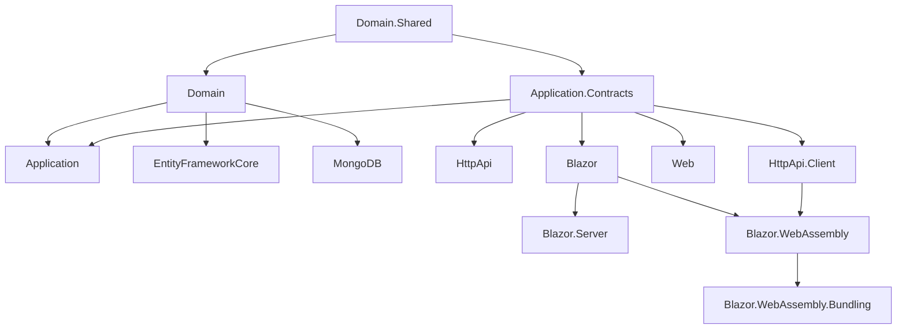

The `templates/module/` directory at the root of [`abpframework/abp`](https://github.com/abpframework/abp/tree/dev/templates/module) is the physical source of every **reusable ABP module solution** the CLI produces. When you run `abp new Acme.IssueTracking -t module`, the CLI copies this tree verbatim, replaces `MyCompanyName.MyProjectName` with your namespace, optionally trims projects for the UI / database flags you passed, and hands back a zip. Unlike the [application template](/templates/app), the output is not an *app* — it is a **module library + host shells**: a shippable, NuGet-ready ABP module plus a set of minimal host applications you use to develop, debug, and demo it in isolation before plugging it into a consuming app.

Conceptually the template encodes one rule: a module is a stack of side-by-side layered packages, each layered package can be referenced independently, and the dependency direction always flows from outer layers (Web, HttpApi, EntityFrameworkCore, MongoDB) toward the core (Domain.Shared). Consumers of your module pick exactly the layers they need — an `HttpApi.Host` shell takes `Application` and `EntityFrameworkCore`; a Blazor WebAssembly client takes `HttpApi.Client` and `Blazor.WebAssembly`; a unified web app takes everything. The host apps inside `templates/module/aspnet-core/host/` are the proof: each one is a different *consumer shape* for the same module.

<Info>
  This page documents what the template actually emits, project by project. For the *overall* template catalog (app, module, microservice, console, …) and the `abp new` flags that select between them, see [Templates overview](/templates/overview). For how the CLI walks pipeline steps to delete unused projects and rewrite namespaces, see [Project creation](/cli/project-creation). For the pre-built modules ABP ships (Identity, Tenant Management, CMS Kit, …) that were themselves authored from this template, see [Modules overview](/modules/overview).
</Info>

## What `abp new -t module` produces

The flag `-t module` selects this template. The output mirrors the source tree below `templates/module/aspnet-core/` plus an optional `angular/` sibling library when `-u angular` is requested:

```text
Acme.IssueTracking/
├── aspnet-core/
│   ├── Acme.IssueTracking.abpmdl      # module manifest read by abp tooling
│   ├── Acme.IssueTracking.abpsln      # solution manifest pointing at the .abpmdl
│   ├── Acme.IssueTracking.slnx        # .NET solution (slnx format)
│   ├── common.props                   # shared MSBuild props (TFM, nullable, etc.)
│   ├── NuGet.Config
│   ├── docker-compose.yml             # host + db dev compose
│   ├── database/                      # SQL init scripts
│   ├── src/                           # the module itself — 13 projects
│   ├── host/                          # 8 host shells that consume src/
│   └── test/                          # 6 test projects
└── angular/                           # optional Angular library + dev-app
    └── projects/
        ├── my-project-name/           # ng-packagr library (renamed)
        └── dev-app/                   # local Angular host for the library
```

The `.abpmdl` file is the canonical inventory of the module; the `.abpsln` simply points at it. Both formats are read by the ABP CLI (notably by `abp install`, `abp add-module`, and `abp suite`) and are the reason the CLI can treat a module solution as an installable unit instead of a loose pile of csprojs.

## Project dependency graph

The src/ projects form a strict DAG. Every arrow is a project reference; every project also declares the same edge as a `[DependsOn(typeof(...))]` on its `AbpModule` class.



Read top-to-bottom: each node depends on (uses) the nodes above it. The split is intentional — a microservice that only needs to *call* the module's APIs can reference `HttpApi.Client` and `Application.Contracts` and skip the `Domain`, `EntityFrameworkCore`, and `Web` projects entirely. An app that wants the UI but wires its own controllers references `Web` and `Application` and skips `HttpApi.Client`.

## The 13 source projects

Every project below lives under `templates/module/aspnet-core/src/MyCompanyName.MyProjectName.<Suffix>/`. Each has an `AbpModule` class named `MyProjectName<Suffix>Module` whose `[DependsOn]` attribute is the source of truth for the graph above.

### Core layers

| Project | Role | What lives here |
| --- | --- | --- |
| `Domain.Shared` | Primitives shared with every other layer and with external consumers | Enums, constants, error codes (`MyProjectNameErrorCodes`), localization resource class (`MyProjectNameResource`), embedded localization JSON under `Localization/MyProjectName/` |
| `Domain` | DDD domain model | Aggregate roots, entities, domain services, repository interfaces, settings under `Settings/`, `MyProjectNameDbProperties` (table prefix, schema, connection-string name) |
| `Application.Contracts` | Service interfaces and DTOs | `IApplicationService` interfaces, DTOs, permission definitions under `Permissions/` (`MyProjectNamePermissions`, `MyProjectNamePermissionDefinitionProvider`), `MyProjectNameRemoteServiceConsts` |
| `Application` | Application service implementations | `ApplicationService` subclasses, Mapperly profiles (`MyProjectNameApplicationMappers.cs`), object-mapping registration |

The `Domain.Shared` module is the only one no other layer can avoid — it owns the localization resource and the error-code namespace mapping, and its `ConfigureServices` registers both with the host:

```csharp Domain.Shared module wiring
[DependsOn(
    typeof(AbpValidationModule),
    typeof(AbpDddDomainSharedModule)
)]
public class MyProjectNameDomainSharedModule : AbpModule
{
    public override void ConfigureServices(ServiceConfigurationContext context)
    {
        Configure<AbpVirtualFileSystemOptions>(options =>
        {
            options.FileSets.AddEmbedded<MyProjectNameDomainSharedModule>();
        });

        Configure<AbpLocalizationOptions>(options =>
        {
            options.Resources
                .Add<MyProjectNameResource>("en")
                .AddBaseTypes(typeof(AbpValidationResource))
                .AddVirtualJson("/Localization/MyProjectName");
        });

        Configure<AbpExceptionLocalizationOptions>(options =>
        {
            options.MapCodeNamespace("MyProjectName", typeof(MyProjectNameResource));
        });
    }
}
```

The `Domain` module is intentionally bare — it only depends on `AbpDddDomainModule` and `Domain.Shared`. Aggregates, repositories, and domain services land here as you build them.

The `Application.Contracts` module pulls `AbpDddApplicationContractsModule` and `AbpAuthorizationModule`. The permission group is declared once here and discovered everywhere:

```csharp Application.Contracts permissions
public class MyProjectNamePermissionDefinitionProvider : PermissionDefinitionProvider
{
    public override void Define(IPermissionDefinitionContext context)
    {
        var myGroup = context.AddGroup(
            MyProjectNamePermissions.GroupName,
            L("Permission:MyProjectName"));
    }
}
```

The `Application` module wires Mapperly:

```csharp Application module
[DependsOn(
    typeof(MyProjectNameDomainModule),
    typeof(MyProjectNameApplicationContractsModule),
    typeof(AbpDddApplicationModule),
    typeof(AbpMapperlyModule)
)]
public class MyProjectNameApplicationModule : AbpModule
{
    public override void ConfigureServices(ServiceConfigurationContext context)
    {
        context.Services.AddMapperlyObjectMapper<MyProjectNameApplicationModule>();
    }
}
```

### Database providers

| Project | Role | What lives here |
| --- | --- | --- |
| `EntityFrameworkCore` | Relational provider | `IMyProjectNameDbContext`, `MyProjectNameDbContext` (subclasses `AbpDbContext`), `MyProjectNameDbContextModelCreatingExtensions.ConfigureMyProjectName(...)`, repository implementations under `EntityFrameworkCore/` |
| `MongoDB` | Document provider | `IMyProjectNameMongoDbContext`, `MyProjectNameMongoDbContext` (subclasses `AbpMongoDbContext`), `MyProjectNameMongoDbContextExtensions.ConfigureMyProjectName(...)`, repository implementations under `MongoDB/` |

The two providers are **siblings, not alternates** — both ship in the template. A consuming app chooses one by adding only that project reference to its host. Both depend on `Domain` (never on each other) and both use `[ConnectionStringName(MyProjectNameDbProperties.ConnectionStringName)]` so they pick up the right connection string from the host:

```csharp EntityFrameworkCore module
[DependsOn(
    typeof(MyProjectNameDomainModule),
    typeof(AbpEntityFrameworkCoreModule)
)]
public class MyProjectNameEntityFrameworkCoreModule : AbpModule
{
    public override void ConfigureServices(ServiceConfigurationContext context)
    {
        context.Services.AddAbpDbContext<MyProjectNameDbContext>(options =>
        {
            // options.AddRepository<Question, EfCoreQuestionRepository>();
        });
    }
}
```

```csharp MongoDB module
[DependsOn(
    typeof(MyProjectNameDomainModule),
    typeof(AbpMongoDbModule)
)]
public class MyProjectNameMongoDbModule : AbpModule
{
    public override void ConfigureServices(ServiceConfigurationContext context)
    {
        context.Services.AddMongoDbContext<MyProjectNameMongoDbContext>(options =>
        {
            // options.AddRepository<Question, MongoQuestionRepository>();
        });
    }
}
```

`MyProjectNameDbProperties` (in `Domain`) is the central knob that both providers read:

```csharp Domain/MyProjectNameDbProperties.cs
public static class MyProjectNameDbProperties
{
    public static string DbTablePrefix { get; set; } = "MyProjectName";
    public static string? DbSchema { get; set; } = null;
    public const string ConnectionStringName = "MyProjectName";
}
```

A consuming app can mutate `DbTablePrefix` and `DbSchema` at startup to avoid table collisions with other modules sharing the same database — a pattern every pre-built ABP module follows.

### HTTP layer

| Project | Role | What lives here |
| --- | --- | --- |
| `HttpApi` | ASP.NET Core controllers exposing the application services | `MyProjectNameController` base class (sets `LocalizationResource = typeof(MyProjectNameResource)`), per-feature controllers under `Samples/` etc., MVC application-part registration |
| `HttpApi.Client` | C# proxies for remote callers | `MyProjectNameHttpApiClientModule` calls `AddHttpClientProxies` against the contracts assembly, embeds `*generate-proxy.json` files so consumers can regenerate proxies via the CLI |

Controllers in `HttpApi` implement the same interface their app service implements — the controller is a thin pass-through whose only job is to expose the application service over HTTP, decorated with `[Area]`, `[RemoteService]`, and `[Route]`:

```csharp HttpApi/Samples/SampleController.cs
[Area(MyProjectNameRemoteServiceConsts.ModuleName)]
[RemoteService(Name = MyProjectNameRemoteServiceConsts.RemoteServiceName)]
[Route("api/MyProjectName/sample")]
public class SampleController : MyProjectNameController, ISampleAppService
{
    private readonly ISampleAppService _sampleAppService;

    public SampleController(ISampleAppService sampleAppService)
    {
        _sampleAppService = sampleAppService;
    }

    [HttpGet]
    public async Task<SampleDto> GetAsync() => await _sampleAppService.GetAsync();
}
```

The `HttpApi.Client` module is the dual — it registers dynamic client proxies for the exact same `ISampleAppService` interface so a remote caller can resolve `ISampleAppService` from DI and have HTTP calls happen transparently:

```csharp HttpApi.Client module
[DependsOn(
    typeof(MyProjectNameApplicationContractsModule),
    typeof(AbpHttpClientModule))]
public class MyProjectNameHttpApiClientModule : AbpModule
{
    public override void ConfigureServices(ServiceConfigurationContext context)
    {
        context.Services.AddHttpClientProxies(
            typeof(MyProjectNameApplicationContractsModule).Assembly,
            MyProjectNameRemoteServiceConsts.RemoteServiceName);

        Configure<AbpVirtualFileSystemOptions>(options =>
        {
            options.FileSets.AddEmbedded<MyProjectNameHttpApiClientModule>();
        });
    }
}
```

### UI layers

| Project | Role | What lives here |
| --- | --- | --- |
| `Web` | Razor Pages / MVC UI | Pages under `Pages/`, menu contributor under `Menus/MyProjectNameMenuContributor.cs`, Mapperly `Web` profile, embedded CSS/JS/Razor, application-part registration |
| `Blazor` | Shared Blazor components and routing | Components under `Pages/`, menu contributor, `_Imports.razor`, router additional-assembly registration |
| `Blazor.Server` | Blazor Server delivery package | Thin module: depends on `Blazor` plus `AbpAspNetCoreComponentsServerThemingModule` |
| `Blazor.WebAssembly` | Blazor WebAssembly delivery package | Thin module: depends on `Blazor`, `HttpApi.Client`, plus `AbpAspNetCoreComponentsWebAssemblyThemingModule` |
| `Blazor.WebAssembly.Bundling` | Build-time WASM bundle contributors | Style and script bundle contributors so consuming apps pick up the module's CSS/JS during `abp bundle` |

The `Web` module follows the same pattern as `Domain.Shared` — it registers itself as an MVC application part, hooks the menu contributor, registers Mapperly, and wires its embedded virtual file system:

```csharp Web module
[DependsOn(
    typeof(MyProjectNameApplicationContractsModule),
    typeof(AbpAspNetCoreMvcUiThemeSharedModule),
    typeof(AbpMapperlyModule)
)]
public class MyProjectNameWebModule : AbpModule
{
    public override void PreConfigureServices(ServiceConfigurationContext context)
    {
        context.Services.PreConfigure<AbpMvcDataAnnotationsLocalizationOptions>(options =>
        {
            options.AddAssemblyResource(
                typeof(MyProjectNameResource),
                typeof(MyProjectNameWebModule).Assembly);
        });

        PreConfigure<IMvcBuilder>(mvcBuilder =>
        {
            mvcBuilder.AddApplicationPartIfNotExists(
                typeof(MyProjectNameWebModule).Assembly);
        });
    }

    public override void ConfigureServices(ServiceConfigurationContext context)
    {
        Configure<AbpNavigationOptions>(options =>
        {
            options.MenuContributors.Add(new MyProjectNameMenuContributor());
        });

        Configure<AbpVirtualFileSystemOptions>(options =>
        {
            options.FileSets.AddEmbedded<MyProjectNameWebModule>();
        });

        context.Services.AddMapperlyObjectMapper<MyProjectNameWebModule>();
    }
}
```

The Blazor side mirrors this with router and Mapperly registration:

```csharp Blazor module
[DependsOn(
    typeof(MyProjectNameApplicationContractsModule),
    typeof(AbpAspNetCoreComponentsWebThemingModule),
    typeof(AbpMapperlyModule)
)]
public class MyProjectNameBlazorModule : AbpModule
{
    public override void ConfigureServices(ServiceConfigurationContext context)
    {
        context.Services.AddMapperlyObjectMapper<MyProjectNameBlazorModule>();

        Configure<AbpNavigationOptions>(options =>
        {
            options.MenuContributors.Add(new MyProjectNameMenuContributor());
        });

        Configure<AbpRouterOptions>(options =>
        {
            options.AdditionalAssemblies.Add(
                typeof(MyProjectNameBlazorModule).Assembly);
        });
    }
}
```

The `Blazor.Server` and `Blazor.WebAssembly` packages stay deliberately thin so a host app picks one rendering model without dragging in the other:

```csharp Blazor.Server and Blazor.WebAssembly modules
[DependsOn(
    typeof(AbpAspNetCoreComponentsServerThemingModule),
    typeof(MyProjectNameBlazorModule)
)]
public class MyProjectNameBlazorServerModule : AbpModule { }

[DependsOn(
    typeof(MyProjectNameBlazorModule),
    typeof(MyProjectNameHttpApiClientModule),
    typeof(AbpAspNetCoreComponentsWebAssemblyThemingModule)
)]
public class MyProjectNameBlazorWebAssemblyModule : AbpModule { }
```

Note that `Blazor.WebAssembly` pulls `HttpApi.Client` — a browser-side WASM app has no in-process Application layer, so it talks to the module over HTTP. Blazor Server, by contrast, runs server-side and reaches the Application layer directly (the consuming host registers it).

### Extras

| Project | Role | What lives here |
| --- | --- | --- |
| `Installer` | NuGet-only installer module | Pure virtual-file-system module; ships embedded resources (icons, install scripts) used by the ABP CLI when adding the module to a target solution |

## The host shell apps

The `host/` folder is where the template gets practical. It contains eight projects that **consume the module** in different shapes so you can `F5`-debug the module without standing up a separate app. Every host shell pulls its own infrastructure (Autofac, Serilog, Redis cache, EF Core SQL Server provider, Identity, Tenant Management, Permission Management, Setting Management, Swashbuckle) and then composes whichever of the module's layers fit its shape.

| Host project | Shape | Module layers it depends on | Purpose |
| --- | --- | --- | --- |
| `HttpApi.Host` | Headless HTTP API | `Application`, `EntityFrameworkCore`, `HttpApi` | Run the module's REST API standalone for client integration, Swagger exploration, and CLI proxy generation |
| `AuthServer` | OpenIddict-based auth server | None of the module directly; relies on `Host.Shared` | Hosts login UI, token endpoints, and OpenIddict EF Core data — paired with HttpApi.Host or Web.Host in tiered scenarios |
| `Web.Host` | MVC UI talking to a remote API | `Web`, `HttpApi.Client`, `HttpApi` | Tiered shell: serves the Razor Pages UI and proxies calls to HttpApi.Host over OpenIdConnect |
| `Web.Unified` | MVC UI + in-process API + EF Core | `Web`, `Application`, `HttpApi`, `EntityFrameworkCore` | Single-tier shell: runs UI, application services, and the database side by side — fastest dev inner loop |
| `Blazor.Host` | WASM host (server-rendered shell) | `Blazor.WebAssembly` (transitively) via `Blazor.Host.Client` | ASP.NET Core host that serves the WebAssembly client and acts as the static-file/auth endpoint |
| `Blazor.Host.Client` | Browser-side WASM bootstrap | `Blazor.WebAssembly` | The actual `Microsoft.AspNetCore.Components.WebAssembly` project shipped to the browser |
| `Blazor.Server.Host` | Blazor Server shell | `Blazor` (via `Blazor.Server`), `EntityFrameworkCore`, `Application` | Interactive-server-mode Blazor app for fastest UI iteration with in-process services |
| `Host.Shared` | Shared host bits | None | `MultiTenancyConsts.IsEnabled` flag and any cross-host helpers; referenced by every host |

`Host.Shared` is the smallest possible — one file:

```csharp Host.Shared/MultiTenancy/MultiTenancyConsts.cs
public static class MultiTenancyConsts
{
    /* Enable/disable multi-tenancy in a single point
     * to test your module with multi-tenancy.
     */
    public const bool IsEnabled = false;
}
```

…but it is the choke point where every host shell reads the same multi-tenancy switch, so flipping one boolean reconfigures the entire dev environment.

The `HttpApi.Host` module is the most representative host. Its `[DependsOn]` shows exactly the *shape* — module Application + EF Core + HttpApi + a stack of cross-cutting Abp modules — and its `ConfigureServices` does what every host is responsible for: pick a relational provider, enable multi-tenancy, and in development swap embedded virtual-file-system entries for physical paths so live-reload of localization, views, and JS works while you edit `src/`:

```csharp HttpApi.Host module — abbreviated
[DependsOn(
    typeof(MyProjectNameApplicationModule),
    typeof(MyProjectNameEntityFrameworkCoreModule),
    typeof(MyProjectNameHttpApiModule),
    typeof(AbpAspNetCoreMvcUiMultiTenancyModule),
    typeof(AbpAspNetCoreAuthenticationJwtBearerModule),
    typeof(AbpAutofacModule),
    typeof(AbpCachingStackExchangeRedisModule),
    typeof(AbpEntityFrameworkCoreSqlServerModule),
    typeof(AbpAuditLoggingEntityFrameworkCoreModule),
    typeof(AbpPermissionManagementEntityFrameworkCoreModule),
    typeof(AbpSettingManagementEntityFrameworkCoreModule),
    typeof(AbpTenantManagementEntityFrameworkCoreModule),
    typeof(AbpAspNetCoreSerilogModule),
    typeof(AbpSwashbuckleModule)
)]
public class MyProjectNameHttpApiHostModule : AbpModule
{
    public override void ConfigureServices(ServiceConfigurationContext context)
    {
        var hostingEnvironment = context.Services.GetHostingEnvironment();

        Configure<AbpDbContextOptions>(options => { options.UseSqlServer(); });

        Configure<AbpMultiTenancyOptions>(options =>
        {
            options.IsEnabled = MultiTenancyConsts.IsEnabled;
        });

        if (hostingEnvironment.IsDevelopment())
        {
            Configure<AbpVirtualFileSystemOptions>(options =>
            {
                options.FileSets.ReplaceEmbeddedByPhysical<MyProjectNameDomainSharedModule>(
                    Path.Combine(hostingEnvironment.ContentRootPath, "..", "..", "src",
                        "MyCompanyName.MyProjectName.Domain.Shared"));
                // …and one ReplaceEmbeddedByPhysical call per layered project
            });
        }
    }
}
```

The `Web.Unified` host inverts the tiered shape — it pulls the *whole* stack (Web + Application + HttpApi + EntityFrameworkCore) plus AbpAccount, AbpIdentity, AbpFeatureManagement, AbpTenantManagement, AbpPermissionManagement, and AbpSettingManagement application/HTTP/EF modules — and runs everything in one process. This is the single fastest way to demo your module end-to-end:

```csharp Web.Unified — module layer dependencies
[DependsOn(
    typeof(MyProjectNameWebModule),
    typeof(MyProjectNameApplicationModule),
    typeof(MyProjectNameHttpApiModule),
    typeof(MyProjectNameEntityFrameworkCoreModule),
    // …plus the Abp Account, Identity, FeatureManagement, TenantManagement,
    //    PermissionManagement, SettingManagement, AuditLogging modules
    typeof(AbpAspNetCoreMvcUiBasicThemeModule),
    typeof(AbpAutofacModule),
    typeof(AbpSwashbuckleModule)
)]
public class MyProjectNameWebUnifiedModule : AbpModule { /* … */ }
```

The Blazor hosts use the same composition strategy with Blazor-specific routing and theming modules. `Blazor.Server.Host` interleaves `AbpAccountWebModule`, `AbpIdentityBlazorServerModule`, and EF Core data modules to give a complete server-rendered dev experience. `Blazor.Host` plus `Blazor.Host.Client` form the WASM-on-host pair: the server host serves static files and the auth proxy, the client host runs `MyProjectNameBlazorHostClientModule` in the browser and depends on `MyProjectNameBlazorWebAssemblyModule` plus `AbpAspNetCoreComponentsWebAssemblyBasicThemeModule`.

```csharp Blazor.Host.Client — browser-side composition
[DependsOn(
    typeof(AbpAutofacWebAssemblyModule),
    typeof(AbpAspNetCoreComponentsWebAssemblyBasicThemeModule),
    typeof(AbpAccountApplicationContractsModule),
    typeof(AbpIdentityBlazorWebAssemblyModule),
    typeof(AbpTenantManagementBlazorWebAssemblyModule),
    typeof(AbpSettingManagementBlazorWebAssemblyModule),
    typeof(MyProjectNameBlazorWebAssemblyModule)
)]
public class MyProjectNameBlazorHostClientModule : AbpModule { /* … */ }
```

<Tip>
  When you start out, run only `Web.Unified` (or `Blazor.Server.Host`). Once your module is stable, add `HttpApi.Host` + `AuthServer` + `Web.Host` (or `Blazor.Host`) to validate the tiered shape — that is the shape your downstream consumers will adopt.
</Tip>

## The test projects

The `test/` folder contains six projects that mirror the layers under test:

| Test project | Tests | Notes |
| --- | --- | --- |
| `TestBase` | Shared test fixtures | Base class for all module test fixtures; wires the in-memory ABP host |
| `Domain.Tests` | Domain layer | Pure aggregate / domain-service tests |
| `Application.Tests` | Application services | Runs against the in-memory test infrastructure |
| `EntityFrameworkCore.Tests` | EF Core repositories | Uses SQLite in-memory provider |
| `MongoDB.Tests` | Mongo repositories | Uses `EphemeralMongo` or the equivalent in-process Mongo |
| `HttpApi.Client.ConsoleTestApp` | Manual HTTP-client smoke testing | Console app that resolves the dynamic proxies from `HttpApi.Client` and calls the running `HttpApi.Host` |

The presence of both `EntityFrameworkCore.Tests` and `MongoDB.Tests` is the test-time confirmation of the dual-provider rule — your domain code must work against both, and the tests prove it.

## The Angular sibling

When `-u angular` is requested, the CLI also emits `angular/` next to `aspnet-core/`. It is a standard `ng-packagr` workspace with two projects defined in `angular.json`:

| Project | Type | Role |
| --- | --- | --- |
| `my-project-name` | `library` | The actual Angular library the consuming application will install — components, services, and routes exported through `src/public-api.ts` |
| `dev-app` | `application` | A throwaway Angular app for local development of the library, equivalent in spirit to the .NET `host/` shells |

```ts angular/projects/my-project-name/src/public-api.ts
export * from './lib/components/my-project-name.component';
export * from './lib/services/my-project-name.service';
export * from './lib/my-project-name.routes';
```

The structure deliberately matches the .NET `HttpApi.Client` pattern — the Angular library is the JavaScript-side analogue of a typed proxy plus shared UI for consumers, and `dev-app` plays the role of the host shells.

## The `.abpmdl` manifest

Every project above is registered in `MyCompanyName.MyProjectName.abpmdl`:

```json MyCompanyName.MyProjectName.abpmdl — excerpt
{
  "folders": { "items": { "src": {}, "test": {}, "host": {} } },
  "packages": {
    "MyCompanyName.MyProjectName.Domain.Shared": {
      "path": "src/MyCompanyName.MyProjectName.Domain.Shared/MyCompanyName.MyProjectName.Domain.Shared.abppkg",
      "folder": "src"
    },
    "MyCompanyName.MyProjectName.Application": {
      "path": "src/MyCompanyName.MyProjectName.Application/MyCompanyName.MyProjectName.Application.abppkg",
      "folder": "src"
    },
    "MyCompanyName.MyProjectName.EntityFrameworkCore": { "path": "...", "folder": "src" },
    "MyCompanyName.MyProjectName.MongoDB":             { "path": "...", "folder": "src" },
    "MyCompanyName.MyProjectName.HttpApi.Host":        { "path": "...", "folder": "host" }
  }
}
```

Each `.abppkg` file is a small JSON sidecar to the `.csproj` declaring NuGet ID, role (`Domain.Shared` / `Application` / `Host` …), and which layers the package belongs to. The ABP CLI reads these when `abp add-module` is run inside a downstream app: it picks the matching `.abppkg` per layer of the target solution and adds exactly that project reference (or NuGet package, if the module is published).

## Mental model for working in the template

A few rules emerge from the structure that are worth internalising before touching any of the projects:

<AccordionGroup>
  <Accordion title="Add new entities in Domain, never in Domain.Shared">
    `Domain.Shared` is for primitives that travel across every layer (enums, constants, error codes, the localization resource). Aggregate roots, value objects, and domain services belong in `Domain`. The `.csproj` for `Domain` already references `Volo.Abp.Ddd.Domain` so every base class you need (`AggregateRoot`, `Entity`, `IRepository<T>`) is available.
  </Accordion>
  <Accordion title="Always update both providers together">
    When you add an aggregate `Foo`, you add `DbSet<Foo>` to `MyProjectNameDbContext`, configure it in `MyProjectNameDbContextModelCreatingExtensions.ConfigureMyProjectName`, *and* add `IMongoCollection<Foo>` to `MyProjectNameMongoDbContext` plus its `Configure...` extension. The dual-provider promise breaks if you forget one side.
  </Accordion>
  <Accordion title="Permissions and DTOs live in Application.Contracts, not Application">
    The `Application.Contracts` project is the public face of the module. It contains every interface and DTO a consumer needs. Permissions are declared there for the same reason — a host that only references `HttpApi.Client` still needs to know the permission names. `Application` itself is internal to the module.
  </Accordion>
  <Accordion title="Controllers are pass-throughs that implement the application-service interface">
    Every controller in `HttpApi` inherits `MyProjectNameController`, implements the same interface as the underlying application service, and forwards calls. This is what lets `HttpApi.Client.AddHttpClientProxies` generate a remote `ISampleAppService` proxy — the wire shape on both sides is the same interface.
  </Accordion>
  <Accordion title="Web and Blazor are siblings, not a chain">
    Both UI projects depend on `Application.Contracts`, never on each other. A consumer picks one UI stack. The Blazor stack itself splits further into `Blazor.Server` and `Blazor.WebAssembly` so the consumer also picks a rendering mode.
  </Accordion>
  <Accordion title="Host apps are not shipped — they are for you">
    Host shells under `host/` exist so you can debug the module. They are not pushed to NuGet and not added to a consuming app. When the module ships, only the projects under `src/` (plus optionally `Installer`) become NuGet packages.
  </Accordion>
</AccordionGroup>

## How the CLI selects projects at generation time

`abp new` flags trim the source tree before zipping it. The default `-t module` keeps every project. Adding `-u` or `-d` flags removes the UI projects or the database provider you didn't pick:

| Flag | Projects kept | Projects removed |
| --- | --- | --- |
| `abp new X -t module` | All 13 src projects, all hosts | None |
| `abp new X -t module -u none` | Drops `Web`, `Blazor`, `Blazor.Server`, `Blazor.WebAssembly`, `Blazor.WebAssembly.Bundling`, and all UI hosts | UI projects under `src/`; Web/Blazor host shells |
| `abp new X -t module -d ef` | Keeps `EntityFrameworkCore`, drops `MongoDB` (and its test project) | `MongoDB`, `MongoDB.Tests` |
| `abp new X -t module -d mongodb` | Keeps `MongoDB`, drops `EntityFrameworkCore` (and its test project) | `EntityFrameworkCore`, `EntityFrameworkCore.Tests` |
| `abp new X -t module -u angular` | Plus the Angular library under `angular/projects/my-project-name` and the `dev-app` host | None of the .NET projects |

The actual pipeline steps that perform this trimming live alongside the [application template](/templates/app) under `framework/src/Volo.Abp.Cli.Core/Volo/Abp/Cli/ProjectBuilding/Templates/Module/`. See [Project creation](/cli/project-creation) for the step-by-step walkthrough.

## Where to go next

<CardGroup cols={2}>
  <Card title="Templates overview" icon="map" href="/templates/overview">
    Catalogue of every template (app, module, microservice, console) and the `abp new -t` flag that selects each.
  </Card>
  <Card title="Application template" icon="layer-group" href="/templates/app">
    The sibling template that produces full applications — the natural consumer of any module you build here.
  </Card>
  <Card title="Pre-built modules" icon="boxes-stacked" href="/modules/overview">
    Identity, Tenant Management, CMS Kit, Account, and friends — every one of them was authored from this template.
  </Card>
  <Card title="Project creation pipeline" icon="gears" href="/cli/project-creation">
    How the CLI walks `ProjectBuildPipelineStep`s to delete projects, rename namespaces, and zip the output of `abp new -t module`.
  </Card>
</CardGroup>
