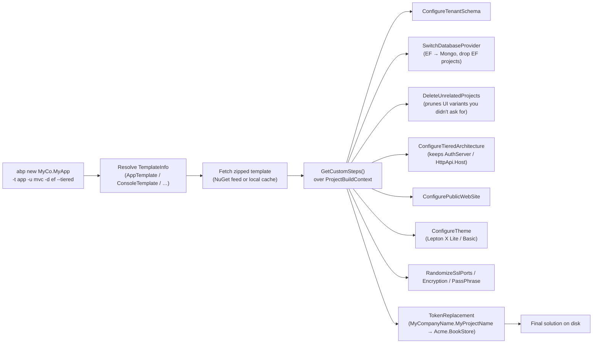
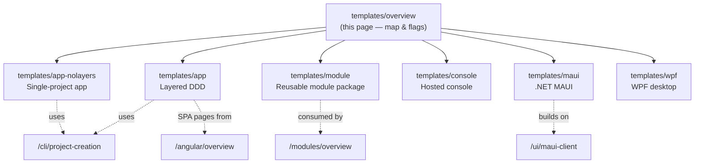

The `templates/` folder at the root of [`abpframework/abp`](https://github.com/abpframework/abp/tree/dev/templates) is where the **physical source** of every ABP starter solution lives. When you run `abp new Acme.BookStore -t app -u mvc -d ef --tiered`, the CLI does **not** generate code with templating heuristics — it copies one of these directories verbatim, walks a configurable pipeline of `ProjectBuildPipelineStep`s (see [`AppTemplateBase.GetCustomSteps`](https://github.com/abpframework/abp/blob/dev/framework/src/Volo.Abp.Cli.Core/Volo/Abp/Cli/ProjectBuilding/Templates/App/AppTemplateBase.cs)) that delete the projects that don't match your flags, renames `MyCompanyName.MyProjectName` to the namespace you supplied, and zips the result. That means **the canonical reference for "what does an ABP solution look like?" is the source you are reading in this section** — not generated output, not the docs site, but the actual project tree below `templates/`.

This page is the map. It enumerates every template directory, what `abp new -t <name>` flag selects it, which UI / DB / tiered switches it understands, and which deep-dive page in this section covers it.

<Info>
  The pipeline that drives `abp new` is documented separately under [Project creation](/cli/project-creation). The CLI itself — including `abp new`, `abp install-libs`, and friends — is covered in [CLI overview](/cli/overview). This section focuses on the **artifacts** the CLI ships.
</Info>

## The templates directory

```text
templates/
├── app/                    # Layered DDD web application
│   ├── aspnet-core/
│   │   ├── src/            # 22 projects (Domain.Shared ... Blazor.WebApp.Tiered.Client)
│   │   └── test/           # 7 test projects
│   └── angular/            # Standalone Angular workspace (Lepton X + ng-packs)
├── app-nolayers/           # Single-project "no-layers" web app
│   ├── aspnet-core/        # 10 csproj: Mvc, Mvc.Mongo, Blazor.Server, Blazor.Server.Mongo,
│   │                       # Host, Host.Mongo, Blazor.WebAssembly/{Client,Server,Server.Mongo,Shared}
│   └── angular/            # Angular workspace pointing at the no-layers Host
├── module/                 # Reusable module / NuGet-style package
│   ├── aspnet-core/
│   │   ├── src/            # 14 module projects (Domain.Shared ... Blazor.WebAssembly.Bundling, Installer)
│   │   ├── host/           # 8 dev/test host variants (Web.Unified, HttpApi.Host, Blazor.Host, AuthServer ...)
│   │   └── test/           # 6 test projects
│   └── angular/            # ng-packs library + dev-app
├── console/src/            # Single-project console host using IHostBuilder + AddApplicationAsync
├── maui/src/               # .NET MAUI multi-platform app
├── wpf/src/                # WPF desktop app
├── Directory.Packages.props
├── NuGet.Config
└── zip-templates.ps1       # The script run by the build to ship templates with the CLI
```

Every leaf directory whose name starts with `MyCompanyName.MyProjectName` is a project that the CLI will rename to your company / project name during scaffolding. The literal strings `MyCompanyName`, `MyProjectName`, `MyCompanyName.MyProjectName` (and their lowercase / cased variants) are reserved tokens — they show up in `csproj` files, namespaces, source code, JSON config, and even Razor markup, and the CLI's `ProjectBuildContext` replaces them token-by-token.

## `abp new -t` flag map

The `-t / --template` flag picks which directory the CLI uses. The table below lists every `TemplateName` constant defined under [`framework/src/Volo.Abp.Cli.Core/Volo/Abp/Cli/ProjectBuilding/Templates/`](https://github.com/abpframework/abp/tree/dev/framework/src/Volo.Abp.Cli.Core/Volo/Abp/Cli/ProjectBuilding/Templates), together with the source directory it copies from and the deep-dive page in this section.

| `-t` value | Source directory | Default DB | Default UI | Deep dive |
| --- | --- | --- | --- | --- |
| `app` | `templates/app/` | `ef` (SQL Server) | `mvc` (Lepton X Lite) | [Layered app template](/templates/app) |
| `app-pro` | (commercial — same shape, more projects) | `ef` | `mvc` | [Layered app template](/templates/app) |
| `app-nolayers` | `templates/app-nolayers/` | `ef` | `mvc` | [No-layers app template](/templates/app-nolayers) |
| `app-nolayers-pro` | (commercial variant) | `ef` | `mvc` | [No-layers app template](/templates/app-nolayers) |
| `module` | `templates/module/` | `ef` + `mongodb` (both shipped) | n/a (library) | [Module template](/templates/module) |
| `module-pro` | (commercial variant) | both | n/a | [Module template](/templates/module) |
| `console` | `templates/console/` | n/a | n/a | [Console template](/templates/console) |
| `maui` | `templates/maui/` | n/a (calls an HttpApi.Host) | MAUI | [MAUI template](/templates/maui) |
| `wpf` | `templates/wpf/` | n/a | WPF | [WPF template](/templates/wpf) |

The `-pro` flavours are not in this repo — they live in the commercial `volosoft/abp-commercial` repo and reuse the same pipeline. The `TemplateName` constants for them (`app-pro`, `app-nolayers-pro`, `module-pro`) are listed here for completeness because the same `AppTemplateBase.IsAppTemplate` check treats them as siblings.

## Pipeline: which flag wires which step



`AppTemplateBase` (the parent of `AppTemplate` and `AppProTemplate`) is the source of truth for those steps. The full list — `ConfigureTenantSchema`, `SwitchDatabaseProvider`, `DeleteUnrelatedProjects`, `RemoveMigrations`, `ConfigureTieredArchitecture`, `ConfigurePublicWebSite`, `ConfigureTheme`, `ConfigureVersion`, `RemoveUnnecessaryPorts`, `RandomizeSslPorts`, `RandomizeStringEncryption`, `RandomizeAuthServerPassPhrase`, `UpdateNuGetConfig`, `ConfigureDockerFiles`, `ChangeConnectionString`, `CleanupFolderHierarchy` — explains why one template directory can produce so many distinct shapes.

## What the `--tiered` / `-u` / `-d` flags actually do

The same `templates/app/aspnet-core/src/` folder contains **all** the host variants. The pipeline keeps the ones you asked for and **deletes** the others before zipping the result back to your disk. Specifically:

- `-u mvc` keeps `MyCompanyName.MyProjectName.Web` (the Razor Pages host) and deletes every `Blazor*` host. With `--tiered`, it instead keeps `MyCompanyName.MyProjectName.Web.Host` and `MyCompanyName.MyProjectName.AuthServer` and `MyCompanyName.MyProjectName.HttpApi.Host`.
- `-u blazor-server` keeps `MyCompanyName.MyProjectName.Blazor.Server` (or `Blazor.Server.Tiered` with `--tiered`).
- `-u blazor` (WebAssembly) keeps `MyCompanyName.MyProjectName.Blazor` + `MyCompanyName.MyProjectName.HttpApi.HostWithIds`.
- `-u blazor-webapp` keeps `MyCompanyName.MyProjectName.Blazor.WebApp` + `MyCompanyName.MyProjectName.Blazor.WebApp.Client` (or the `.Tiered` versions).
- `-u angular` keeps `templates/app/angular/` for the SPA and `MyCompanyName.MyProjectName.HttpApi.HostWithIds` for the API.
- `-u none` deletes every UI host and only keeps the HTTP API.
- `-d ef` keeps `MyCompanyName.MyProjectName.EntityFrameworkCore` and deletes `MyCompanyName.MyProjectName.MongoDB`.
- `-d mongodb` does the opposite and additionally rewrites the host module dependencies via `AppTemplateSwitchEntityFrameworkCoreToMongoDbStep`.

## Template variants table

The deep-dive pages enumerate every project per template; this table summarises which projects each template produces.

| Template | ASP.NET Core projects | Test projects | UI | Notes |
| --- | --- | --- | --- | --- |
| `app` | 22 (`Domain.Shared`, `Domain`, `Application.Contracts`, `Application`, `HttpApi`, `HttpApi.Client`, `EntityFrameworkCore`, `MongoDB`, `DbMigrator`, `AuthServer`, `Web`, `Web.Host`, `HttpApi.Host`, `HttpApi.HostWithIds`, `Blazor`, `Blazor.Client`, `Blazor.Server`, `Blazor.Server.Tiered`, `Blazor.WebApp`, `Blazor.WebApp.Client`, `Blazor.WebApp.Tiered`, `Blazor.WebApp.Tiered.Client`) | 7 | MVC / Blazor Server / Blazor WASM / Blazor WebApp / Angular | Full DDD layering, OpenIddict in `AuthServer`, `DbMigrator` is a console host that runs `MyProjectNameDbMigrationService` |
| `app-nolayers` | 10 csproj — 8 hosts (`Mvc`, `Mvc.Mongo`, `Blazor.Server`, `Blazor.Server.Mongo`, `Blazor.WebAssembly/Server`, `Blazor.WebAssembly/Server.Mongo`, `Host`, `Host.Mongo`) + WASM `Blazor.WebAssembly/Client` and `Blazor.WebAssembly/Shared` | none | MVC / Blazor Server / Blazor WASM | Single executable per host; `MyProjectNameModule.cs` depends directly on Account / Identity / OpenIddict modules; `--migrate-database` arg replaces `DbMigrator` |
| `module` | 14 lib (`Domain.Shared`, `Domain`, `Application.Contracts`, `Application`, `HttpApi`, `HttpApi.Client`, `Web`, `Blazor`, `Blazor.Server`, `Blazor.WebAssembly`, `Blazor.WebAssembly.Bundling`, `EntityFrameworkCore`, `MongoDB`, `Installer`) + 8 host shells (`AuthServer`, `HttpApi.Host`, `Web.Host`, `Web.Unified`, `Blazor.Host`, `Blazor.Host.Client`, `Blazor.Server.Host`, `Host.Shared`) | 6 | MVC / Blazor (in host shells only) | Hosts are *only* there for dev / e2e; the lib projects are the deliverable |
| `console` | 1 (`MyCompanyName.MyProjectName`) | none | Console | Uses `Host.CreateApplicationBuilder` + `AddApplicationAsync<MyProjectNameModule>` |
| `maui` | 1 (`MyCompanyName.MyProjectName`) | none | MAUI | Uses `MauiApp.CreateBuilder().ConfigureContainer(new AbpAutofacServiceProviderFactory(...))` |
| `wpf` | 1 (`MyCompanyName.MyProjectName`) | none | WPF | Uses `AbpApplicationFactory.CreateAsync<MyProjectNameModule>(...)` in `App.OnStartup` |

The `Pro` variants add the **Public Web Site** project family, additional Lepton X themes, paid modules (Chat, FileManagement, LanguageManagement, …), and the Saas / Identity-Pro / Identity-Server pairs. They live in a different repo but are scaffolded with the same pipeline.

## Where each template is documented in this section



## Solution / project file conventions

Every template under `templates/` uses the **same** set of root files:

| File | Purpose |
| --- | --- |
| `MyCompanyName.MyProjectName.slnx` | The new VS solution format. The CLI's `CleanupFolderHierarchy` step replaces the literal `MyCompanyName.MyProjectName` with your project name. |
| `MyCompanyName.MyProjectName.sln.DotSettings` (some templates) | ReSharper / Rider settings shipped with the solution. |
| `common.props` | A shared MSBuild props file that fixes `LangVersion`, nullable, the path to `framework/src/Volo.Abp.*` (when developing against the repo), and the central package version stamp. |
| `NuGet.Config` | Adds the `https://abp.io` MyGet feed for nightly previews and the public NuGet feed. |
| `Directory.Packages.props` (root of `templates/`) | Central Package Management for every template — pins the version of every `Volo.Abp.*` and third-party package across all templates. |
| `zip-templates.ps1` | Run during build to repackage `templates/app`, `templates/console`, etc. into `.zip` blobs the CLI consumes via `Volo.Abp.Cli.ProjectBuilding.TemplateSourceFinder`. |

When you scaffold a project, those root files are renamed and rewritten by the pipeline — the `common.props` `<ProjectReference Include="...framework/src/Volo.Abp.Autofac..." />` paths become `<PackageReference Include="Volo.Abp.Autofac" />` because the templated build relies on the public NuGet packages.

## How the CLI deletes projects you didn't ask for

The pipeline step `DeleteUnrelatedProjects` walks a static decision table to remove project folders, references in `.slnx`, and dependencies in `Module.cs` files. As an example, when you pass `-u angular`, the step removes:

- `MyCompanyName.MyProjectName.Web`
- `MyCompanyName.MyProjectName.Web.Host`
- `MyCompanyName.MyProjectName.Web.Tests`
- All eight `Blazor*` projects
- `MyCompanyName.MyProjectName.HttpApi.Host` (in favour of `HttpApi.HostWithIds`)

…and leaves the Angular workspace under `angular/` untouched. The `templates/app/angular/` directory is therefore included on disk for every scaffold but only **shipped** when the user picks `-u angular` — the pipeline drops it otherwise.

## Reading the templates by hand

Coding agents and humans alike are encouraged to read these templates as primary documentation:

1. Start with `templates/app/aspnet-core/src/MyCompanyName.MyProjectName.Web/Program.cs` — the canonical "how an ABP host wires up" file (it is reproduced in [`templates/app`](/templates/app)).
2. Read each `*Module.cs` to see the `[DependsOn(...)]` graph that turns into the [module loading lifecycle](/flows/module-loading-lifecycle).
3. Read `MyProjectNameDbContext.cs` and `MyProjectNameDbMigrationService.cs` to see how [data seeding](/flows/data-seeding-flow) is composed.
4. For SPA scaffolds, read `templates/app/angular/src/app/app.config.ts` to see the corresponding [Angular provider bag](/angular/overview).

The remaining pages in this section walk each template top-to-bottom and call out the variants that the CLI's flags produce.

## See also

- [CLI overview](/cli/overview) — every `abp` subcommand
- [Project creation](/cli/project-creation) — the full `abp new` flag surface and step list
- [Solution structure](/overview/solution-structure) — how the repo is organised
- [Module loading lifecycle](/flows/module-loading-lifecycle) — how `[DependsOn]` is resolved when a templated app starts
- [Modules overview](/modules/overview) — what the application modules layered on top of every template provide
