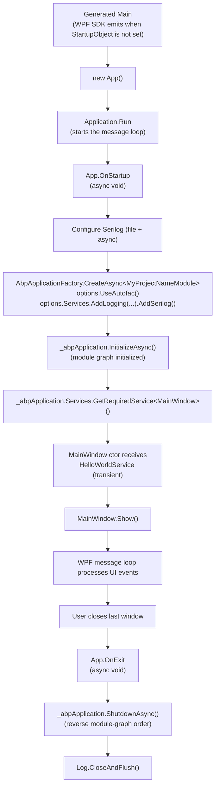

The `templates/wpf/` directory is the ABP starter for **WPF** — a single-project Windows desktop application that uses the direct `AbpApplicationFactory.CreateAsync<TModule>()` bootstrap path instead of `IHostBuilder`. That choice is forced by WPF: the framework owns the UI message loop through `Application.Run`, so ABP cannot drive the lifetime via `IHost.RunAsync`. Instead, the template creates the ABP application inside `App.OnStartup`, initializes it, resolves `MainWindow` from the container, and tears the application down inside `App.OnExit`.

This page walks every file in the template, contrasts the bootstrap shape with the [console template](/templates/console) (which does use `IHostBuilder`), and shows how to wire the project to a backend `HttpApi.Host` using `Volo.Abp.Http.Client` and the framework's HTTP client proxies.

<Info>
  Generated by `abp new Acme.Desktop -t wpf`. See [Templates overview](/templates/overview) for the catalogue of `-t` values and [Project creation](/cli/project-creation) for the CLI pipeline that rewrites `MyCompanyName.MyProjectName` into your namespace.
</Info>

## Project layout

```text
templates/wpf/src/MyCompanyName.MyProjectName/
├── MyCompanyName.MyProjectName.csproj   # net10.0-windows, UseWPF=true, WinExe
├── App.xaml(.cs)                        # AbpApplicationFactory.CreateAsync + lifetime
├── AssemblyInfo.cs                      # WPF theme info
├── MainWindow.xaml(.cs)                 # Resolved from container; ctor takes HelloWorldService
├── MyProjectNameModule.cs               # AbpModule; AddSingleton<MainWindow>
├── HelloWorldService.cs                 # ITransientDependency sample
└── appsettings.json                     # Empty placeholder
```

There is no `src` / `test` split, no XAML resource dictionaries, no view-model layer. Like the other client-app starters, the template is shaped to demonstrate the **integration seams** between ABP and the UI framework — not to ship a UI architecture.

## `.csproj` — the smallest possible WPF + ABP project

```xml MyCompanyName.MyProjectName.csproj
<Project Sdk="Microsoft.NET.Sdk">

    <Import Project="..\..\common.props" />

    <PropertyGroup>
        <OutputType>WinExe</OutputType>
        <TargetFramework>net10.0-windows</TargetFramework>
        <Nullable>enable</Nullable>
        <UseWPF>true</UseWPF>
    </PropertyGroup>

    <ItemGroup>
        <ProjectReference Include="..\..\..\..\framework\src\Volo.Abp.Autofac\Volo.Abp.Autofac.csproj" />
    </ItemGroup>

    <ItemGroup>
        <PackageReference Include="Microsoft.Extensions.Hosting" Version="10.0.2" />
        <PackageReference Include="Serilog.Extensions.Hosting" Version="9.0.0" />
        <PackageReference Include="Serilog.Extensions.Logging" Version="9.0.2" />
        <PackageReference Include="Serilog.Sinks.Async" Version="2.1.0" />
        <PackageReference Include="Serilog.Sinks.File" Version="7.0.0" />
    </ItemGroup>

    <ItemGroup>
        <None Remove="appsettings.json" />
        <Content Include="appsettings.json">
            <CopyToOutputDirectory>Always</CopyToOutputDirectory>
        </Content>
    </ItemGroup>

</Project>
```

Things to internalise:

- **`OutputType=WinExe` + `UseWPF=true` + `net10.0-windows`** make this a windowed Windows-only binary. There is no cross-platform story for the WPF template — it is the right pick when your audience runs Windows and you can ignore Linux / macOS / mobile.
- **`Volo.Abp.Autofac` is the only ABP reference.** Like the other client templates, ABP modules require Autofac semantics; the autofac toggle is flipped via `options.UseAutofac()` rather than `AddAutofacServiceProviderFactory`.
- **`Microsoft.Extensions.Hosting` is referenced** even though the template does not use `IHostBuilder`. The package is pulled because Serilog's `Serilog.Extensions.Hosting` integration is the easiest way to bridge `ILogger<T>` to Serilog. None of the host-builder APIs are called at runtime.
- **`appsettings.json` is copied to the output**, not embedded — WPF apps run on the desktop and can read the file from disk next to the executable. (The [MAUI template](/templates/maui) embeds the file because mobile sandboxes do not let you do that.)

## `App.xaml.cs` — direct factory bootstrap

This file is the heart of the template. It does five things in `OnStartup` and one in `OnExit`. None of it goes through `IHostBuilder`.

```csharp App.xaml.cs
using System;
using System.Windows;
using Microsoft.Extensions.DependencyInjection;
using Serilog;
using Serilog.Events;
using Volo.Abp;

namespace MyCompanyName.MyProjectName;

/// <summary>
/// Interaction logic for App.xaml
/// </summary>
public partial class App : Application
{
    private IAbpApplicationWithInternalServiceProvider? _abpApplication;

    protected override async void OnStartup(StartupEventArgs e)
    {
        Log.Logger = new LoggerConfiguration()
#if DEBUG
            .MinimumLevel.Debug()
#else
            .MinimumLevel.Information()
#endif
            .MinimumLevel.Override("Microsoft", LogEventLevel.Information)
            .Enrich.FromLogContext()
            .WriteTo.Async(c => c.File("Logs/logs.txt"))
            .CreateLogger();

        try
        {
            Log.Information("Starting WPF host.");

            _abpApplication = await AbpApplicationFactory.CreateAsync<MyProjectNameModule>(options =>
            {
                options.UseAutofac();
                options.Services.AddLogging(loggingBuilder => loggingBuilder.AddSerilog(dispose: true));
            });

            await _abpApplication.InitializeAsync();

            _abpApplication.Services.GetRequiredService<MainWindow>()?.Show();

        }
        catch (Exception ex)
        {
            Log.Fatal(ex, "Host terminated unexpectedly!");
        }
    }

    protected override async void OnExit(ExitEventArgs e)
    {
        if (_abpApplication != null)
        {
            await _abpApplication.ShutdownAsync();
        }
        Log.CloseAndFlush();
    }
}
```

Walk through the lifecycle:

<Steps>
  <Step title="Configure Serilog before anything else">
    Same pattern as the [console template](/templates/console): set `Log.Logger` early so that any subsequent failure (including ABP module construction) is captured. The `#if DEBUG` switch controls the minimum level, and the file sink is wrapped with `Serilog.Sinks.Async` so I/O never blocks the UI thread. Note that the WPF template does **not** add a console sink — desktop apps usually have no attached console.
  </Step>
  <Step title="Create the ABP application with AbpApplicationFactory.CreateAsync">
    `AbpApplicationFactory.CreateAsync<MyProjectNameModule>(options => ...)` is the direct-factory path. It returns an `IAbpApplicationWithInternalServiceProvider` — ABP owns the service provider in this shape. Two options matter:
    - `options.UseAutofac()` swaps the default DI for Autofac. Without it, `AbpAutofacModule` will throw at startup.
    - `options.Services.AddLogging(b => b.AddSerilog(dispose: true))` attaches Serilog to the logging pipeline so every `ILogger<T>` resolved through the container flows through the file sink configured above. `dispose: true` means the logging system will dispose the Serilog logger when the container is disposed.
  </Step>
  <Step title="Initialize the module graph">
    `await _abpApplication.InitializeAsync()` walks the `[DependsOn]` graph and runs `OnPreApplicationInitializationAsync` → `OnApplicationInitializationAsync` → `OnPostApplicationInitializationAsync`. Only after this call can you safely resolve services from `_abpApplication.Services`.
  </Step>
  <Step title="Resolve and show the main window">
    `_abpApplication.Services.GetRequiredService<MainWindow>()?.Show()` pulls the window from the container — meaning its constructor is satisfied via DI — and shows it. WPF then takes over the UI thread; `OnStartup` returns and the message loop runs until the user closes the window.
  </Step>
  <Step title="Shut down on exit">
    `OnExit` awaits `_abpApplication.ShutdownAsync()`, which runs every module's `OnApplicationShutdown` in reverse dependency order and disposes the internal service provider. `Log.CloseAndFlush()` flushes the async file sink.
  </Step>
</Steps>

<Warning>
  `OnStartup` and `OnExit` are `async void` — that is correct here because WPF's lifecycle hooks are not async-aware, and an `async Task` override would not be invoked by the framework. Any unhandled exception inside an `async void` would normally terminate the process; the template catches everything in `OnStartup` and logs via `Log.Fatal`. Mirror that pattern when you add code — never let an exception escape `OnStartup` unlogged.
</Warning>

### Why the direct factory and not `IHostBuilder`?

The [console template](/templates/console) uses `Host.CreateApplicationBuilder` because nothing else owns the lifetime — the .NET host **is** the process. WPF is different: `System.Windows.Application` owns the message loop, and `Application.Run` is the call that blocks until the last window closes. If you tried to layer `IHost.RunAsync` on top, you would either:

- Run the host on a background thread and lose direct access to its `IHostApplicationLifetime` signals from the UI, or
- Block `OnStartup` waiting for `RunAsync` and never reach `Application.Run`.

Direct `AbpApplicationFactory.CreateAsync` sidesteps both. ABP becomes a **service** of the WPF lifecycle instead of trying to drive it. The pattern translates one-for-one to WinForms, Avalonia, and any other framework that already has a main loop you cannot give up.

## The module class — registering `MainWindow` as a singleton

```csharp MyProjectNameModule.cs
using Microsoft.Extensions.DependencyInjection;
using Volo.Abp.Autofac;
using Volo.Abp.Modularity;

namespace MyCompanyName.MyProjectName;

[DependsOn(typeof(AbpAutofacModule))]
public class MyProjectNameModule : AbpModule
{
    public override void ConfigureServices(ServiceConfigurationContext context)
    {
        context.Services.AddSingleton<MainWindow>();
    }
}
```

Two design choices:

- **`MainWindow` is explicitly registered as a singleton.** It does *not* implement `ISingletonDependency`, so the conventional-registration pass would skip it; explicit registration ensures `App.OnStartup` can resolve it. Singleton lifetime is correct because there is exactly one main window per process.
- **`[DependsOn(typeof(AbpAutofacModule))]`** is the only module reference. Add `AbpHttpClientModule`, `AbpSettingManagementApplicationModule`, or any other framework module here when the desktop app starts needing them.

If you add additional windows or dialogs, the convention is one of:

```csharp Sample registration for additional windows
public override void ConfigureServices(ServiceConfigurationContext context)
{
    context.Services.AddSingleton<MainWindow>();         // one of these in the process
    context.Services.AddTransient<NewBookDialog>();      // fresh instance per resolution
    context.Services.AddTransient<SettingsWindow>();
}
```

`AddTransient` is the right choice for modal dialogs you open and close repeatedly; their constructors get a clean dependency tree each time.

## `MainWindow.xaml(.cs)` — DI-resolved view

```xml MainWindow.xaml
<Window x:Class="MyCompanyName.MyProjectName.MainWindow"
        xmlns="http://schemas.microsoft.com/winfx/2006/xaml/presentation"
        xmlns:x="http://schemas.microsoft.com/winfx/2006/xaml"
        xmlns:d="http://schemas.microsoft.com/expression/blend/2008"
        xmlns:mc="http://schemas.openxmlformats.org/markup-compatibility/2006"
        xmlns:local="clr-namespace:MyCompanyName.MyProjectName"
        mc:Ignorable="d"
        Title="MainWindow" Height="450" Width="800">
    <Grid>
        <Label Name="HelloLabel" FontSize="90" Margin="58,129,-58,-129"/>
    </Grid>
</Window>
```

```csharp MainWindow.xaml.cs
using System;
using System.Windows;

namespace MyCompanyName.MyProjectName;

/// <summary>
/// Interaction logic for MainWindow.xaml
/// </summary>
public partial class MainWindow : Window
{
    private readonly HelloWorldService _helloWorldService;

    public MainWindow(HelloWorldService helloWorldService)
    {
        _helloWorldService = helloWorldService;
        InitializeComponent();
    }

    protected override void OnContentRendered(EventArgs e)
    {
        HelloLabel.Content = _helloWorldService.SayHello();
    }
}
```

Three things to call out:

1. **`MainWindow` has a non-default constructor.** That is impossible in a vanilla WPF project because the XAML compiler generates a default-constructor call into `InitializeComponent`. It works here because **the window is never instantiated by XAML or by `Application.StartupUri`** — `App.OnStartup` resolves it from the container, which satisfies the parameterised constructor. `App.xaml` accordingly does **not** set `StartupUri`.
2. **`OnContentRendered` is the first safe hook to touch UI from the view-model side.** It fires after layout, so `HelloLabel` is guaranteed to be in the visual tree. If you set `Content` in the constructor, the value would still be there (because `InitializeComponent` already wired the field) but `OnContentRendered` is the convention for view-model-triggered UI work.
3. **No view-model exists in the template.** As with the MAUI starter, the recommended next step is a `MainWindowViewModel : INotifyPropertyChanged, ITransientDependency` injected into the window and assigned to `DataContext`. That keeps the window code-behind thin and makes data-binding the path of least resistance.

```csharp App.xaml — note no StartupUri
<Application x:Class="MyCompanyName.MyProjectName.App"
             xmlns="http://schemas.microsoft.com/winfx/2006/xaml/presentation"
             xmlns:x="http://schemas.microsoft.com/winfx/2006/xaml"
             xmlns:local="clr-namespace:MyCompanyName.MyProjectName">
    <Application.Resources>

    </Application.Resources>
</Application>
```

The missing `StartupUri` attribute is intentional. If it were present, WPF would instantiate the window itself through its default constructor and skip the container — defeating the entire bootstrap.

## The transient service

```csharp HelloWorldService.cs
using Microsoft.Extensions.Logging;
using Microsoft.Extensions.Logging.Abstractions;
using Volo.Abp.DependencyInjection;

namespace MyCompanyName.MyProjectName;

public class HelloWorldService : ITransientDependency
{
    public ILogger<HelloWorldService> Logger { get; set; }

    public HelloWorldService()
    {
        Logger = NullLogger<HelloWorldService>.Instance;
    }
    public string SayHello()
    {
        Logger.LogInformation("Call SayHello");
        return "Hello world!";
    }
}
```

Same convention as the other client templates: `ITransientDependency` marker for conventional registration, property-injected logger with a `NullLogger<T>` default so the class is testable without a container, an information-level log call before returning the greeting. The information log shows up in `Logs/logs.txt` because Serilog is wired through `options.Services.AddLogging(...).AddSerilog(...)` in `App.OnStartup`.

## `appsettings.json` and `AssemblyInfo.cs`

```json appsettings.json
{

}
```

Empty by default. WPF apps load it the same way ASP.NET Core apps do — through `IConfiguration` — but the template does not register a JSON source explicitly. To read settings, either:

- Add `AddJsonFile("appsettings.json", optional: true)` to `options.Services.ReplaceConfiguration(...)` inside `AbpApplicationFactory.CreateAsync`, or
- Register a custom `IConfigurationBuilder` in `MyProjectNameModule.ConfigureServices` and call `Configure<T>(IConfiguration)` from there.

```csharp AssemblyInfo.cs
using System.Windows;

[assembly: ThemeInfo(
    ResourceDictionaryLocation.None,
    ResourceDictionaryLocation.SourceAssembly
)]
```

Standard WPF theme info — leave it alone unless you ship a custom theme dictionary.

## Calling a backend with `Volo.Abp.Http.Client`

The WPF template does not include backend integration by default. The recipe for adding it mirrors what the [MAUI template](/templates/maui) does, with one key difference: there is no `AbpMauiClientModule` equivalent for WPF, so you depend on `AbpHttpClientModule` directly and skip the cached application-configuration client (or implement your own warm-up).

Add the framework references and the generated HTTP API client module:

```xml MyCompanyName.MyProjectName.csproj (additions)
<ItemGroup>
    <ProjectReference Include="..\..\..\..\framework\src\Volo.Abp.Http.Client\Volo.Abp.Http.Client.csproj" />
    <ProjectReference Include="..\..\..\Acme.BookStore.HttpApi.Client\Acme.BookStore.HttpApi.Client.csproj" />
</ItemGroup>
```

Pull them into the module and call `AddHttpClientProxies`:

```csharp MyProjectNameModule.cs (with backend client)
using Microsoft.Extensions.DependencyInjection;
using Volo.Abp.Autofac;
using Volo.Abp.Http.Client;
using Volo.Abp.Modularity;
using Acme.BookStore.HttpApi.Client;

namespace MyCompanyName.MyProjectName;

[DependsOn(
    typeof(AbpAutofacModule),
    typeof(AbpHttpClientModule),
    typeof(BookStoreHttpApiClientModule) // generated by your backend solution
)]
public class MyProjectNameModule : AbpModule
{
    public override void ConfigureServices(ServiceConfigurationContext context)
    {
        context.Services.AddSingleton<MainWindow>();

        var configuration = context.Services.GetConfiguration();

        Configure<AbpRemoteServiceOptions>(options =>
        {
            options.RemoteServices.Default = new RemoteServiceConfiguration(
                configuration["RemoteServices:Default:BaseUrl"]
                    ?? "https://localhost:44300/"
            );
        });

        context.Services.AddHttpClientProxies(
            typeof(BookStoreHttpApiClientModule).Assembly,
            remoteServiceConfigurationName: "Default"
        );
    }
}
```

How the pieces fit together:

| Piece | What it does |
| --- | --- |
| `AbpHttpClientModule` | Brings in the dynamic-proxy infrastructure that turns `IRemoteService`-derived interfaces into typed `HttpClient`-backed implementations. |
| `BookStoreHttpApiClientModule` | The contract assembly generated by your backend; declares the `IBookAppService` (etc.) interfaces and their assembly-level remote-service attributes. |
| `AbpRemoteServiceOptions.RemoteServices.Default` | Carries the base URL and per-service overrides (timeout, name-mapping). |
| `AddHttpClientProxies(assembly, "Default")` | Scans the assembly for application-service interfaces and registers a proxy implementation for each, dialling the `Default` remote. |

`MainWindow` can then take an application-service interface in its constructor and the window will receive a working proxy:

```csharp Window calling a backend
public partial class BooksWindow : Window
{
    private readonly IBookAppService _bookAppService;

    public BooksWindow(IBookAppService bookAppService)
    {
        _bookAppService = bookAppService;
        InitializeComponent();
    }

    protected override async void OnContentRendered(EventArgs e)
    {
        var books = await _bookAppService.GetListAsync(new PagedAndSortedResultRequestDto());
        BooksList.ItemsSource = books.Items;
    }
}
```

Authentication is the part of the story that the framework does not solve for desktop clients out of the box. The conventional patterns are:

- **Resource-owner password** (legacy) — call `/connect/token` directly, store the access token in `IDataProtectionProvider`-encrypted local storage, and attach it via a `DelegatingHandler` on the typed `HttpClient`.
- **OpenID Connect with a system browser** — use a library such as `IdentityModel.OidcClient` to open the default browser, listen on `127.0.0.1:<port>` for the callback, exchange the code, and store the resulting tokens in DPAPI-protected files.
- **Windows Hello / Passkeys** — combine OIDC with platform-specific credential storage from `Windows.Security.Credentials.PasswordVault`.

For the template-level discussion the takeaway is: ABP gives you a typed proxy and a configured remote-service URL; how you obtain a bearer token is a desktop-application concern you layer on top of the same `HttpClient` pipeline.

## How initialization actually flows



Three properties to internalise:

1. **WPF drives, ABP follows.** `Application.Run` is the outer loop; ABP is created, initialized, and torn down inside its hooks.
2. **`MainWindow` has DI superpowers** because it is resolved from the container, not constructed by XAML. The cost is that you must not put `StartupUri="MainWindow.xaml"` in `App.xaml`.
3. **Shutdown is async** — both `InitializeAsync` and `ShutdownAsync` are `Task`-returning, and `App.OnExit` `await`s the latter. Modules that hold resources (database connections, message-bus subscriptions, file handles) get a chance to release them cleanly.

## Adapting the template

| Goal | Minimal change |
| --- | --- |
| Add a backend API call | `DependsOn(typeof(AbpHttpClientModule), typeof(MyApi.HttpApiClientModule))`, `Configure<AbpRemoteServiceOptions>`, `AddHttpClientProxies`. |
| Per-environment configuration | Build an `IConfiguration` with `AddJsonFile("appsettings.json")` + `AddJsonFile($"appsettings.{env}.json", optional: true)` and pass it via `options.Services.ReplaceConfiguration(config)` inside `CreateAsync`. |
| View-models | Define them as `ITransientDependency`, inject into windows, assign to `DataContext`. |
| Dialog windows | `context.Services.AddTransient<TDialog>()` in the module; resolve via `_abpApplication.Services.GetRequiredService<TDialog>()`. |
| Background work | `DependsOn(typeof(AbpBackgroundJobsModule))`; use `IBackgroundJobManager` from an injected service inside `OnContentRendered` or a button click. |
| Settings persistence | `DependsOn(typeof(AbpSettingsManagementApplicationModule))`; inject `ISettingProvider` and `ISettingManager`. |
| Auto-update on startup | Put the check inside `OnApplicationInitializationAsync` on a module so it runs before `MainWindow.Show()`. |
| OIDC authentication | Add a `DelegatingHandler` to typed `HttpClient` instances; combine with `IdentityModel.OidcClient` and DPAPI-protected token storage. |

## Where this template fits

- **Templates index:** [Templates overview](/templates/overview) catalogues every `-t` flag — `-t wpf` points here.
- **CLI:** [CLI overview](/cli/overview) describes `abp new` and adjacent commands; [Project creation](/cli/project-creation) covers the pipeline that copies this directory and rewrites `MyCompanyName.MyProjectName` into your namespace.
- **Sibling client templates:** [Console template](/templates/console) is the right pick when you do not need a UI at all and want `IHostBuilder` + `IHostedService` semantics. [MAUI template](/templates/maui) is the cross-platform desktop / mobile option — it also uses an external-service-provider bootstrap, but lets the MAUI builder own the container instead of the ABP factory.
