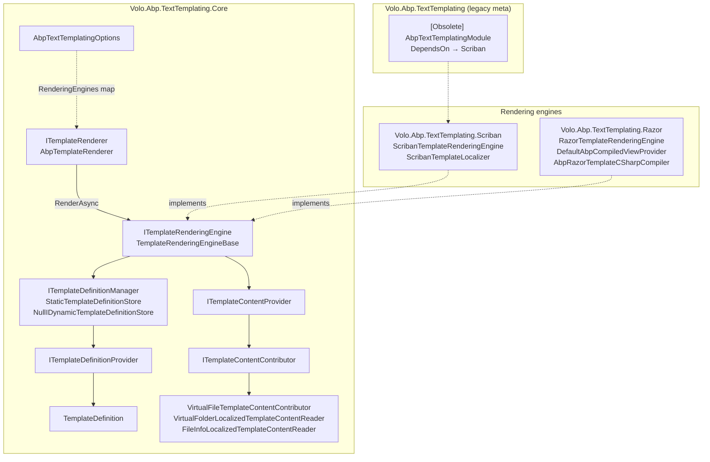
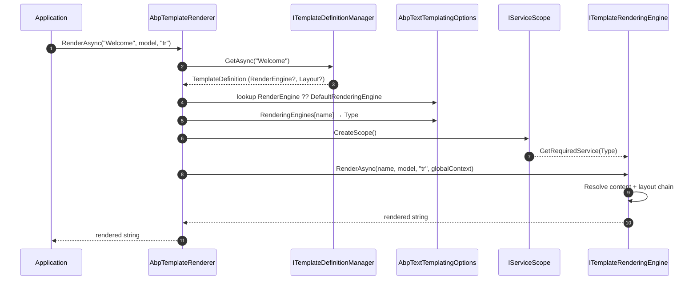

ABP's text templating subsystem produces strings (emails, SMS bodies, reports, scaffold output) from named, virtual-file backed templates that can be **localized**, **culture-fallback aware**, and rendered by a pluggable engine — currently **Scriban** or **Razor**. The whole subsystem is framework-agnostic: it does not require ASP.NET Core, has no HTTP dependency, and is consumed both by the emailing module (`framework/src/Volo.Abp.Emailing.Templates/`) and by application code that wants safe, server-side string composition.

This page is the map. The two engine pages — [`texttemplating/razor`](/texttemplating/razor) and [`texttemplating/scriban`](/texttemplating/scriban) — drill into renderer internals.

## Package map



The orchestrator is **`AbpTemplateRenderer`** (`framework/src/Volo.Abp.TextTemplating.Core/Volo/Abp/TextTemplating/AbpTemplateRenderer.cs`). It looks up the `TemplateDefinition`, picks the engine name (template-specific `RenderEngine` or `Options.DefaultRenderingEngine`), resolves the engine type via `AbpTextTemplatingOptions.RenderingEngines[name]`, and delegates.

## Packages at a glance

| Package | Module | Purpose |
| --- | --- | --- |
| `Volo.Abp.TextTemplating.Core` | `AbpTextTemplatingCoreModule` | Engine-agnostic plumbing — definitions, content providers, virtual-file readers. Depends on `AbpVirtualFileSystemModule` and `AbpLocalizationAbstractionsModule`. |
| `Volo.Abp.TextTemplating.Scriban` | `AbpTextTemplatingScribanModule` | Registers `ScribanTemplateRenderingEngine` and sets it as `DefaultRenderingEngine`. |
| `Volo.Abp.TextTemplating.Razor` | `AbpTextTemplatingRazorModule` | Registers `RazorTemplateRenderingEngine` and `DefaultAbpCompiledViewProvider`. Sets itself as default **only** if no other default has been chosen. |
| `Volo.Abp.TextTemplating` | `[Obsolete] AbpTextTemplatingModule` | Legacy meta-package, just `DependsOn(AbpTextTemplatingScribanModule)`. New code should depend directly on Scriban or Razor module. |

<Note>
The Core package never references Scriban or Razor. Engines plug themselves into `AbpTextTemplatingOptions.RenderingEngines` from their own module's `ConfigureServices`. You can register a custom engine — say a Mustache or Liquid backend — by adding `options.RenderingEngines["MyEngine"] = typeof(MyEngine);` and implementing `ITemplateRenderingEngine`.
</Note>

## The two public contracts

### `ITemplateRenderer`

`framework/src/Volo.Abp.TextTemplating.Core/Volo/Abp/TextTemplating/ITemplateRenderer.cs`:

```csharp
public interface ITemplateRenderer
{
    Task<string> RenderAsync(
        [NotNull] string templateName,
        object? model = null,
        string? cultureName = null,
        Dictionary<string, object>? globalContext = null
    );
}
```

This is what application code consumes. The default implementation is `AbpTemplateRenderer` (`ITransientDependency`). It is engine-neutral.

### `ITemplateRenderingEngine`

```csharp
public interface ITemplateRenderingEngine
{
    string Name { get; }

    Task<string> RenderAsync(
        [NotNull] string templateName,
        object? model = null,
        string? cultureName = null,
        Dictionary<string, object>? globalContext = null
    );
}
```

Implementations: `RazorTemplateRenderingEngine` (`Name = "Razor"`) and `ScribanTemplateRenderingEngine` (`Name = "Scriban"`). Custom engines derive from `TemplateRenderingEngineBase`.

## Dispatch flow



The dispatch lives in `AbpTemplateRenderer.RenderAsync`:

```csharp
var templateDefinition = await TemplateDefinitionManager.GetAsync(templateName);
var renderEngine = templateDefinition.RenderEngine;
if (renderEngine.IsNullOrWhiteSpace())
    renderEngine = Options.DefaultRenderingEngine;
var providerType = Options.RenderingEngines.GetOrDefault(renderEngine!);
// ...
using (var scope = ServiceScopeFactory.CreateScope())
{
    var engine = (ITemplateRenderingEngine)scope.ServiceProvider.GetRequiredService(providerType);
    return await engine.RenderAsync(templateName, model, cultureName, globalContext);
}
```

A new DI scope is opened per render call — this matters for any scoped state the engine uses (the Scriban engine, for example, internally calls `IStringLocalizerFactory`).

## Template definitions

A `TemplateDefinition` (`framework/src/Volo.Abp.TextTemplating.Core/Volo/Abp/TextTemplating/TemplateDefinition.cs`) is metadata; it doesn't carry the template body itself.

```csharp
public class TemplateDefinition : IHasNameWithLocalizableDisplayName
{
    public const int MaxNameLength = 128;

    public string Name { get; }
    public ILocalizableString DisplayName { get; set; }
    public bool IsLayout { get; }                 // marks layout templates
    public string? Layout { get; set; }           // name of layout to wrap output
    public string? LocalizationResourceName { get; set; }
    public bool IsInlineLocalized { get; set; }   // template contains {{L "..."}} calls
    public string? DefaultCultureName { get; }    // fallback culture
    public string? RenderEngine { get; set; }     // "Razor" or "Scriban" or custom
    public Dictionary<string, object?> Properties { get; }

    public TemplateDefinition WithProperty(string key, object value);
    public TemplateDefinition WithRenderEngine(string renderEngine);
}
```

Two flags matter for the **content lookup** (see below):

- `IsInlineLocalized = true` — the template body itself calls into the localizer (`{{ L "Greeting" }}` in Scriban or `@Localizer["Greeting"]` in Razor). A single, culture-independent file backs the template.
- `IsInlineLocalized = false` — one file **per culture** sits in a folder, and the content provider picks the right file.

### Defining templates

Implement `ITemplateDefinitionProvider` — or extend `TemplateDefinitionProvider` (an `ITransientDependency` base):

```csharp
public class WelcomeEmailTemplateProvider : TemplateDefinitionProvider
{
    public override void Define(ITemplateDefinitionContext context)
    {
        context.Add(
            new TemplateDefinition(
                name: "WelcomeEmail",
                localizationResource: typeof(MyLocalizationResource),
                displayName: LocalizableString.Create<MyLocalizationResource>("WelcomeEmail"),
                defaultCultureName: "en"
            )
            .WithVirtualFilePath("/MyApp/EmailTemplates/Welcome", isInlineLocalized: false)
            .WithScribanEngine()  // or .WithRazorEngine()
        );
    }
}
```

`AbpTextTemplatingCoreModule.PreConfigureServices` auto-registers every concrete `ITemplateDefinitionProvider` and every `ITemplateContentContributor` via `services.OnRegistered` — you do not need manual `Configure<AbpTextTemplatingOptions>` calls to wire providers up.

### `ITemplateDefinitionContext` and providers

```csharp
public interface ITemplateDefinitionProvider
{
    void PreDefine(ITemplateDefinitionContext context);
    void Define(ITemplateDefinitionContext context);
    void PostDefine(ITemplateDefinitionContext context);
}
```

`StaticTemplateDefinitionStore` orders the three phases over all registered providers:

```csharp
foreach (var provider in providers) provider.PreDefine(context);
foreach (var provider in providers) provider.Define(context);
foreach (var provider in providers) provider.PostDefine(context);
```

Use `PreDefine` to register layout templates that other providers will reference, and `PostDefine` to apply cross-cutting changes (e.g. add a property to every template).

`StaticTemplateDefinitionStore` is cached via `IStaticDefinitionCache<TemplateDefinition, Dictionary<string, TemplateDefinition>>` — the providers run once per process and the result is reused. Dynamic templates plug through `IDynamicTemplateDefinitionStore`; the default `NullIDynamicTemplateDefinitionStore` returns nothing, but template-management modules can override it.

### Definition manager merge rule

`TemplateDefinitionManager.GetAllAsync` merges static and dynamic stores **preferring static**:

```csharp
var staticTemplateNames = staticTemplates.Select(p => p.Name).ToImmutableHashSet();
return staticTemplates.Concat(
    dynamicTemplates.Where(d => !staticTemplateNames.Contains(d.Name))
).ToImmutableList();
```

If a dynamic provider tries to redefine `"WelcomeEmail"` it is shadowed by the in-code definition.

## Content resolution

```mermaid
flowchart LR
  App["App calls RenderAsync"]
  Renderer["AbpTemplateRenderer"]
  Engine["Rendering engine"]
  TCP["TemplateContentProvider"]
  Loop["Iterate ContentContributors (reverse order)"]
  VF["VirtualFileTemplateContentContributor"]
  Reader["LocalizedTemplateContentReaderFactory"]
  File["IFile (virtual)"]

  App --> Renderer --> Engine
  Engine -->|GetContentOrNullAsync| TCP
  TCP --> Loop
  Loop --> VF
  VF --> Reader
  Reader --> File
```



`TemplateContentProvider.GetContentOrNullAsync` (`framework/src/Volo.Abp.TextTemplating.Core/Volo/Abp/TextTemplating/TemplateContentProvider.cs`) implements the culture fallback chain. For a requested `cultureName`:

1. **Requested culture** — `tr-TR`. Ask each contributor in `Options.ContentContributors` (reversed) for content.
2. **Base culture** — strip the country code, ask again. Uses `CultureHelper.GetBaseCultureName`. So `tr-TR` → `tr`.
3. **Inline-localized fallback** — if the definition has `IsInlineLocalized = true`, ask for **culture-independent** content (null culture).
4. **Default culture** — if `templateDefinition.DefaultCultureName` is set (and the template is not inline-localized), ask with that culture.

If nothing matches, the provider returns `null`. The engine then has to decide what to do — typically throw.

```csharp
if (cultureName == null && useCurrentCultureIfCultureNameIsNull)
{
    cultureName = CultureInfo.CurrentUICulture.Name;
}
```

So an unspecified `cultureName` argument resolves to the ambient UI culture (which both engines set via `CultureHelper.Use` inside their `RenderAsync`).

### Content contributors

```csharp
public interface ITemplateContentContributor
{
    Task<string?> GetOrNullAsync(TemplateContentContributorContext context);
}
```

The built-in implementation is `VirtualFileTemplateContentContributor`. Its rule:

```csharp
return localizedReader.GetContentOrNull(context.Culture);
```

The reader is built by `LocalizedTemplateContentReaderFactory.CreateAsync`:

- Reads `templateDefinition.GetVirtualFilePathOrNull()` — set via `WithVirtualFilePath(...)`.
- If the virtual path is a **file**, builds `FileInfoLocalizedTemplateContentReader` (one body, ignores culture).
- If it's a **folder**, builds `VirtualFolderLocalizedTemplateContentReader` with file extensions `[".tpl", ".cshtml"]`. Each file is keyed by its name without the extension — so `Welcome/en.tpl` is `"en"`, `Welcome/tr.tpl` is `"tr"`.

In production the reader is **cached** per template by name (`ConcurrentDictionary<string, ILocalizedTemplateContentReader>`). In `IsDevelopment()` the cache is bypassed so file edits reload immediately:

```csharp
if (AbpHostEnvironment.IsDevelopment())
{
    return await CreateInternalAsync(templateDefinition);
}
```

`TemplateContentFileProvider.GetFilesAsync` is the helper template-management UIs use to list all per-culture files of a definition for editing.

### Adding a contributor

Custom contributors implement `ITemplateContentContributor`. They are picked up automatically by `AbpTextTemplatingCoreModule`. Use them when bodies live in a database, S3 bucket, or remote CMS:

```csharp
public class DbTemplateContentContributor : ITemplateContentContributor, ITransientDependency
{
    private readonly ITemplateRepository _repository;
    public DbTemplateContentContributor(ITemplateRepository repository) => _repository = repository;

    public async Task<string?> GetOrNullAsync(TemplateContentContributorContext context)
    {
        var row = await _repository.FindAsync(context.TemplateDefinition.Name, context.Culture);
        return row?.Body;
    }
}
```

Contributors are evaluated in **registration-reverse order** — the last registered runs first. A typical setup keeps `VirtualFileTemplateContentContributor` as the final fallback and inserts DB-backed contributors after it (so they win).

## Options surface

`AbpTextTemplatingOptions` (`framework/src/Volo.Abp.TextTemplating.Core/Volo/Abp/TextTemplating/AbpTextTemplatingOptions.cs`):

| Property | Type | Set by |
| --- | --- | --- |
| `DefinitionProviders` | `ITypeList<ITemplateDefinitionProvider>` | `AbpTextTemplatingCoreModule.PreConfigureServices` |
| `ContentContributors` | `ITypeList<ITemplateContentContributor>` | `AbpTextTemplatingCoreModule.PreConfigureServices` |
| `RenderingEngines` | `IDictionary<string, Type>` | Engine modules (`Scriban`, `Razor`) |
| `DefaultRenderingEngine` | `string?` | First engine module loaded |
| `DeletedTemplates` | `HashSet<string>` | Template-management tooling to hide template definitions |

The `DefaultRenderingEngine` resolution differs between the two engines:

- `AbpTextTemplatingScribanModule.ConfigureServices` **unconditionally** sets `DefaultRenderingEngine = "Scriban"`.
- `AbpTextTemplatingRazorModule.ConfigureServices` sets it **only if blank**:

```csharp
if (options.DefaultRenderingEngine.IsNullOrWhiteSpace())
    options.DefaultRenderingEngine = RazorTemplateRenderingEngine.EngineName;
options.RenderingEngines[RazorTemplateRenderingEngine.EngineName] = typeof(RazorTemplateRenderingEngine);
```

So if you depend on both modules, **Scriban wins as default** unless you override it yourself.

<Tip>
To force Razor as the default when both modules are referenced, set it in your own module:

```csharp
public override void ConfigureServices(ServiceConfigurationContext context)
{
    Configure<AbpTextTemplatingOptions>(options =>
    {
        options.DefaultRenderingEngine = RazorTemplateRenderingEngine.EngineName;
    });
}
```
</Tip>

## Layouts

Layouts are first-class. A `TemplateDefinition` with `isLayout: true` marks itself as renderable as a wrapper. A non-layout definition can reference one by name via the `Layout` property.

Both engines implement layout chaining in `RenderInternalAsync`:

- **Razor**: after rendering the child, calls `RenderInternalAsync(templateDefinition.Layout, body: renderedContent, …)`. Inside the layout, the body is exposed as `Model.Body` (well, the `Body` property on `RazorTemplatePageBase`).
- **Scriban**: writes the child output into `globalContext["content"]` and renders the layout. The layout body should reference `{{ content }}`.

Layout chains can nest — the layout itself may have a `Layout` of its own; the recursion bottoms out when `Layout == null`.

## End-to-end example

```csharp
public class WelcomeService : ITransientDependency
{
    private readonly ITemplateRenderer _renderer;
    public WelcomeService(ITemplateRenderer renderer) => _renderer = renderer;

    public Task<string> RenderForUser(string userName, string culture)
    {
        return _renderer.RenderAsync(
            templateName: "WelcomeEmail",
            model: new { Name = userName, JoinedOn = DateTime.UtcNow },
            cultureName: culture,
            globalContext: new Dictionary<string, object>
            {
                ["AppName"] = "Acme Cloud",
                ["SupportEmail"] = "support@acme.io"
            }
        );
    }
}
```

What happens at runtime:

1. `AbpTemplateRenderer` resolves the `WelcomeEmail` definition.
2. The definition has `RenderEngine == "Scriban"` (set by `WithScribanEngine()`), so `ScribanTemplateRenderingEngine` is resolved.
3. The engine opens a culture scope (`CultureHelper.Use(culture)`).
4. `TemplateContentProvider` walks the contributors. For `de-DE` it tries `de-DE`, then `de`, then `en` (the `DefaultCultureName`).
5. Scriban parses the body and renders it with `model`, `globalContext`, and an `L(...)` helper if the template has a `LocalizationResourceName`.
6. If `Layout = "EmailLayout"` is set, Scriban pushes the rendered body into `globalContext["content"]` and renders the layout.

## Consumers in the codebase

| Consumer | What it does |
| --- | --- |
| `Volo.Abp.Emailing.Templates` | `TemplateRenderingEmailSender` — see [`comm/emailing`](/comm/emailing). |
| Email layout default | `StandardEmailTemplates` defines a `StandardLayout` referenced by app emails. |
| Volo modules (TextTemplateManagement, CmsKit) | Add UI for editing template bodies. Use `TemplateContentFileProvider` and `IDynamicTemplateDefinitionStore`. |

## When to pick which engine

| Concern | Scriban | Razor |
| --- | --- | --- |
| Default | ✅ (set by `AbpTextTemplatingScribanModule`) | Only if no Scriban |
| Syntax | `{{ … }}` mustache-style, sandboxed | `@…` C# inside HTML, full type system |
| Logic in templates | Limited DSL (safer for user-edited bodies) | Arbitrary C# at runtime |
| Compilation | Parse-and-render at every call | Compiled to assembly, cached by content MD5 |
| Cold start | Fast | Slow (Roslyn) |
| Trusted-author scenarios | Use Scriban | Razor only when authors are developers |
| Localization helper | `{{ L "Key" arg1 arg2 }}` via `ScribanTemplateLocalizer` | `@Localizer["Key", arg1, arg2]` via `IStringLocalizer` |

See [`texttemplating/scriban`](/texttemplating/scriban) and [`texttemplating/razor`](/texttemplating/razor) for engine internals, helper APIs and pitfalls.

## Cross-references

<CardGroup cols={2}>
  <Card title="Emailing" href="/comm/emailing">
    `TemplateRenderingEmailSender` uses `ITemplateRenderer` to build email bodies. Templates live in the virtual file system and are typically Scriban.
  </Card>
  <Card title="Virtual file system" href="/core/virtual-file-system">
    Template bodies are read through `IVirtualFileProvider`. Contributing folders happens via `Configure<AbpVirtualFileSystemOptions>`.
  </Card>
  <Card title="Localization" href="/crosscut/localization">
    Both engines wire `IStringLocalizerFactory.CreateByResourceName` from `LocalizationResourceName`. Inline-localized templates depend on this.
  </Card>
  <Card title="ASP.NET Core integration" href="/aspnetcore/overview">
    Razor compilation requires `Microsoft.AspNetCore.Razor.Language`. Templates do not need ASP.NET Core hosting to render.
  </Card>
</CardGroup>
