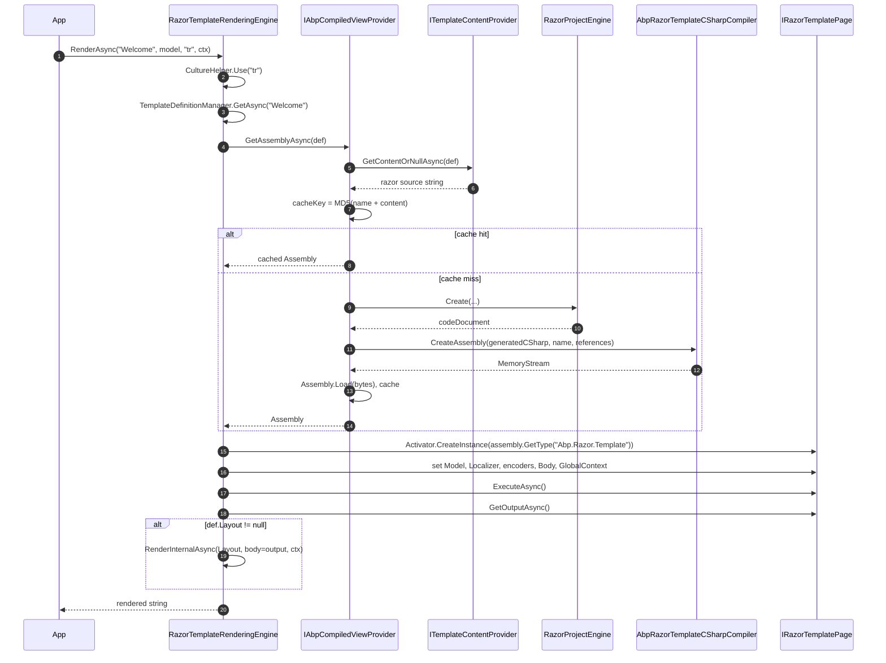

`Volo.Abp.TextTemplating.Razor` wires the Razor view engine into ABP's text templating subsystem. Instead of using ASP.NET Core MVC's runtime view compilation (which assumes a hosted environment, a `RazorProjectFileSystem`, tag helpers, etc.), it compiles **standalone Razor strings** straight into in-memory assemblies via Roslyn and instantiates them on demand. This makes Razor templates usable in any process — console hosts, background workers, library code — and gives templates access to the full C# language.

It is registered behind `RazorTemplateRenderingEngine.EngineName = "Razor"` in `AbpTextTemplatingOptions.RenderingEngines`. See [`texttemplating/overview`](/texttemplating/overview) for how the orchestrator picks an engine.

## Files in this package

| File | Role |
| --- | --- |
| `AbpTextTemplatingRazorModule.cs` | ABP module; registers the engine and (conditionally) sets it as default. |
| `RazorTemplateRenderingEngine.cs` | The `ITemplateRenderingEngine` — orchestrates compilation, model binding, layout chain. |
| `IAbpCompiledViewProvider.cs` / `DefaultAbpCompiledViewProvider.cs` | Compile-and-cache Razor source → `Assembly`. |
| `AbpRazorTemplateCSharpCompiler.cs` | Roslyn `CSharpCompilation` wrapper. |
| `AbpCompiledViewProviderOptions.cs` | Per-template extra `MetadataReference`s. |
| `AbpRazorTemplateCSharpCompilerOptions.cs` | Global extra `MetadataReference`s. |
| `IAbpRazorProjectEngineFactory.cs` / `DefaultAbpRazorProjectEngineFactory.cs` | Builds a `RazorProjectEngine` configured with class/namespace name. |
| `EmptyProjectFileSystem.cs` / `NotFoundProjectItem.cs` | Stub `RazorProjectFileSystem` — Razor doesn't read from disk; templates come in as strings. |
| `AbpRazorTemplateConsts.cs` | `DefaultNameSpace = "Abp.Razor"`, `DefaultClassName = "Template"`. |
| `RazorTemplatePageBase.cs` / `IRazorTemplatePage.cs` | Base class generated Razor pages derive from; exposes `Write`, `WriteLiteral`, attribute helpers, `Model`, `Localizer`, `GlobalContext`, `Body`. |
| `RazorTemplateDefinitionExtensions.cs` | `WithRazorEngine()` fluent helper. |

## Module wiring

`framework/src/Volo.Abp.TextTemplating.Razor/Volo/Abp/TextTemplating/Razor/AbpTextTemplatingRazorModule.cs`:

```csharp
[DependsOn(typeof(AbpTextTemplatingCoreModule))]
public class AbpTextTemplatingRazorModule : AbpModule
{
    public override void ConfigureServices(ServiceConfigurationContext context)
    {
        Configure<AbpTextTemplatingOptions>(options =>
        {
            if (options.DefaultRenderingEngine.IsNullOrWhiteSpace())
            {
                options.DefaultRenderingEngine = RazorTemplateRenderingEngine.EngineName;
            }
            options.RenderingEngines[RazorTemplateRenderingEngine.EngineName]
                = typeof(RazorTemplateRenderingEngine);
        });
    }
}
```

Note the conditional default — it does **not** override a default set by a previously loaded module. If both the Scriban and Razor modules are referenced, Scriban remains default unless your code re-assigns it.

To opt into Razor as default explicitly:

```csharp
Configure<AbpTextTemplatingOptions>(options =>
{
    options.DefaultRenderingEngine = RazorTemplateRenderingEngine.EngineName;
});
```

Or mark individual templates with the engine:

```csharp
new TemplateDefinition("ReportPdf").WithRazorEngine();
```

`WithRazorEngine` is the fluent helper from `RazorTemplateDefinitionExtensions.cs`:

```csharp
public static TemplateDefinition WithRazorEngine([NotNull] this TemplateDefinition templateDefinition)
{
    return templateDefinition.WithRenderEngine(RazorTemplateRenderingEngine.EngineName);
}
```

## Render flow



Source: `RazorTemplateRenderingEngine.RenderTemplateContentWithRazorAsync`.

## The renderer

`framework/src/Volo.Abp.TextTemplating.Razor/Volo/Abp/TextTemplating/Razor/RazorTemplateRenderingEngine.cs` derives from `TemplateRenderingEngineBase`:

```csharp
public class RazorTemplateRenderingEngine : TemplateRenderingEngineBase, ITransientDependency
{
    public const string EngineName = "Razor";
    public override string Name => EngineName;

    public override async Task<string> RenderAsync(
        string templateName, object? model = null,
        string? cultureName = null, Dictionary<string, object>? globalContext = null)
    {
        globalContext ??= new Dictionary<string, object>();
        if (cultureName == null)
            return await RenderInternalAsync(templateName, null, globalContext, model);
        using (CultureHelper.Use(cultureName))
            return await RenderInternalAsync(templateName, null, globalContext, model);
    }
}
```

`CultureHelper.Use` swaps `CultureInfo.CurrentCulture` and `CurrentUICulture` for the duration of the scope. This is what makes `IStringLocalizer` lookups inside the template pick the right resource file.

### Layout chain

```csharp
protected virtual async Task<string> RenderInternalAsync(
    string templateName, string? body,
    Dictionary<string, object> globalContext, object? model = null)
{
    var templateDefinition = await TemplateDefinitionManager.GetAsync(templateName);
    var renderedContent = await RenderSingleTemplateAsync(templateDefinition, body, globalContext, model);

    if (templateDefinition.Layout != null)
    {
        renderedContent = await RenderInternalAsync(
            templateDefinition.Layout, renderedContent, globalContext);
    }
    return renderedContent;
}
```

The child renders first, then its output is passed as `body` to the layout's render (which reads it from `template.Body`). The model is passed to the **child only** — layouts cannot strongly-type the inner model. Use `globalContext` to share data with the layout.

### Single-template render

```csharp
protected virtual async Task<string> RenderTemplateContentWithRazorAsync(
    TemplateDefinition templateDefinition, string? body,
    Dictionary<string, object> globalContext, object? model = null)
{
    using (var scope = ServiceScopeFactory.CreateScope())
    {
        var provider = scope.ServiceProvider.GetRequiredService<IAbpCompiledViewProvider>();
        var assembly = await provider.GetAssemblyAsync(templateDefinition);
        var templateType = assembly.GetType(AbpRazorTemplateConsts.TypeName)!;
        var template = (IRazorTemplatePage)Activator.CreateInstance(templateType)!;

        // Bind the model if the template declared @inherits IRazorTemplatePage<T>
        var modelType = templateType.GetInterfaces()
            .Where(x => x.IsGenericType && x.GetGenericTypeDefinition() == typeof(IRazorTemplatePage<>))
            .Select(x => x.GenericTypeArguments.FirstOrDefault())
            .FirstOrDefault();

        if (modelType != null)
        {
            GetType().GetMethod(nameof(SetModel), BindingFlags.Instance | BindingFlags.NonPublic)
                ?.MakeGenericMethod(modelType).Invoke(this, new[] { template, model });
        }

        template.ServiceProvider     = scope.ServiceProvider;
        template.Localizer           = GetLocalizerOrNull(templateDefinition);
        template.HtmlEncoder         = scope.ServiceProvider.GetService<HtmlEncoder>();
        template.JavaScriptEncoder   = scope.ServiceProvider.GetService<JavaScriptEncoder>();
        template.UrlEncoder          = scope.ServiceProvider.GetService<UrlEncoder>();
        template.Body                = body;
        template.GlobalContext       = globalContext;

        await template.ExecuteAsync();
        return await template.GetOutputAsync();
    }
}
```

Things to notice:

- A **new scope** is created per render so per-render scoped services are clean.
- Model binding is **reflection-based**: the template only needs to declare `@inherits Volo.Abp.TextTemplating.Razor.IRazorTemplatePage<MyModel>` and Razor's project engine emits the right base type. The engine then sets `Model` through `SetModel<TModel>`.
- `Localizer` is filled from `TemplateDefinition.LocalizationResourceName` via `StringLocalizerFactory.CreateByResourceName(name)`. If not set, it falls back to `StringLocalizerFactory.CreateDefaultOrNull()`.
- HTML/JS/URL encoders come from DI, so they share configuration with the host app's MVC services if any.

## Compiled view provider

`framework/src/Volo.Abp.TextTemplating.Razor/Volo/Abp/TextTemplating/Razor/DefaultAbpCompiledViewProvider.cs` is responsible for turning a Razor string into an `Assembly`, and for caching the result:

```csharp
private readonly static ConcurrentDictionary<string, Assembly> CachedAssembles = new();
private readonly static SemaphoreSlim SemaphoreSlim = new(1, 1);

public virtual async Task<Assembly> GetAssemblyAsync(TemplateDefinition templateDefinition)
{
    var templateContent = await _templateContentProvider.GetContentOrNullAsync(templateDefinition);
    if (templateContent == null)
        throw new AbpException($"Razor template content of {templateDefinition.Name} is null!");

    using (await SemaphoreSlim.LockAsync())
    {
        var cacheKey = (templateDefinition.Name + templateContent).ToMd5();
        if (CachedAssembles.TryGetValue(cacheKey, out var cachedAssemble))
            return cachedAssemble;
        var assembly = await CreateAssembly(templateContent);
        CachedAssembles.TryAdd(cacheKey, assembly);
        return assembly;
    }
}
```

<Warning>
The cache key is `MD5(template name + content)`. Content changes invalidate automatically. The dictionary is **static** — it lives for the process lifetime. Compiled assemblies cannot be unloaded from the default `AssemblyLoadContext`, so long-running processes that frequently edit templates will see unbounded growth. For dev hot-reload this is fine; for production template-management scenarios consider rolling your own `IAbpCompiledViewProvider` with an `AssemblyLoadContext` that can be released.
</Warning>

Compilation passes through a `RazorProjectEngine`:

```csharp
var razorProjectEngine = await _razorProjectEngineFactory.CreateAsync(builder =>
{
    builder.SetNamespace(AbpRazorTemplateConsts.DefaultNameSpace);  // "Abp.Razor"
    builder.ConfigureClass((document, node) =>
    {
        node.ClassName = AbpRazorTemplateConsts.DefaultClassName;   // "Template"
    });
});

var codeDocument = razorProjectEngine.Process(
    RazorSourceDocument.Create(templateContent, templateDefinition.Name),
    null, new List<RazorSourceDocument>(), new List<TagHelperDescriptor>());

var cSharpDocument = codeDocument.GetCSharpDocument();
```

The fixed namespace + class name (`Abp.Razor.Template`) means every compiled template lives at the **same type** inside its own assembly. The engine resolves it with `assembly.GetType("Abp.Razor.Template")`. That's also why each template gets its own assembly — multiple `Template` types cannot coexist in the same one.

### Per-template extra references

`AbpCompiledViewProviderOptions` lets you attach extra metadata references on a per-template basis:

```csharp
public class AbpCompiledViewProviderOptions
{
    public Dictionary<string, List<PortableExecutableReference>> TemplateReferences { get; }
    public AbpCompiledViewProviderOptions()
    {
        TemplateReferences = new Dictionary<string, List<PortableExecutableReference>>();
    }
}
```

If a particular template uses types from `MyApp.Domain`, register the reference:

```csharp
Configure<AbpCompiledViewProviderOptions>(options =>
{
    options.TemplateReferences["WelcomeEmail"] = new List<PortableExecutableReference>
    {
        MetadataReference.CreateFromFile(typeof(MyApp.Domain.User).Assembly.Location)
    };
});
```

These are concatenated onto `_options.TemplateReferences.GetOrDefault(templateName)` at compile time.

## The Roslyn compiler

`framework/src/Volo.Abp.TextTemplating.Razor/Volo/Abp/TextTemplating/Razor/AbpRazorTemplateCSharpCompiler.cs` (`ISingletonDependency`) wraps Roslyn. Its `DefaultReferences` are:

| Assembly | Why |
| --- | --- |
| `netstandard`, `System.Private.CoreLib`, `System.Runtime` | Core runtime |
| `System.Collections`, `System.ComponentModel`, `System.Linq`, `System.Linq.Expressions` | Common BCL surface |
| `Microsoft.Extensions.DependencyInjection(.Abstractions)` | `IServiceProvider`, `GetRequiredService` |
| `Microsoft.Extensions.Localization(.Abstractions)` | `IStringLocalizer` |
| `Volo.Abp.TextTemplating.Razor` itself | `RazorTemplatePageBase`, `IRazorTemplatePage<T>` |

Extra global references can be added via:

```csharp
public class AbpRazorTemplateCSharpCompilerOptions
{
    public List<PortableExecutableReference> References { get; }
}
```

Configure them once for **all** templates:

```csharp
Configure<AbpRazorTemplateCSharpCompilerOptions>(options =>
{
    options.References.Add(
        MetadataReference.CreateFromFile(typeof(MyApp.Common.Shared).Assembly.Location));
});
```

### Compilation options

```csharp
protected virtual CSharpCompilationOptions GetCompilationOptions()
{
    var opts = new CSharpCompilationOptions(OutputKind.DynamicallyLinkedLibrary);
    opts = opts.WithSpecificDiagnosticOptions(new Dictionary<string, ReportDiagnostic>
    {
        { "CS1701", ReportDiagnostic.Suppress },
        { "CS1702", ReportDiagnostic.Suppress },
        { "CS1705", ReportDiagnostic.Suppress }
    });
    return opts.WithOptimizationLevel(OptimizationLevel.Release);
}
```

Binding-redirect warnings are suppressed; the output assembly is optimized. Override `GetCompilationOptions` (and `CreateSyntaxTree`) in a derived compiler if you need diagnostics, debug symbols, or a language-version override.

On failure, the compiler aggregates **every diagnostic** into a single exception message:

```csharp
if (!result.Success)
{
    var error = new StringBuilder();
    error.AppendLine("Build failed");
    foreach (var diagnostic in result.Diagnostics)
        error.AppendLine(diagnostic.ToString());
    throw new Exception(error.ToString());
}
```

A common cause: a model type lives in an assembly that wasn't added to `TemplateReferences`. The error will read `CS0246: The type or namespace name 'MyModel' could not be found`.

## The Razor project engine factory

`DefaultAbpRazorProjectEngineFactory` is intentionally minimal:

```csharp
public virtual async Task<RazorProjectEngine> CreateAsync(Action<RazorProjectEngineBuilder>? configure = null)
{
    return RazorProjectEngine.Create(
        await CreateRazorConfigurationAsync(),
        EmptyProjectFileSystem.Empty,
        configure);
}

protected virtual Task<RazorConfiguration> CreateRazorConfigurationAsync()
{
    return Task.FromResult(RazorConfiguration.Default);
}
```

`EmptyProjectFileSystem.Empty` is a stub `RazorProjectFileSystem`. It returns `NotFoundProjectItem` for every path — Razor uses it only as a placeholder; content is supplied directly through `RazorSourceDocument.Create(text, …)`. Override `CreateRazorConfigurationAsync` if you need to enable tag helpers, change Razor language version, or add features.

## The page contract

`framework/src/Volo.Abp.TextTemplating.Razor/Volo/Abp/TextTemplating/Razor/IRazorTemplatePage.cs`:

```csharp
public interface IRazorTemplatePage<TModel> : IRazorTemplatePage
{
    TModel? Model { get; set; }
}

public interface IRazorTemplatePage
{
    IServiceProvider ServiceProvider { get; set; }
    IStringLocalizer? Localizer { get; set; }
    HtmlEncoder? HtmlEncoder { get; set; }
    JavaScriptEncoder? JavaScriptEncoder { get; set; }
    UrlEncoder? UrlEncoder { get; set; }
    Dictionary<string, object> GlobalContext { get; set; }
    string? Body { get; set; }
    Task ExecuteAsync();
    Task<string> GetOutputAsync();
}
```

### `RazorTemplatePageBase`

Generated Razor templates inherit `RazorTemplatePageBase<TModel>` (or non-generic `RazorTemplatePageBase`). The base buffers output through a `StringBuilder` and implements the Razor-emitted `Write`, `WriteLiteral`, `BeginWriteAttribute`, `WriteAttributeValue`, `EndWriteAttribute` methods. `ExecuteAsync` is overridden by the generated subclass; the base's default is a no-op.

The attribute-writing logic correctly elides `false`/`null` boolean attributes and renders `true` booleans as `name="name"` — matching ASP.NET Core's runtime behavior for HTML output.

`GetOutputAsync` returns the buffered string. There is no streaming — for very large templates consider splitting into smaller pieces.

## Writing a Razor template

A minimal welcome email body (`Welcome.cshtml` placed in a virtual file folder):

```cshtml
@inherits Volo.Abp.TextTemplating.Razor.RazorTemplatePageBase<WelcomeModel>

<h1>@Localizer["Welcome", Model.Name]</h1>

<p>@Localizer["JoinedOn", Model.JoinedOn.ToString("yyyy-MM-dd")]</p>

@if (Model.IsPremium)
{
    <p>@Localizer["PremiumGreeting"]</p>
}

<footer>
    @GlobalContext["AppName"] — @GlobalContext["SupportEmail"]
</footer>
```

A layout (`StandardLayout.cshtml`, marked `IsLayout = true`):

```cshtml
@inherits Volo.Abp.TextTemplating.Razor.RazorTemplatePageBase

<!DOCTYPE html>
<html>
<head><title>@GlobalContext["AppName"]</title></head>
<body>
    @Body
</body>
</html>
```

Registration:

```csharp
context.Add(
    new TemplateDefinition("StandardLayout", typeof(MyResource), isLayout: true)
        .WithVirtualFilePath("/MyApp/Templates/StandardLayout.cshtml", isInlineLocalized: true)
        .WithRazorEngine(),

    new TemplateDefinition("WelcomeEmail", typeof(MyResource),
            defaultCultureName: "en", layout: "StandardLayout")
        .WithVirtualFilePath("/MyApp/Templates/WelcomeEmail.cshtml", isInlineLocalized: true)
        .WithRazorEngine()
);
```

This setup uses **inline localization** — a single `WelcomeEmail.cshtml` (any culture) calls `@Localizer["…"]`, and `IStringLocalizer` resolves text from the resource bound to `MyResource`. The `cultureName` argument to `RenderAsync` flips `CultureInfo.CurrentUICulture`, which is what `IStringLocalizer` reads.

If you want **separate body per culture**, drop `isInlineLocalized` and lay out a folder with `WelcomeEmail/en.cshtml`, `WelcomeEmail/tr.cshtml`, etc. Set `.WithVirtualFilePath("/MyApp/Templates/WelcomeEmail", isInlineLocalized: false)`.

## Operational notes

- **Compilation cost.** First render of a template pays the Roslyn cost (tens to hundreds of ms). Subsequent renders hit the assembly cache. Pre-warm in `OnApplicationInitializationAsync` if cold-start latency matters.
- **Process-wide cache.** As noted above, the cache is static. For multi-tenant template management consider per-tenant cache key prefixes by overriding `DefaultAbpCompiledViewProvider`.
- **Diagnostics on failure.** Compile errors throw `Exception("Build failed\n…")` listing each Roslyn diagnostic. Wrap the call site for friendlier errors.
- **No tag helpers.** Razor tag helpers aren't enabled in the default `RazorConfiguration`. ASP.NET Core tag helpers depend on MVC services that aren't wired up here.
- **HTML encoding.** Razor's `@expression` calls `Write(object)` which on `RazorTemplatePageBase` simply appends `value.ToString()` — there is **no HTML encoding by default**. Use `@HtmlEncoder.Encode(value)` if you need it.

## Cross-references

<CardGroup cols={2}>
  <Card title="Text templating overview" href="/texttemplating/overview">
    Engine dispatch, definition providers, content contributors and the culture fallback chain.
  </Card>
  <Card title="Scriban engine" href="/texttemplating/scriban">
    The default engine — safer when template bodies are edited by non-developers.
  </Card>
  <Card title="Emailing" href="/comm/emailing">
    `TemplateRenderingEmailSender` uses `ITemplateRenderer` to build email bodies.
  </Card>
  <Card title="ASP.NET Core integration" href="/aspnetcore/overview">
    Razor template compilation is independent of the MVC pipeline — but the same `HtmlEncoder` / `UrlEncoder` services are shared.
  </Card>
</CardGroup>
