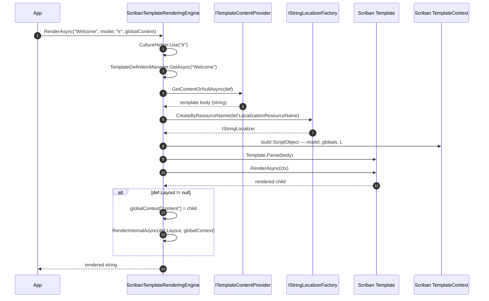

`Volo.Abp.TextTemplating.Scriban` is the **default** rendering engine in ABP. It wraps the [`Scriban`](https://github.com/scriban/scriban) library — a sandboxed, mustache-flavored DSL inspired by Liquid — and exposes it through `ITemplateRenderingEngine`. Scriban is the safe choice when template bodies are stored in a database and edited by non-developers, because the DSL cannot reach out to arbitrary .NET APIs, throw exceptions to bring down the host, or execute long-running code.

See [`texttemplating/overview`](/texttemplating/overview) for how the orchestrator picks an engine. This page focuses on Scriban-specific details.

## Files in this package

| File | Role |
| --- | --- |
| `AbpTextTemplatingScribanModule.cs` | ABP module; registers the engine and sets it as `DefaultRenderingEngine`. |
| `ScribanTemplateRenderingEngine.cs` | `ITemplateRenderingEngine` implementation — parses & renders Scriban templates and walks the layout chain. |
| `ScribanTemplateLocalizer.cs` | `IScriptCustomFunction` that exposes `IStringLocalizer` to templates as the `L(...)` function. |
| `ScribanTemplateDefinitionExtensions.cs` | `WithScribanEngine()` fluent helper. |

## Module wiring

`framework/src/Volo.Abp.TextTemplating.Scriban/Volo/Abp/TextTemplating/Scriban/AbpTextTemplatingScribanModule.cs`:

```csharp
[DependsOn(typeof(AbpTextTemplatingCoreModule))]
public class AbpTextTemplatingScribanModule : AbpModule
{
    public override void ConfigureServices(ServiceConfigurationContext context)
    {
        Configure<AbpTextTemplatingOptions>(options =>
        {
            options.DefaultRenderingEngine = ScribanTemplateRenderingEngine.EngineName;
            options.RenderingEngines[ScribanTemplateRenderingEngine.EngineName]
                = typeof(ScribanTemplateRenderingEngine);
        });
    }
}
```

The Scriban module **unconditionally** sets `DefaultRenderingEngine = "Scriban"`. That means:

- If only this module is referenced, every template without an explicit `RenderEngine` renders through Scriban.
- If both Scriban and Razor modules are referenced, **Scriban still wins as default** (because the Razor module's setter is conditional — see [`texttemplating/razor`](/texttemplating/razor)). Mark Razor templates explicitly with `.WithRazorEngine()`, or override the default yourself.

`WithScribanEngine()` is the fluent opt-in:

```csharp
public static TemplateDefinition WithScribanEngine([NotNull] this TemplateDefinition templateDefinition)
{
    return templateDefinition.WithRenderEngine(ScribanTemplateRenderingEngine.EngineName);
}
```

## Render flow



## The renderer

`framework/src/Volo.Abp.TextTemplating.Scriban/Volo/Abp/TextTemplating/Scriban/ScribanTemplateRenderingEngine.cs`:

```csharp
public class ScribanTemplateRenderingEngine : TemplateRenderingEngineBase, ITransientDependency
{
    public const string EngineName = "Scriban";
    public override string Name => EngineName;

    public override async Task<string> RenderAsync(
        string templateName, object? model = null,
        string? cultureName = null, Dictionary<string, object>? globalContext = null)
    {
        globalContext ??= new Dictionary<string, object>();
        if (cultureName == null)
            return await RenderInternalAsync(templateName, globalContext, model);
        using (CultureHelper.Use(cultureName))
            return await RenderInternalAsync(templateName, globalContext, model);
    }
}
```

`CultureHelper.Use(cultureName)` flips both `CurrentCulture` and `CurrentUICulture`. The template inherits both for the duration of the render — important because:

- `IStringLocalizer` reads `CurrentUICulture`.
- `TemplateContent fallback chain` (in `TemplateContentProvider`) defaults to `CurrentUICulture.Name` when no culture is supplied.
- Scriban's number/date formatting uses `CurrentCulture`.

### Layout chain

```csharp
protected virtual async Task<string> RenderInternalAsync(
    string templateName,
    Dictionary<string, object> globalContext,
    object? model = null)
{
    var templateDefinition = await TemplateDefinitionManager.GetAsync(templateName);
    var renderedContent = await RenderSingleTemplateAsync(templateDefinition, globalContext, model);

    if (templateDefinition.Layout != null)
    {
        globalContext["content"] = renderedContent;
        renderedContent = await RenderInternalAsync(templateDefinition.Layout, globalContext);
    }
    return renderedContent;
}
```

The child output is pushed into `globalContext["content"]`. The layout body **must** reference it as `{{ content }}`:

```scriban
<!DOCTYPE html>
<html>
<head><title>{{ app_name }}</title></head>
<body>
    {{ content }}
</body>
</html>
```

If the layout itself has a `Layout` set, the recursion repeats. The chain bottoms out when `Layout == null`.

<Note>
Unlike Razor (which passes `Model` to the **child** only), Scriban passes `model` only to the **inner-most** template too — but every layer in the chain shares the same `globalContext`. That's the recommended channel for layout-time values such as branding, support links, and unsubscribe URLs.
</Note>

### Single template render

```csharp
protected virtual async Task<string> RenderTemplateContentWithScribanAsync(
    TemplateDefinition templateDefinition, string templateContent,
    Dictionary<string, object> globalContext, object? model = null)
{
    var context = CreateScribanTemplateContext(templateDefinition, globalContext, model);
    return await Template.Parse(templateContent).RenderAsync(context);
}
```

Scriban templates are **parsed on every call**. Unlike Razor, there is no precompilation cache — parsing is cheap (no Roslyn) so it's not a concern in practice. If you need to render the same template at extreme throughput, you can wrap `Template.Parse` in your own cache by overriding `RenderTemplateContentWithScribanAsync`.

### Context construction

```csharp
protected virtual TemplateContext CreateScribanTemplateContext(
    TemplateDefinition templateDefinition,
    Dictionary<string, object> globalContext,
    object? model = null)
{
    var context = new TemplateContext();
    var scriptObject = new ScriptObject();

    scriptObject.Import(globalContext);

    if (model != null)
        scriptObject["model"] = model;

    var localizer = GetLocalizerOrNull(templateDefinition);
    if (localizer != null)
        scriptObject.SetValue("L", new ScribanTemplateLocalizer(localizer), true);

    context.PushGlobal(scriptObject);
    context.PushCulture(System.Globalization.CultureInfo.CurrentCulture);

    return context;
}
```

What this means for template authors:

| Available identifier | Where it comes from |
| --- | --- |
| `{{ model.* }}` | The `model` argument to `RenderAsync`. Properties become snake_case via Scriban's default member renamer. |
| `{{ snake_cased_key }}` | Keys from `globalContext` are imported flat. Pass them in PascalCase or camelCase; Scriban exposes them in snake_case. |
| `{{ L "Key" arg1 arg2 }}` | `IStringLocalizer` via `ScribanTemplateLocalizer`. Only present if the definition has a `LocalizationResourceName`. |
| `{{ content }}` | Set by the layout chain to the child's rendered output. |
| Scriban built-ins (`string`, `array`, `math`, `date`, …) | Always available from Scriban itself. |

### Snake-case member access

Scriban renames .NET members to snake_case by default. A model

```csharp
public class WelcomeModel { public string UserName { get; set; } public DateTime JoinedOn { get; set; } }
```

is read as `{{ model.user_name }}` and `{{ model.joined_on }}`. Renaming can be customized by passing a `MemberRenamer` when constructing the `TemplateContext` — override `CreateScribanTemplateContext` to do so.

## The L(...) helper

`framework/src/Volo.Abp.TextTemplating.Scriban/Volo/Abp/TextTemplating/Scriban/ScribanTemplateLocalizer.cs` implements Scriban's `IScriptCustomFunction`:

```csharp
public class ScribanTemplateLocalizer : IScriptCustomFunction
{
    private readonly IStringLocalizer _localizer;

    public object Invoke(TemplateContext context, ScriptNode caller,
        ScriptArray arguments, ScriptBlockStatement block)
        => GetString(arguments);

    public ValueTask<object> InvokeAsync(TemplateContext context, ScriptNode caller,
        ScriptArray arguments, ScriptBlockStatement block)
        => new ValueTask<object>(GetString(arguments));

    private string GetString(ScriptArray arguments)
    {
        if (arguments.IsNullOrEmpty()) return string.Empty;
        var name = arguments[0];
        if (name == null || name.ToString().IsNullOrWhiteSpace()) return string.Empty;
        var args = arguments.Skip(1)
                            .Where(x => x != null && !x.ToString().IsNullOrWhiteSpace())
                            .ToArray();
        return args.Any() ? _localizer[name.ToString()!, args] : _localizer[name.ToString()!];
    }

    public int RequiredParameterCount => 1;
    public int ParameterCount => ScriptFunctionCall.MaximumParameterCount - 1;
    public ScriptVarParamKind VarParamKind => ScriptVarParamKind.Direct;
    public Type ReturnType => typeof(object);
}
```

Behavior:

- The function name is **`L`** (capital). It's set on the script object: `scriptObject.SetValue("L", ..., readOnly: true)`.
- First argument is the resource key, rest are positional arguments forwarded to `IStringLocalizer["key", args]`.
- Empty/whitespace keys return `""` rather than throwing. Empty/whitespace argument values are **filtered out**.
- It is only registered if `templateDefinition.LocalizationResourceName` is set (or `CreateDefaultOrNull` returns a localizer).

In a template:

```scriban
<h1>{{ L "WelcomeTitle" model.user_name }}</h1>
<p>{{ L "JoinedOn" (model.joined_on | date.to_string "%Y-%m-%d") }}</p>
{{~ if model.is_premium ~}}
  <p>{{ L "PremiumGreeting" }}</p>
{{~ end ~}}
<footer>{{ app_name }} — {{ support_email }}</footer>
```

The `~` markers strip surrounding whitespace — handy for clean output. `date.to_string` is a Scriban built-in.

## Defining Scriban templates

A typical setup with inline localization:

```csharp
public class EmailTemplateDefinitionProvider : TemplateDefinitionProvider
{
    public override void Define(ITemplateDefinitionContext context)
    {
        context.Add(
            new TemplateDefinition(
                name: "StandardLayout",
                localizationResource: typeof(MyEmailResource),
                isLayout: true)
            .WithVirtualFilePath(
                "/MyApp/EmailTemplates/StandardLayout.tpl",
                isInlineLocalized: true)
            .WithScribanEngine(),

            new TemplateDefinition(
                name: "WelcomeEmail",
                localizationResource: typeof(MyEmailResource),
                defaultCultureName: "en",
                layout: "StandardLayout")
            .WithVirtualFilePath(
                "/MyApp/EmailTemplates/WelcomeEmail.tpl",
                isInlineLocalized: true)
            .WithScribanEngine()
        );
    }
}
```

With **per-culture files** instead:

```csharp
.WithVirtualFilePath("/MyApp/EmailTemplates/WelcomeEmail", isInlineLocalized: false)
```

Folder layout — `WelcomeEmail/en.tpl`, `WelcomeEmail/tr.tpl`, `WelcomeEmail/de.tpl`. The folder reader uses extensions `.tpl` and `.cshtml` (see `VirtualFolderLocalizedTemplateContentReader`).

`WithScribanEngine()` is technically optional when Scriban is the default — but explicit is better than implicit. It also future-proofs the definition against module-load order changes.

## Inline vs per-file localization

The choice has render-time consequences:

| | Inline (`isInlineLocalized: true`) | Per-file (`isInlineLocalized: false`) |
| --- | --- | --- |
| Template files | One file (any extension), culture-independent | One file per culture, in a folder |
| Content lookup | Requested culture → base culture → null (culture-independent) | Requested culture → base culture → `DefaultCultureName` |
| Localization mechanism | Inside the template with `{{ L "Key" }}` | Whole body is a translation |
| Adding a language | Add resource keys (`*.json` localization file) | Add a new template file (e.g. `tr.tpl`) |
| Best for | Many small strings, dense templates, shared layouts | Long-form bodies, marketing copy, translator-friendly editing |

## End-to-end example

Template body (`WelcomeEmail.tpl`):

```scriban
{{- # WelcomeEmail — inline-localized -}}
{{ L "Hello" model.first_name }},

{{ L "WelcomeBody" }}

{{~ if model.is_premium ~}}
{{ L "PremiumThanks" }}
{{~ end ~}}

{{ L "Regards" }},
{{ app_name }} Team
```

Layout (`StandardLayout.tpl`):

```scriban
{{ content }}

--
{{ L "FooterDisclaimer" }}
{{ support_email }}
```

Call site:

```csharp
var html = await _templateRenderer.RenderAsync(
    templateName: "WelcomeEmail",
    model: new { FirstName = "Ada", IsPremium = true },
    cultureName: "de-DE",
    globalContext: new Dictionary<string, object>
    {
        ["AppName"]      = "Acme Cloud",
        ["SupportEmail"] = "support@acme.io"
    });
```

The renderer:

1. Pushes culture `de-DE`.
2. Looks up `WelcomeEmail` content. With inline localization the lookup chain is `de-DE → de → (null)` — the single file matches at the last step.
3. Parses the body, builds a context with `model`, `app_name`, `support_email`, `L`, then renders.
4. Layout `StandardLayout` is rendered with `globalContext["content"] = <child output>`.

## Operational notes

- **Sandbox.** Scriban does not expose .NET reflection or arbitrary type access. Template authors can only touch values present in the `ScriptObject`. This is the main reason it's the default — user-edited templates are safe to execute.
- **Cost.** Parsing happens on every render. For very hot paths you can subclass and cache `Template.Parse(...)` keyed by content hash.
- **Errors.** A parse error throws `ScriptRuntimeException` (or `Scriban.Parsing.ParserMessage`). Wrap the call site if you want graceful fallback to plain text.
- **Whitespace.** Use `{{- ... -}}` and `{{~ ... ~}}` markers to control whitespace. Email templates that produce extra blank lines look broken in many clients.
- **`model` shadowing.** `model` is added **after** `globalContext.Import(...)`. So if you pass a `"model"` entry in `globalContext`, the `RenderAsync` `model` argument overwrites it.

## Cross-references

<CardGroup cols={2}>
  <Card title="Text templating overview" href="/texttemplating/overview">
    Engine dispatch, definition providers, content contributors and culture fallback.
  </Card>
  <Card title="Razor engine" href="/texttemplating/razor">
    When templates are authored by developers and need full C# semantics.
  </Card>
  <Card title="Emailing" href="/comm/emailing">
    `TemplateRenderingEmailSender` calls `ITemplateRenderer.RenderAsync` for body/subject composition.
  </Card>
  <Card title="Localization" href="/crosscut/localization">
    `IStringLocalizerFactory.CreateByResourceName` is the binding point for `L(...)` in Scriban.
  </Card>
</CardGroup>
