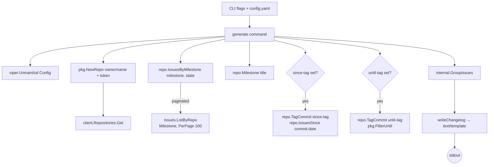
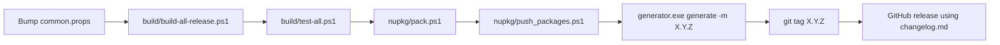

`tools/github-changelog-generator/` is a self-contained Go (Cobra + Viper) command-line app the ABP release team runs at version bump time to turn a milestone's closed PRs and issues into a release-notes Markdown file. It is **not** part of the .NET CLI — it ships as a precompiled `generator.exe` and a sibling `config.yaml` and is invoked by a human (or release script) during the release ritual. This page documents the source layout, configuration, request flow, output template, and the operational tips an agent automating an ABP release needs.

<Info>
Version `0.2.0` (`tools/github-changelog-generator/src/GithubChangelogGenerator/cmd/version.go`). Module: `GithubChangelogGenerator`, `go 1.12`. Dependencies: `spf13/cobra`, `spf13/viper`, `google/go-github`, `golang.org/x/oauth2`.
</Info>

## Layout

```text
tools/github-changelog-generator/
├── README.md
├── config.yaml            # default Viper config (committed)
├── generator.exe          # prebuilt Windows binary
└── src/GithubChangelogGenerator/
    ├── go.mod, go.sum
    ├── main.go            # cmd.Execute()
    ├── cmd/
    │   ├── root.go        # Cobra root + Viper init
    │   ├── generate.go    # `generate` subcommand
    │   ├── version.go     # `version` subcommand
    │   └── helpers.go     # template execution + er()
    ├── internal/
    │   ├── config.go      # Config / Group structs
    │   └── issues.go      # GroupIssues + label matching
    └── pkg/
        └── repo.go        # GitHubRepo wrapper around go-github
```

## Invocation

The two subcommands are:

```bash
# Print the version
generator.exe version

# Generate a changelog for a milestone (writes to stdout)
generator.exe generate -r abpframework/abp -m "0.19" > changelog.md
```

`generate` accepts the following flags (all also readable from `config.yaml` via Viper):

| Flag | Short | Maps to YAML | Purpose |
| --- | --- | --- | --- |
| `--repo` | `-r` | `repo` | `owner/name` of the GitHub repo |
| `--token` | `-t` | `token` | Personal access token (optional but recommended) |
| `--milestone` | `-m` | `milestone` | Milestone title to pull issues from |
| `--since-tag` |  | `since-tag` | Lower-bound git tag (inclusive of its commit date) |
| `--until-tag` |  | `until-tag` | Upper-bound git tag |
| `--state` | `-s` | `state` | Issue state filter: `open` / `closed` / `all` (default `closed`) |
| `--config` |  | — | Override config file path (root persistent flag) |

`viper.BindPFlags(generateCmd.Flags())` is called in `init()`, so flags override YAML values when both are present.

## `config.yaml`

The repo ships with a working default:

```yaml
repo: abpframework/abp
# token:
milestone: 0.18.1
# since-tag: 0.18.0
# until-tag: 0.17.0
state: closed
groups:
  - labels:
      - breaking change
    title: "Breaking Changes"

  - labels:
      - feature
    title: "Features"

  - labels:
      - enhancement
    title: "Enhancements"

  - labels:
      - bug
    title: "Bug Fixes"

  - labels:                # empty Labels list → catch-all bucket
    title: "Others"

#template: |-
#  ...optional Go text/template override...
```

Group ordering is preserved verbatim in the output. A group with `labels: []` (or simply no `labels:` key) is the **catch-all bucket** — every issue not matched by any earlier group ends up there.

### Group struct

```go
type Config struct {
    Repo      string   `mapstructure:"repo"`
    Token     string   `mapstructure:"token"`
    Milestone string   `mapstructure:"milestone"`
    SinceTag  string   `mapstructure:"since-tag"`
    UntilTag  string   `mapstructure:"until-tag"`
    State     string   `mapstructure:"state"`
    Groups    []*Group `mapstructure:"groups"`
    Template  string   `mapstructure:"template"`
}

type Group struct {
    Labels []string `mapstructure:"labels"`
    Title  string   `mapstructure:"title"`
}
```

## End-to-end flow



### Authentication

`pkg.NewRepo` accepts an optional token; when present an `oauth2.StaticTokenSource` is used to build an authenticated client:

```go
client := github.NewClient(nil)
if token != nil && token[0] != "" {
    gr.token = token[0]
    ts := oauth2.StaticTokenSource(&oauth2.Token{AccessToken: token[0]})
    tc := oauth2.NewClient(context.Background(), ts)
    client = github.NewClient(tc)
}
```

Public repos work unauthenticated but quickly hit the **60 req/hour** anonymous rate limit. The `pkg.checkrate()` helper exits with a friendly message when `rl.Core.Remaining == 0`. Authenticated tokens raise the limit to 5,000/hour.

<Warning>
Do **not** commit your token into `config.yaml`. The recommended approach is `--token $(gh auth token)` (or any equivalent secret retrieval), so the secret never lands in source control.
</Warning>

### Issue retrieval

`repo.IssuesByMilestone` resolves the milestone *title* to its number via `repo.Milestone` (which lists `state: "all"` milestones, 100 at a time, until match), then paginates:

```go
opt := &github.IssueListByRepoOptions{
    Milestone: strconv.Itoa(mil.GetNumber()),
    State:     "closed",
    ListOptions: github.ListOptions{PerPage: 100},
}
for {
    issues, resp, err := client.Issues.ListByRepo(ctx, gr.repoOwner, gr.repoName, opt)
    allIssues = append(allIssues, issues...)
    if resp.NextPage == 0 { break }
    opt.Page = resp.NextPage
}
```

GitHub's `Issues.ListByRepo` returns **both issues and pull requests** in the same response. Each `Issue` carries `IsPullRequest` (via `PullRequestLinks != nil`), which the template uses to render the "PR" vs "ISSUE" prefix.

### Tag-bounded variant

When `since-tag` and/or `until-tag` are set, `repo.TagCommit(name)` resolves the tag to its underlying commit:

```go
refs, _, _ := client.Git.GetRefs(ctx, owner, name, "tags")
refName := fmt.Sprintf("refs/tags/%s", name)
for _, ref := range refs {
    if ref.GetRef() == refName { sha = ref.Object.GetSHA() }
}
commit, _, _ := client.Git.GetCommit(ctx, owner, name, sha)
```

The commit's `Committer.GetDate()` becomes the `Since` filter passed to `Issues.ListByRepo`. If `until-tag` is also set, `pkg.FilterUntil` (which compares `issue.GetClosedAt()`) drops anything closed after the upper bound.

The decision logic in `generate.go`:

```go
switch {
case sinceTagCommit != nil:
    issuesByTag, _ = repo.IssuesSince(sinceTagCommit.Committer.GetDate())
    if c.UntilTag != "" {
        issuesByTag = pkg.FilterUntil(issuesByTag, untilTagCommit.Committer.GetDate())
    }
case untilTagCommit != nil:
    issuesByTag, _ = repo.AllIssues(c.State)
    issuesByTag = pkg.FilterUntil(issuesByTag, untilTagCommit.Committer.GetDate())
}
```

Note that `until-tag` *alone* triggers an `AllIssues` scan of the repo and filters client-side — fine for medium repos, slow for huge ones.

### Label-based grouping

`internal.GroupIssues` matches each issue against every group's `Labels`, preserving the YAML ordering, and supports **regex** label matchers (any label string is compiled as `^<rx>$`):

```go
func match(a, rx string) bool {
    if a == rx { return true }
    re, err := regexp.Compile(fmt.Sprintf("^%s$", rx))
    if err != nil { return false }
    return re.MatchString(a)
}
```

So `labels: [area/.*]` would group every label starting with `area/`. Issues with no matching label fall into the first group whose `Labels` is empty (the catch-all). If no catch-all is defined they are silently dropped.

### Output template

If `template:` is not set in `config.yaml`, the built-in default is used (`cmd/generate.go:writeChangelog`):

```text
{{if .Milestone}}## {{.Milestone.GetTitle}} ({{.Milestone.GetClosedAt.Format "2006-01-02"}}){{end -}}
{{if .IssuesByMilestone}}
{{range .IssuesByMilestone}}
### {{.Title}}
{{range .Issues}}
{{if .IsPullRequest -}}
- PR [\#{{.GetNumber}}]({{.GetHTMLURL}}): {{.GetTitle}} (by [{{.GetUser.GetLogin}}]({{.GetUser.GetHTMLURL}}))
{{- else -}}
- ISSUE [\#{{.GetNumber}}]({{.GetHTMLURL}}): {{.GetTitle}}
{{- end -}}
{{end}}
{{end}}
{{end -}}
{{if .SinceTagCommit}}## {{.SinceTag}}{{if .UntilTagCommit}} - {{.UntilTag}}{{end}}{{end -}}
{{if .IssuesByTag}}
{{range .IssuesByTag}}
### {{.Title}}
{{range .Issues}}
{{if .IsPullRequest -}}
- PR [\#{{.GetNumber}}]({{.GetHTMLURL}}): {{.GetTitle}} (by [{{.GetUser.GetLogin}}]({{.GetUser.GetHTMLURL}}))
{{- else -}}
- ISSUE [\#{{.GetNumber}}]({{.GetHTMLURL}}): {{.GetTitle}}
{{- end -}}
{{end}}
{{end}}
{{- end -}}
```

Template execution is plain `text/template` (`cmd/helpers.go`):

```go
func executeTemplate(tmplStr string, data interface{}) ([]byte, error) {
    tmpl, err := template.New("").Parse(tmplStr)
    if err != nil { return nil, err }
    buf := new(bytes.Buffer)
    err = tmpl.Execute(buf, data)
    return buf.Bytes(), err
}
```

The data shape passed in:

```go
type TemplateData struct {
    Repository        *github.Repository
    IssuesByMilestone []*internal.GroupedIssues
    IssuesByTag       []*internal.GroupedIssues
    Milestone         *github.Milestone
    SinceTag          string
    SinceTagCommit    *github.Commit
    UntilTag          string
    UntilTagCommit    *github.Commit
}

type GroupedIssues struct {
    Title  string
    Issues []*github.Issue
}
```

### Example output

Running with the default `config.yaml` against milestone `0.18.1`:

```markdown
## 0.18.1 (2020-XX-XX)

### Breaking Changes
- PR [\#3001](https://github.com/abpframework/abp/pull/3001): Foo (by [bar](https://github.com/bar))

### Features
- PR [\#3010](https://github.com/abpframework/abp/pull/3010): Feature X (by [baz](https://github.com/baz))
- ISSUE [\#3011](https://github.com/abpframework/abp/issues/3011): Tracking ticket

### Enhancements
- ...

### Bug Fixes
- ...

### Others
- ...
```

The leading `## <milestone-title> (<closed-at>)` only appears when a milestone is configured. The tag-based block (`## <since-tag> - <until-tag>`) is appended when the tag flags resolve to actual commits — both can render in one run, producing two top-level sections.

## Operational notes

<AccordionGroup>
<Accordion title="Build the binary from source">
```bash
cd tools/github-changelog-generator/src/GithubChangelogGenerator
go build -o ../../generator.exe .
```
The committed `generator.exe` targets Windows; the Go source has no platform-specific code, so `go build` on Linux/macOS produces a working binary you can drop in next to `config.yaml`.
</Accordion>
<Accordion title="Catch-all group ordering">
The grouping loop iterates `groups` in declaration order; the first match wins. If you list the catch-all group `{labels: [], title: "Others"}` **before** a labelled group, every issue lands in Others. Always put unlabelled groups last.
</Accordion>
<Accordion title="Issues missing from the output">
Three common causes:
1. Issue is not assigned to the milestone or has a different milestone title.
2. Issue's labels match **no** group and there is no catch-all group.
3. Issue is `open` but `state: closed` (default) filters it out — set `state: all` for a draft pre-release changelog.
</Accordion>
<Accordion title="Rate-limited responses">
Unauthenticated runs against a large milestone (>60 paged requests) will trip `403 rate-limited`. Pass `--token` or set `GITHUB_TOKEN` and call `--token $GITHUB_TOKEN`. The `checkrate` helper inside `pkg/repo.go` only validates *before* requests start; mid-run rate limits surface as a normal go-github error.
</Accordion>
<Accordion title="Tag references must be annotated">
`TagCommit` calls `client.Git.GetCommit` directly on the SHA returned from `client.Git.GetRefs(..., "tags")`. Lightweight tags whose ref points at a commit work; annotated tags also work because go-github resolves the dereferenced SHA. Branch refs masquerading as tags will fail with "you didn't pass a valid tag name".
</Accordion>
</AccordionGroup>

## Where it fits in the release process

`tools/github-changelog-generator` is **one step** of the release pipeline documented under [/overview/build-and-tooling](/overview/build-and-tooling). The typical order on a release branch:



The generated `changelog.md` is the body of the GitHub Release that ships alongside the published NuGet packages. The same Markdown is referenced by the ABP docs site's release-notes pages.

## Code references at a glance

| File | What to look at |
| --- | --- |
| `cmd/root.go` | Cobra root + `initConfig` (looks for `config(.yaml)` in `.`) |
| `cmd/generate.go` | Whole orchestration, default template, `TemplateData` |
| `cmd/version.go` | Hard-coded `version = "0.2.0"` |
| `cmd/helpers.go` | `executeTemplate`, `er` (fatal error printer) |
| `internal/config.go` | `Config`, `Group`, `AllLabels` |
| `internal/issues.go` | `GroupIssues`, `containsAny`, regex `match` |
| `pkg/repo.go` | `GitHubRepo`, `AllIssues`, `IssuesByMilestone`, `IssuesSince`, `Tags`, `Milestones`, `Milestone`, `TagCommit`, `Repository`, `checkrate` |
| `pkg/repo.go` (filters) | `FilterMilestone`, `FilterSince`, `FilterUntil` |

## Related pages

- [/overview/build-and-tooling](/overview/build-and-tooling) — full release pipeline
- [/tools/localization-key-synchronizer](/tools/localization-key-synchronizer) — sibling standalone tool
- [/cli/overview](/cli/overview) — the .NET CLI that is *not* the changelog generator
