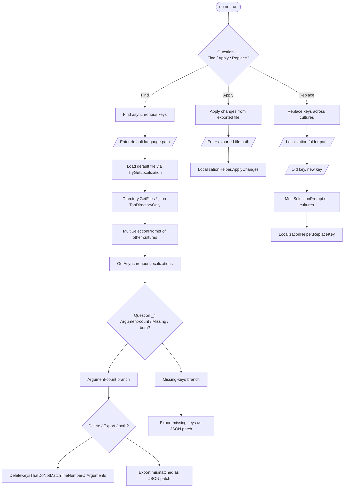

`tools/localization-key-synchronizer/` is a small interactive .NET 10 console tool that helps maintainers keep per-culture JSON localization files in lockstep with a reference (default) culture. It detects two problem classes — missing keys and `{0}`/`{1}`-style argument-count mismatches — exports an editable JSON patch, applies the patch back to the files, and supports bulk key renames. This page documents the data model it operates on, the three top-level workflows, and how it differs from `abp translate`.

<Note>
Not invoked by the ABP CLI host. It is a standalone solution: `LocalizationKeySynchronizer.slnx` + `src/LocalizationKeySynchronizer.csproj` (`<OutputType>Exe</OutputType>`, `<TargetFramework>net10.0</TargetFramework>`, only depends on `Newtonsoft.Json` and `Spectre.Console`).
</Note>

## What it operates on

ABP localization resources are JSON files under `Localization/<ResourceName>/*.json` inside framework, modules, and your own application. The expected shape:

```json title="Localization/MyResource/en.json"
{
  "culture": "en",
  "texts": {
    "Volo.Abp.MyResource:Welcome": "Welcome, {0}!",
    "Volo.Abp.MyResource:Goodbye": "Bye"
  }
}
```

The runtime loader (`JsonLocalizationDictionaryBuilder` — see [/crosscut/localization](/crosscut/localization)) reads exactly this format: a top-level object with a `culture` string and a `texts` dictionary. Each per-culture sibling file (`tr.json`, `de.json`, `zh-Hans.json`, …) is expected to mirror the **keys** of the reference culture; values are the localized strings.

`AbpLocalizationInfo` is the in-memory model:

```csharp
public class AbpLocalizationInfo
{
    public string Culture { get; set; }
    public Dictionary<string, string> Texts { get; set; }

    public static bool TryDeserialize(string json, out AbpLocalizationInfo? localizationInfo)
        => JsonHelper.TryDeserialize(json, out localizationInfo);
}
```

A file is loaded with `LocalizationHelper.TryGetLocalization(path, out var info)` which:

1. Returns `false` if the file does not exist.
2. Reads via `File.ReadAllTextAsync(path).GetAwaiter().GetResult()` (sync-over-async — fine for a CLI).
3. Deserialises with Newtonsoft and falls back to `false` on any exception.

## Three top-level operations



Source order matches the `Program.cs` top-level statements; questions are defined as constants in `Questions.cs`.

### Operation 1 — Find asynchronous keys

The user is asked for the **default language file** path (typically `en.json`). The tool then enumerates every other `*.json` in the same directory (top-level only — sub-resources are processed separately), prompts the user to select which cultures to check, and computes a diff for each.

The diff function is `LocalizationHelper.GetAsynchronousLocalizations`:

```csharp
public static List<AbpAsyncLocalization> GetAsynchronousLocalizations(
    this AbpLocalization defaultLocalization,
    IEnumerable<AbpLocalization> otherLocalizations)
{
    var results = new List<AbpAsyncLocalization>();
    var defaultCultureKeysAndArgCount = defaultLocalization.LocalizationInfo.GetKeysAndArgCount();

    foreach (var localization in otherLocalizations)
    {
        var keysAndArgCount = localization.LocalizationInfo.GetKeysAndArgCount();
        var asynchronousResource = new AbpAsyncLocalization(localization, defaultLocalization,
                                                             new List<AbpAsyncKey>());

        foreach (var (key, defaultCultureArgCount) in defaultCultureKeysAndArgCount)
        {
            if (keysAndArgCount.TryGetValue(key, out var value))
            {
                if (value != defaultCultureArgCount)
                {
                    asynchronousResource.AsyncKeys.Add(new ArgumentCountMismatch(
                        key,
                        defaultLocalization.LocalizationInfo.Texts[key],
                        defaultCultureArgCount,
                        value,
                        localization.LocalizationInfo.Texts[key]));
                }
            }
            else
            {
                asynchronousResource.AsyncKeys.Add(new MissingKey(
                    key,
                    defaultLocalization.LocalizationInfo.Texts[key]));
            }
        }

        if (asynchronousResource.AsyncKeys.Any())
            results.Add(asynchronousResource);
    }
    return results;
}
```

Two kinds of "asynchronous" (out-of-sync) records can land in `AsyncKeys`:

| Type | Class | Triggers when |
| --- | --- | --- |
| Missing key | `MissingKey` | Key exists in the default culture but not in the target. |
| Argument-count mismatch | `ArgumentCountMismatch` | Both files have the key, but counting `{0}`, `{1}`, … with `MyRegex()` produces different totals. |

`GetArgCount` is the regex counter:

```csharp
private static int GetArgCount(string value)
{
    var matches = MyRegex().Matches(value);   // [GeneratedRegex("{(\\d+)}")]
    return matches.Count;
}
```

<Warning>
This counts **occurrences**, not the maximum index. `"{0} and {0}"` returns `2`, not `1`. That intentionally flags strings whose translator collapsed repeated placeholders, but it also flags valid intentional repetition. Verify before deleting.
</Warning>

### Argument-count branch

If the user picked `Not matching arguments count`, the second prompt offers `Delete`, `Export`, or both:

- **Delete** — `DeleteKeysThatDoNotMatchTheNumberOfArguments` removes each offending key from the target culture's `Texts` dictionary and writes the file back via `JsonHelper.Serialize` (Newtonsoft, `Formatting.Indented`):

  ```csharp
  foreach (var resource in asynchronousResources)
  {
      foreach (var key in resource.AsyncKeys.Select(x => x.Key))
          resource.Localization.LocalizationInfo.Texts.Remove(key);

      File.WriteAllTextAsync(resource.Localization.FilePath,
          JsonHelper.Serialize(resource.Localization.LocalizationInfo)).GetAwaiter().GetResult();
  }
  ```

  After deletion the next runtime startup will fall back to the reference culture for those keys.
- **Export** — writes a patch JSON the maintainer can hand-edit:

  ```csharp
  public static void Export<T>(IEnumerable<AbpAsyncLocalization> asynchronousResources, string? exportPath)
      where T : AbpAsyncKey
  {
      var asyncLocalizationViewModels = asynchronousResources.Select(x =>
          new AbpAsyncLocalizationViewModel(
              x.Reference.LocalizationInfo.Culture,
              x.Localization.LocalizationInfo.Culture,
              x.Localization.FilePath,
              x.AsyncKeys.Where(k => k is T).ToList())).ToList();

      if (exportPath != null)
          File.WriteAllTextAsync(exportPath,
                  JsonHelper.Serialize(asyncLocalizationViewModels)).GetAwaiter().GetResult();
  }
  ```

  If both `MissingKeys` and `ArgumentsCount` were selected and the user chose `Export`, the tool exports **all** entries (`Export<AbpAsyncKey>`) into a single file. Otherwise it exports just the chosen subclass.

### Missing-keys branch

Selects `Export<MissingKey>` — only `MissingKey` entries go into the patch. Useful for "translation TODOs" that you want to e-mail to a translator without exposing existing mismatches.

### Patch file shape

An exported patch is a JSON array of `AbpAsyncLocalizationViewModel`:

```csharp
public class AbpAsyncLocalizationViewModel
{
    public string ReferenceCulture { get; set; }
    public string Culture { get; set; }
    public string Path { get; set; }                  // absolute path to the per-culture JSON
    public List<AbpAsyncKey> AsyncKeys { get; set; }
}

public class AbpAsyncKey
{
    public string NewValue = string.Empty;            // FILL THIS IN
    public virtual string Type => GetType().Name;
    public string Key { get; set; }
    public string Reference { get; set; }             // value in the reference culture
}

public class MissingKey : AbpAsyncKey { /* same */ }

public class ArgumentCountMismatch : AbpAsyncKey
{
    public int ReferenceArgumentCount { get; }
    public int ArgumentCount { get; }
    public string Value { get; }                      // current target value
}
```

Example serialised patch:

```json
[
  {
    "ReferenceCulture": "en",
    "Culture": "tr",
    "Path": "C:\\src\\MyApp\\Localization\\MyResource\\tr.json",
    "AsyncKeys": [
      {
        "NewValue": "",
        "Type": "MissingKey",
        "Key": "Volo.Abp.MyResource:Goodbye",
        "Reference": "Bye"
      },
      {
        "NewValue": "",
        "Type": "ArgumentCountMismatch",
        "ReferenceArgumentCount": 1,
        "ArgumentCount": 0,
        "Value": "Hoşgeldin",
        "Key": "Volo.Abp.MyResource:Welcome",
        "Reference": "Welcome, {0}!"
      }
    ]
  }
]
```

The translator fills `NewValue` for each entry and saves the file. The fact that `MissingKey` and `ArgumentCountMismatch` deserialise *through* the `AbpAsyncKey` base class is OK because `LocalizationHelper.ApplyChanges` does not need the polymorphic discriminator — it only reads `Key` and `NewValue`.

### Operation 2 — Apply changes

```csharp
public static bool ApplyChanges(string path)
{
    var json = File.ReadAllTextAsync(path).GetAwaiter().GetResult();
    if (!JsonHelper.TryDeserialize(json, out List<AbpAsyncLocalizationViewModel>? viewModels))
        return false;

    foreach (var vm in viewModels!)
    {
        if (!TryGetLocalization(vm.Path, out var localizationInfo))
            return false;

        foreach (var asyncKey in vm.AsyncKeys.Where(k => !string.IsNullOrWhiteSpace(k.NewValue)))
            localizationInfo!.Texts[asyncKey.Key] = asyncKey.NewValue;

        File.WriteAllTextAsync(vm.Path,
            JsonHelper.Serialize(localizationInfo)).GetAwaiter().GetResult();
    }
    return true;
}
```

Notable behaviour:

- The patch file's `Path` property is followed verbatim — moving the source tree between Export and Apply breaks the link.
- Entries with **empty `NewValue`** are skipped, so a partial translation produces a partial patch.
- The dictionary's `Texts[key] = newValue` works for both new (missing) and existing (mismatched) keys.
- **No sorting** is performed — `apply` preserves the original target file's key order and appends new keys at the end.

### Operation 3 — Replace keys

A bulk rename — useful when an ABP module renames an existing localization key (e.g. typo fix or namespace move):

```csharp
public static void ReplaceKey(string oldKey, string newKey, List<AbpLocalization> localizations)
{
    foreach (var localization in localizations)
    {
        if (!localization.LocalizationInfo.Texts.TryGetValue(oldKey, out var value))
            continue;
        localization.LocalizationInfo.Texts.Remove(oldKey);
        localization.LocalizationInfo.Texts.Add(newKey, value);
        File.WriteAllTextAsync(localization.FilePath,
            JsonHelper.Serialize(localization.LocalizationInfo)).GetAwaiter().GetResult();
    }
}
```

The Spectre.Console prompt picks the folder, then offers a multi-selection of `*.json` filenames within it (top-level). Cultures missing the old key are silently skipped.

## Question / option reference

All prompts are defined as constants in `Questions.cs` for reuse:

| Constant | Text |
| --- | --- |
| `_1.Question` | "Do you want to find asynchronous keys, apply changes in the exported file or replace the keys?" |
| `_1.Options.Find` / `.Apply` / `.Replace` | Top-level branches |
| `_2` | "Enter the absolute path to the exported file:" |
| `_3` | "Enter the default language path:" |
| `_4.Question` | "Find keys that do not match the number of arguments, find missing keys, or both?" |
| `_4.Options.ArgumentsCount` / `.MissingKeys` | Diff filter |
| `_5.Question` | "Should the keys that do not match the number of arguments be deleted, exported or both?" |
| `_5.Options.Delete` / `.Export` | Mismatch action |
| `_6` | "Enter the absolute path to export the keys that do not match the number of arguments:" |
| `_7` | "Enter the absolute path to export the missing keys:" |
| `_8` | "Enter the export path:" (combined export) |
| `_9` | "Enter the localization folder path:" |
| `_10` | "Enter the old key:" |
| `_11` | "Enter the new key:" |

Multi-selection prompts always offer an `"All"` choice group — the user can `<space>` to include every option in one go.

## Differences from `abp translate`

`abp translate` (`Volo.Abp.Cli.Core/Volo/Abp/Cli/Commands/TranslateCommand.cs`) — see [/cli/mcp-and-translate](/cli/mcp-and-translate) — covers part of the same surface but with different intent:

| Aspect | `abp translate` | localization-key-synchronizer |
| --- | --- | --- |
| Distribution | `dotnet tool` global CLI | Standalone `dotnet run` exe |
| UI | Argument-driven (non-interactive) | Spectre.Console interactive prompts |
| File discovery | Recursive (`SearchOption.AllDirectories`) | Top-level per folder |
| Detects argument-count mismatches | ❌ | ✅ |
| Online translation | ✅ via DeepL | ❌ |
| Patch format | `abp-translation.json` (resource list with `LocalizationKey/Reference/Target`) | `List<AbpAsyncLocalizationViewModel>` with absolute `Path` per culture |
| Deletes orphan keys after Apply | ✅ (sorts target keys to reference order, drops extras) | ❌ (apply preserves existing keys, append-only) |
| Bulk rename | ❌ | ✅ (`Replace` mode) |

In practice the two are complementary: use `abp translate -c <culture>` to crowdsource missing translations via DeepL or hand edits across the entire module tree; use this tool's `Replace` mode for one-off renames and its `Argument-count` detection for QA before a release.

## Operational tips

<AccordionGroup>
<Accordion title="Run it">
```bash
cd tools/localization-key-synchronizer/src
dotnet run
```
The committed `LocalizationKeySynchronizer.exe` next to the slnx is a Windows convenience binary; the project targets `net10.0` and runs cross-platform.
</Accordion>
<Accordion title="Path you should give as default-language">
Point at the **reference JSON file** itself, not its directory. e.g. `C:\src\MyApp\src\MyApp.Domain.Shared\Localization\MyApp\en.json`. The tool calls `Path.GetDirectoryName(path)` to find sibling cultures.
</Accordion>
<Accordion title="Multi-resource projects">
Sibling discovery is **top-level only**. To process every `Localization/<Resource>` folder under a module, run the tool once per resource directory. Scripting this with `find … -name en.json` and `dotnet run --project ... < responses.txt` is feasible but the prompts are mandatory — the cleanest automation is to use `abp translate` instead and reserve this tool for the interactive QA pass.
</Accordion>
<Accordion title="Argument-count false positives">
The tool counts every `{N}` occurrence. A reference value `"{0} bytes ({0:N0})"` (using format specifiers) is counted as 2. The runtime is happy because both reference and a translator's literal `"{0} bayt ({0:N0})"` also yield 2. Mismatches arise when a translator collapses or expands placeholders. Always review before choosing `Delete`.
</Accordion>
<Accordion title="Newtonsoft formatting">
`JsonHelper.Serialize` uses `Formatting.Indented` without further options. Strings are escaped per Newtonsoft defaults, key order is dictionary order (insertion order in modern .NET). If you care about deterministic order in source control, run `abp translate -c <culture>` afterwards — it sorts keys to match the reference culture.
</Accordion>
</AccordionGroup>

## File / type cross-reference

| File | Type(s) | Role |
| --- | --- | --- |
| `Program.cs` | top-level statements | Spectre.Console prompts and dispatch |
| `Questions.cs` | static classes `_1`..`_11` | Localized prompt strings |
| `JsonHelper.cs` | `JsonHelper` | `TryDeserialize<T>` / `Serialize<T>` over Newtonsoft |
| `AbpLocalizationInfo.cs` | `AbpLocalizationInfo` | On-disk shape: `Culture` + `Texts` dictionary |
| `AbpLocalization.cs` | `AbpLocalization` | Path + parsed info pair |
| `AbpAsyncKey.cs` | `AbpAsyncKey` | Base patch entry — has `Key`, `Reference`, `NewValue` |
| `MissingKey.cs` | `MissingKey : AbpAsyncKey` | Marker for keys absent in target |
| `ArgumentCountMismatch.cs` | `ArgumentCountMismatch : AbpAsyncKey` | Adds `ReferenceArgumentCount`, `ArgumentCount`, `Value` |
| `AbpAsyncLocalization.cs` | `AbpAsyncLocalization` | Per-culture diff bundle (`Localization`, `Reference`, `AsyncKeys`) |
| `AbpAsyncLocalizationViewModel.cs` | `AbpAsyncLocalizationViewModel` | Serialised patch envelope (`ReferenceCulture`, `Culture`, `Path`, `AsyncKeys`) |
| `LocalizationHelper.cs` | `LocalizationHelper` (partial, generated regex) | All workflow methods |

## Related pages

- [/crosscut/localization](/crosscut/localization) — runtime localization (`JsonLocalizationDictionaryBuilder`, `ILocalizationDictionaryProvider`)
- [/cli/mcp-and-translate](/cli/mcp-and-translate) — `abp translate` command (DeepL, exchange JSON)
- [/tools/changelog-generator](/tools/changelog-generator) — sibling standalone tool
- [/overview/build-and-tooling](/overview/build-and-tooling) — release pipeline that runs these tools
