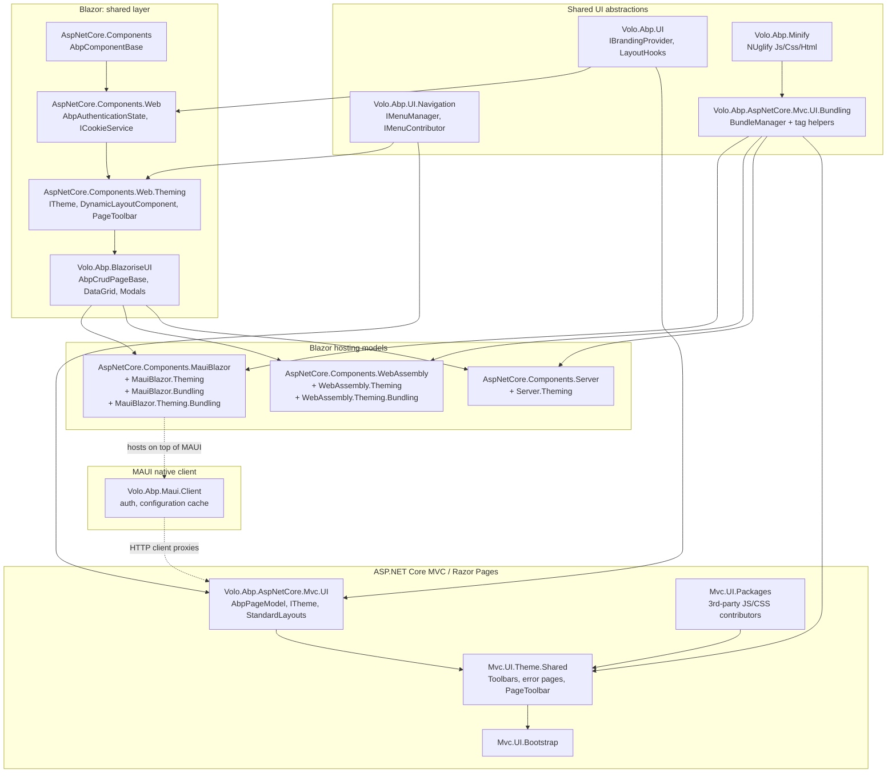

ABP ships *multiple* server-side UI stacks that all share the same domain, application services, navigation menus, theming, branding and bundling abstractions. From a coding-agent point of view, picking a stack means picking a thin **adapter module** on top of:

- `Volo.Abp.UI` — branding (`IBrandingProvider`) and layout hooks.
- `Volo.Abp.UI.Navigation` — `IMenuManager`, `IMenuContributor`, `ApplicationMenu*` model.
- `Volo.Abp.AspNetCore.Mvc.UI.*` — the MVC/Razor Pages stack and the **Bundling** pipeline (which is also reused by every Blazor stack).
- `Volo.Abp.Minify` — `IJavascriptMinifier` / `ICssMinifier` (NUglify) used by bundling.

Everything Razor/Blazor/MAUI plugs into those primitives. The Angular SPA stack is documented separately under [`/angular/overview`](/angular/overview); this section covers only the .NET-resident UIs.

## Stack map

The arrows are *module dependencies* (`[DependsOn(...)]`) — they show how the framework chains a stack on top of the shared abstractions. The dashed arrows represent runtime relationships, not dependencies.

## Module-graph highlights

| Concern | Lives in | Key types |
| --- | --- | --- |
| Branding / app name / logo | `framework/src/Volo.Abp.UI/Volo/Abp/Ui/Branding/` | `IBrandingProvider`, `DefaultBrandingProvider` |
| Layout hook slots (`Header.First`, `Body.Last`, …) | `framework/src/Volo.Abp.UI/Volo/Abp/Ui/LayoutHooks/` | `LayoutHooks`, `AbpLayoutHookOptions`, `LayoutHookInfo` |
| Menus | `framework/src/Volo.Abp.UI.Navigation/` | `IMenuManager`, `ApplicationMenu`, `ApplicationMenuItem`, `IMenuContributor` |
| Razor base page + theming | `framework/src/Volo.Abp.AspNetCore.Mvc.UI/Volo/Abp/AspNetCore/Mvc/UI/` | `AbpPageModel`, `AbpPage`, `ITheme`, `IThemeManager`, `IThemeSelector`, `StandardLayouts` |
| Bundling abstractions | `framework/src/Volo.Abp.AspNetCore.Mvc.UI.Bundling.Abstractions/` | `AbpBundlingOptions`, `BundleConfiguration`, `IBundleContributor` |
| Bundling runtime | `framework/src/Volo.Abp.AspNetCore.Mvc.UI.Bundling/` | `BundleManager`, `MvcUiBundlerBase`, `<abp-script-bundle>` tag helpers |
| Minification | `framework/src/Volo.Abp.Minify/` | `IMinifier`, `IJavascriptMinifier`, `ICssMinifier`, `NUglifyMinifierBase` |
| Blazor component base | `framework/src/Volo.Abp.AspNetCore.Components/` | `AbpComponentBase`, `ServiceProviderComponentActivator` |
| Blazor shared web layer | `framework/src/Volo.Abp.AspNetCore.Components.Web/` | `AbpAuthenticationState`, `ICookieService`, `ILocalStorageService`, `IUiMessageService` etc. |
| Blazor theming abstractions | `framework/src/Volo.Abp.AspNetCore.Components.Web.Theming/` | `ITheme` (returns `Type`), `IThemeManager`, `DynamicLayoutComponent`, `IComponentBundleManager`, `PageToolbar`, `PageHeader` |
| Blazor Server adapter | `framework/src/Volo.Abp.AspNetCore.Components.Server/` + `.Theming/` | `AbpAspNetCoreComponentsServerModule`, `BlazorServerComponentBundleManager`, `BlazorStandardBundles` |
| Blazor WebAssembly adapter | `framework/src/Volo.Abp.AspNetCore.Components.WebAssembly/` + `.Theming/` + `.Theming.Bundling/` | `AbpWebAssemblyHostBuilderExtensions.AddApplicationAsync`, `WebAssemblyAuthenticationStateProvider<,,>`, `BlazorWebAssemblyStandardBundles`, `RemoteAuthenticationStateProvider` |
| MAUI-hosted Blazor adapter | `framework/src/Volo.Abp.AspNetCore.Components.MauiBlazor/` + `.Theming/` + `.Bundling/` + `.Theming.Bundling/` | `AbpAspNetCoreComponentsMauiBlazorModule`, `MauiBlazorCachedApplicationConfigurationClient`, `MauiBlazorStandardBundles`, `AbpBlazorWebView` |
| MAUI native client integration | `framework/src/Volo.Abp.Maui.Client/` | `AbpMauiClientModule`, `MauiCachedApplicationConfigurationClient` |
| Blazorise component library wrappers | `framework/src/Volo.Abp.BlazoriseUI/` | `AbpCrudPageBase<,,...>`, `AbpExtensibleDataGrid<T>`, `BlazoriseUiMessageService`, `BlazoriseUiNotificationService` |

## How the pieces compose at runtime

1. **Menus** are produced by `MenuManager.GetMainMenuAsync()` (transient) — it iterates `AbpNavigationOptions.MenuContributors` and filters items through `ISimpleStateCheckerManager<ApplicationMenuItem>` (permission + feature checks). Each stack renders the same `ApplicationMenu` differently: the MVC theme via a view component, Blazor via the theming module's sidebar component.
2. **Themes** map a logical layout name (`Application`, `Account`, `Public`, `Empty` from `StandardLayouts`) to either a Razor view path (`ITheme.GetLayout(string, bool)` in MVC) or a Razor *component type* (`ITheme.GetLayout(string, bool)` in Components.Web.Theming). The same name resolves to different artefacts depending on the active theme module.
3. **Bundling** is shared. `AbpBundlingOptions` + `BundleManager` from the MVC bundling stack are reused by Server, WebAssembly and MauiBlazor — Server uses the live `BundleManager` at request time; WebAssembly and MauiBlazor pre-render a single global CSS/JS file at app startup (`InitialGlobalAssetsAsync`) and the resulting bytes are exposed through `IDynamicFileProvider` / `IMauiBlazorContentFileProvider`.
4. **Minification** sits at the bottom of bundling. `MvcUiBundlerBase` and `MauiBlazorBundlerBase` both take an `IMinifier` via DI; the default impls are `NUglifyJavascriptMinifier` and `NUglifyCssMinifier`.

## When to read which page

- Razor Pages app → [`mvc-razor-pages`](/ui/mvc-razor-pages), [`navigation-menus`](/ui/navigation-menus), then [`/aspnetcore/mvc-ui-bundling`](/aspnetcore/mvc-ui-bundling) and [`/aspnetcore/mvc-ui-themes`](/aspnetcore/mvc-ui-themes).
- Blazor Server app → [`blazor-components-web`](/ui/blazor-components-web), then [`blazor-components-server`](/ui/blazor-components-server), [`blazorise-ui`](/ui/blazorise-ui).
- Blazor WebAssembly app → [`blazor-components-web`](/ui/blazor-components-web), then [`blazor-components-webassembly`](/ui/blazor-components-webassembly).
- MauiBlazor (Blazor inside MAUI) → [`blazor-maui`](/ui/blazor-maui), then [`maui-client`](/ui/maui-client).
- Pure MAUI/Xamarin client (no Blazor) → [`maui-client`](/ui/maui-client).
- Theme/module authors → [`/modules/basic-theme`](/modules/basic-theme) and [`minify`](/ui/minify).
- Angular SPA → [`/angular/overview`](/angular/overview).
